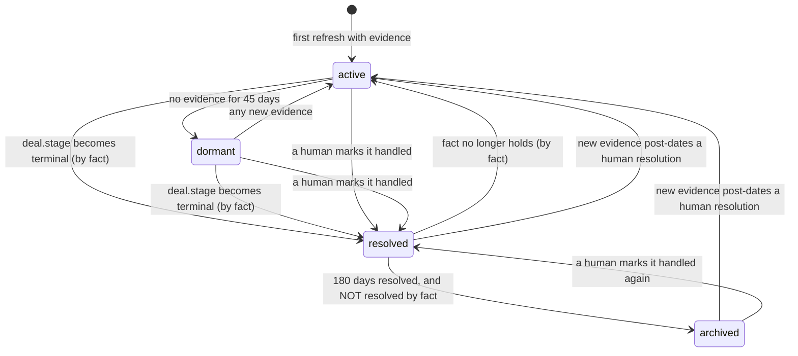

# 02 · Lifecycle

*`situations.py:decide_lifecycle` — what state a situation is in, re-derived on every refresh.*

> **What this file is for.** A situation has four states and **two different ways of being
> done**, and the two behave differently when new evidence arrives. Getting that wrong is
> the failure the module's own test file names first:
>
> > *A situation marked handled, that never comes back when the customer writes again, is
> > worse than no situation at all: **it actively hides work**.*
> > — `tests/test_situations.py:7-9`

---

## §1 · What exists

| Symbol | Line | Purpose |
|---|---|---|
| `STATUS_ACTIVE` / `STATUS_DORMANT` / `STATUS_RESOLVED` / `STATUS_ARCHIVED` | `:61-64` | the four states |
| `RESOLVED_BY_FACT` = `"fact"` / `RESOLVED_BY_HUMAN` = `"human"` | `:67-68` | how a resolution was reached |
| `DORMANT_AFTER_DAYS` = `45` / `ARCHIVE_AFTER_DAYS` = `180` | `:70-72` | the two clocks |
| `_TERMINAL_DEAL_STAGES` = `{"closedwon", "closedlost"}` | `:80` | the one fact that ends a situation |
| `LifecycleDecision(status, resolved_by, reopened=False)` | `:229` | frozen result |
| **`decide_lifecycle(...)`** | `:236` | the pure decision — six named inputs, no clock, no database |
| `resolve_situation(conn, *, org_id, situation_id, note=None)` | `:427` | the human door |

Everything except `resolve_situation` is pure.
`test_lifecycle_is_pure_and_repeatable` calls `decide_lifecycle` twice with identical
arguments and compares the results.

---

## §2 · The four states



| Status | Means | Appears in `GET /situations` | Appears in a lens (`active_only=True`) |
|---|---|---|---|
| `active` | live, in the working set | ✅ | ✅ |
| `dormant` | gone quiet past 45 days | ❌ | ❌ |
| `resolved` | done — by fact or by a human | ❌ | ❌ |
| `archived` | resolved and 180 days past | ❌ | ❌ |

> **`dormant` is not a failure.** From `situations.py:59-60`: *a situation that has gone
> quiet and should stop competing for attention **without being forgotten***. And from
> `migrations/0038_l2_situations.sql:23-24`, the same sentence again in the schema. Nothing
> is ever deleted; `archived` is as far as tidying goes.

**Why 45 days and not some other number.** `DORMANT_AFTER_DAYS` is deliberately equal to
`correlation.py:CORRELATION_WINDOW_DAYS`:

> *matches the correlation window: past it, a new generation opens and this one has
> genuinely ended* — `situations.py:70-71`

Past 45 days of silence the correlation engine opens **generation 2** for the same
`(anchor, domain)`, which produces a *new* correlation and therefore a *new* situation. The
old one going dormant at the same instant is not a coincidence; it is the same fact stated
in two places. *The renewal you lost in March is not the renewal you are working in
September* (`correlation.py:56-57`).

---

## §3 · `decide_lifecycle` as an ordered decision table

**Branch order is the semantics.** Read top to bottom; the first match wins.

| # | Line | Condition | Result | `reopened` |
|---|---|---|---|---|
| **B1** | `:251` | `terminal_by_fact` | `(resolved, fact)` | `False` |
| **B2** | `:254` | `current_status == resolved` **and** `resolved_by == fact` | `(active, None)` | **`True`** |
| **B3** | `:258` | `current_status in (resolved, archived)` | ↓ three sub-branches | |
| B3a | `:259` | `resolved_by == human` **and** `last_seen_at` **and** `resolved_at` **and** `last_seen_at > resolved_at` | `(active, None)` | **`True`** |
| B3b | `:262` | `current_status == resolved` **and** `resolved_at` **and** `now − resolved_at > 180 d` | `(archived, resolved_by)` | `False` |
| B3c | `:265` | otherwise | `(current_status, resolved_by)` — unchanged | `False` |
| **B4** | `:267` | `last_seen_at is None` | `(active, None)` | `False` |
| **B5** | `:269` | `now − last_seen_at > 45 d` | `(dormant, None)` | `False` |
| | | otherwise | `(active, None)` | `False` |

Three consequences of the ordering that are not obvious from reading the states:

* **B1 outranks everything, including a human.** A situation somebody marked handled, whose
  deal later moves to `closedwon`, is rewritten to `resolved_by = 'fact'`. The human
  attribution is overwritten — and with it, the human reopening rule (B3a) stops applying
  to that row.
* **B1 outranks dormancy.** A closed-won deal with 200-day-old evidence is `resolved`, never
  `dormant`. Correct: it did not go quiet, it finished.
* **B4/B5 never carry `resolved_by` forward.** Any path that reaches them returns
  `resolved_by = None`, so a dormant situation always has a null `resolved_by`.

---

## §4 · The two kinds of "done"

This is the heart of the file. From `decide_lifecycle`'s own docstring
(`situations.py:242-249`):

### Resolved by fact — self-correcting

> *RESOLVED BY FACT (the CRM stage went to closed-won) is recomputed each time. If the
> stage moves back, the situation un-resolves by itself — the system should not need a
> human to undo a conclusion it drew from data that has since changed.*

`terminal_by_fact` is computed at the call site (`situations.py:375-376`):

```python
terminal_by_fact=normalize_stage(node_facts.get("deal.stage")) in _TERMINAL_DEAL_STAGES
```

`node_facts` is the **anchor node's** active facts — so the terminal test only fires for a
situation anchored on a node that carries `deal.stage`. A company-anchored `opportunity`
whose related deal is closed-won does **not** self-resolve; only the deal-anchored
situation does.

> **Why this domain word is allowed to live in `situations.py`.** `_TERMINAL_DEAL_STAGES` is
> the single piece of domain vocabulary in the file, and its comment (`:76-79`) defends it:
> *it is here because it is a **lifecycle** rule (when does a situation stop being live)
> rather than a statement about what sales means. It applies to any domain that produces a
> `deal.stage` fact.* Note the exemption is real but narrow — the test that forbids domain
> names outside `domain_spec.py` scans for `"sales"`, `"support"`, `"admin"`, not for
> `"closedwon"`.

### Resolved by a human — sticks, then reopens

> *RESOLVED BY A HUMAN sticks until new evidence arrives, then reopens. Someone marking a
> thing handled is a statement about the past, not a promise about the future; when the
> customer writes again, it is open again.*

The comparison in B3a is `last_seen_at > resolved_at` — **strictly** newer evidence than the
resolution. That is what keeps a backfill from resurrecting everything a team has closed
(`test_evidence_older_than_the_resolution_does_not_reopen`): replaying six-month-old email
moves `last_seen_at` backwards or not at all, never past `resolved_at`.

### Side by side

| | resolved **by fact** | resolved **by human** |
|---|---|---|
| Set by | `refresh_situations`, every run | `resolve_situation`, via `POST .../resolve` |
| Survives a refresh? | recomputed from scratch each time | **yes** — B3c leaves it alone |
| Reopens when | the fact stops holding (B2) | evidence post-dates the resolution (B3a) |
| Needs a human to undo? | **no** | no |
| `resolution_note` | never set | set by the caller, dropped on reopen |
| Can it archive? | **no** — see §4.1 | yes, after 180 days |

### 4.1 · The archive rule, and the state it cannot reach

```python
if (current_status == STATUS_RESOLVED and resolved_at is not None
        and (now - resolved_at) > timedelta(days=ARCHIVE_AFTER_DAYS)):
    return LifecycleDecision(STATUS_ARCHIVED, resolved_by)
```
> `situations.py:262-264`

Three preconditions: status is exactly `resolved` (not already `archived`), `resolved_at` is
known, and it is more than **180 days** old. Note the clock is measured from
`resolved_at`, **not** from `last_seen_at` — how long ago it was *closed*, not how long ago
it was *touched*.

Archiving is tidying, not deletion. An archived situation still reopens:
`test_an_archived_situation_still_reopens_on_new_evidence` — *a customer coming back after
a year is exactly the moment you most want the history to surface.*

> [!WARNING]
> **Defect — a fact-resolved situation can never be archived.**
>
> B3b is only reachable from B3, and B3 is only reachable when B1 and B2 both missed.
> Trace it:
>
> * If `deal.stage` is still terminal, **B1** fires on every refresh → `(resolved, fact)`.
>   The row never gets to B3b.
> * If `deal.stage` stops being terminal, **B2** fires → `(active, None)`. Also never
>   reaches B3b.
>
> So `resolved_by = 'fact'` combined with `status = 'archived'` is **unreachable**, and
> every closed-won deal in the tenant's history stays in `status = 'resolved'` forever
> rather than aging out of the working set after six months. Since `graph_facts` keeps
> `deal.stage = "closedwon"` active with `valid_to is null` indefinitely, this is the
> normal case, not a corner. No test covers it — every archive test uses
> `resolved_by=RESOLVED_BY_HUMAN`.

> [!NOTE]
> **A second dead-end state:** `status = 'resolved'` with `resolved_by = NULL`. B2 needs
> `fact`, B3a needs `human`, so such a row can only archive (B3b) and can never reopen.
> `refresh_situations` and `resolve_situation` never produce it — but a manual `UPDATE`
> or a partially-applied merge would, and nothing detects it.

---

## §5 · `resolve_situation` — the human door

```python
return conn.execute(text(
    "update context_situations set status = 'resolved', resolved_by = 'human', "
    "  resolved_at = now(), resolution_note = :note "
    "where org_id = :o and situation_id = :sid and status <> 'resolved'"),
    {"o": org_id, "sid": situation_id, "note": note}).rowcount > 0
```
> `situations.py:430-434`

| Property | Consequence |
|---|---|
| filter is `status <> 'resolved'` | `active`, `dormant` **and `archived`** situations can all be resolved. Re-resolving an already-resolved one returns `False` → the route answers **404 "no such open situation"**. |
| `resolved_at = now()` | database clock, not the caller's — so the reopen comparison in B3a is against a server timestamp |
| returns `rowcount > 0` | the route turns `False` into a 404 rather than a silent success |
| scope | `org_id` **and** `situation_id` — a cross-tenant id resolves nothing |

`resolution_note` is written here and **only** here. `refresh_situations` never sets it; it
only preserves or clears it (§7).

---

## §6 · Edge cases

### 6.1 · The read/write race loses a human resolution

`refresh_situations` reads existing situations on one connection (`situations.py:292`,
`store.engine.connect()`) and writes on a second (`:348`, `store.engine.begin()`). There is
no transaction spanning both.

```
t0   refresh reads existing → S = {status: active, resolved_by: null, resolved_at: null}
t1   POST .../resolve lands → S = {resolved, human, resolved_at: t1, note: "handled"}
t2   refresh's write loop reaches S
     decide_lifecycle(current_status="active", resolved_by=None, ...) → (active, None)
     upsert sets status='active', resolved_by=null,
             resolved_at=null   (the CASE has no matching branch)
             resolution_note=null (the CASE has no ELSE)
```

The resolution, its timestamp and its note are all gone. The window is however long the
correlation loop takes for that org. Not covered by any test — it cannot be, without a
database.

### 6.2 · A merge folds two situations

`context/merge.py:_merge_correlations` runs **before** the generic node-repoint loop,
because a blind `update anchor_node_id` would violate
`unique (org, anchor, domain, generation)` the moment both nodes have a situation in the
same domain and generation — *which is precisely the case when the two nodes were the same
customer all along.* Postgres would abort the whole merge.

When the survivor already owns the counterpart correlation, the merged one is folded, and
the human decision is carried across first (`merge.py:147-159`):

```sql
update context_situations t set status = s.status,
  resolved_by = s.resolved_by, resolved_at = s.resolved_at,
  resolution_note = s.resolution_note
from context_situations s
where t.org_id = :o and t.correlation_id = :twin
  and s.org_id = :o and s.correlation_id = :src
  and s.resolved_by = 'human' and t.resolved_by is distinct from 'human';

delete from context_situations where org_id=:o and correlation_id=:c;
```

Read the `where` clause carefully — it encodes a precedence rule:

* the **source** must be human-resolved (`s.resolved_by = 'human'`),
* the **target** must not already be (`t.resolved_by is distinct from 'human'`, which is
  `IS DISTINCT FROM` so a `NULL` target qualifies).

*Everything about a situation is derived and rebuilt on the next refresh **except** one
thing: a human marking it resolved. That decision carries over when the surviving situation
has not been decided, so confirming two customers are one does not quietly reopen work
somebody already closed.* Pinned by `test_folding_never_loses_a_human_resolution`, which
asserts both halves of that `where` clause appear in the source.

The folded situation is then deleted outright — situations are 1:1 with correlations, and
*leaving an orphan would put a situation about nothing in the active list*
(`test_a_folded_correlation_takes_its_situation_with_it`).

### 6.3 · Reversing a merge deletes situations rather than restoring them

`merge.py:378-388`:

```sql
-- Derived views are dropped, not restored — the next refresh rebuilds them correctly
-- from the graph as it now stands.
delete from context_situations where org_id=:o and anchor_node_id in (:s, :m);
delete from context_correlation_members where ...;
delete from context_correlations where ...;
```

**This loses human resolutions on both sides of an un-merge.** The situations are recreated
by the next refresh with fresh `sit_…` ids, `status = 'active'`, and no note. That is a
deliberate trade — restoring a derived view precisely is harder than rebuilding it — but it
is a real data loss for the one non-derived field, and it is not documented in the code.

### 6.4 · A situation anchored on a closed node

A merge closes the losing node (`valid_to` set) rather than deleting it. If a situation
still points at it, `active_situations`' `left join graph_nodes … and n.valid_to is null`
returns `anchor_name = NULL` and the situation still lists. `context/health.py` counts this
as an integrity issue rather than repairing it — **nothing in Layer 2 repairs itself**.

### 6.5 · The correlation's `status` is not the situation's `status`

`context_correlations.status` is `open | dormant` (`0037_l2_correlation.sql:26`).
`context_situations.status` is `active | dormant | resolved | archived`. They are computed
independently, from different clocks, and nothing reconciles them. `decide_lifecycle` never
reads the correlation's status — only its `last_event_at`.

---

## §7 · The lifecycle's SQL half

Two pieces of the upsert exist only to make the pure rules above survive a round-trip
through Postgres. Both were bugs first.

### 7.1 · `resolved_at` must survive archiving

```sql
case when :status in ('resolved', 'archived')
     then coalesce(:rat, :now) end
```
> `situations.py:392-394`

* `:rat` is the **held** row's `resolved_at`, so a resolution keeps its original timestamp
  across refreshes.
* `coalesce(…, :now)` stamps the moment a *new* fact-resolution happens.
* The `case` includes `'archived'` because B3a needs `resolved_at` to compare against
  `last_seen_at`. Null it on archive and *an archived situation is permanently unable to
  reopen — the opposite of what the lifecycle rules say, and invisible in a pure test*
  (`situations.py:387-391`).

This is bug #6 in `Rohit_Updates/Layer 2.md`: *the logic said "reopens on new evidence" and
passed its test; the SQL made it impossible.*
`test_an_archived_situation_keeps_the_timestamp_it_needs_to_reopen` now asserts the literal
`in ('resolved', 'archived')` appears in the function.

### 7.2 · A reopened situation must lose its note

```sql
resolution_note = case when excluded.status in ('resolved', 'archived')
                       then context_situations.resolution_note end
```
> `situations.py:401-403`

No `else`, so a non-resolved status evaluates to `NULL` and the note is cleared. *A
reopened situation must not keep the note explaining why it was closed — it would read as
the current state of something now open* (`test_a_reopened_situation_drops_its_resolution_note`).

---

## §8 · Worked examples

All at `now = 2026-08-06T12:00Z`, matching `tests/test_situations.py:NOW`.

| # | `current_status` | `resolved_by` | `last_seen_at` | `resolved_at` | `terminal_by_fact` | Branch | → status | `reopened` |
|---|---|---|---|---|---|---|---|---|
| 1 | `None` (new) | `None` | 1 d ago | `None` | `False` | B5 | **active** | `False` |
| 2 | `active` | `None` | 50 d ago | `None` | `False` | B5 | **dormant** | `False` |
| 3 | `active` | `None` | 1 d ago | `None` | **`True`** | B1 | **resolved** / `fact` | `False` |
| 4 | `dormant` | `None` | 200 d ago | `None` | **`True`** | B1 | **resolved** / `fact` | `False` |
| 5 | `resolved` | `fact` | 1 d ago | 10 d ago | `False` | B2 | **active** | **`True`** |
| 6 | `resolved` | `human` | 10 d ago | 5 d ago | `False` | B3c | **resolved** | `False` |
| 7 | `resolved` | `human` | 1 d ago | 5 d ago | `False` | B3a | **active** | **`True`** |
| 8 | `resolved` | `human` | 30 d ago | 5 d ago | `False` | B3c | **resolved** | `False` |
| 9 | `resolved` | `human` | 230 d ago | 190 d ago | `False` | B3b | **archived** | `False` |
| 10 | `archived` | `human` | 1 d ago | 190 d ago | `False` | B3a | **active** | **`True`** |
| 11 | `resolved` | `human` | 1 d ago | 5 d ago | **`True`** | B1 | **resolved** / **`fact`** | `False` |
| 12 | `archived` | `human` | 200 d ago | 190 d ago | `False` | B3c | **archived** | `False` |
| 13 | `active` | `None` | `None` | `None` | `False` | B4 | **active** | `False` |

Rows 1–10 are `tests/test_situations.py` verbatim, in order. Rows 11–13 are not covered by
any test:

* **Row 11** — the human's attribution is silently replaced by `fact`. From that point the
  row follows the fact rules, not the human ones.
* **Row 12** — the resting state of an old archived situation. It stays archived because
  B3b requires `current_status == resolved`, so archiving happens exactly once.
* **Row 13** — a situation whose correlation has **no dated evidence at all** is
  permanently `active`. It can never go dormant (B4 returns before B5) and can only leave
  `active` through a terminal fact or a human. `joins_window` in the correlation engine
  already refuses to let undated evidence extend a window, so such a group is rare — but
  when it happens, the situation sits in the working set forever with
  `confidence_freshness = 0` and `inputs.freshness_known = false`.

---

## §9 · Tests

| Test | Row above | Pins |
|---|---|---|
| `test_a_new_situation_is_active` | 1 | the default |
| `test_a_quiet_situation_goes_dormant_not_deleted` | 2 | the 45-day clock |
| `test_a_closed_deal_resolves_itself` | 3 | B1 and `RESOLVED_BY_FACT` |
| `test_a_deal_reopening_in_the_crm_un_resolves_the_situation` | 5 | **B2** — *a conclusion drawn from data must be withdrawn when that data changes* |
| `test_a_human_resolution_survives_a_refresh` | 6 | B3c — *recomputing must not quietly undo somebody's decision* |
| `test_new_evidence_reopens_a_human_resolution` | 7 | **B3a** — the rule that stops situations hiding work |
| `test_evidence_older_than_the_resolution_does_not_reopen` | 8 | the strict `>` — backfill must not resurrect closed work |
| `test_a_long_resolved_situation_is_archived` | 9 | B3b and the 180-day clock |
| `test_an_archived_situation_still_reopens_on_new_evidence` | 10 | archiving is tidying, not deletion |
| `test_lifecycle_is_pure_and_repeatable` | — | purity |
| `test_every_spelling_of_a_closed_deal_counts` | — | `normalize_stage` over four CRM spellings |
| `test_an_open_stage_is_not_mistaken_for_a_closed_one` | — | no false terminals |
| `test_an_archived_situation_keeps_the_timestamp_it_needs_to_reopen` | — | §7.1, by source text |
| `test_a_reopened_situation_drops_its_resolution_note` | — | §7.2, by source text |
| `test_folding_never_loses_a_human_resolution` | — | §6.2, by source text |
| `test_a_folded_correlation_takes_its_situation_with_it` | — | §6.2, by source text |

**Not covered by any test:** the fact-resolution archive gap (§4.1), the read/write race
(§6.1), the un-merge deleting human resolutions (§6.3), and rows 11–13 of §8.
