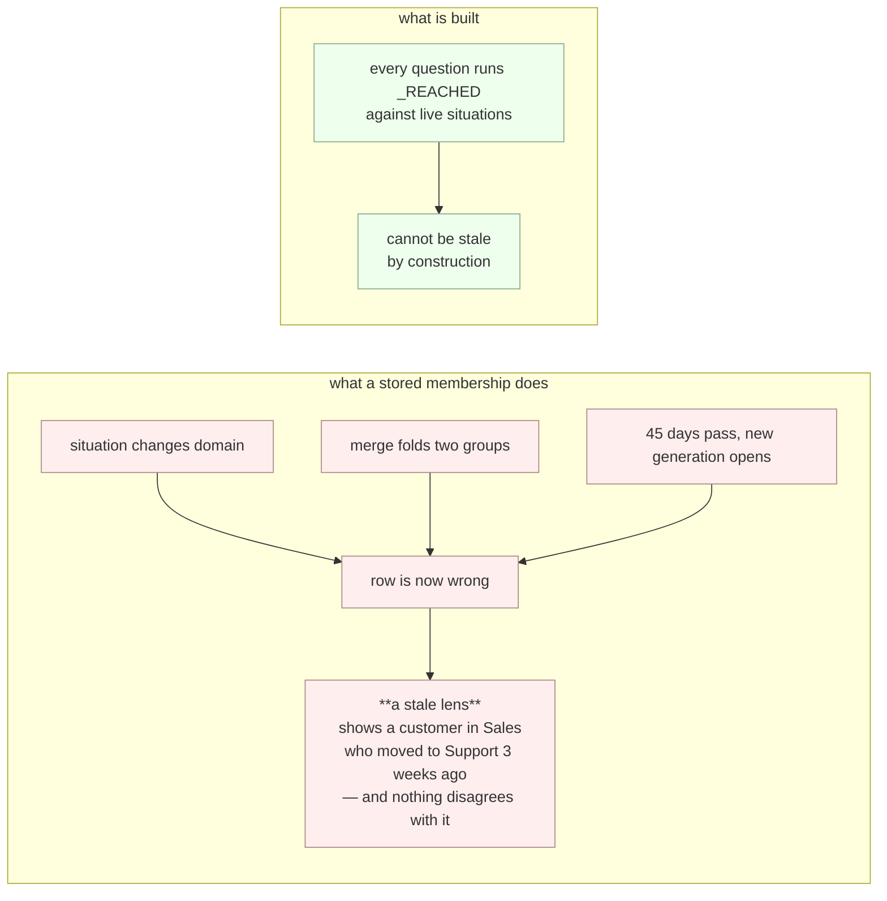

# 03 · Projections

*`genios_engine/context/projections.py` — one graph, many lenses.*

> **What this file is for.** The spec asks for a Sales graph, a Support graph, an HR
> graph — and is emphatic that these must not be separate graphs, only different views of
> one. The reason is worth stating plainly (`projections.py:1-6`):
>
> > *Separate graphs mean the same customer exists twice, and the moment they disagree
> > there is no way to say which is correct.*

---

## §1 · The three properties, up front

```
A projection is a DERIVED QUERY, not a stored membership.
Domains are DISCOVERED from data, never DECLARED in this module.
A lens narrows RETRIEVAL. It never narrows EVALUATION.
```

Each of the three is enforced by a test, not by a convention. §2, §3 and §5 argue them.

### On the word "projection"

It already means three other things in this codebase, and the module says so
(`projections.py:44-48`):

| Meaning | Where |
|---|---|
| an authoritative read-model of a Layer 4 decision | `reason/authority.py` |
| a delivery card's rendered form | `deliver/push.py` |
| a derived, rewritable table, generically | throughout |
| **a domain lens over the graph** | **this module** |

The module keeps the name because it is the product's word and the user-facing route
(`GET /api/org/{org}/projections`). This document says **lens** wherever the ambiguity
would bite.

---

## §2 · Derived, never stored

There is no `node_projections` table and there will not be one.



From `projections.py:12-17`: *Membership is computable from data that already exists … and
storing it would create a second source of truth that goes stale the instant a situation
changes domain, is folded by a merge, or opens a new generation. **A stale lens is worse
than no lens.***

Two tests hold the line:

* `test_projections_store_nothing` — parses the module with `ast`, strips docstrings, and
  asserts that none of `insert into`, `update `, `delete from`, `create table` survive.
* `test_no_migration_creates_a_projection_membership_table` — walks every `.sql` in
  `migrations/` and fails on `create table if not exists node_projections` or
  `… context_projections`.

**Cost of the choice.** Every lens question is a fresh join across
`context_situations → context_correlation_members → graph_facts`. That join is unindexed in
migration `0004`, which is why `migrations/0040_l2_projection_reads.sql` exists — see §4.

---

## §3 · `_REACHED` — the one definition of membership

```sql
select distinct domain, status, node_id from (
    select s.domain, s.status, s.anchor_node_id as node_id
      from context_situations s
     where s.org_id = :o
    union all
    select s.domain, s.status, f.subject_node_id as node_id
      from context_situations s
      join context_correlation_members m
        on m.org_id = s.org_id and m.correlation_id = s.correlation_id
      join graph_facts f
        on f.org_id = m.org_id and f.created_by_event_id = m.event_id
       and f.valid_to is null and f.status = 'active'
     where s.org_id = :o
) reached
where node_id is not null
```
> `projections.py:77-93`

**A node reaches a lens two ways:** the situation is *about* it (the anchor), or its facts
were written by an event in that situation's evidence (a participant).

> *Both matter — a deal anchors an opportunity, but the people on it belong to that lens
> too.*

### Why it is one constant and not three queries

The module's comment is a confession (`projections.py:73-76`):

> *This is a single constant because the first draft had **three** definitions in 197
> lines: members counted anchors and participants, while "which lenses is this node in?"
> and "what falls through every lens?" counted anchors only. **A participant in the Sales
> lens was therefore also reported as belonging to no lens at all** — three answers to one
> question, in the module written to prevent exactly that.*

`test_membership_has_exactly_one_definition` asserts that `projection_members`,
`node_projections` and `unprojected_nodes` all contain the token `_REACHED`, **and** that
no second constant `_MEMBER_SQL` exists.

### Two details that are load-bearing

* **`where node_id is not null`.** `unprojected_nodes` uses `node_id not in (select …)`.
  In SQL, `x NOT IN (…)` where the subquery yields a single `NULL` evaluates to `UNKNOWN`
  for **every** row — the query would return zero unprojected nodes and report a perfect
  classification rate. The guard is what makes `NOT IN` safe here.
* **`select distinct domain, status, node_id`** — distinct over the *triple*, not over
  `node_id`. That is correct for every caller that pins `status`, and is the source of the
  defect in §6.

---

## §4 · What exists

| Symbol | Line | Returns | Question it answers |
|---|---|---|---|
| `MEMBER_LIMIT` = `500` | `:99` | — | default cap on a lens's membership |
| `Projection` | `:102` | frozen dataclass | one lens — *deliberately thin: it reports membership, it does not rank or filter* |
| `available_projections(conn, *, org_id)` | `:118` | `list[dict]` | which lenses does this tenant have? |
| `projection_members(conn, *, org_id, domain, active_only=True, limit=500)` | `:144` | `Projection` | who is visible through one lens? |
| `boundary_edges(conn, *, org_id, node_ids)` | `:173` | `list[dict]` | which relationships leave the lens? |
| `unprojected_nodes(conn, *, org_id, limit=200)` | `:197` | `dict` | what falls through **every** lens? |
| `node_projections(conn, *, org_id, node_id)` | `:225` | `list[str]` | which lenses is this one entity in? |

The `Projection` dataclass:

| Field | Type | Meaning |
|---|---|---|
| `domain` | `str` | the raw domain string from `context_situations` |
| `display_name` | `str` | `spec_for(domain).display_name or domain` |
| `registered` | `bool` | **is this domain described yet, or only present in data?** |
| `node_ids` | `tuple[str, ...]` | up to `limit` members, ordered by `node_id` |
| `situation_count` | `int` | situations in this lens (honouring `active_only`) |
| `total_members` | `int` | how many entities the lens **actually** holds |
| `truncated` | `bool` | `total_members > len(node_ids)` |

> **Why `total_members` and `truncated` exist** (`projections.py:111-113`): *Without this,
> "500 members" is indistinguishable from "exactly 500 members" when the truth is 40,000 —
> a truncation the caller cannot see and would not suspect.*
> `test_a_truncated_lens_says_so` pins both fields onto the dataclass.

### 4.1 · `available_projections` — discovered, not declared

```sql
select domain, count(*) as situations,
       count(*) filter (where status = 'active') as active_situations,
       max(last_seen_at) as last_seen_at
from context_situations where org_id = :o
group by domain order by active_situations desc, situations desc
```

> *Domains are NOT read from a registry here on purpose. A registry lists what someone has
> described; this lists what exists. A domain arriving in the data before anyone describes
> it must still get a working lens — otherwise Layer 2 blocks Layer 3 from ever adding one.*
> — `projections.py:121-124`

The registry is consulted only for cosmetics and honesty:

```python
"display_name": spec_for(r["domain"]).display_name or r["domain"],
"registered":   is_registered(r["domain"]),
```

`registered: false` means *present in the data, not described yet* — **a normal state while
a new domain is being introduced, not an error.**

Two tests: `test_projections_never_name_a_domain` (AST-strips the module and asserts none of
`sales`, `support`, `admin`, `hr`, `finance`, `engineering` appear as string literals) and
`test_projections_are_discovered_from_data_not_declared` (asserts the function's source
contains `from context_situations` and `group by domain`).

### 4.2 · `projection_members`

Three queries:

1. `total` — `select count(*) from (_REACHED) r where r.domain = :d [and r.status = 'active']`
2. `node_ids` — `select distinct r.node_id from (_REACHED) r where … order by r.node_id limit :lim`
3. `situations` — `select count(*) from context_situations where org_id = :o and domain = :d [and status = 'active']`

`active_only` defaults to `True` *because a lens is a working view. Pass `False` to include
dormant and resolved situations — which is what a historical question needs, and the reason
this is a parameter rather than a hard-coded filter*
(`test_a_lens_can_include_history_when_asked` asserts the parameter exists and defaults to
`True`).

`order by r.node_id` makes truncation **deterministic** rather than "whatever the planner
returned" — the same 500 members every call.

### 4.3 · `boundary_edges` — reported, not dropped

```sql
select e.edge_id, e.edge_type, e.from_node_id, e.to_node_id,
       case when e.from_node_id = any(:ids) then e.to_node_id
            else e.from_node_id end as outside_node_id,
       n.display_name as outside_name, n.node_type as outside_type
from graph_edges e
left join graph_nodes n on n.org_id = e.org_id and n.valid_to is null
  and n.node_id = case when e.from_node_id = any(:ids) then e.to_node_id
                       else e.from_node_id end
where e.org_id = :o and e.valid_to is null
  and (e.from_node_id = any(:ids)) <> (e.to_node_id = any(:ids))
```
> `projections.py:182-193`

The `<>` between two booleans is an **XOR**, and it is what makes an edge a *boundary* edge:

| `from` inside? | `to` inside? | `<>` | included |
|---|---|---|---|
| ✅ | ✅ | `false` | no — internal edge |
| ✅ | ❌ | **`true`** | **yes** — outside node is `to` |
| ❌ | ✅ | **`true`** | **yes** — outside node is `from` |
| ❌ | ❌ | `false` | no — irrelevant edge |

> *An entity in the Sales lens is often connected to one that is not. Dropping that edge
> makes the lens claim the customer has no other relationships — **a lie by omission, and
> the worst kind, because the view looks complete.***

`test_edges_leaving_the_lens_are_reported_not_dropped` asserts both `outside_node_id` and
the `<>` appear in the source.

Empty `node_ids` short-circuits to `[]` before any SQL runs — a lens with no members has no
boundary.

### 4.4 · `unprojected_nodes` — a first-class query

```sql
select count(*) from graph_nodes n
where n.org_id = :o and n.valid_to is null
  and n.node_id not in (select node_id from (_REACHED) r)
```
plus the same predicate for the rows, `order by n.valid_from desc limit :lim` (default 200).

> *A first-class query, not a diagnostic afterthought. Without it a projection system is a
> way to lose things quietly: an entity nobody classified is invisible in every view and
> absent from every count, and nothing anywhere says so.*
>
> *A non-empty result is **normal, not a fault**. It is also the most useful place to look
> when a domain has just been introduced and classification has not caught up.*

Note the deliberate `not in` over a correlated `not exists` (`projections.py:208-210`): *so
the reachable set is computed **once** instead of once per candidate entity.*

Returns `{"nodes": [...], "total": int, "truncated": bool}`.

**The same count also lives in graph health**, as `nodes_in_no_lens`
(`context/health.py:283-294`) — because *health.py is where anyone actually looks;
uncounted, "nobody classified this" is a fact you can only find if you already suspect it.*
Health spells the predicate out as two `not exists` clauses rather than importing this
module, so the two implementations must be kept in step by hand.

### 4.5 · `node_projections` — a list, never a value

```python
def node_projections(conn, *, org_id: str, node_id: str) -> list[str]:
```

> *A customer with a live deal AND an open support ticket genuinely belongs to both, and
> picking one would make the other view lose them — silently, since neither view can tell
> it is incomplete.*

`test_an_entity_can_be_in_several_lenses_at_once` asserts the **return annotation** is
literally `"list[str]"`. Note this function has **no HTTP route** — it is library surface
only, with no caller anywhere in `genios_engine/`.

---

## §5 · The constitutional rule

> ### Showing less is fine. Evaluating less is not.

From `projections.py:26-36`:

> *This is the third time this rule appears in Layer 2 (attention scores, lifecycle states,
> now projections), and it is the most dangerous of the three **because a projection looks
> so reasonable**: "the Sales view shouldn't show promotional email".*
>
> *If reasoning only ever evaluated the Sales lens, then anything mis-assigned — or in no
> lens at all — becomes permanently invisible, and nothing reports it missing. **The
> customer whose domain was never classified is exactly the one nobody is watching.***

The same trap, stated as a loop, appears in `Rohit_Updates/Layer 2.md` Part 6:

```
a quiet entity stops being evaluated
   → it produces no signals
      → so it stays quiet
         → so it stays dormant
            → so it is never evaluated again
```

### How it is made physical rather than intended

**Guarantee 1 — the escape hatch exists.** `unprojected_nodes` is a first-class query with
its own route (`GET /projections/_/unclassified`) and its own health metric.

**Guarantee 2 — Layer 4 cannot import this module.**

```python
def test_a_lens_never_narrows_evaluation() -> None:
    offenders = [str(py.relative_to(ROOT)) for py in (ROOT / "reason").rglob("*.py")
                 if "context.projections" in py.read_text()
                 or "from genios_engine.context import projections" in py.read_text()]
    assert not offenders, f"reason/ must not scope itself by a lens: {offenders}"
```
> `tests/test_projections.py:182-190`

It walks every `.py` under `genios_engine/reason/` recursively and fails the build on a
single import. The same rule is enforced for attention (`tests/test_attention.py`) and for
lifecycle (`tests/test_graph_health.py`).

**Guarantee 3 — the route says so in its own payload.** `GET /projections/{domain}` returns

```json
"note": "a lens narrows retrieval, never evaluation — reasoning still sees every entity"
```

---

## §6 · Edge cases, and one real defect

> [!WARNING]
> **Defect — `total_members` over-counts when `active_only=False`.**
>
> `_REACHED` is `select distinct domain, status, node_id`. With `active_only=True` the
> outer filter pins `status = 'active'`, so within one domain each `node_id` appears at
> most once and `count(*)` is a correct distinct count.
>
> With `active_only=False` there is no status filter, and a node that appears in **both** an
> active and a resolved situation of the same domain yields **two rows**. But `node_ids`
> uses `select distinct r.node_id`. So:
>
> | | value |
> |---|---|
> | actual distinct members | 1 |
> | `total_members` (query 1, `count(*)`) | **2** |
> | `len(node_ids)` (query 2, `distinct`) | 1 |
> | `truncated = total > len(node_ids)` | **`true`** |
>
> A two-situation lens with one member reports itself as truncated at a limit of 500. The
> fix is `count(distinct r.node_id)` in query 1. The `active_only=True` path — the default,
> and what the route uses — is unaffected.

**Other edges, all correct as written:**

| Case | Behaviour |
|---|---|
| an org with no situations | `available_projections` → `[]`; `projection_members` → `Projection(node_ids=(), total_members=0, truncated=False)` |
| a lens with no members | `boundary_edges` short-circuits to `[]` without touching the database |
| a node in two domains | appears in both lenses; `node_projections` returns both, `order by r.domain` |
| a domain nobody registered | full lens, `registered: false`, `display_name` = `Title Case` of the domain |
| an entity created but never correlated | listed by `unprojected_nodes` — **normal, not an error** |
| a closed node (`valid_to` set) | excluded from `unprojected_nodes` and from boundary-edge names; **not** excluded from `_REACHED`, which never checks `graph_nodes.valid_to` |
| `MEMBER_LIMIT` | the route never passes `limit`, so a lens is always capped at 500 with no way to raise it from HTTP |

---

## §7 · The tests — and what two of them do not actually check

| Test | Pins |
|---|---|
| `test_projections_store_nothing` | no DML anywhere in the module |
| `test_no_migration_creates_a_projection_membership_table` | no membership table in any migration |
| `test_projections_never_name_a_domain` | the module is domain-blind |
| `test_projections_are_discovered_from_data_not_declared` | `from context_situations` + `group by domain` |
| **`test_a_lens_never_narrows_evaluation`** | **nothing under `reason/` imports this module** |
| `test_membership_has_exactly_one_definition` | all three readers use `_REACHED`; no `_MEMBER_SQL` |
| `test_an_entity_can_be_in_several_lenses_at_once` | `node_projections` returns a list |
| `test_a_truncated_lens_says_so` | `total_members` + `truncated` on the dataclass |
| `test_edges_leaving_the_lens_are_reported_not_dropped` | `outside_node_id` + the XOR |
| `test_a_lens_can_include_history_when_asked` | `active_only` exists, defaults `True` |
| `test_a_lens_reports_whether_its_domain_is_described_yet` | `registered` on the dataclass |
| `test_whatever_falls_through_every_lens_is_findable` | ⚠️ see below |

> [!CAUTION]
> **`test_whatever_falls_through_every_lens_is_findable` passes vacuously.**
>
> ```python
> source = inspect.getsource(unprojected_nodes)
> assert "not exists" in source
> ```
>
> The function does **not** use `not exists` — it uses `not in`, deliberately, and the
> docstring explains why: *"via `not in` rather than a correlated `not exists`"*.
> `inspect.getsource` includes the docstring, so the assertion matches the *explanation of
> why the pattern is absent*. The test would pass if the SQL were deleted entirely and only
> the docstring remained. What it does still verify is `callable(unprojected_nodes)`.

> [!NOTE]
> `test_projections_never_name_a_domain` and `test_projections_store_nothing` use
> `_code_only()`, which parses with `ast` and pops docstrings before comparing. That helper
> exists because *a module docstring that says "add engineering upstream and its lens
> exists immediately" is documenting the very property under test — matching on raw text
> would fail the file for describing itself correctly* (`test_projections.py:26-30`). The
> `unprojected_nodes` test does not use it, which is exactly why it is vacuous.
