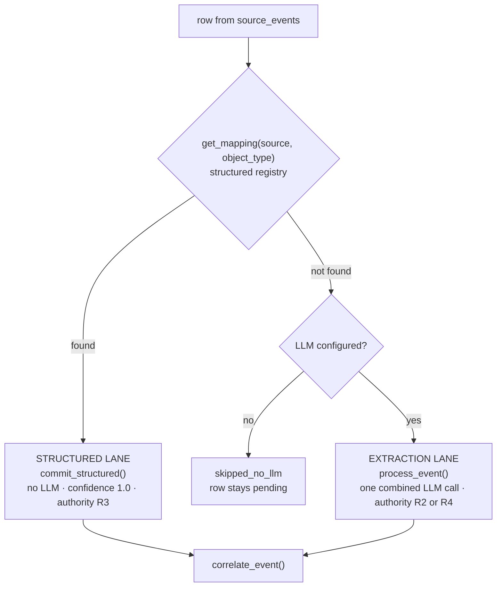

# Input — what Layer 1 actually hands over

*The seam between `capture/` and `context/`, as it exists in the code.*

> **The spec says:** Layer 1 emits a `QualifiedEnterpriseSignal` onto a bus, and Layer 2
> subscribes to it.
>
> **The code says:** Layer 1 writes a row to `source_events` with `outcome='emitted'`, and
> Layer 2 **polls that table**. There is no bus, no subscription, and no in-memory object
> crossing the boundary.
>
> The code wins, because the code is what runs.

---

## §0 · At a glance

| | |
|---|---|
| **Producer** | `genios_engine/capture/pipeline.py` → `capture_event()` |
| **Transport** | the `source_events` table — a **durable queue**, not a message bus |
| **Consumer** | `genios_engine/context/runner.py` → `_pull()` |
| **Trigger** | `process_pending()`, called after every L1 sync and by the scheduler |
| **Typed object** | `GatedEvent` (`contracts/gated_event.py`) — see §4, it is **not** the transport |
| **Concurrency** | 3 workers by default (`GENIOS_L2_WORKERS`), capped for the Supabase client limit |

---

## §1 · Why a table and not a bus

This looks like a shortcut. It is not — it buys three properties a bus would have to be
engineered to provide, and they are the three that matter most here.

| Property | How the table gives it |
|---|---|
| **No event is ever lost** | The row is committed before Layer 2 sees it. A crashed worker changes nothing; the row is still `emitted` and still unclaimed. |
| **Replay is free** | Delete the ledger rows and the same events reprocess in the same order. A bus would need a retained log to match this. |
| **Order is a decision, not an accident** | `_pull` sorts by triage lane, then time (§3). A bus delivers in arrival order, which is the wrong order — see §3. |

The cost is polling latency, which is irrelevant here: the L2 drain is dominated by an LLM
call, not by how quickly it noticed there was work.

---

## §2 · What one row carries

`_pull` selects exactly these columns. Anything not on this list **does not reach Layer 2**,
which is the fastest way to answer "why can't the graph see X?".

```sql
select se.event_id, se.source, se.object_type,
       se.actor->>'email'   as sender,
       se.occurred_at, se.source_object_id, se.triage_lane,
       se.internal_kind,          -- company canon: authority rank 4 (see §5)
       se.parent_object_id,       -- the email thread id: correlation's continuity carrier
       se.domain_hints,           -- L1's deterministic keyword/source-prior guesses
       rp.enc_content,            -- the raw payload, encrypted, short TTL
       pc.clean_text as prepared_text   -- PII-masked text, computed once at ingestion
from source_events se
join raw_payloads rp      on rp.event_id = se.event_id
left join prepared_content pc on pc.event_id = se.event_id and pc.org_id = se.org_id
where se.org_id = :o and se.outcome = 'emitted'
```

| Field | What Layer 2 does with it | If it is missing |
|---|---|---|
| `event_id` | provenance on every fact, edge and observation written | nothing can be written — evidence is mandatory |
| `source` | fact provenance; distinct-source count drives situation confidence | corroboration scoring degrades |
| `object_type` | selects the lane (§4) | falls to the LLM lane |
| `sender` | becomes the person node that anchors the event | no sender node; facts have no default subject |
| `occurred_at` | correlation windows, freshness, lifecycle | event never extends a correlation window |
| `triage_lane` | **drain order** (§3) | treated as `P3`, drained last |
| `internal_kind` | authority rank 4 + canon node (§5) | lands as ordinary observed traffic at rank 2 |
| `parent_object_id` | thread continuity — a bare reply inherits its conversation | every reply becomes its own island |
| `domain_hints` | the domain a situation is filed under | falls to `general` |
| `prepared_text` | **the text sent to the model** | re-derived at read time (legacy rows only) |

> **The prepared-text rule.** Layer 2 uses `pc.clean_text` as-is and never re-adds the raw
> subject line. Layer 1 already masked the subject *together with* the body; prepending the
> raw subject here would push unmasked PII into the model. The fallback path in
> `runner.py:_clean_for_llm` exists only for rows written before that seam existed.

---

## §3 · Drain order is triage lane first, then time

```sql
order by coalesce(se.triage_lane, 'P3') asc, se.occurred_at asc
```

Layer 1 computed a triage lane at ingestion (`P0`–`P3`) and, before this seam existed, threw
it away. Layer 2 now honours it.

**Lanes are processing order, not user priority.** `P0` does not mean "important to the
founder" — it means "process this before the backlog", because a same-day reply on a live
thread is worth more than a three-week-old newsletter that happens to be next in the queue.

Within a lane, oldest first. This matters more than it looks: correlation opens a new
*generation* when an event falls outside an existing group's time span, so processing newest
first would shatter one conversation into several situations.

---

## §4 · Two lanes, chosen deterministically



| | Structured lane | Extraction lane |
|---|---|---|
| **Chosen when** | `capture/structured/registry.py` has a mapping for `(source, object_type)` | everything else |
| **Examples** | `hubspot/deal`, `gcal/calendar_event`, `stripe/subscription`, a client's Postgres table | email, Slack, uploads, written knowledge |
| **LLM** | none — the fields are already typed | one combined call per event |
| **Authority** | R3, system of record | R2 observed · R4 company canon |
| **Cost** | free | the dominant cost of the whole layer |

Both lanes correlate. That is deliberate and was once a real bug: correlation originally ran
only in the extraction lane, so **CRM deals and calendar events never joined a situation** —
the headline "four systems, one reality" case failed silently with two of the four missing.

---

## §5 · `internal_kind` — the field that changes authority

Most of the seam is mechanical. This field is not: it is the only input that changes how much
Layer 2 **believes** what it is reading.

| `internal_kind` | Meaning | Authority | Effect in Layer 2 |
|---|---|---|---|
| `null` | observed traffic — an email, a Slack message, a CRM row | **R2** (or R3 structured) | facts attach to the sender |
| one of the 12 kinds | the company asserting something about itself | **R4** | a *canon node* is created; facts attach to **it**, not the author |

The twelve kinds live in `capture/internal_knowledge.py`: `policy`, `sop`, `product`,
`pricing`, `goal`, `kpi`, `org_structure`, `employee_profile`, `project`, `task`, `asset`,
`wiki`.

R4 sits **above** R3 (system of record) because when the company writes down its own refund
policy and Stripe implies something different, the company's deliberate statement should win —
and the disagreement is still recorded as a discrepancy rather than resolved by luck.

---

## §6 · Idempotency — why a re-run is safe

`_pull` excludes anything already accounted for:

```sql
and se.event_id not in (select event_id from l2_extraction_results where org_id = :o)
and se.event_id not in (select event_id from l2_processing_runs
                        where org_id = :o and status in ('done','parked'))
```

Two ledgers, two different jobs:

| Ledger | Records | Purpose |
|---|---|---|
| `l2_extraction_results` | the model's output, keyed by a hash of `org_id + prompt version + content` | **cache** — identical content never pays for a second LLM call, and the key is org-scoped so one tenant's cache can never serve another's |
| `l2_processing_runs` | attempt count and terminal status | **retry budget** — three transient failures and the event is parked as `model_unavailable` rather than re-charging the model forever |

Bumping `PROMPT_VERSION` in `context/pipeline.py` invalidates the cache deliberately: new
events extract richly for free, and the backlog is re-extracted only on an explicit rebuild.

---

## §7 · The typed object that is *not* the transport

`contracts/gated_event.py` defines `GatedEvent` — route, structured fields, domain hints,
triage lane, `internal_kind`, versions.

**Nothing outside `capture/` imports it.** Verified: a repo-wide search for `GatedEvent`
returns only `contracts/` and `capture/`.

So what is it for? It is Layer 1's **internal** statement of its own decision, persisted into
`source_events` column by column. Layer 2 reads the columns, not the object. That is not a
defect — it is what makes the seam durable — but a reader who assumes `GatedEvent` is the wire
format will look for a consumer that does not exist.

---

## §8 · Worked example

An email arrives from `john@acme.io`, subject *"Re: pricing for Q3"*, on a thread Layer 1 has
seen before.

| Stage | Value |
|---|---|
| L1 writes | `source_events` row · `outcome='emitted'` · `triage_lane='P1'` · `parent_object_id='thread_18c4a'` · `domain_hints=[{"domain":"sales","source":"keyword"}]` · `internal_kind=null` |
| `_pull` returns it | ahead of every `P2`/`P3` row regardless of arrival time |
| Lane | no mapping for `(gmail, message)` → **extraction lane** |
| `process_event` | sender node `john@acme.io`; company node `acme.io` via `works_at`; facts at **R2** |
| `correlate_event` | thread `thread_18c4a` already has a correlation → **joins it**, `joined_via='thread'` |
| Result | the reply lands in the existing Acme/sales situation instead of starting a new one |

Had the same text arrived with `internal_kind='pricing'`, everything above would change: a
canon node `internal:pricing:<key>` would be created, the facts would land on **it** at
**R4**, and the anchor would be the document rather than the sender.

---

## §9 · Failure modes at this seam

| Symptom | Cause | Where to look |
|---|---|---|
| Events land but the graph stays empty | no LLM configured → `skipped_no_llm`, rows stay pending forever | `platform/wiring.py:make_llm_client` |
| One event reprocesses endlessly | it never reaches a terminal outcome | `_DONE_OUTCOMES` in `runner.py` |
| Replies each start a new situation | `parent_object_id` is null — the connector did not supply a thread id | `capture/connectors/composio.py` |
| Everything files under `general` | `domain_hints` empty — L1 only emits `sales`/`support`/`admin` and only on keyword or source prior | `capture/domain/hints.py` |
| A written policy behaves like an ordinary email | `internal_kind` null — the tag did not match a declared kind | `capture/internal_knowledge.py:normalize_kind` |

---

*Next: [Output — what Layer 2 hands on](Output-To-Layer-3-and-4.md)*
