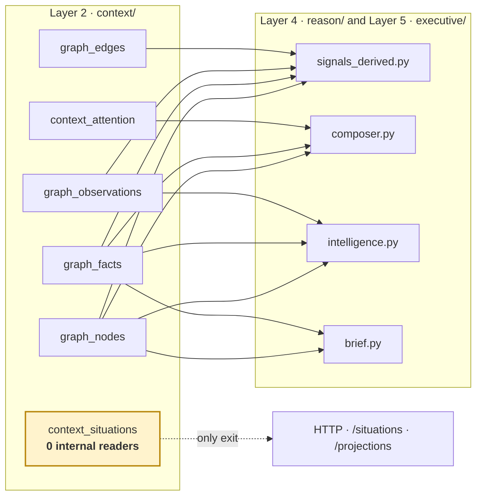

# Output — what Layer 2 hands on

*And the one thing about this boundary that everybody gets wrong.*

> **⚠️ READ THIS FIRST — the honest state of the boundary**
>
> The spec says Layer 2 emits a `BusinessSituationObject`, and that *"Layer 3 never reads the
> raw graph."*
>
> **In the code, the opposite is true.** Nothing outside `context/` reads `context_situations`
> at all — a repo-wide search returns **zero consumers**. Layer 4 and Layer 5 read the graph
> tables **directly**: `graph_nodes` in 11 files, `graph_facts` in 9.
>
> The Situation Engine is built, tested and correct. **It is not yet adopted.** Anyone reading
> "situations are the primary artifact" and assuming reasoning consumes them will be wrong
> about how the running system behaves today.

---

## §0 · At a glance

| | |
|---|---|
| **What the spec promises** | one typed `BusinessSituationObject` per boundary crossing |
| **What actually crosses** | shared **tables**, read directly by `reason/` and `executive/` |
| **Situation table** | `context_situations` — populated, exposed over HTTP, **consumed by nothing internally** |
| **Real contract** | the graph schema itself (`migrations/0004`, `0028`, `0036`–`0040`) |
| **Consequence** | changing a graph column is a **breaking change to Layer 4**, with no type to warn you |

---

## §1 · What downstream actually reads

Measured, not assumed — a search across `reason/`, `executive/` and `packs/`:

| Table | Files reading it | What they use it for |
|---|---|---|
| `graph_nodes` | **11** | entity identity, display names, node types |
| `graph_facts` | **9** | the state signals fire on — `deal.stage`, `thread.ball_in_court`, `commitment.due_at` |
| `graph_observations` | **5** | the signal-kind vocabulary (`objection_price`, `budget_approved`, …) |
| `graph_edges` | **4** | relationship depth, single-threaded-deal detection |
| `context_attention` | **3** | retrieval ordering only — never evaluation scope |
| `context_situations` | **0** | — |

Principal readers: `reason/signals_derived.py`, `reason/composer.py`, `reason/intelligence.py`,
`reason/baselines.py`, `reason/foresight.py`, `executive/brief.py`, `executive/summary.py`.



---

## §2 · The five things Layer 2 produces

Whether or not anything consumes them yet.

### 2.1 · The graph — *what is true right now*

`graph_nodes` · `graph_facts` · `graph_edges` · `graph_observations` · `graph_source_refs`

The layer's real product, and genuinely consumed. Its guarantees:

| Guarantee | Mechanism |
|---|---|
| Every fact carries evidence | `graph_source_refs` links fact → event → exact quoted span |
| Nothing is overwritten | facts are versioned; a superseded value keeps its provenance |
| Authority is explicit | `authority_rank` R1–R4; R4 canon beats R3 system-of-record |
| Freshness beats authority | `fact_write_action` checks recency **before** rank |
| Conflicts are recorded, not resolved | a losing challenger becomes a `discrepancies` row |

### 2.2 · Situations — *the intended primary artifact*

`context_situations`, one per correlation. Carries type, domain, lifecycle status, a **four
dimension confidence vector**, coverage, and the named gaps.

**Consumed only over HTTP today.** See the warning at the top.

### 2.3 · Attention — *look here first*

`context_attention`, 0–100 per node. **Constitutional rule: it may order retrieval, never gate
evaluation.** Enforced by `tests/test_attention.py::test_attention_never_gates_evaluation`,
which fails if anything under `reason/` so much as mentions the table.

### 2.4 · Identity questions — *things a human must settle*

`merge_proposals` — two entities claiming one name. Layer 2 never merges on similarity; it asks.
Reviewed at `/api/org/{org}/identity/proposals`.

### 2.5 · Quality signals — *is the picture trustworthy*

`graph_health` (append-only, 180-day retention) and `context_node_lifecycle`. Consumed by
humans and the scheduler, not by reasoning.

---

## §3 · The HTTP surface

The only place situations and projections currently leave the layer.

| Endpoint | Returns |
|---|---|
| `GET /api/org/{org}/situations` | active situations, most-confident first |
| `GET /api/org/{org}/situations/{id}` | one situation **with its evidence events** |
| `POST /api/org/{org}/situations/{id}/resolve` | mark handled — reopens on new evidence |
| `POST /api/org/{org}/situations/backfill` | apply Layer 2 to pre-existing history |
| `GET /api/org/{org}/projections` | the domain lenses this tenant has |
| `GET /api/org/{org}/projections/{domain}` | one lens + **boundary edges** |
| `GET /api/org/{org}/projections/_/unclassified` | what falls through every lens |
| `GET /api/org/{org}/graph/health` | the quality vector |
| `GET /api/org/{org}/identity/proposals` | the duplicate queue |

> **Ordering is by confidence, not priority.** A situation we are *sure* about is worth more
> thought than one assembled from a single unverified email. Which situation *matters most* is
> a decision, and this layer does not make decisions.

---

## §4 · Confidence — the shape of the number

Situations return a **vector**, not a scalar, because a caller needs to know *why* it is low.
"82% overall, 12% identity" tells you to go resolve a duplicate. "82%" tells you nothing.

```
overall = MIN(evidence, freshness, consistency, identity)      ← never the average
coverage                                                        ← reported separately
```

| Dimension | Question | Formula |
|---|---|---|
| `evidence` | how much independent material | `min(40, events×8) + min(60, sources×25)` |
| `freshness` | how current | banded by age: ≤3d→100, ≤7→85, ≤14→70, ≤30→50, ≤45→30, else 10 |
| `consistency` | do sources contradict | `100 − min(100, open_discrepancies×34)` |
| `identity` | are we sure who | 100 · one open proposal → 40 · more → 20 |
| `coverage` | how complete | `100 × known_fields / expected_fields` |

**Why minimum.** These are failure modes, not features. Perfect evidence about an entity we
cannot identify is not 60% confidence — it is unusable, and an average would report it as fine.

**Why coverage is outside.** Completeness is not correctness. Not knowing a deal's close date
does not make the stage we *do* know less true. Folding it in would make absence read as doubt.

**Why an unknown dimension is excluded, not zeroed.** Evidence with no timestamps tells us
nothing about currency — it does not tell us the situation is stale. A dimension with no basis
is left out of the minimum and marked `freshness_known: false`.

---

## §5 · What Layer 2 refuses to output

Load-bearing absences. Each is a decision, and each belongs to a layer that is allowed to have
opinions.

| Not produced | Why | Whose job |
|---|---|---|
| **Priority / urgency** | a judgement about what matters | L4 |
| **Risk scores** | already detected in `packs/` — two layers scoring risk means no way to tell which was wrong | L3/L4 |
| **Opportunity detection** | same argument | L4 |
| **Recommendations** | "what should happen" is the next question, not this one | L4 |
| **Goal progress** | requires knowing what good looks like | L4 |
| **Policy comparison** *("only 130 of 1000 leads match ICP")* | domain expertise | L3 |

> The spec places Risk Detector and Opportunity Detector inside Layer 2. It also says context
> never decides. Those contradict; the code follows the second, because detection already lives
> in the packs and duplicating it would create two answers with no tie-breaker.

---

## §6 · The unadopted-situations gap

The most consequential open item in this layer.

**Today**
```
graph tables ──► reason/signals_derived.py ──► signals ──► L4
context_situations ──► HTTP only
```

**Intended**
```
graph tables ──► context_situations ──► L4 asks for active situations
```

**What adoption would buy**

| | Direct graph reads (today) | Situations (intended) |
|---|---|---|
| Context assembly | every reasoner re-traverses the graph | assembled once |
| Confidence | derived per reasoner | already computed, five dimensions |
| Boundary | any column change breaks L4 silently | one typed surface |
| Evidence | re-gathered per query | attached |

**Why it has not happened.** Situations shipped in Layer 2 Step 3; adopting them is a **Layer 4
change**, and Layer 4 is under active development by another workstream. Rewiring it mid-flight
would collide.

**How to verify the gap is closed.** This returns nothing today, and returning results is the
test:

```bash
grep -rl "context_situations" --include='*.py' genios_engine/reason genios_engine/executive
```

---

## §7 · Stability of the contract

Because the contract is a schema rather than a type, "what is safe to change" has to be stated
explicitly.

| Element | Stability | Notes |
|---|---|---|
| `graph_nodes.node_id` · `canonical_key` | **frozen** | ids appear in delivered cards and reasoning traces |
| `graph_facts.field` names | **frozen** | `deal.stage`, `thread.ball_in_court`, `commitment.due_at` are matched literally by pack rules |
| `authority_rank` scale | **frozen** | R1–R4, with R4 above R3 |
| observation `kind` vocabulary | **additive only** | `context/vocabulary.py`; renaming one silently stops a rule firing |
| `context_situations` columns | fluid | nothing internal reads it yet |
| `graph_health` metrics | fluid | monitoring only |

> **The trap.** A fact field is a string matched literally by pack rules. Rename `deal.stage`
> and nothing raises — the rules simply stop firing, quietly, with green tests. This is the
> single sharpest edge at the Layer 2 boundary.

---

## §8 · Worked example — one email to a delivered card

| Layer | Produces | Deliberately does not |
|---|---|---|
| L1 | `source_events` row, `emitted`, lane `P1` | judge whether the promise was kept |
| **L2** | person + company nodes · `thread.ball_in_court='us'` at R2 · correlation joined by thread · situation *Acme / sales*, confidence 76 | say what to do about it |
| L4 | reads `graph_facts` **directly** → `unanswered_email` signal → decision | — |
| L5 | execution plan, reminders | change the decision |
| Layer 5.2 | delivered card | create new intelligence |

Note the third row: L4 read the **facts**, not the situation. That is the gap in §6, visible in
a single trace.

---

*Previous: [Input — what Layer 1 hands over](Input-From-Layer-1.md)*
