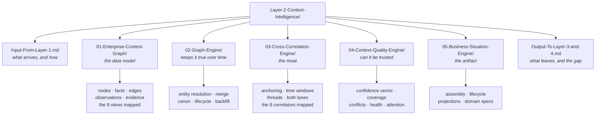

# Layer 2 · Context Intelligence — the folder map

**This folder is the live truth of `genios_engine/context/`.** It is the source consulted before
any action, update or improvement to Layer 2. If a document and the code disagree, the document
is wrong — fix it in the same change that moved the code.

Start at **[00-Overview.md](00-Overview.md)** if you want the layer in one sitting. Use this page
when you know what you are looking for.

---

## How the folder is shaped

The nesting mirrors the architecture: the graph itself, the engines that keep it honest, the
correlation that makes it more than a database, the quality machinery, and the situations it
produces. The two boundary documents sit at the root because they are what every other layer
actually needs from this one.

Every file answers the same four questions, in order:
**what it is for → what exists → how it works → examples and edge cases.**

---

## The five parts

| Part | Answers | Read it when |
|---|---|---|
| [**01 · Enterprise Context Graph**](01-Enterprise-Context-Graph/00-Overview.md) | *What shape is reality stored in?* | you are adding a fact field, a node type or an observation kind |
| [**02 · Graph Engine**](02-Graph-Engine/00-Overview.md) | *What keeps it true as it grows?* | identity is wrong, a merge went badly, or the graph looks unhealthy |
| [**03 · Cross-Correlation Engine**](03-Cross-Correlation-Engine/00-Overview.md) | *Which events describe one thing?* | signals are not grouping, or are grouping too much |
| [**04 · Context Quality Engine**](04-Context-Quality-Engine/00-Overview.md) | *How sure are we, and is the graph healthy?* | a confidence number looks wrong or unexplainable |
| [**05 · Business Situation Engine**](05-Business-Situation-Engine/00-Overview.md) | *What is the artifact reasoning consumes?* | you are adding a domain, or wiring Layer 4 to situations |

---

## The two boundary documents

These are the contract. Read them before changing anything that crosses a layer line.

| Document | The one thing it tells you |
|---|---|
| [**Input — from Layer 1**](Input-From-Layer-1.md) | The handoff is a **table**, not a message bus. `GatedEvent` exists but nothing outside `capture/` imports it. |
| [**Output — to Layer 3 & 4**](Output-To-Layer-3-and-4.md) | **Nothing outside Layer 2 reads `context_situations`.** L4 and L5 read the graph tables directly. The Situation Engine is built and unadopted. |

---

## If you only remember six things

1. **A label may narrow retrieval, never evaluation.** Attention, lifecycle and projections all
   obey this, and a test fails if `reason/` so much as mentions them.
2. **Absence is never negative evidence.** Undated is not stale. Empty is not unhealthy.
3. **Exact match is the only automatic merge.** A shared name is a question for a human.
4. **Nothing repairs itself.** Integrity checks detect and report; they never fix.
5. **Nothing is deleted, only archived.** Volume control happened at Layer 1.
6. **This layer does not decide.** No priority, no risk, no recommendation.

---

## Fastest paths to an answer

| You want to know | Go to |
|---|---|
| Why a fact has the confidence it does | [Facts](01-Enterprise-Context-Graph/02-Facts.md) → [Confidence Vector](04-Context-Quality-Engine/01-Confidence-Vector.md) |
| Why two "Acme"s did not merge | [Entity Resolution](02-Graph-Engine/01-Entity-Resolution.md) |
| Why an email did not join the situation it obviously belongs to | [Anchoring](03-Cross-Correlation-Engine/01-Anchoring.md) → [Thread Continuity](03-Cross-Correlation-Engine/03-Thread-Continuity.md) |
| Why a situation reopened after somebody closed it | [Lifecycle](05-Business-Situation-Engine/02-Lifecycle.md) |
| Why the Sales view is missing an account | [Projections](05-Business-Situation-Engine/03-Projections.md) |
| Whether the graph can be trusted right now | [Graph Health](04-Context-Quality-Engine/04-Graph-Health-Metrics.md) |
| What to run to make this layer live | [`Rohit_Updates/Layer 2.md` §5](../../Rohit_Updates/Layer%202.md) |

---

## Status, stated plainly

Layer 2 is **feature-complete and unproven**. 659 tests pass in under three seconds because
nothing connects to a database. Migrations `0036`–`0040` have never been executed. Every table
the code queries is verified to exist; **column names, types and semantics are not.**

If something in this layer is broken, it is in the SQL — not the logic.
