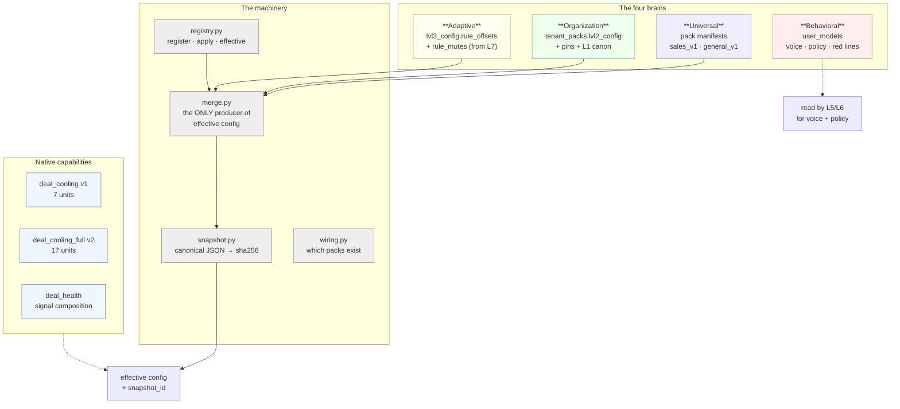
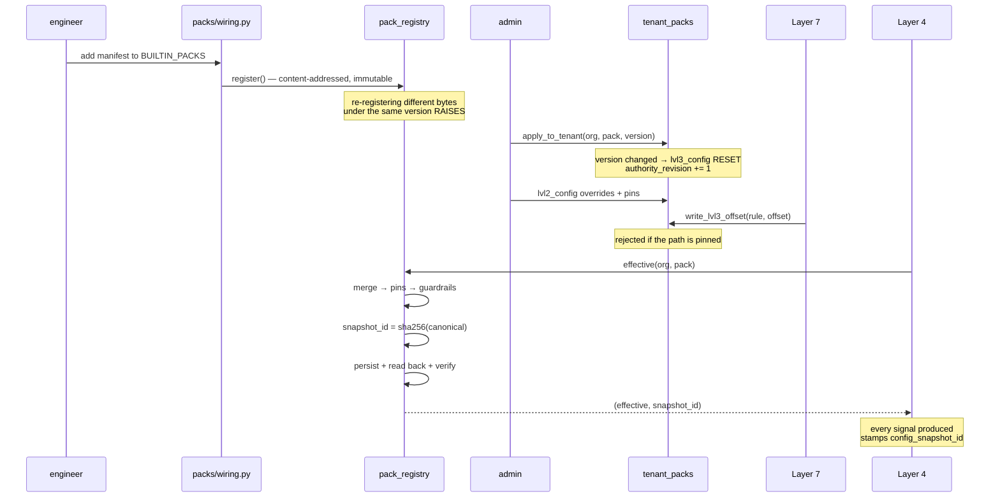
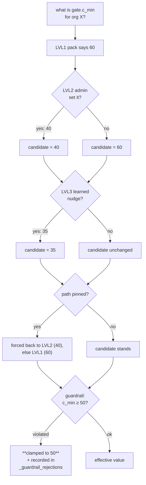
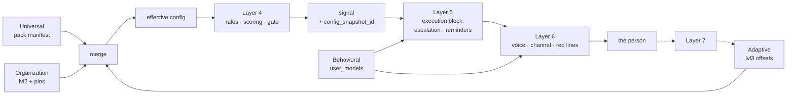

[Folder map](README.md) · [System Design index](../README.md)

---

# Layer 3 — Domain Expertise (`packs/`)

> **Pack = data. Engine = code.**
> The engine reads this layer; it hardcodes nothing about sales, support, or finance.
> Adding a domain is adding a manifest — **zero engine change, zero deploy.**

Layer 3 is where *what a business domain means* is written down. Not how to reason — that
is Layer 4. Not what is true — that is Layer 2. Layer 3 holds the **expertise**: which
patterns matter, what they are called, what to do about them, how heavily to weigh them,
and where the floors and ceilings sit.

Every byte of it is content-addressed, versioned, immutable, tenant-scoped, and stamped
onto every signal it produces — so any decision the system ever made can be replayed
against the exact configuration that produced it.

---

## §0 · At a glance

| | |
|---|---|
| **Package** | `genios_engine/packs/` |
| **Layer number** | 3 |
| **Size** | 11 files · ~1,650 lines — **almost all of it data** |
| **Input** | Admin overrides (LVL2), learned nudges from Layer 7 (LVL3) |
| **Output** | An **effective config** + its snapshot id — what Layer 4 executes |
| **May import** | `contracts/`, `platform/` |
| **LLM calls** | Zero |
| **Shipped packs** | `sales` v1.8.0 (20 rules) · `general` v1.1.0 (5 rules) |
| **Shipped capabilities** | `sales.deal_cooling` v1 · `sales.deal_cooling_full` v2 · `deal_health` |
| **Tables** | `pack_registry`, `tenant_packs`, `config_snapshots`, `user_models`, `user_model_proposals` |
| **Migrations** | `0007_l4_packs.sql`, `0023_user_models.sql`, `0034_l4_learning_authority.sql` |

---

---

## §1 · What was supposed to be built

### 1.1 The spec

From the layer map:

> **`packs/` — Layer 3 — Domain Expertise.** The **four brains** + capability content,
> **shipped as data**.
> *Universal* = pack manifests · *Organization* = org settings/knowledge ·
> *Behavioral* = user_models · *Adaptive* = calibration + outcomes.

### 1.2 The six requirements this implies

| # | Requirement | Why it is non-negotiable |
|---|---|---|
| 1 | **Domain knowledge must be data, never code** | Adding "admin" or "legal" must not require a deploy or an engine change |
| 2 | **A published version is immutable** | Historical signals must be replayable *honestly* — the bytes that produced a decision cannot change under it |
| 3 | **Content addressing** | The snapshot id *is* the config's identity; a key reorder must not change it, and any value change must |
| 4 | **Four levels of override, with precedence** | Expert baseline → admin override → learned nudge, with pins and absolute guardrails |
| 5 | **Per-tenant application with zero deploy** | 30 startups, 30 different configurations, one running engine |
| 6 | **Every signal carries its config snapshot** | Replay resolves snapshot → effective → **byte-identical** signal |

---

---

## §2 · What exists — the inventory

---

---

## §4 · The workflows

### W1 · A pack's lifecycle

### W2 · Precedence, resolved for one path

### W3 · Where each brain enters a decision

---

---

## §5 · Strategies — the decisions behind the code

### S1 · Data, not code — and the proof is a shipped refactor

Moving four rules from `sales_v1` to `general_v1` in version 1.4.0 fixed a real
mislabelling bug **with zero engine change**. That is the architecture's own regression
test: if adding or moving expertise ever requires touching `reason/`, the boundary has
leaked.

### S2 · Immutable versions, or replay is a lie

A published `(pack_id, version)` can never change bytes. Without it, *"why did the system
say that in March?"* is unanswerable, because the config that produced it may have been
edited in place.

### S3 · Content addressing over version strings

A version string is a promise; a content hash is a fact. The snapshot id is derived from
the **effective** bytes — including runtime overlays — so a signal's provenance cannot drift
from what actually ran.

### S4 · Precedence is explicit, and violations are visible

Three levels, then pins, then guardrails, in that order, every time. A clamped value is
**recorded**, not silently swallowed. An operator who cannot see that their setting was
refused will keep setting it.

### S5 · Learned tuning has exactly one door, and it can be locked

`write_lvl3_offset` is the only path. It is one atomic statement, it increments
`authority_revision`, and the pin check lives in the `WHERE` clause — so the guard cannot be
bypassed by a race or forgotten by a caller.

### S6 · Version change resets learning

A correction learned against v1.5's arithmetic is not valid for v1.8's. Discarding LVL3 on
version change is the conservative choice, and the alternative — silently carrying it — is
the kind of error nobody would ever trace.

### S7 · Never re-enable what an admin disabled

`ensure_default` applies only when a pack row is **absent**. A background run must never
undo a human's configuration decision.

### S8 · Optional units degrade confidence; required units block

Capability v2's `_REQUIRED` set encodes a product principle: *a situation that cannot feed
one unit should lower the confidence of the answer, not withhold advice the buyer is
actively waiting for.*

### S9 · Integers everywhere

Basis points, not floats. Every threshold, weight and multiplier is an integer, so a
decision is bit-for-bit reproducible on replay.

---

---

## §7 · The map

### 7.1 Files

| Concern | File |
|---|---|
| Universal brain — manifests | `sales_v1.py`, `general_v1.py` |
| Merge engine | `merge.py` |
| Content addressing | `snapshot.py` |
| Registry | `registry.py` |
| Wiring & defaults | `wiring.py` |
| Native capabilities | `capabilities/deal_cooling.py`, `capabilities/deal_cooling_v2.py`, `capabilities/deal_health.py` |
| Capability contracts | `contracts/reasoning.py` |

### 7.2 Tables

`pack_registry` · `tenant_packs` · `config_snapshots` · `user_models` ·
`user_model_proposals` · `signals.config_snapshot_id` / `.pack_id` / `.pack_version`

### 7.3 Endpoints

| Endpoint | Purpose |
|---|---|
| `GET /v1/expertise/domains` | which packs exist, and which are active for this tenant |
| `GET /v1/expertise/learned` | the LVL3 nudges + auto-mutes this tenant has accrued |
| `POST /v1/expertise/request` | *customers request domains, never author them* |
| `GET /v1/usermodel/{user}` · `POST /v1/usermodel/seed` · `PATCH .../field` | the Behavioral brain |
| `GET /v1/usermodel/{user}/proposals` · `POST /v1/usermodel/proposals/{id}/decide` | learned persona changes, human-approved |

### 7.4 Scorecard against §1

| Required | Status |
|---|---|
| Domain knowledge is data, never code | ✅ proven by the 1.4.0 rule move |
| Published versions are immutable | ✅ checksum + canonical form, race-safe |
| Content addressing | ✅ sorted-key canonical JSON → sha256 |
| Four levels with precedence | ✅ LVL1→2→3, pins, guardrails, rejections recorded |
| Per-tenant, zero deploy | ✅ `apply_to_tenant`, non-clobbering defaults |
| Every signal carries its snapshot | ✅ `config_snapshot_id` + `pack_id` + `pack_version` |
| The four brains | ⚠️ Universal / Organization / Adaptive fully wired; **Behavioral stored and governed but thinly consumed** |
| Capability content | ⚠️ three manifests built; **shadow-only, not the live path** |
