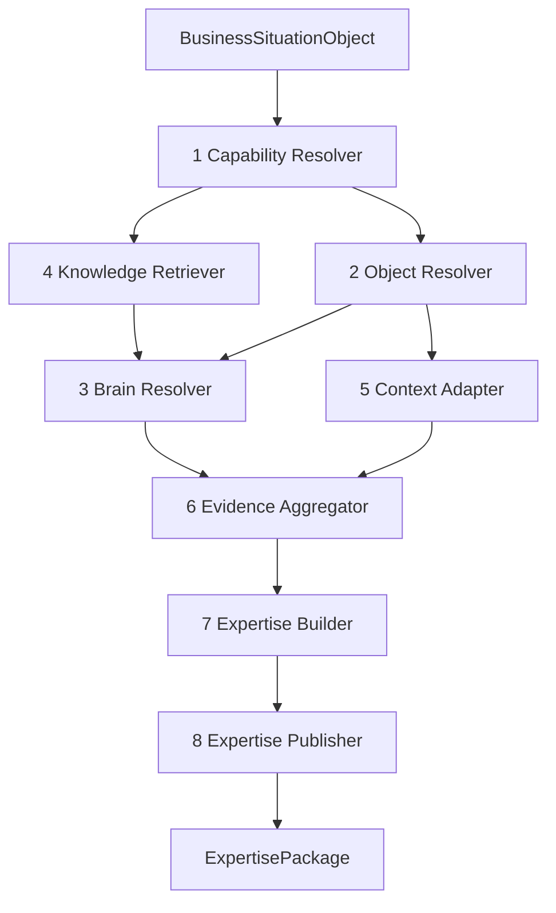

[Folder map](README.md) · [The Four Brains](01-The-Four-Brains.md) · [Domain Compiler](07-Domain-Compiler.md)

# Layer 3 — Domain Expertise

Layer 3 is a deterministic expertise-assembly boundary. Layer 2 identifies and qualifies a
business situation. Layer 3 resolves only the relevant domain knowledge, binds it to the
situation, adds permitted runtime knowledge, records evidence, and publishes one immutable
`ExpertisePackage`. Layer 4 alone reasons over that package.

## Contract

| | Layer 2 -> Layer 3 | Layer 3 -> Layer 4 |
|---|---|---|
| Object | `BusinessSituationObject` + `SituationContextSlice` | `ExpertisePackage` |
| Common envelope | both inputs carry `org_id`, `schema_version`, `trace_id`, `visibility` | BSO envelope is inherited unchanged |
| Semantic identity | situation id + semantic hash | content-addressed package id + semantic hash |
| Required content | type, confidence, importance, evidence, entities, relationships, timeline, dependencies, state, metadata | capabilities, objects, four brain slices, bindings, confidence, evidence, brain snapshot |
| Forbidden | raw graph fetches, unresolved guesses | recommendation, score, decision, action choice |

Both contracts are frozen value objects. Visibility is parsed at ingress. Signal ids and source
trace ids are sorted and unique. Confidence and importance use integer basis points. Unsupported
schema versions fail closed.

## Pipeline



The context adapter is embedded where authored predicates and object bindings are evaluated; it
adapts only the supplied BSO and relevant context slice. It never reads the graph behind Layer 2.

## The source model

The authored Expert Brain is global by concept and referenced by use:

```text
Domain
  models + offerings
  capabilities
    capability.yaml
    objects.yaml                 references, not copies
    knowledge.yaml               references, not copies
    situations/                  the routing entry points
  objects/
    core/                        reusable domain concepts
    <capability>/                capability-owned concepts
  playbooks + rules + heuristics + mental-models + decision-frameworks
  registry/situation-capability-map.yaml
```

An object is defined once. Capabilities and situations declare which objects and knowledge
artifacts they require. A business situation activates a focused slice, not an entire domain.
Inference patterns remain inside the object because they answer how that specific concept is
recognized from evidence.

## Authoring and runtime are separate

```text
Authoring Engine
  YAML schemas + authoring tools + validation + generated registries
        |
        v
Expert Brain catalog snapshot
        |
        +----------------------+
                               v
Runtime Engine          Organization / Behavior / Adaptive snapshots
                               |
                               v
Domain Compiler ----------------+
        |
        v
ExpertisePackage
```

- Expert Brain knowledge is written by domain experts and versioned in Git.
- Organization knowledge is discovered or explicitly configured for one tenant.
- Behavior knowledge is observed about operating patterns and communication preferences.
- Adaptive knowledge is learned from governed outcomes.
- The compiler reads all four; it writes none of them.

## Routing

Routing starts from the generated `situation-capability-map.yaml`, keyed by Layer 2 situation type.
That reverse index provides bounded candidates. Authored situation predicates then narrow those
candidates using only facts already present in the BSO.

The resolver:

1. honors explicit domain hints or searches the three registered domains;
2. rejects unknown domains;
3. distinguishes predicate `false` from missing context;
4. fails with `SituationContextIncomplete` rather than guessing when required context is missing;
5. skips explicitly marked capability stubs and reports them in package metadata;
6. unions required and optional object manifests, then applies `never_load`;
7. enforces maximum capability and object expansion;
8. verifies that generated registries have not drifted from authored situations.

## Knowledge loading and binding

Required objects fail closed when missing. Optional objects remain visible in metadata and lower
package confidence. Explicit model and offering ids from BSO metadata select overlays; the compiler
does not infer a business model from prose. Capability knowledge manifests resolve playbooks,
rules, heuristics, mental models, and decision frameworks.

Object-to-entity bindings use authored type identity and the entities already carried by the BSO.
Unbound objects remain knowledge objects; a binding is never fabricated.

## Runtime brains and authority

Runtime entries are tenant-scoped and included only when relevant to a selected capability,
object, situation, explicit brain subject key, or BSO entity. The package visibility can never be
wider than the runtime evidence visibility. Incompatible entries are excluded and receipted in
metadata.

There are two independent axes:

| Axis | Precedence |
|---|---|
| Preference | Expert < Behavior < Organization < Adaptive |
| Permission | Adaptive < Behavior < Expert < Organization |

This is not a blind overwrite merge. Each brain remains a separate package section. Runtime entries
compete only when they declare the same `conflict_key`; preference conflicts resolve Adaptive over
Organization over Behavior, while same-rank ambiguity fails closed. Behavior and Adaptive entries
are rejected if they attempt to define permission, policy, compliance, security, retention,
approval, constraint, or equivalent authority.

## Determinism and replay

For the same BSO, authored Git snapshot, and runtime-brain rows:

- selections are sorted;
- YAML floats are normalized before hashing;
- catalog documents and brain values receive semantic content hashes;
- the combined brain snapshot is content-addressed;
- the context-slice hash and graph/selector versions are pinned in package metadata;
- the package id is derived from the complete package body;
- publisher retries return the byte-identical stored package;
- attempting to reuse an id for different bytes fails;
- PostgreSQL rejects package updates.

The output is therefore reproducible without relying on a version label alone.

## Failure and degradation policy

| Condition | Result |
|---|---|
| No route for a situation type | fail closed |
| Authored predicate needs absent BSO context | fail closed, name the missing path |
| Registry points to missing situation/capability | authoring-integrity failure |
| All selected capabilities are stubs | fail closed |
| Required object absent | fail closed |
| Optional object absent | package continues, confidence reduced, receipt emitted |
| Referenced optional artifact absent | package continues, receipt emitted |
| Runtime row belongs to another tenant | excluded |
| Runtime visibility is narrower than package audience | excluded, receipt emitted |
| Behavior/Adaptive attempts permission authority | fail closed |
| Package id already stores different bytes | fail closed |

The compiler never compensates for missing knowledge by asking an LLM to guess.

## Current implemented inventory

The catalog loads the three authored domains: Admin, Customer Support, and Sales. The corpus is
intentionally at mixed maturity: Customer Support and Sales contain routable situations, while
Admin and a number of capabilities remain authoring work. The compiler exposes stubs and missing
optional knowledge instead of presenting authored quantity as runtime readiness.

The older `sales`/`general` Python pack registry, LVL2/LVL3 effective-config merge, and native
deal capabilities remain present as a compatibility runtime. They are not the canonical model for
new Domain Expertise authoring and must not be confused with the new `ExpertisePackage` boundary.

## Production state

The Layer 3 compiler, contracts, persistence migration, composition root, and corpus-backed tests
are implemented. The remaining work is activation across adjacent layers: Layer 2 must publish the
typed BSO in the live runner, Layer 4 must consume the package, and migration/query behavior must be
proven against production-like PostgreSQL and concurrency. See [06 · Gaps](06-Gaps.md).
