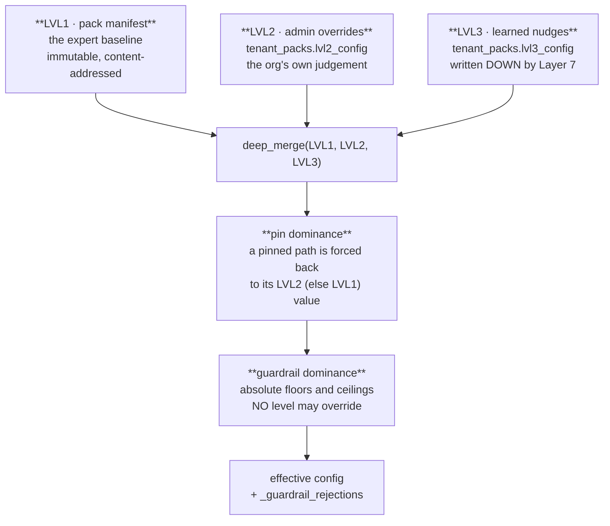

← [Pack Manifests — the Universal Brain](02-Pack-Manifests.md) · [Folder map](README.md) · → [The Pack Registry and Wiring](04-The-Pack-Registry.md)

---

# The Merge Engine and Content Addressing

---

## The four-level merge — `merge.py`

> **The ONLY producer of effective config.**



#### Pin dominance

```python
for path in pins:
    val = _get(lvl2, path) or _get(pack_defaults, path)
    if val is not None:
        _set(eff, path, val)
```

A pinned path **freezes** at the admin's (or the pack's) value. Layer 7 may still compute a
nudge for it — the nudge is simply rejected. *The calibrator gets no private door.*

#### Guardrail dominance — clamped, and **recorded**

```python
gate.c_min          < 50  → clamped to 50
budget_per_user_day > 15  → clamped to 15
weights u+i+r      ≠ 100  → reset to {45, 35, 20}
cfg["_guardrail_rejections"] = rejected      # the list of what was clamped
```

The rejections list is the design detail that matters: a violation is **rejected visibly,
not silently kept**. An admin who sets `c_min: 20` gets 50 *and* a record saying their value
was refused. A clamp nobody can see is a config system that lies to its operator.

#### Determinism

`merge_config` is a pure function of `(pack_defaults, lvl2, lvl3, pins)`. Same inputs →
same effective config → **same hash**. That is what makes the snapshot id meaningful.

---

---

## Content addressing — `snapshot.py`

Sixteen lines that carry the replay guarantee:

```python
def canonical(cfg):   return json.dumps(cfg, sort_keys=True, separators=(",", ":"), default=str)
def snapshot_id(cfg): return "cfg_" + sha256(canonical(cfg))[:16]
```

| Property | Consequence |
|---|---|
| sorted keys | a key reorder never changes the hash |
| no whitespace | formatting never changes the hash |
| any value change | **always** changes the hash |
| idempotent | same content → same id, forever |

This is **the truth of record stamped on every signal** (Law 6). A signal carries
`config_snapshot_id`; replay resolves snapshot → effective → byte-identical signal.

---
