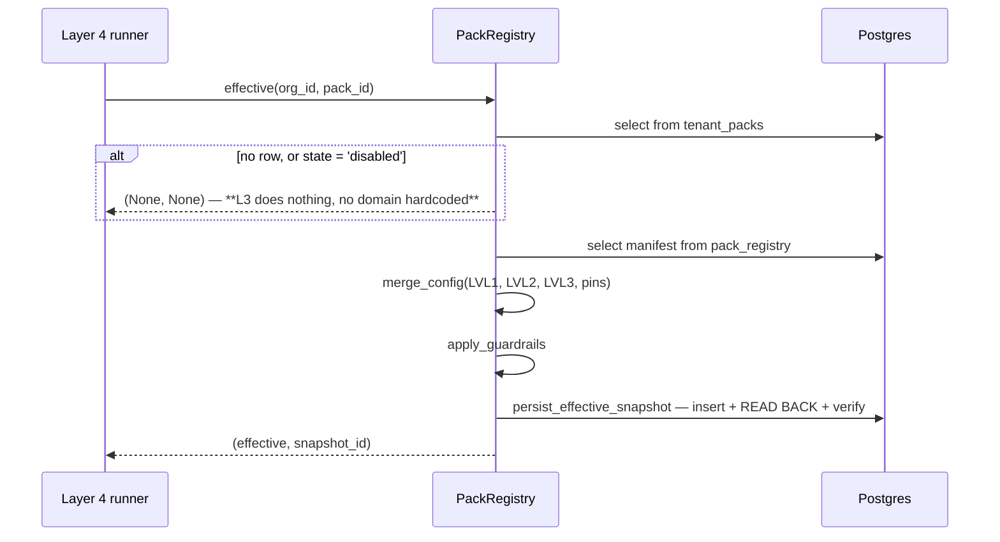

← [The Merge Engine and Content Addressing](03-The-Merge-Engine.md) · [Folder map](README.md) · → [Native Capabilities](05-Native-Capabilities.md)

---

# The Pack Registry and Wiring

---

## The registry — `registry.py`

Four operations, each with a defended invariant.

#### `register(manifest)` — immutability, enforced against a race

```python
insert ... on conflict (pack_id, version) do nothing
held = select manifest, checksum ... for update
if held.checksum != checksum or canonical(held.manifest) != canonical(manifest):
    raise ValueError("immutable pack version mismatch")
```

> `ON CONFLICT DO NOTHING` alone used to **silently accept different bytes under an already
> published version**, making historical signals impossible to replay honestly.

The post-insert read is safe under concurrency: PostgreSQL waits for the conflicting insert
before this `SELECT` can observe the winning row. And it compares **both** the checksum and
the canonical form — belt and braces against a hash collision or a checksum written by an
older code path.

#### `apply_to_tenant(org, pack, version)` — the version-change rule

```sql
lvl3_config = case when tenant_packs.version = excluded.version
                   then tenant_packs.lvl3_config
                   else '{}'::jsonb end
```

**Learned tuning is discarded when the pack version changes.** Rule ids and their meanings
can move between versions; carrying a v1.5 offset for `champion_quiet` into v1.8 would
apply a correction learned against different arithmetic. `authority_revision` increments on
every apply, so downstream can tell that the tenant's authority moved.

#### `write_lvl3_offset(...)` — the ONE calibration write path

This is the **only** door Layer 6 Learning has into Layer 3, and it is a single atomic statement with
the pin guard in the `WHERE`:

```sql
update tenant_packs
   set lvl3_config = jsonb_set(..., '{scoring_defaults,rule_offsets}',
                               existing || jsonb_build_object(:rule, :offset), true),
       authority_revision = authority_revision + 1
 where org_id = :o and pack_id = :p
   and not exists (select 1 from jsonb_array_elements_text(coalesce(pins,'[]')) pe
                   where pe like 'scoring_defaults.rule_offsets%')
```

> The old shape — read the whole blob → mutate in Python → write the whole blob — meant two
> concurrent calibration runs both read the same blob and **the second write silently
> discarded the first**, losing offsets for rules it never touched. That is *corrupting
> tenant config*, not just double-stepping one nudge.

Returns `False` when the row does not exist **or** the path is pinned. Bounding the offset
value is the caller's responsibility (Layer 6 Learning bounds it).

#### `effective(org, pack)` — the assembly line



The `None, None` return is load-bearing: a tenant with no pack applied means **Layer 4 does
nothing**. No domain is ever assumed.

#### `persist_effective_snapshot` — write, read back, verify

```python
insert ... on conflict do nothing
held = select effective ...
if held is None:      raise RuntimeError("apply migration 0025_...")
if canonical(held) != canonical(effective):  raise RuntimeError("hash collision")
```

Two failures are caught that a fire-and-forget insert would not: a **missing migration**
(the snapshot silently not persisting, so replay finds nothing) and a **hash collision**.

Why snapshot the *effective* bytes rather than just referencing the pack version:

> Runtime-derived overlays — for example a tenant's observed P90 deal value — are part of
> the scoring configuration, not incidental metadata. Giving those bytes their own snapshot
> prevents a run from claiming provenance from the earlier, pre-overlay pack snapshot.

---

---

## Wiring & defaults — `wiring.py`

> One place that knows which packs exist and which is the tenant default. The runner asks
> here for a registry; **it never imports a domain pack directly.** Adding a pack = import
> it + register it here. Zero engine change.

```python
BUILTIN_PACKS = [SALES_V1, GENERAL_V1]
DEFAULT_PACKS = [("sales", SALES_V1["version"]), ("general", GENERAL_V1["version"])]
```

`make_registry` is `lru_cache`d and registers every built-in pack idempotently at first use.

**`ensure_default` / `ensure_defaults` apply a pack only if it is *absent*** — never
clobbering:

> An admin who disabled or overrode a pack is never silently re-enabled by a background
> Layer 4 run. Orgs already on an older pinned version keep it until explicitly promoted —
> this only backfills what is missing.

---
