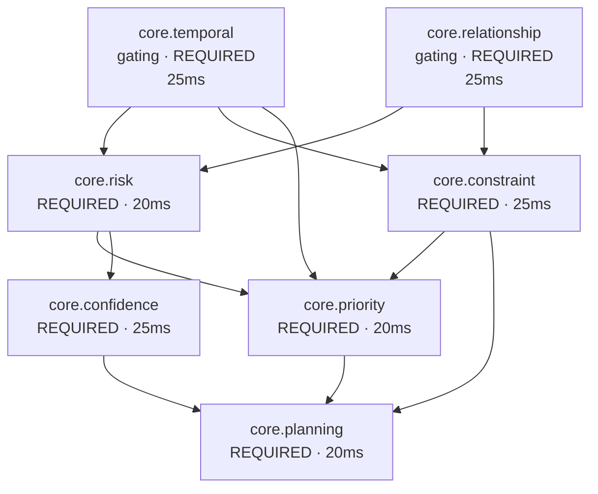

← [The Pack Registry and Wiring](04-The-Pack-Registry.md) · [Folder map](README.md) · → [Gaps](06-Gaps.md)

---

# Native Capabilities

---

## Native capabilities — the next-generation shape

A **capability** is the newer form of expertise: instead of *"a corpus of threshold rules
plus a scoring formula"*, it declares **a reasoning DAG** — which units run, in what order,
on what inputs, with what failure policy.

```python
"""Native, capability-scoped expertise manifests.

The legacy domain packs remain the active compatibility path. Manifests in this
package are immutable Layer 4 inputs for shadow/canary execution and do not
register or activate themselves at import time."""
```

Read that carefully: **packs are the live path; capabilities run in shadow.** They do not
self-register, so importing one cannot change behaviour.

#### The manifest's four parts

| Part | Contract type | Holds |
|---|---|---|
| **Intelligence objects** | `IntelligenceObject` | compiled expertise slices — purpose, required context, relationships to other objects, and *knowledge* split across the four brains |
| **Reasoners** | `ReasonerSpec` | the version-pinned DAG — id, dependencies, input/output kind, required fields, latency budget, failure policy, gating flag, config |
| **Plays** | `PlayDefinition` | *"safe alternatives with observable outcomes — not interaction proxies"* |
| **Goals / policies** | `Goal`, `FailurePolicy` | what the capability is trying to achieve, and what happens when a unit cannot run |

An `IntelligenceObject` is where **the four brains appear explicitly** in one structure:

```python
knowledge={
    "universal":            {"cooling_threshold_bp": 5_000,
                             "maximum_observation_window_days": 28},
    "organization_overlay": {"source": "tenant_policy_snapshot"},
    "behavioral_overlay":   {"source": "owner_cadence_baseline"},
    "adaptive_overlay":     {"source": "observed_outcomes",
                             "minimum_samples_before_override": 20},
}
```

The universal layer carries the numbers; the three overlays name **where a tenant-, person-,
or outcome-specific correction comes from** — and `minimum_samples_before_override: 20`
stops a handful of outcomes from rewriting expert judgement.

**Everything is in basis points.** `cooling_threshold_bp: 5_000` is 50%. Integer arithmetic
end to end means a decision is exactly reproducible; floats are not.

#### `sales.deal_cooling` v1 — seven units



Each spec pins its `version`, declares `required_fields`, a `latency_budget_ms`, a
`failure_policy`, and whether it is **gating** (a gating unit that cannot run stops the
capability rather than degrading it).

#### `sales.deal_cooling_full` v2 — seventeen units, and why it is a *separate* capability

The v2 docstring is the clearest statement of intent in the layer:

> v1 names seven units: the four it needs plus the shared scoring trio. That was correct
> when seven units existed. **Now there are seventeen, and a capability that ignores twelve
> of them is not conservative — it is blind in twelve specific ways.** It cannot see that
> the buyer is waiting on us (Opportunity), that acting today would pre-empt tomorrow's
> meeting (Scheduling), that the owner has no capacity (Resource), that its own conclusion
> rests on uncited claims (Validation), or that two of its readings contradict each other.

Three design decisions follow:

1. **The expertise is reused verbatim.** v2 imports v1's `_intelligence_objects`, `_plays`
   and `_reasoners` and rewires only *how it reasons* over them. *Re-deriving the thresholds
   would create two sources of truth for the same expertise; the next person to tune a
   cadence would fix one and not the other.*
2. **It is a separate capability, not a version bump**, precisely so the two can run **side
   by side** — v1 the shipped baseline, v2 the candidate. *Comparing their decisions on the
   same situation is how you find out whether twelve more units actually made the reasoning
   better.*
3. **The DAG order is a real data dependency, not a taxonomy:** understand → evaluate →
   optimise → support. *You cannot weigh a tradeoff before knowing the risk and the
   opportunity, and you cannot validate a conclusion before one exists.*

And the required/optional split is a product decision expressed as configuration:

```python
_REQUIRED = {"core.temporal", "core.relationship", "core.risk", "core.constraint",
             "core.priority", "core.confidence", "core.planning", "core.validation"}
```

> Units whose judgement is load-bearing: without them the run cannot honestly reach a
> decision. **Everything else is OPTIONAL, so a situation that cannot feed a unit degrades
> confidence rather than blocking advice the buyer is actively waiting for.**

---
