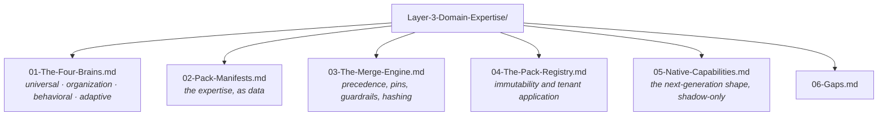

# Layer 3 · Domain Expertise — the folder map

**This folder is the live truth of `genios_engine/packs/`.** It is the source consulted before any action,
update or improvement to this layer. If a document and the code disagree, the document is wrong —
fix it in the same change that moved the code.

Start at **[00-Overview.md](00-Overview.md)** for the layer in one sitting. Use this page when you
already know what you are looking for.

---

## The one question this layer answers

> **How should an expert understand this situation?**

---

## The documents

| # | Document | Answers |
|---|---|---|
| 00 | [Overview](00-Overview.md) | The layer in one sitting — spec, inventory, workflows, strategies, map |
| 01 | [The Four Brains](01-The-Four-Brains.md) | Universal · Organization · Behavioral · Adaptive, and where each is stored |
| 02 | [Pack Manifests](02-Pack-Manifests.md) | The seven sections of a manifest, the rule grammar, the two shipped packs |
| 03 | [The Merge Engine](03-The-Merge-Engine.md) | LVL1→2→3, pin dominance, guardrails, and content addressing |
| 04 | [The Pack Registry](04-The-Pack-Registry.md) | Immutability enforced against a race, tenant application, the effective config |
| 05 | [Native Capabilities](05-Native-Capabilities.md) | `deal_cooling` v1 and v2, `deal_health` — built, and shadow-only |
| 06 | [Gaps](06-Gaps.md) | Two domains shipped, capabilities unwired, zero golden cases |

---

## Where this layer sits

| | |
|---|---|
| **Package** | `genios_engine/packs/` |
| **Layer number** | 3 — `genios_engine/LAYERS.py` |
| **Reads from** | admin overrides (LVL2) · learned nudges from Layer 7 (LVL3) |
| **Hands to** | an **effective config** + its snapshot id → Layer 4 |
| **May import** | `contracts/` · `platform/` |
| **LLM calls** | Zero |

[← System Design index](../README.md)
