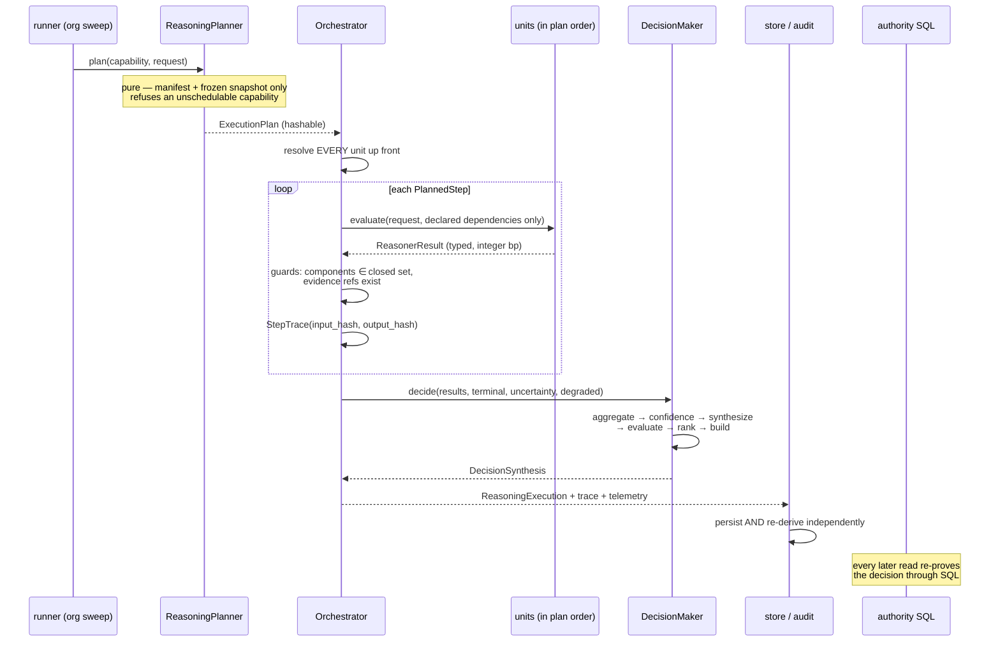
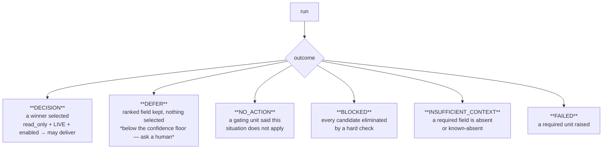
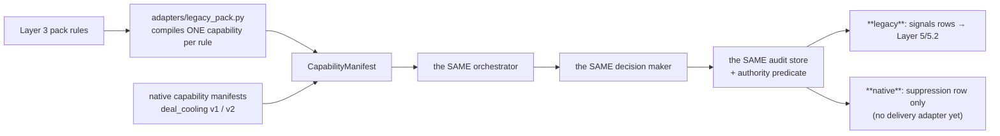

# Layer 4 — The Reasoning Engine (`reason/`)

> **Status: built and adversarially verified. Mostly — but not entirely — locked in shadow.**
>
> An earlier version of this line said Layer 4 "has never made a decision that reached a human".
> **That was wrong**, and the distinction matters enough to state precisely:
>
> - The **capability sweep** path is shadow-locked. `sales.deal_cooling` (7 units) runs in shadow;
>   `sales.deal_cooling_full` (the 17-unit roster) is not in `BUILTIN_CAPABILITIES` and therefore
>   **never runs at all**.
> - The **composite** path is live. `reason/composer.py:compose_deal_health` reasons
>   `sales.deal_health` at the tenant's real execution mode, and that manifest sets
>   `live_delivery_enabled=True`. It writes real `signals` rows for any tenant whose pack is active.
>
> So the native kernel *does* reach production today — through five pre-existing units, not through
> anything built in this pass. **Twelve of the seventeen units have zero production callers.**

Layer 4 is deterministic cognition. It takes a frozen snapshot of what is true (Layer 2), the
expertise that says what matters (Layer 3), and produces a **decision** — or a justified
refusal to decide — that can be replayed byte-for-byte months later.

No language model participates. No clock is read. No database is touched by a reasoning unit.
That is not asceticism; it is the only way a conclusion can be **proved** rather than merely
asserted.

This layer is a folder rather than a single file because three architectural parts, seventeen
units, fifty-two analyzer plugins and a determinism story that stands on its own do not fit one
readable document. **This page is the entry point:** it carries the §0–§7 skeleton for the layer
as a whole and links down into the detail.

---

## The documents

| # | Document | Answers |
|---|---|---|
| **00** | **Overview** *(this page)* | What the layer is, what was asked for, what exists, and how it all fits |
| 01 | [Part 1 — The Orchestrator](01-Reasoning-Orchestrator/README.md) | Which units run, in what order, and what the record of that says. Plan, guards, telemetry, registry |
| 02 | [Part 2 — The Unit Framework](02-Reasoning-Units/README.md) | What every unit has in common, and what stops any one of them becoming special |
| 03 | [Category 1 — Situation Understanding](02-Reasoning-Units/01-Situation-Understanding/README.md) | `core.context` · `core.timeline` · `core.dependency` · `core.constraint` |
| 04 | [Category 2 — Business Evaluation](02-Reasoning-Units/02-Business-Evaluation/README.md) | `core.risk` · `core.opportunity` · `core.impact` · `core.priority` · `core.confidence` |
| 05 | [Category 3 — Optimization](02-Reasoning-Units/03-Optimization/README.md) | `core.tradeoff` · `core.resource` · `core.scheduling` · `core.cost` · `core.policy` |
| 06 | [Category 4 — Decision Support](02-Reasoning-Units/04-Decision-Support/README.md) | `core.alternative` · `core.validation` · `core.recommendation` |
| 07 | [Part 3 — The Decision Maker](03-Decision-Maker/README.md) | Which exposed operation should happen, and whether this run is confident enough to say so at all |
| 08 | [Contracts & Data Flow](_reference/Contracts-and-Dataflow.md) | What exactly crosses each boundary, and what it is not allowed to say |
| 09 | [Determinism, Audit & Replay](_reference/Determinism-Audit-Replay.md) | Six months from now, can we **prove** this decision — not assert it? |
| 10 | [Integration & Activation](_reference/Integration-and-Activation.md) | What Layer 4 reads, what it hands on, who may believe it, and what is still switched off |

---

## §0 · At a glance

| | |
|---|---|
| **Package** | `genios_engine/reason/` |
| **Layer number** | 4 |
| **Size** | 54 files · ~14,530 lines — **the largest package in the engine** |
| **Input** | `ContextSnapshot` (frozen) + `CapabilityManifest` (versioned) |
| **Output** | `ReasoningDecision` + a full `ReasoningTrace`, persisted and re-derivable |
| **May import** | `packs/` (L3), `context/` (L2), `capture/` (L1), `contracts/`, `platform/` |
| **LLM calls** | **Zero — test-enforced ban** |
| **Arithmetic** | Integer basis points (0–10,000), round-half-up. Floats rejected at canonicalisation |
| **Units** | 17 core + 6 supplementary · **52 analyzer plugins** |
| **Tests** | 1,678 passing — **and not one of them is real data** |
| **Live?** | **Partly.** The sweep path is shadow-locked; the composite path (`sales.deal_health`) is live. Twelve of seventeen units have zero production callers — see [Integration & Activation](_reference/Integration-and-Activation.md) |

---

## §1 · What was supposed to be built

### 1.1 The three parts, and why the separation *is* the design

```text
Part 1  Reasoning Orchestrator   schedules  — never analyses, never decides
Part 2  Reasoning Units (17)     analyse    — never decide, never rank
Part 3  Decision Maker           decides    — the only synthesis authority
```

> If any one of those three starts doing another's job, the layer has failed, **regardless of
> what the tests say.** Most of the work below is about making that boundary *physical* rather
> than a convention.

### 1.2 The orchestrator's seven declared duties

| # | Duty | How it is answered | Detail |
|---|---|---|---|
| 1 | Which units execute | the declared roster, plus opt-in context-aware pruning | [01](01-Reasoning-Orchestrator/README.md) |
| 2 | In what order | Kahn topological sort, lexical tie-break | [01](01-Reasoning-Orchestrator/README.md) |
| 3 | Which can run in parallel | `ExecutionPlan.stages` — **described, not performed** | [01](01-Reasoning-Orchestrator/README.md) |
| 4 | Which are skipped | terminal outcomes, gating, and recorded `SkippedStep` rows with reasons | [01](01-Reasoning-Orchestrator/README.md) |
| 5 | What happens when one fails | reserve units: a unit declaring `fallback_for` runs only when its primary failed | [01](01-Reasoning-Orchestrator/README.md) |
| 6 | Should an LLM be called | **Never.** Below the floor → `DEFER` | [07](03-Decision-Maker/README.md) |
| 7 | Should the confidence threshold change | `confidence_floor_bp` in capability metadata | [07](03-Decision-Maker/README.md) |

### 1.3 The unit anatomy — eight stages

```text
Input → Validator → Retriever → Analyzer → Calculator → Evaluator → Builder → Metrics
```

Detailed in [02 · The Unit Framework](02-Reasoning-Units/README.md).

### 1.4 The unit roster — four categories, seventeen units

```text
Category 1 · Situation Understanding   context · timeline · dependency · constraint
Category 2 · Business Evaluation       risk · opportunity · impact · priority · confidence
Category 3 · Optimization              tradeoff · resource · scheduling · cost · policy
Category 4 · Decision Support          alternative · validation · recommendation
```

One document per category: [03 · Situation Understanding](02-Reasoning-Units/01-Situation-Understanding/README.md) ·
[04 · Business Evaluation](02-Reasoning-Units/02-Business-Evaluation/README.md) ·
[05 · Optimization](02-Reasoning-Units/03-Optimization/README.md) ·
[06 · Decision Support](02-Reasoning-Units/04-Decision-Support/README.md).

### 1.5 The Decision Maker's six components

```text
Evidence Aggregator     → every citation the units stood behind, deduplicated
Confidence Calculator   → one authoritative confidence for the whole decision
Decision Synthesizer    → declared plays become scored candidates
Decision Evaluator      → hard checks eliminate BEFORE anything is ranked
Decision Ranker         → a total order over the survivors
Decision Object Builder → one immutable, content-addressed ReasoningDecision
```

Detailed in [07 · The Decision Maker](03-Decision-Maker/README.md).

### 1.6 What already existed, and was good

None of this was thrown away:

- A deterministic orchestrator executing a capability-declared DAG in lexical topological order.
- Immutable, content-addressed contracts: `ContextSnapshot`, `CapabilityManifest`,
  `ReasonerResult`, `DecisionCandidate`, `ReasoningDecision`, `ReasoningTrace`.
- Integer-basis-point arithmetic with floats rejected at canonicalisation.
- Full audit persistence with **independent re-derivation** in `reason/store.py`, plus replay
  and shadow/simulation modes.
- Seven reasoning units and a legacy strangler pair running existing pack rules unchanged.
- A SQL authority predicate that **re-proves every decision on every downstream read**.

### 1.7 The seven gaps

| Gap | State before |
|---|---|
| Decision-making lived **inside** the orchestrator | `_build_candidates` ranked and selected in `orchestrator.py` — Parts 1 and 3 were one module |
| Unit roster | 7 of 17 existed; **12 missing entirely** |
| Unit framework | **Zero** units implemented the 8-stage anatomy; each was one `evaluate()` of 37–142 lines |
| Analyzer plugins | Did not exist anywhere in the layer |
| Confidence floor | No path from "low confidence" to "ask a human" |
| Unit selection | Static per capability; the orchestrator could not see the situation |
| Fallback | Only `required`/`optional`; no substitution |

Plus two contract fields declared and never used: `ReasonerSpec.latency_budget_ms` was validated
but never read at runtime, and `DecisionOutcome.DEFER` existed in the enum **and the database
constraint** with no code path producing it.

---

## §2 · What exists — the inventory

```mermaid
flowchart TB
    subgraph P1 ["**Part 1 · Orchestrator** — schedules"]
        o1["plan.py<br/>ExecutionPlan · hashable schedule"]:::a
        o2["orchestrator.py<br/>execute the DAG"]:::a
        o3["registry.py<br/>versioned unit resolution"]:::a
        o4["telemetry.py<br/>observed cost · never a decision input"]:::a
        o5["guards.py<br/>contract predicates, shared with the verifier"]:::a
    end

    subgraph P2 ["**Part 2 · Units** — analyse"]
        u0["unit.py<br/>the 8-stage framework"]:::b
        u1["4 · situation understanding"]:::b
        u2["5 · business evaluation"]:::b
        u3["5 · optimization"]:::b
        u4["3 · decision support"]:::b
        u5["6 supplementary<br/>incl. the legacy strangler pair"]:::b
    end

    subgraph P3 ["**Part 3 · Decision Maker** — decides"]
        d1["decision_maker.py<br/>the sole synthesis authority"]:::c
    end

    subgraph LEG ["The legacy path — still the live one"]
        l1["engine.py + rules.py"]:::d
        l2["scoring.py"]:::d
        l3["baselines.py · signals_derived.py"]:::d
        l4["composer.py · foresight.py"]:::d
        l5["runner.py · adapters/"]:::d
    end

    subgraph AUD ["Audit · replay · authority"]
        a1["store.py — 1,950 lines"]:::e
        a2["audit.py · replay.py · simulation.py"]:::e
        a3["authority.py — ~130-line SQL predicate"]:::e
    end

    P1 --> P2 --> P3
    LEG -.-> P1
    P3 --> AUD

    classDef a fill:#eef,stroke:#88a
    classDef b fill:#efe,stroke:#8a8
    classDef c fill:#fee,stroke:#a88
    classDef d fill:#ffe,stroke:#aa8
    classDef e fill:#eee,stroke:#888
```



---

## §3 · Anatomy

Opened up across ten documents:

| Reading for | Go to |
|---|---|
| *how a run is scheduled and recorded* | [01 · Orchestrator](01-Reasoning-Orchestrator/README.md) |
| *what makes a unit a unit* | [02 · Unit Framework](02-Reasoning-Units/README.md) |
| *what one specific unit computes, and why that formula* | [03](02-Reasoning-Units/01-Situation-Understanding/README.md) · [04](02-Reasoning-Units/02-Business-Evaluation/README.md) · [05](02-Reasoning-Units/03-Optimization/README.md) · [06](02-Reasoning-Units/04-Decision-Support/README.md) |
| *how a winner is chosen, or refused* | [07 · Decision Maker](03-Decision-Maker/README.md) |
| *what crosses each boundary* | [08 · Contracts & Data Flow](_reference/Contracts-and-Dataflow.md) |
| *how a decision is proved months later* | [09 · Determinism, Audit & Replay](_reference/Determinism-Audit-Replay.md) |
| *what is wired, what is pinned, and how to switch it on* | [10 · Integration & Activation](_reference/Integration-and-Activation.md) |

---

## §4 · The workflows

### W1 · One reasoning run, end to end



### W2 · Every way a run can end



Six outcomes. **Silence and a question are both valid outputs of this system** — *shipping a
weakly-evidenced recommendation as though it were a strong one is how an intelligence layer
loses the trust it cannot re-earn.*

### W3 · The strangler — how legacy and native coexist



Detail in [10 · Integration & Activation](_reference/Integration-and-Activation.md).

---

## §5 · Strategies

### S1 · Determinism outranks the diagram

Anywhere the blueprint asks for something that would make the same situation resolve differently
on different hardware, the blueprint loses. **Replay is what makes a decision auditable rather
than merely asserted.**

### S2 · Integer basis points, everywhere

0–10,000, round-half-up, floats rejected at canonicalisation. A float would make the decision
hash machine-dependent.

### S3 · Every ordering is total

Plugin order by `plugin_id`. Check order by a five-key sort. Candidate ties by `play_id`.
Topological order with lexical tie-break. **A tie broken by iteration order is a decision that
cannot be reproduced.**

### S4 · Declared, never discovered

Units register explicitly. Metrics are declared in `publishes`. Categories are declared, not
inferred. *A unit appearing in the runtime because a file happened to be importable is how a
decision gets made by something nobody reviewed.*

### S5 · One authority per shared value

One confidence publisher, one urgency publisher, one cost publisher. Without a named authority,
*"whichever emitter ran last"* wins — and adding a unit silently re-scores the system.

### S6 · Eliminate before ranking

A play removed by policy never competes on score. It cannot win and then be quietly demoted.

### S7 · A failure that is recorded is inspectable

Unit exceptions become typed `FAILED` results inside the trace. Skipped steps are recorded with
reasons. Planner omissions become `SkippedStep`. **Nothing disappears.**

### S8 · Prove the same law twice

`guards.py` is applied by the orchestrator *and* re-applied by the store's verifier.
`build_candidates` is run by the decision maker *and* re-run by the verifier. Two independent
provers make forgery detectable.

### S9 · When unsure, ask — never invent

`MissingContextError` at the unit level. `INSUFFICIENT_CONTEXT` at the run level. `DEFER` below
the confidence floor. Three different heights, one rule.

---

## §6 · Gaps — what is genuinely unproven

Said plainly, because the test count is misleading on its own.

- **1,678 tests pass, and not one of them is real data.** Every fixture is synthetic. The engine
  has never reasoned about an actual customer's deal.
- **Twelve of the seventeen units have zero production callers** outside the reasoners package.
- **The thresholds are guesses.** They were authored from domain reasoning, not fitted to data.
  They cannot be tuned until decisions ship and Layer 6 Learning sees outcomes — **and Layer 6 Learning cannot see
  outcomes until decisions ship.** Shadow mode on real inputs breaks that circle.
- **The native delivery adapter does not exist.** The largest remaining build item, and the one
  that touches the authority SQL.
- **Layer 4 still reads per-node `NodeContext`, not Layer 2's situations.** The blueprint says
  Layer 4 should reason over *situations*; `context.situations.active_situations()` has **zero
  callers in `reason/`**. Deliberately deferred so the unit roster and the input contract would
  not change in the same move. **It remains open.**

Full detail — including three latent bugs deliberately preserved — in
[09 · Determinism, Audit & Replay](_reference/Determinism-Audit-Replay.md) and
[10 · Integration & Activation](_reference/Integration-and-Activation.md).

---

## §7 · The map

### 7.1 Files

| Part | Files |
|---|---|
| Part 1 · Orchestrator | `plan.py`, `orchestrator.py`, `registry.py`, `telemetry.py`, `guards.py`, `protocols.py` |
| Part 2 · Units | `unit.py`, `reasoners/__init__.py` + 23 unit modules, `reasoners/common.py` |
| Part 3 · Decision Maker | `decision_maker.py` |
| Legacy path | `engine.py`, `rules.py`, `scoring.py`, `baselines.py`, `signals_derived.py`, `composer.py`, `foresight.py`, `runner.py`, `adapters/*` |
| Audit & authority | `store.py`, `audit.py`, `replay.py`, `simulation.py`, `authority.py`, `intelligence.py` |
| Determinism | `canonical.py` → `platform/canonical.py` |

### 7.2 Tables

`reasoning_runs` · `reasoning_run_outputs` · `reasoning_candidates` ·
`reasoning_reasoner_results` · `reasoning_capability_snapshots` · `reasoning_context_snapshots` ·
`reasoning_context_payloads` · `signals` (+ `config_snapshot_id`, `pack_id`, `pack_version`,
`reasoning_run_id`)

### 7.3 Tests

**Kernel:** `test_reasoning_orchestrator.py` · `test_reasoning_plan.py` ·
`test_reasoning_decision_maker.py` · `test_reasoning_contracts.py` ·
`test_reasoning_math_hardening.py` · `test_reasoning_telemetry.py`

**Determinism & audit:** `test_reasoning_config_order.py` (the replay defect) ·
`test_reasoning_audit_replay.py` · `test_reasoning_simulation.py` · `test_reason_store.py` ·
`test_reasoning_retention.py`

**Roster:** `test_unit_roster.py` + 14 per-unit differential tests

**Authority:** `test_reasoning_authority.py` · `test_learning_authority.py` ·
`test_intelligence_authority_routes.py` · `test_agent_api_authority.py`

**Legacy path:** `test_corpus_can_fire.py` · `test_foresight.py` ·
`test_reasoning_composition.py` · `test_reasoning_legacy_native.py`

### 7.4 Scorecard against §1

| Required | Status |
|---|---|
| Three parts, physically separated | ✅ three modules, one entry point each |
| Orchestrator's seven duties | ✅ all real — duty 6 answered "never", duty 7 via `confidence_floor_bp` |
| 8-stage unit anatomy | ✅ template method, not overridable in spirit |
| 17 units in 4 categories | ✅ 17 core + 6 supplementary, 52 plugins |
| Decision Maker's 6 components | ✅ separate, individually tested functions |
| Deterministic + replayable | ✅ verified — and the one defect that broke the *proof* was found and fixed |
| Analyzer plugins | ✅ 52 |
| Confidence floor → ask a human | ✅ `DEFER` |
| Fallback / substitution | ✅ reserve units |
| Context-aware unit selection | ✅ opt-in; compile-time selection is the better default |
| Wall-clock timeouts | ⛔ **deliberately not built** — static + observable instead |
| LLM consultant | ⛔ **deliberately not built** — `DEFER` instead |
| Reasons over L2 **situations** | ❌ still per-node `NodeContext` — **open** |
| Native delivery adapter | ❌ **does not exist** |
| Ever run on real data | ❌ **not once** |
