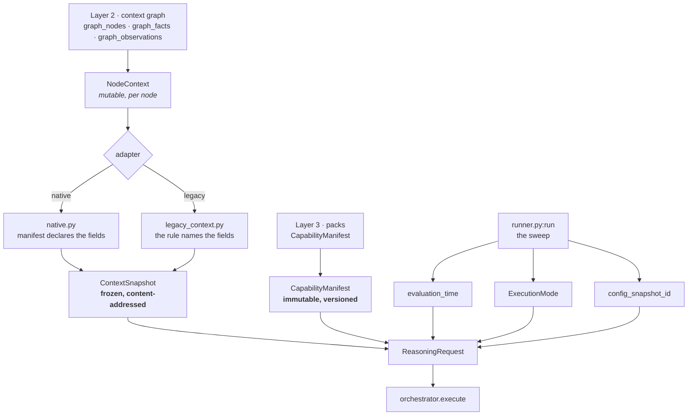

# Part 1 · Inputs and Sources — what the orchestrator consumes, and from where

**Source of truth:** `genios_engine/reason/orchestrator.py:ReasoningOrchestrator.execute` ·
`genios_engine/contracts/reasoning.py:ReasoningRequest` ·
`genios_engine/reason/adapters/` · `genios_engine/reason/runner.py`

---

## 1 · What it is for

The orchestrator reads **exactly one thing**: a `ReasoningRequest`. No clock, no database, no
environment, no network. Everything the run will ever know is inside that object before the first
unit executes.

That is not minimalism for its own sake. It is what makes a decision replayable: hand the same
request back six months later and the same bytes come out, because there was nothing else to read.

---

## 2 · What exists



| Input | Type | Comes from | Mutable? |
|---|---|---|---|
| `org_id` | `str` | the sweep's tenant loop | — |
| `capability` | `CapabilityManifest` | Layer 3 · `packs/capabilities/` | **No** — content-addressed |
| `context` | `ContextSnapshot` | Layer 2 · via an adapter | **No** — deep-frozen |
| `evaluation_time` | aware `datetime` | the caller, never `now()` | — |
| `trigger_kind` / `trigger_ref` | `str` | what caused this run | — |
| `mode` | `ExecutionMode` | `LIVE` \| `SHADOW` \| `SIMULATION` \| `REPLAY` | — |
| `config_snapshot_id` | `str` | the tenant's effective pack config | — |
| `policy_snapshot_id` | derived | **computed from the manifest's own policy bytes** | — |
| `request_id` | derived | **computed from everything above** | — |

The last two are the interesting ones. Neither is accepted from the caller as an opaque value —
both are *derived content addresses*. Supply one that disagrees with the content and construction
fails. A caller cannot claim a request is something it is not.

---

## 3 · How it works

### 3.1 · The ContextSnapshot — what is true, frozen

This is the larger of the two inputs and the one that carries the situation.

```python
ContextSnapshot(
    org_id, graph_version, root_entity_id, root_entity_type,
    evaluation_time, selector_version,
    facts={...}, observations=(...), neighbor_facts={...},
    edge_count, evidence=(...), missing_fields=(...), metadata={...},
)
```

**Facts arrive in one of two shapes**, and both are handled:

```python
"deal.status":         {"value": "open", "confidence_bp": 9_500, "src_count": 2}
"derived.engagement":  {"value_bp": 4_000, "confidence_bp": 8_500, "src_count": 2}
"deal.owner":          "rohit"          # a bare scalar is also legal
```

`reasoners/common.py:fact_value` unwraps `value`, and the contract's evidence check additionally
understands `value_bp`. A unit never has to know which shape it got.

**`missing_fields` is a first-class input, not an absence.** Layer 2 can say *"I looked for this and
it is not there"*, which is a different fact from *"nobody asked"*. `guards.required_missing` treats
a declared-missing field exactly like an absent one — both stop the run.

**Every `EvidenceRef` is validated against the fact it cites.** At construction time:

```python
if item.field not in source:            # root or neighbor scope
    raise ValueError("evidence field is absent from its context scope")
if semantic_hash(actual) != semantic_hash(item.value):
    raise ValueError("evidence value does not match its context fact")
```

So a snapshot cannot carry a citation to a value it does not contain. That is what makes
"nothing is cited that the snapshot cannot produce" enforceable rather than aspirational.

### 3.2 · The two adapters — who chooses the fields

Both produce a `ContextSnapshot`. They differ in **who decides which fields go in**:

| | `adapters/native.py` | `adapters/legacy_context.py` |
|---|---|---|
| Field selection | the **manifest** declares them | the **rule** names them |
| `neighbor:` prefixes | split out into `neighbor_facts` | flattened |
| `missing_fields` | recorded explicitly | not expressible |
| Used by | native capabilities | the legacy strangler path |

The legacy adapter's inability to express *known absent* is a real limitation: on that path, a fact
that Layer 2 knows is missing looks identical to one nobody asked about.

### 3.3 · The CapabilityManifest — what to run and what may be done

From Layer 3. Immutable and content-addressed, so `capability_snapshot_id` changes the moment any
byte of it changes — including a threshold nobody thought was semantic.

It carries the four things the orchestrator needs:

| Field | Used for |
|---|---|
| `reasoners: tuple[ReasonerSpec, ...]` | the DAG: which units, their dependencies, config, budgets, failure policy |
| `plays: tuple[PlayDefinition, ...]` | the action space Part 3 will score |
| `required_fields` | a run-level precondition checked **before** any unit executes |
| `policies` + `metadata` | the confidence floor, latency ceiling, metric authorities, delivery flag |

The manifest also enforces its own consistency at construction: ranking weights must sum to 100, a
capability declaring policies must schedule a **required** `core.constraint`, and a gating reasoner
must use a fail-closed policy. A malformed manifest cannot be built, let alone run.

### 3.4 · `evaluation_time` — passed in, never read

```python
if self.evaluation_time != self.context.evaluation_time:
    raise ValueError("request and context evaluation_time differ")
```

The request and its snapshot must agree on *when this is*. Units compute elapsed time against this
value, not against the wall clock — which is why a replay reasons about the original moment rather
than about today.

### 3.5 · `ExecutionMode` — same reasoning, different authority

| Mode | Computes a decision? | May deliver? |
|---|---|---|
| `LIVE` | yes | yes, if everything else permits |
| `SHADOW` | yes | **never** |
| `SIMULATION` | yes | never |
| `REPLAY` | yes | never |

Mode changes nothing about the reasoning — only about what the result is allowed to authorise. That
separation is what makes shadow running meaningful: it is the *same* computation, not a rehearsal.

---

## 4 · Examples and edge cases

**A well-formed request** — the shipped `sales.deal_cooling` on a cooling deal:

```text
org_1 · sales.deal_cooling@1.0.0 · deal_1 · 2026-08-06T12:00Z · LIVE
facts: deal.status=open · deal.value=500,000 · derived.engagement=4,000bp
       thread.last_inbound=2026-07-27 · relationship.verified_stakeholder_count=2
evidence: 5 refs across crm / gmail / derived
neighbor_facts: deal.status=open · contact.verified_recipient=true
```

**A starved request** — remove `derived.engagement`. The capability declares it in
`required_fields`, so `guards.required_missing` returns it and the orchestrator sets a terminal
`INSUFFICIENT_CONTEXT` **before the plan loop begins**. Every unit is skipped with
`skipped_after_insufficient_context`. No decision, no delivery, and the reason is in the trace.

**A forged evidence reference** — a snapshot claiming `deal.value = 500_000` while its `EvidenceRef`
says `750_000`. `ContextSnapshot.__post_init__` raises. The request cannot be built at all, so the
forgery never reaches reasoning.

**A mismatched request id** — a caller supplies `request_id="req_something_else"`. Construction
compares it to `stable_id("req", ...)` of the actual content and raises. Content addresses are
verified, not trusted.

**A capability with policies but no constraint unit** — `CapabilityManifest.__post_init__` raises:
*"capability policies and play preconditions require a required core.constraint"*. A policy nobody
enforces is worse than no policy, so the manifest refuses to exist.

---

## Related

- [README.md](README.md) — Part 1 in full
- [README.md](README.md) — the execution plan and what happens to these inputs first
- [../_reference/Contracts-and-Dataflow.md](../_reference/Contracts-and-Dataflow.md) — every contract, field by field
- [../_reference/Integration-and-Activation.md](../_reference/Integration-and-Activation.md) — how the runner assembles a NodeContext
