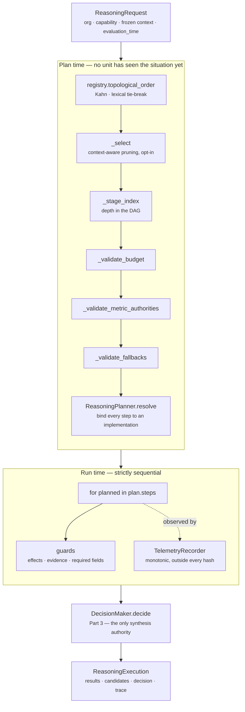
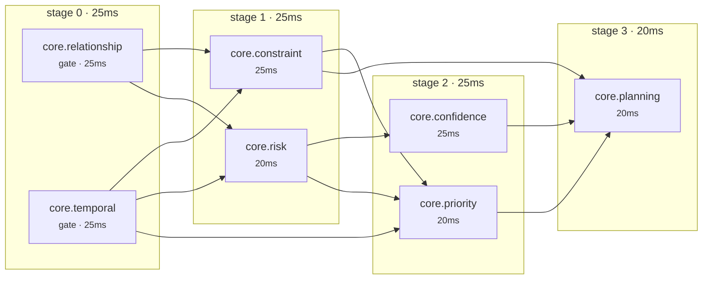
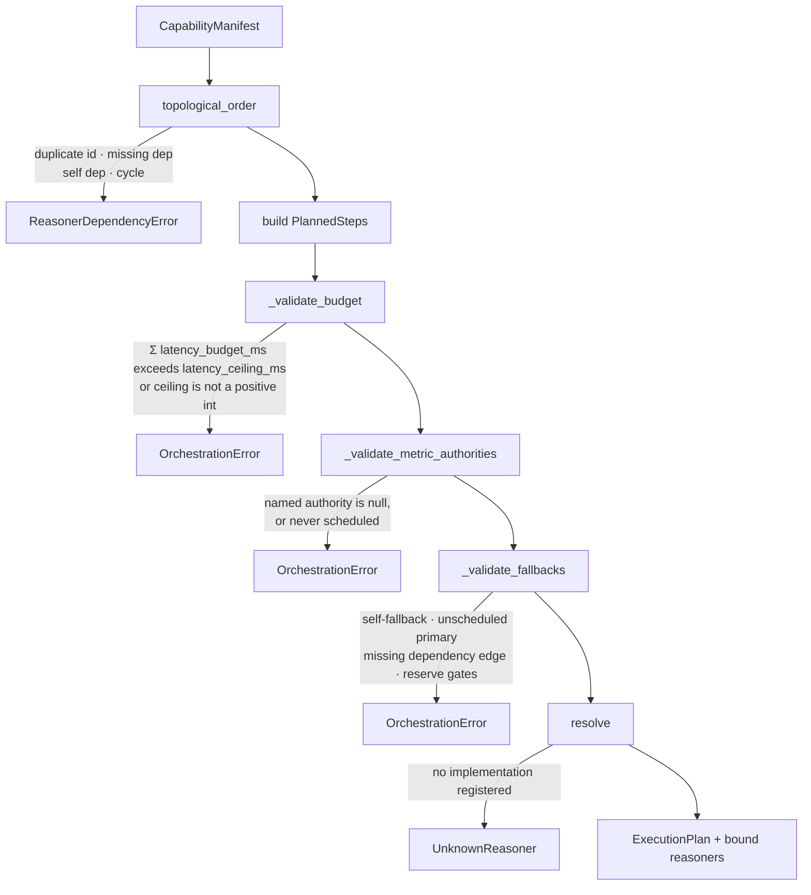
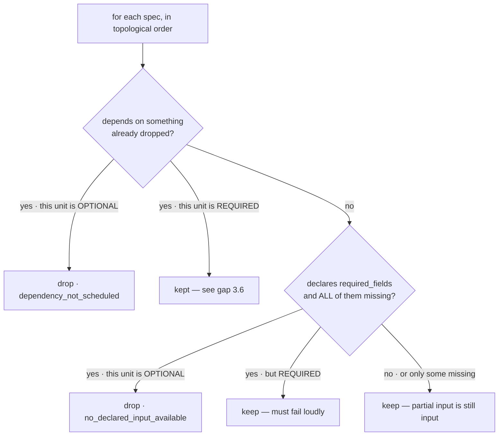
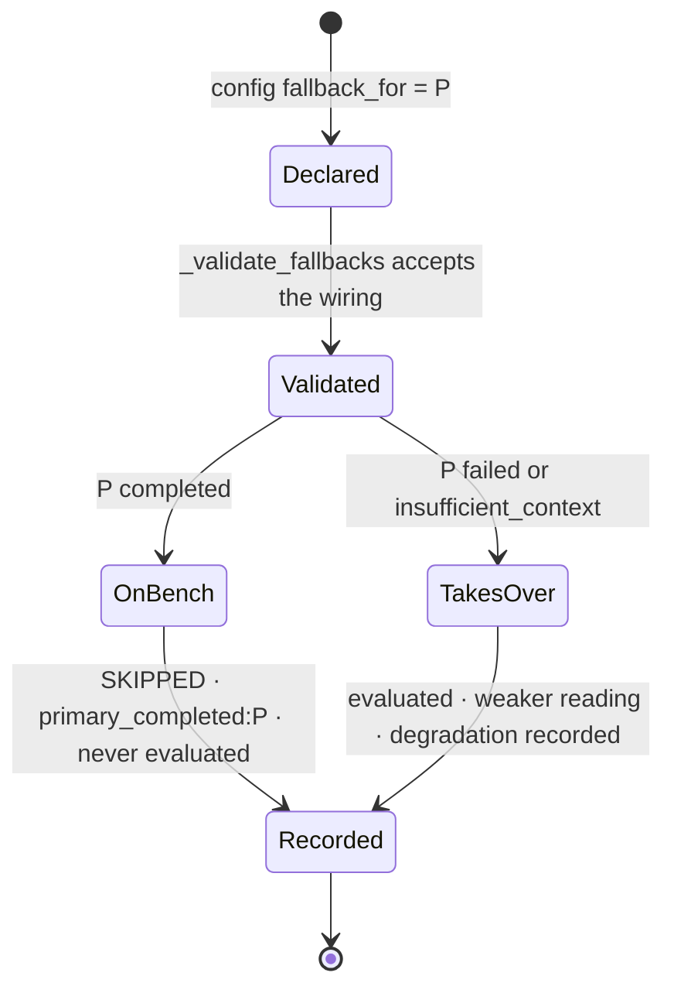
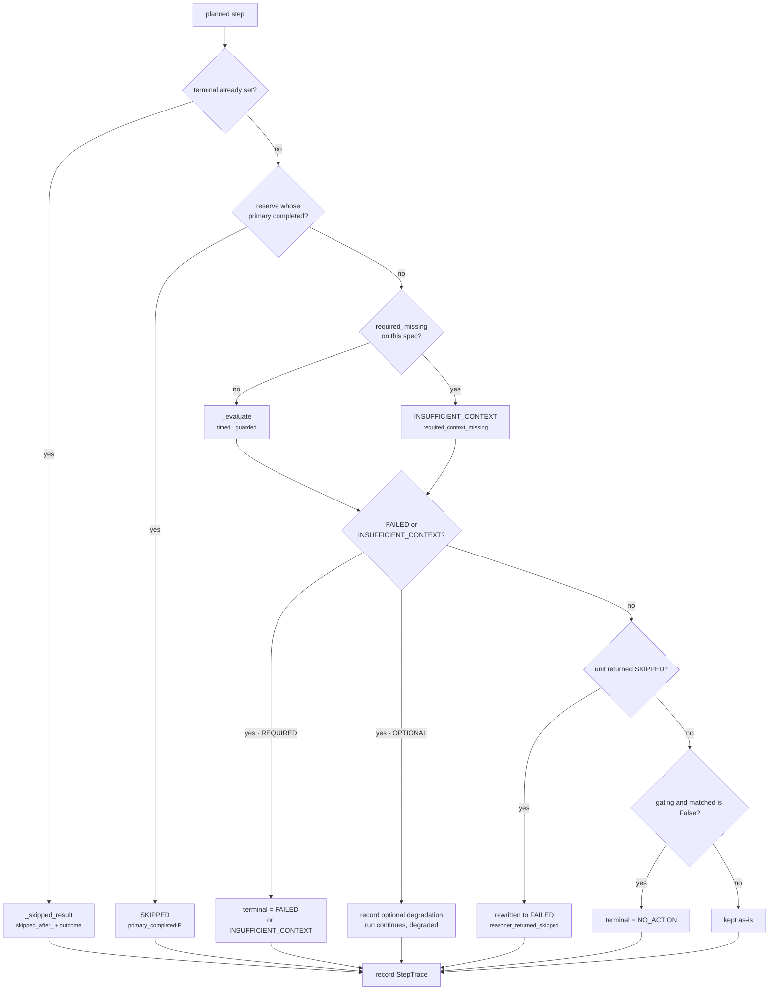
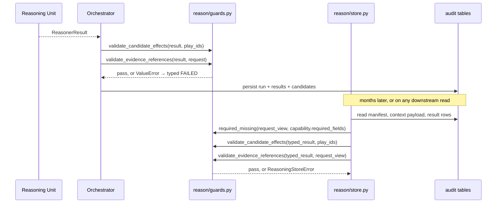

# Part 1 · The Reasoning Orchestrator

**Files:** `genios_engine/reason/orchestrator.py` · `plan.py` · `guards.py` · `telemetry.py` ·
`registry.py` · `protocols.py`
**Question it answers:** *Which units run, in what order, and what does the record of that say?*
**Output:** a `ReasoningExecution` — ordered results, a `ReasoningTrace` of hashed steps, and the
`ExecutionPlan` it committed to before any of it happened.

The orchestrator is the scheduler and only the scheduler. It analyses nothing and selects nothing.
See [00 · Overview](../00-Overview.md) for how Parts 1–3 divide the layer; this document opens Part 1.

---

## 1 · What the blueprint asked for

The architecture is blunt about what this component may not do:

> *"It NEVER reasons. It NEVER calculates. It NEVER makes decisions."*

And it hands the orchestrator seven duties — phrased in the frozen architecture as questions the
scheduler must answer for every run:

| # | The duty, as the blueprint states it |
|---|---|
| 1 | Which reasoning units should execute for this situation? |
| 2 | In what order? |
| 3 | Which can run in parallel? |
| 4 | Which should be skipped? |
| 5 | Should an LLM be called? |
| 6 | What happens if a unit fails — what is the fallback? |
| 7 | Should the confidence threshold change? |

Read together with the ban above, those seven are a narrow mandate. Every one of them is a question
about *scheduling*, answerable from the capability manifest and the frozen context without looking
at what any answer means. The moment the scheduler starts asking "is this risk score high enough",
it has become a second reasoning engine — the failure mode the architecture names explicitly for
the Executive layer and which applies with equal force here.

The blueprint also asks for per-unit timeouts and runtime, situation-driven unit selection
(*"run Risk and Priority, not Pricing"*). Both are addressed in §3, one by refusal and one by an
opt-in that is not yet safe to switch on.

---

## 2 · What exists

Six modules, ~1,100 lines, and a hard split between deciding the schedule and running it.

| Module | Symbol that matters | Responsibility |
|---|---|---|
| `reason/plan.py` | `ReasoningPlanner.plan` | Selects, orders, stages, budgets, and validates — pure |
| `reason/plan.py` | `ExecutionPlan` | The schedule as a frozen, hashable, describable artifact |
| `reason/registry.py` | `ReasonerRegistry.topological_order` | Kahn sort with a lexical tie-break |
| `reason/orchestrator.py` | `ReasoningOrchestrator.execute` | The run loop, terminal propagation, trace |
| `reason/guards.py` | `required_missing`, `validate_candidate_effects`, `validate_evidence_references` | The three contract laws, applied twice by two callers |
| `reason/telemetry.py` | `TelemetryRecorder`, `ExecutionTelemetry` | Observed cost, structurally unable to reach a decision |
| `reason/protocols.py` | `Reasoner`, `MissingContextError`, `OrchestrationError` | The unit seam and the two failure kinds |



Everything above the dividing line is a pure function of the manifest — and, when the capability
opts in, of the frozen snapshot. Nothing in it can fail *because of the situation*; it fails only
because the deployment is wrong. That is the whole reason the two halves are separate modules: a
misconfigured capability should be a build error, not a slow, half-formed decision.

### The seven duties, answered

| # | Duty | Where it is answered |
|---|---|---|
| 1 | Which units | `plan.py:ReasoningPlanner.plan` — the capability's declared roster, plus opt-in pruning in `plan.py:_select` |
| 2 | In what order | `registry.py:ReasonerRegistry.topological_order` — Kahn, `heapq` for a lexical tie-break, so the order is total |
| 3 | Which in parallel | `plan.py:ExecutionPlan.stages` — described, not performed (§3.1) |
| 4 | Which skipped | Three distinct mechanisms: `plan.py:SkippedStep` at plan time, `orchestrator.py:_skipped_result` after a terminal outcome, `orchestrator.py:_reserve_not_needed` for a stood-down reserve |
| 5 | LLM? | Never. `reason/` contains no model call and a test enforces it; below the confidence floor the outcome becomes `DEFER` (see [07 · Decision Maker](../03-Decision-Maker/README.md)) |
| 6 | Fallback | `plan.py:FALLBACK_FOR_KEY` — a *reserve unit*, not a retry (§4.5) |
| 7 | Confidence threshold | Not the orchestrator's. `decision_maker.py:CONFIDENCE_FLOOR_KEY` reads `confidence_floor_bp` from capability metadata; the scheduler never sees a confidence value |

Duty 7 is answered by declining it. A threshold that the scheduler could move at runtime would be
the scheduler forming an opinion about the answer — precisely the leak the blueprint warns about.
The floor lives in the versioned manifest, so changing it changes the capability's content address
and is visible in an audit.

**Tests:** `tests/test_reasoning_plan.py` (27), `tests/test_reasoning_orchestrator.py` (17),
`tests/test_reasoning_telemetry.py` (13) — 57 in total, all passing.

---

## 3 · The gap, and why

### 3.1 · Parallelism is described, not performed

`ExecutionPlan.stages` computes dependency-free waves and hashes them. `execute` still walks
`plan.steps` one at a time.

This is deliberate and permanent until something changes upstream. Concurrency that could
interleave results would make `StepTrace.input_hash` depend on which unit happened to finish first,
and a trace that varies with CPU scheduling cannot be replayed. The stage grouping is still worth
computing now: it is the *proven* safe fan-out envelope, hashed rather than guessed, and on the
shipped capability it immediately quantified 65ms of unexploited headroom (§4.2) that nobody had
measured.

### 3.2 · No wall-clock timeout kills a running unit

The blueprint asks for per-unit timeouts. Not built, and not planned.

Cancelling a unit mid-run makes the decision depend on machine speed: the same situation resolves
one way on an idle laptop and another on a loaded box. The budget is instead enforced **statically**
— `plan.py:_validate_budget` refuses a capability whose declared budgets exceed its declared ceiling
— and **socially**, by `telemetry.py:log_budget_breaches` making an overrun loud and attributable.
`tests/test_reasoning_telemetry.py:test_a_slow_unit_produces_an_identical_decision` pins the
consequence: the same unit given a 20ms `time.sleep` against a 1ms declared budget produces a
byte-identical `decision.semantic_hash`, `trace.semantic_hash`, and execution hash as the version
that returns immediately.

### 3.3 · The shipped capability declares no ceiling

`_validate_budget` returns immediately when `latency_ceiling_ms` is absent from
`CapabilityManifest.metadata`, and `sales.deal_cooling` does not declare one. So the 160ms figure in
§4.2 is *reported* arithmetic, not *enforced* arithmetic, on the one capability that exists. The
enforcement path is tested
(`test_capability_that_cannot_afford_its_units_is_refused_before_any_of_them_run`) but is dormant in
production until a capability opts in.

### 3.4 · `plan_hash` is computed and never persisted

`ExecutionPlan.plan_hash` covers ordinals, stages, dependencies, failure policies, gating flags,
required fields, latency budgets, fallback wiring, *and* the skipped list. The audit store persists
none of it. `reason/store.py:ReasoningStore.persist_complete` stores `reasoner_plan_hash`, which is
`semantic_hash` of the ordered id tuple alone.

The consequence is precise: a change to stage grouping, a declared budget, or a fallback edge that
leaves the execution *order* unchanged is invisible in the audit trail. The plan is hashable, and
the hash is currently thrown away. Persisting it alongside `reasoner_plan_hash` is a small, additive
change; it has not been made.

### 3.5 · Context-aware selection cannot currently be persisted

This is the sharpest gap in Part 1, and it is a genuine incompatibility rather than a missing
feature.

`plan.py:_select` drops units from the schedule when the capability sets
`context_aware_selection`. `store.py:persist_complete` computes `expected_plan` as the topological
order of **every** reasoner in the manifest and refuses anything shorter:

```
if reasoner_plan != expected_plan:
    raise ReasoningStoreError("reasoner plan differs from capability DAG")
if len(ordered_results) != len(manifest_specs):
    raise ReasoningStoreError("reasoner results do not cover the capability DAG")
```

So a capability that switches selection on will plan and execute correctly, produce a valid
decision, and then fail to write its audit row. No shipped capability sets the flag, and no test
exercises selection together with the store, which is why the collision has not surfaced. Anyone
enabling `context_aware_selection` must first teach the store that the *plan*, not the manifest, is
the roster of record — and that means persisting `SkippedStep` rows, which currently live only on
the in-memory `ExecutionPlan` and never reach `ReasoningTrace`.

### 3.6 · A required dependent of a dropped optional unit keeps its slot and loses its input

Also inside the opt-in path. `_select` drops a dependent only when that dependent is itself
`OPTIONAL`:

```
orphaned = tuple(sorted(set(spec.dependencies) & dropped))
if orphaned and spec.failure_policy == FailurePolicy.OPTIONAL:
    ...drop it...
```

A `REQUIRED` unit whose only dependency was pruned therefore stays scheduled. `_stage_index` counts
only dependencies still present, so it silently rises to stage 0, and at run time
`dependencies = {item: prior[item] for item in spec.dependencies if item in prior}` hands it an
empty mapping. Reproduced directly against the shipped planner:

| Unit | Policy | Declares | Outcome |
|---|---|---|---|
| `core.always` | required | — | runs, stage 0 |
| `core.pricing` | optional | `required_fields=("deal.list_price",)` | dropped — `no_declared_input_available` |
| `core.needs_pricing` | **required** | `dependencies=("core.pricing",)` | **runs at stage 0 with `prior_results == {}`** |

The run completes with `outcome == DECISION`. Nothing in the trace records that a unit reasoned
without an input it declared. The honest reading is that `_select`'s third rule — *"anything
depending on a dropped unit is dropped with it"* — is implemented for optional dependents only,
and the required case should instead be a plan-time `OrchestrationError`: a required unit that
cannot be fed is a manifest that contradicts itself. Off by default, so nothing shipped is affected.

### 3.7 · Smaller things, recorded so they are not rediscovered

| Where | What |
|---|---|
| `plan.py:_stage_index` | Takes `specs_by_id` and never reads it; the ordering guarantee comes from `ordered` alone |
| `plan.py:ExecutionPlan.specs_by_id` | Returns `PlannedStep`, not `ReasonerSpec`, despite the name |
| `plan.py:plan_capability` / `describe_plans` | Call `plan(capability)` with no request, so context-aware selection is inert through both entry points — correct for tooling, surprising if you expect them to mirror a run |
| `orchestrator.py:execute` | `run_id = stable_id("run", {request_hash, orchestrator_version, reasoner_plan})` is a *content address*, not a per-invocation identifier. Two executions of the same request share a `run_id` — intended, and pinned by `test_identical_request_replay_has_identical_semantic_output`, but it will surprise anyone expecting a UUID |

---

## 4 · How it works inside

### 4.1 · The ExecutionPlan as a first-class artifact

The plan exists as an object rather than as control flow inside a loop because an object can be
inspected, diffed, hashed, and *rejected* before any work happens. `plan.py`'s own docstring makes
the argument: a misconfigured capability "should surface at plan time as a refusal, not at runtime
as a slow, half-finished decision", and operators need "one artifact to read when they ask *why did
it run these seven units and not those three?*".

A `PlannedStep` is the per-unit answer, frozen and slotted:

| Field | Source | Meaning |
|---|---|---|
| `ordinal` | enumerate from 1 | Position in the total order; matches `StepTrace.ordinal` |
| `stage` | `_stage_index` | Depth in the DAG — provable independence, not a hint |
| `dependencies` | `ReasonerSpec.dependencies` | Already sorted and de-duplicated by the contract |
| `failure_policy` | spec | `REQUIRED` ends the run on failure; `OPTIONAL` degrades it |
| `gating` | spec | May end the run with `NO_ACTION` |
| `required_fields` | spec | Checked against the frozen context by `required_missing` |
| `latency_budget_ms` | spec, default 100, range 1–60,000 | Declared cost — never a measurement |
| `fallback_for` | `config["fallback_for"]` via `_fallback_for` | The unit this one stands in for |

Two derived properties earn their place because they answer operator questions directly.
`PlannedStep.can_end_run` is `gating or failure_policy == REQUIRED` — it names, from the plan alone,
every place a run can stop before the last step. `PlannedStep.optional` names the complement: units
that can only lower confidence.

`_stage_index` is a single forward pass, correct because its input is already topologically ordered:

```
stages[unit] = max(stages[d] for d in unit.dependencies) + 1     # 0 if it has none
```

That definition is what makes the claim *provable* rather than approximate — a unit sits strictly
below its deepest dependency, so two units sharing a stage cannot possibly have a path between
them. `test_stages_group_only_provably_independent_units` asserts exactly that invariant over every
edge, not just the expected grouping.

The two budgets are declared arithmetic over `latency_budget_ms`:

- `sequential_budget_ms` = `sum` over all steps — what the run costs today.
- `critical_path_budget_ms` = `sum` over stages of `max(budget in that stage)` — what it would cost
  with stage-synchronised fan-out.

The second is reported for attribution, not optimism: if even the critical path exceeds the ceiling,
parallelism cannot rescue the capability and a unit has to get cheaper. The code is honest that it
prices *waves*, not a dataflow scheduler — a unit that blocks nothing still makes the next wave wait
behind a stage barrier, so this figure can sit above the longest true dependency path.
`test_stage_synchronised_cost_can_exceed_a_pure_dataflow_schedule` pins that on a synthetic case;
§4.2 shows it happening on the real one.

`plan_hash` is `semantic_hash` of every field of every step plus every `SkippedStep`. Two properties
follow: identical manifests hash identically (`test_plan_is_a_pure_function_of_the_manifest`), and
relaxing a single dependency edge changes the hash even when the unit roster is unchanged
(`test_relaxing_a_dependency_promotes_the_freed_unit_and_changes_the_plan`). See §3.4 for where
that hash currently goes, which is nowhere.

`describe()` is the operator surface. It is also the one place the plan touches the outside world,
and `test_describing_a_run_cannot_change_it` proves it is inert: `plan` is `compare=False` on
`ReasoningExecution` and absent from `to_semantic_dict()`, so describing a run cannot alter the run
it describes.

### 4.2 · The real plan: `sales.deal_cooling`

Run against the shipped manifest (`packs/capabilities/deal_cooling.py:build_deal_cooling_manifest`):

```text
sales.deal_cooling@1.0.0 · 7 units · 4 stages · budget 160ms (critical path 95ms)
  stage 0 (independent): core.relationship@1.0.0 [gate], core.temporal@1.0.0 [gate]
  stage 1 (independent): core.constraint@1.0.0, core.risk@1.0.0
  stage 2 (independent): core.confidence@1.0.0, core.priority@1.0.0
  stage 3: core.planning@1.0.0
```



Both gates sit in stage 0 and are `REQUIRED` — a gating spec is forced to `REQUIRED` by
`contracts/reasoning.py:ReasonerSpec.__post_init__`, so a gate can never be optional. Everything
downstream is therefore reached only if both gates matched.

The arithmetic, stage by stage:

| Stage | Units | Sequential | Wave cost `max` |
|---|---|---|---|
| 0 | `core.relationship` 25, `core.temporal` 25 | 50ms | 25ms |
| 1 | `core.constraint` 25, `core.risk` 20 | 45ms | 25ms |
| 2 | `core.confidence` 25, `core.priority` 20 | 45ms | 25ms |
| 3 | `core.planning` 20 | 20ms | 20ms |
| | | **160ms** | **95ms** |

65ms of the declared 160ms is wave-level headroom. And this capability demonstrates the caveat in
§4.1 on real data: the longest actual dependency path is
`core.temporal` 25 → `core.risk` 20 → `core.confidence` 25 → `core.planning` 20 = **90ms**. The
reported 95ms is 5ms above it, entirely because the stage-1 barrier makes `core.risk` wait for
`core.constraint` even though nothing on that path needs it. The number is an upper bound on
stage-synchronised fan-out, not a lower bound on all fan-out — which is why the docstring says a
dataflow scheduler "can sometimes beat this; it is never worse."

Planning this capability costs on the order of 10µs. That figure is a measurement and is therefore
not load-bearing anywhere in the layer; it is quoted only to make the point that planning before
every run is not a cost worth optimising away.

### 4.3 · Plan-time validation: three refusals and a resolve



Every arrow leaving to the right is a **deployment fault**, and every one of them fires before a
single unit observes the situation. `protocols.py:OrchestrationError` says so in its own docstring:
raised "for deployment faults — a malformed manifest, an unschedulable plan — never for a reasoner's
own failure, which becomes a typed FAILED result inside the trace instead." The two failure
vocabularies never mix.

Each refusal has a specific argument behind it:

**Latency ceiling.** It is a static comparison of *declared* budgets, never a measurement, so it
must reach the same verdict on a laptop and in production. The ceiling lives in
`CapabilityManifest.metadata` rather than deployment configuration precisely so it travels inside
the manifest's content address and an audit can see it. `test_..._refused_before_any_of_them_run`
asserts the stub reasoners' call list is empty after the refusal.

**Metric authorities.** Confidence and priority each have exactly one publisher
(`decision_maker.py:CONFIDENCE_AUTHORITY` = `core.confidence`, `PRIORITY_AUTHORITY` =
`core.priority`). A capability may name its own via metadata. If it names a unit it never schedules,
the value would silently fall back to "whichever emitter ran last" — the exact order-dependence the
authority exists to remove, and a bug that would move every score in the system the day someone adds
a unit. Note the deliberate strictness about `None`: a key *present with a null value* is a
malformed manifest, not an omission, and is rejected here rather than deferred to the Decision Maker
after every unit has already run.

**Fallback wiring.** Covered in §4.5.

**Resolve.** `ReasoningPlanner.resolve` binds every planned step to a registered implementation and
returns a `MappingProxyType`. A capability that can only partly execute is a broken deployment, so
the whole plan is refused rather than emitting a decision built on the units that happened to exist
— `test_missing_implementation_fails_closed_before_evaluation`.

### 4.4 · Context-aware selection, and its three rules

Off by default. With `context_aware_selection` absent from metadata — or with no `request` supplied
at all — `_select` returns the capability's declared roster unchanged, which is what every existing
capability expects.

Turned on, it answers the blueprint's *"run Risk and Priority, not Pricing"* deterministically:
selection follows from **declared inputs**, never from a guess about intent. Three rules keep it
honest.



1. **Only optional units are ever dropped.** A required unit's missing input is a fact the decision
   must confront, not one the schedule may hide. Dropping it would convert a loud
   `INSUFFICIENT_CONTEXT` into a silently shorter run.
2. **Only when *every* declared field is unavailable.** A partially-fed unit still has something to
   say — `test_a_partially_fed_unit_still_runs` pins the case where one of two fields is present.
3. **Dependents are dropped with it.** Running a dependent whose input never arrived just relocates
   the failure. Implemented for optional dependents; see §3.6 for the required case.

"Missing" is `guards.py:required_missing`, which counts a field as missing when it is absent from
`context.facts` **or** when Layer 2 explicitly published it in `context.missing_fields`. An unknown
fact and a known-absent fact must both stop reasoning rather than be silently treated as a default.
Fields prefixed `neighbor:` are looked up in `context.neighbor_facts` instead.

Because the traversal is topological, a single forward pass suffices: anything a unit depends on has
already been decided when the unit is examined. Dropped units are recorded as `SkippedStep` rows
rather than silently omitted — "this unit did not run" and "this unit was never considered" are
different facts. (Those rows currently reach only `describe()`; see §3.4 and §3.5.)

The default remains compile-time selection, and that is the better answer: the legacy adapter
compiles one capability per rule, so selection is baked into an immutable manifest rather than
chosen during a run.

### 4.5 · Reserve-unit fallback, and why a retry would be meaningless

`FALLBACK_FOR_KEY` is a reasoner config key naming the unit this one stands in for. The docstring
states the reasoning in one sentence: *"retrying a pure function would reproduce the same failure,
so the only useful fallback is a different, simpler analysis of the same situation — typically one
needing fewer inputs."*

This follows directly from `protocols.py:Reasoner`. A unit may not read a database, network, clock,
random generator, environment variable, global mutable state, or language model. Every input it has
is passed explicitly and is frozen. A retry is therefore a re-evaluation of the identical function
on identical arguments: it is guaranteed to fail identically. Retry is a coherent strategy for
I/O; it is a no-op for a pure function. Substitution is the only fallback with any information
content.



`_validate_fallbacks` enforces four rules at plan time, each closing a specific hole:

| Rule | Why |
|---|---|
| A unit cannot be its own fallback | Would be a retry, which cannot work (above) |
| The primary must be scheduled | A reserve for a unit that never runs would run unconditionally |
| The reserve must **depend on** its primary | The dependency edge is what guarantees ordering — without it the reserve could be scheduled first and would have nothing to stand in for |
| A reserve may not gate | A substitute deciding the whole situation does not apply would let a failure masquerade as a considered `NO_ACTION` |

At run time, `orchestrator.py:_reserve_not_needed` returns true only when the primary's status is
exactly `COMPLETED`. Both failure kinds — `FAILED` and `INSUFFICIENT_CONTEXT` — bring the reserve on.

The behavioural difference between the two branches is worth reading carefully, because it is what
makes the mechanism honest rather than a way to hide failures:

| Primary outcome | Reserve | Confidence in the test fixture | Uncertainty |
|---|---|---|---|
| `COMPLETED` | never evaluated; `SKIPPED` with `primary_completed:core.rich` | 9,000bp — that is 0.90 | *no* optional-degradation entry: standing down lost nothing |
| `FAILED` | evaluated; `COMPLETED` | 4,000bp — that is 0.40, the reserve's weaker reading | `optional_failed:core.rich` recorded — the run admits it needed a substitute |

That second row is the point. The reserve keeps the run alive, but the decision is built on a
weaker reading *and says so*. A fallback that erased the degradation would be a way of laundering a
failure into full confidence.

### 4.6 · The execution loop



Four things in that ladder are load-bearing.

**Terminal propagation, not early exit.** Once `terminal` is set, every remaining step still
produces a `ReasonerResult` and a `StepTrace` — a synthetic `SKIPPED` carrying
`skipped_after_no_action` or `skipped_after_failed`. The loop never breaks. The trace therefore
always has one row per planned unit, which is what lets `store.py` verify ordinal-by-ordinal against
the manifest DAG, and what lets a reader see *how far* a run got rather than inferring it from a
short list.

**A unit may not skip itself.** If an implementation returns `SKIPPED`, the orchestrator overwrites
it with `FAILED` / `reasoner_returned_skipped`. Skipping is a scheduling decision, and scheduling is
Part 1's alone; a unit that could opt out of its own execution would be making one. Note that the
same `ResultStatus.SKIPPED` value is *legitimate* two lines above, when the orchestrator itself
benches a reserve — the two are distinguished by control flow, not by inspecting the value, which is
why the reserve branch sits outside the `else` block that applies this rule.

**Dependencies are narrowed to what was declared.** `_evaluate` receives
`MappingProxyType(dict(prior))` restricted to `spec.dependencies`. Passing every earlier result
would create hidden, order-dependent edges — a unit could start relying on a neighbour it never
declared, and the DAG would stop describing the real data flow.
`test_reasoner_can_only_observe_explicitly_declared_dependencies` pins it.

**Exceptions become typed state.** `_evaluate` catches `MissingContextError` into a clean
`INSUFFICIENT_CONTEXT` result carrying `exc.fields`, and every other exception into `FAILED` with
`reason_codes=("reasoner_failure",)` and the exception type and message in `diagnostics`. Two
details matter: `diagnostics` is `compare=False` on `ReasonerResult` and absent from its
`to_semantic_dict`, so a machine-specific exception message can never enter a hash; and the
orchestrator's own contract checks — result type, identity match against the spec, and the rule that
a completed gating unit must return a real boolean — run *inside* the same `try`, so a unit that
violates its contract fails the same way a unit that raises does. A failure that is recorded is
inspectable; a failure that escapes is just an outage.

After the loop, `uncertainty` is assembled from three sources in a fixed order: the capability-level
missing fields computed before the run, the optional-degradation markers, then every result's own
`missing_fields`. That list, plus `terminal` and a `degraded` boolean, is everything Part 3 receives
about *how* the run went. The orchestrator hands over facts, never a judgement about them.

### 4.7 · How a StepTrace hash is built

Each step contributes one `StepTrace` with two hashes:

```
input_hash  = semantic_hash({ "request_hash":  request.semantic_hash,
                              "spec":          spec,
                              "dependencies":  {declared id -> that unit's ReasonerResult} })
output_hash = result.semantic_hash
```

The input hash deliberately contains the *full spec*, not just its identity — so changing a unit's
`required_fields`, budget, gating flag, or config changes every downstream input hash. And it
contains the dependency **results**, not their ids, which chains the steps: altering any earlier
result changes the input hash of everything that declared it. That is the chain that makes a forged
intermediate row detectable.

`reason/store.py:ReasoningStore.persist_complete` recomputes this identical expression from the
persisted manifest and the persisted result rows, and rejects the bundle on any mismatch:
*"reasoner result input hash differs from declared DAG dependencies"*. The formula is therefore a
contract between two modules, not an implementation detail of one — which is exactly the pattern
§4.8 describes for the guards.

Note what is *outside* every hash: `telemetry` and `plan` on `ReasoningExecution` (both
`compare=False`, both absent from `to_semantic_dict`), and `diagnostics` on `ReasonerResult`. Each
exclusion has the same justification — a value that varies by machine must never be able to change
an identity, or `==` on two byte-identical runs would report them as different the moment anyone
reached for it.

### 4.8 · Guards: three functions, two callers, one law

`guards.py` holds three predicates, and they are public on purpose. The module docstring states the
reason directly: the orchestrator applies them the moment a reasoner returns, and `reason/store.py`
re-applies *the identical functions* when it re-derives a persisted run — "two independent callers
proving the same law, so a forged or drifted audit row cannot pass verification by satisfying a
weaker copy of the rule."



If these were private helpers, `store.py` would have had to reimplement them — and the day the two
copies drifted, a row that the kernel would have rejected would verify clean. Promoting them was
not a style change; it is what makes forgery detectable. `store.py` reconstructs a `SimpleNamespace`
request view from the persisted manifest and context payload precisely so it can call the same
functions with the same signature.

| Guard | Rejects | Business reason |
|---|---|---|
| `required_missing` | fields absent from `context.facts`, or listed in `context.missing_fields`; `neighbor:` prefix scopes to `neighbor_facts` | An unknown fact and a known-absent fact must both stop reasoning. Silence is not zero |
| `validate_candidate_effects` | any metric named `*_bp` that is not an integer in 0–10,000; adjustments or checks naming an undeclared play; adjustments outside `CANDIDATE_COMPONENTS`; checks outside `CHECK_STAGES` | A unit may only move score components and claim pipeline stages the capability declared. Both sets are closed: an unknown name is a deployment fault, never a silent no-op |
| `validate_evidence_references` | any `evidence_id` on the result, its findings, or its adjustments that is not in `request.context.evidence` | A unit cannot cite a row it fetched itself — only what the selector froze into the snapshot the decision was hashed against. This is what makes evidence replayable |

The closed sets are small and explicit:

- `CANDIDATE_COMPONENTS` = `impact`, `success`, `urgency`, `effort`, `risk`
- `CHECK_STAGES` = `precondition`, `constraint`, `policy`, `permission`, `safety`, `cost_benefit`,
  `ranking`

The basis-point check is a second line of defence: `contracts/reasoning.py:ReasonerResult` already
rejects a non-integer or out-of-range `*_bp` metric at construction. The guard repeats it because
`store.py` rebuilds results from JSON, where nothing ran `__post_init__`. There are no floats
anywhere in this layer — `7,500bp` means 0.75, and a float would make the decision hash depend on
the machine's rounding.

All three must stay pure and total: same result and same request, same verdict, with no clock,
database, or configuration lookup. That is not a nicety — an impure guard would give the kernel and
the verifier different answers, which defeats the entire point of having two callers.

### 4.9 · Telemetry: measured, never consulted

`telemetry.py` exists because `latency_budget_ms` was a declared contract field that nothing read at
runtime, so a unit could become ten times slower and the only symptom would be a slow product.

The design constraint is the negative one. A stopwatch reading differs between a laptop and a loaded
production box; letting elapsed time reach a decision would make the same situation resolve
differently by machine, and a decision that cannot be reproduced cannot be audited. So timings live
outside the semantic hash and the orchestrator never branches on them. Structurally: `execute`
touches the recorder in exactly two places — `recorder.now_ns()` around `_evaluate`, and
`recorder.finish()` after the loop — and there is no `if` anywhere in the module whose condition
reads a timing.

`TelemetryRecorder.now_ns` uses `time.monotonic_ns()`, not the wall clock, so a system clock
adjustment mid-run cannot produce a negative or wildly inflated duration. `record` additionally
clamps with `max(0, …)`, which is belt-and-braces for the same failure — pinned by
`test_a_backwards_clock_cannot_produce_a_negative_duration`. The measurement has to stay trustworthy
precisely when the machine is not.

| Property | Definition | Note |
|---|---|---|
| `elapsed_us` | `(ended_ns - started_ns) // 1_000`, floored at 0 | Microsecond capture |
| `elapsed_ms` | `elapsed_us // 1_000` | Millisecond *reporting* only — most units finish well inside 1ms, and rounding those to zero would hide the difference between fast and never-ran |
| `over_budget` | `elapsed_us > budget_ms * 1_000` | Comparison happens in microseconds, so a 1.4ms unit against a 1ms budget is a breach rather than a tie |
| `budget_used_bp` | `min(100_000, (elapsed_us * 10_000) // (budget_ms * 1_000))` | Share of budget consumed. `2,500bp` means 0.25 of the declared budget |

`budget_used_bp` is the one basis-point value in Layer 4 permitted above 10,000: it is capped at
`100,000bp`, meaning 10× the declared budget, because an overrun's *magnitude* is the diagnostic
signal and clamping it at 1.0 would flatten "slightly late" and "catastrophically late" into the
same number. That is legal only because telemetry is never a metric — `validate_candidate_effects`
would reject any `*_bp` above 10,000 the moment it appeared in a `ReasonerResult`. A `budget_ms` of
zero or less yields `10,000bp` and `over_budget = True`; that path is unreachable from a real spec,
since `ReasonerSpec` requires 1–60,000, and exists only for directly-constructed `StepTiming`
values.

Only units that actually ran are timed. A unit skipped after a terminal outcome, benched as a
reserve, or blocked on missing context never reaches the recorder, so it cannot appear in telemetry
as "fast" — `test_only_units_that_actually_ran_are_timed` and
`test_a_unit_blocked_on_missing_context_is_not_timed`.

Breach detection is `log_budget_breaches`, a `logger.warning` per breach naming the unit, its
version, its capability, its capability version, the observed milliseconds and the declared
milliseconds. It changes nothing about the decision it came from. A breach is a bug to fix in the
unit, not a decision to alter at runtime. `aggregate` rolls several runs into per-unit worst
observed cost, which is the input an operator actually needs when retuning a capability's declared
budgets — and retuning them is a manifest edit, which changes the capability's content address and
is therefore visible in the audit.

---

## Related

| Document | Covers |
|---|---|
| [00 · Overview](../00-Overview.md) | The three parts, the five laws, the four ways a run can end |
| [02 · Unit Framework](../02-Reasoning-Units/README.md) | What the orchestrator schedules — the eight stages and the plugin seam |
| [07 · Decision Maker](../03-Decision-Maker/README.md) | Part 3, and where the confidence floor actually lives |
| [08 · Contracts & Data Flow](../_reference/Contracts-and-Dataflow.md) | `ReasonerSpec`, `ReasonerResult`, `StepTrace`, `ReasoningTrace` |
| [09 · Determinism, Audit & Replay](../_reference/Determinism-Audit-Replay.md) | `reason/store.py`, the second application of the guards, and replay |
