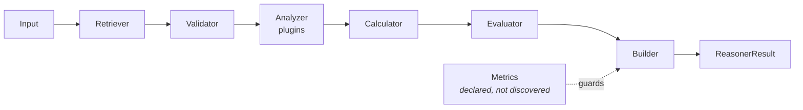

# The Unit Framework — the eight stages, in general

Every one of the seventeen units has the same anatomy. That is the whole point: you do not build
seventeen systems, you build **one framework and seventeen implementations of it**. A unit that
looks like every other unit can be reviewed, tested, timed and replaced by someone who has never
seen it before.

**Source of truth:** `genios_engine/reason/unit.py` · `genios_engine/reason/reasoners/common.py` ·
`genios_engine/reason/protocols.py`
**Invariants enforced by:** `tests/test_unit_roster.py`

This document explains what the base class does **for every unit**. Each unit's own folder then
documents how *that* unit uses or overrides it.

---

## 1 · What it is for

A reasoning unit answers one narrow question about a situation and emits **evidence**, never a
decision. The framework's job is to make that contract impossible to break by accident:

- a unit cannot skip validation,
- a unit cannot invent its own result shape,
- a unit cannot publish a metric it never declared,
- a unit cannot reach for a clock, a database, or a language model.

Take any of those away and the layer's determinism guarantee is only as strong as the least careful
author.

---

## 2 · What exists

### The eight stages



`ReasoningUnit.evaluate()` is a **template method**: it runs the stages in a fixed order and returns
the result. Subclasses implement the analytical stages and, where they must, override the
structural ones.

| # | Stage | Symbol | Who implements it |
|---|---|---|---|
| 1 | Input | `active_spec(request, unit_id)` | Framework |
| 2 | Retriever | `ReasoningUnit.retrieve()` | Framework; 3 units override |
| 3 | Validator | `ReasoningUnit.validate()` | Framework; 6 units override |
| 4 | Analyzer | `ReasoningUnit.analyze()` + `plugins` | Framework runs them; **every unit supplies plugins** |
| 5 | Calculator | `ReasoningUnit.calculate()` | **Abstract — every unit must implement** |
| 6 | Evaluator | `ReasoningUnit.evaluate_meaning()` | **Abstract — every unit must implement** |
| 7 | Builder | `ReasoningUnit.build()` | Framework; 1 unit overrides |
| 8 | Metrics | `publishes` class attribute | Every unit declares |

### One correction to the blueprint's ordering

The architecture lists **Validator → Retriever**. The code runs **Retriever → Validator**, because
the default validator's subject is the `UnitView` — it checks the window the retriever selected. The
practical effect is identical; the ordering in `unit.py:ReasoningUnit.evaluate` is the truth.

### The five supporting types

| Type | What it is |
|---|---|
| `UnitCategory` | The four families, declared not inferred — so the roster can be audited |
| `UnitView` | The unit's bounded window: request, spec, prior results, selected facts, evidence ids |
| `Observation` | One plugin's partial contribution — a claim with metrics, evidence and reason codes, **never a conclusion** |
| `AnalyzerPlugin` | Protocol: a `plugin_id` and `contribute(view) -> tuple[Observation, ...]` |
| `Verdict` | The Evaluator's reading: matched, metrics, reason codes, findings, adjustments, checks |

---

## 3 · How it works

### Stage 1 · Input

`evaluate(request, prior_results)` receives the whole `ReasoningRequest` and a mapping of prior
results **narrowed to declared dependencies only**. The orchestrator does that narrowing — passing
every earlier result would create hidden, order-dependent edges that no capability declared.

`active_spec(request, self.unit_id)` finds this unit's `ReasonerSpec` inside the capability, which
carries its `required_fields`, `dependencies`, `latency_budget_ms` and per-capability `config`.
A unit not declared by the capability raises immediately — that is a deployment fault.

### Stage 2 · Retriever — selects, never fetches

```python
wanted = [f for f in spec.required_fields if not f.startswith("neighbor:")]
facts  = {name: request.context.facts[name] for name in wanted if name in request.context.facts}
evidence = sorted(item.evidence_id for item in request.context.evidence if item.field in facts)
```

**Why it cannot fetch.** Units are forbidden database and network access. Retrieval already happened
when Layer 2 froze the `ContextSnapshot`. "Retriever" here means *select and shape* from that frozen
input — the only form of retrieval that survives replay six months later.

The `neighbor:` prefix marks a field that lives in the neighbourhood rather than on the root entity;
the base retriever skips those when building `facts`, so a unit needing them reads
`view.request.context.neighbor_facts` directly.

### Stage 3 · Validator — how a unit says "I will not guess"

```python
absent = missing_fields(view.request, view.spec.required_fields)
if absent:
    raise MissingContextError(*absent)
```

The orchestrator catches `MissingContextError` and converts it into a typed
`INSUFFICIENT_CONTEXT` result carrying the missing field names. That is the mechanism by which a
unit refuses to reason rather than fabricating a default.

Six units override `validate()` to a documented no-op. Every one of them does so for the same
reason: the base validator would convert an *answerable* run into an abstention. `core.confidence`
is the clearest case — completeness is its subject matter, so a thin snapshot is something it must
measure, not something that should stop it.

### Stage 4 · Analyzer — where the IP lives

```python
for plugin in sorted(self.plugins, key=lambda item: item.plugin_id):
    observations.extend(plugin.contribute(view))
```

**Sorted by `plugin_id`, always.** Observation order reaches downstream hashes, so it must be a
property of the unit's composition rather than of registration order.

**Why plugins at all.** Risk is not one algorithm. It is time decay *plus* revenue exposure *plus*
relationship health *plus* policy — each a small deterministic contribution that can be tested,
tuned and versioned alone. A unit **composes** plugins; it does not hide a monolith behind one
method.

A plugin returns `()` when it has nothing to say. **Silence is not zero** — a plugin that guessed
would be indistinguishable from one that observed, and that distinction is what makes the evidence
trustworthy.

Across the roster: **52 plugins over 17 units** — three each, except `core.scheduling` with four.

### Stage 5 · Calculator — integer arithmetic only

Abstract. Every unit implements it. Two helpers from `reasoners/common.py` carry the discipline:

| Helper | Behaviour |
|---|---|
| `clamp_bp(v)` | `min(10_000, max(0, int(v)))` — saturates, never wraps |
| `divide_half_up(n, d)` | Round-half-up integer division; negatives handled symmetrically |

**Why no floats.** `platform/canonical.canonicalize` *rejects* floats rather than rounding them. A
float would make the decision hash machine-dependent, and a decision that hashes differently on two
machines cannot be replayed — which is the one property the whole layer exists to provide.

Worked rounding: `divide_half_up(7, 2) == 4`, `divide_half_up(5, 2) == 3`,
`divide_half_up(-5, 2) == -3`.

### Stage 6 · Evaluator — numbers become meaning

Abstract. Turns metrics into a `Verdict`: a threshold crossed, a candidate blocked, a gate matched.
This is where `82` becomes *high risk*.

Three things a unit may emit here, and the rules that govern them:

| Emission | Rule |
|---|---|
| `Finding` | A named observation with evidence. `finding_id` must be a valid identifier — a config-supplied field name containing a space will fail the run |
| `CandidateAdjustment` | Moves one scoring component of one play. Component must be one of impact, success, urgency, effort, risk |
| `CandidateCheck` | Stage must be one of precondition, constraint, policy, permission, safety, cost_benefit, ranking. Only `core.constraint`, `core.policy` and `core.validation` emit `ELIMINATE` |

`matched` is `True`/`False` for gating units and `None` for units that report without ruling. A
gating unit that returns `None` from a completed run is converted to a failure — a gate that cannot
say yes or no has not done its job.

### Stage 7 · Builder — one shape for every unit

The base `build()` assembles the `ReasonerResult`: status `COMPLETED`, the verdict's matched value,
metrics with `_bp` keys clamped, findings, adjustments, checks, the union of evidence ids, and
reason codes.

One unit overrides it — `core.confidence`, so that its full metric map survives the publish guard
(see stage 8) and so its `evidence_ids` stays empty, matching its pre-migration behaviour exactly.

### Stage 8 · Metrics — declared, not discovered

```python
undeclared = sorted(set(verdict.metrics) - set(self.publishes))
if undeclared:
    raise ValueError(f"{self.unit_id} published undeclared metrics: ...")
```

**Why this guard exists.** Shared metrics like `confidence_bp` are read by the Decision Maker
through a named authority. Without this guard, a unit could start publishing one and silently move
every score in the system the day it was added to a capability.

---

## 4 · The roster invariants

Enforced by `tests/test_unit_roster.py` — build failures, not review comments.

| Invariant | What it prevents |
|---|---|
| Exactly one publisher per metric name | Two units disagreeing about one number; `core.validation` reporting the overlap as a contradiction |
| Only `core.confidence` publishes `confidence_bp` | A new unit silently re-scoring every decision |
| Only `core.priority` publishes `urgency_bp` / `priority_override_bp` | The same, for ranking |
| Every unit id unique, prefixed `core.` or `legacy.` | Registry collisions |
| Every framework unit declares a category, plugins and publishes | A monolith wearing the framework |
| Plugin ids unique within a unit | Non-deterministic analyzer ordering |
| No clock, randomness, env or DB import in any unit source | The determinism guarantee, which is only as strong as the least pure unit |

---

## 5 · Known limits

**`evaluate()` is not enforceable.** Python has no `final`. `unit.py` says the template is
"deliberately not overridable *in spirit*", and no subclass currently overrides `evaluate` or
`analyze` — six override `validate`, three override `retrieve`, one overrides `build`. The seam
holds by author discipline. The cheapest fix is an `__init_subclass__` hook that rejects an override
of `evaluate`; it has not been added.

**The publish guard only covers the Verdict.** A unit that overrides `build()` can attach metrics
that never passed the guard. Exactly one unit does this, deliberately and documented.

---

## Related

- [../README.md](../README.md) — Part 2 overview: the framework in the context of the whole roster
- [../01-Situation-Understanding/README.md](../01-Situation-Understanding/README.md) — Category 1
- [../02-Business-Evaluation/README.md](../02-Business-Evaluation/README.md) — Category 2
- [../03-Optimization/README.md](../03-Optimization/README.md) — Category 3
- [../04-Decision-Support/README.md](../04-Decision-Support/README.md) — Category 4
- [../../01-Reasoning-Orchestrator/README.md](../../01-Reasoning-Orchestrator/README.md) — who calls `evaluate()`
- [../../03-Decision-Maker/README.md](../../03-Decision-Maker/README.md) — who consumes the results
