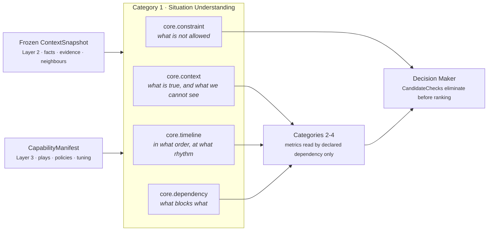
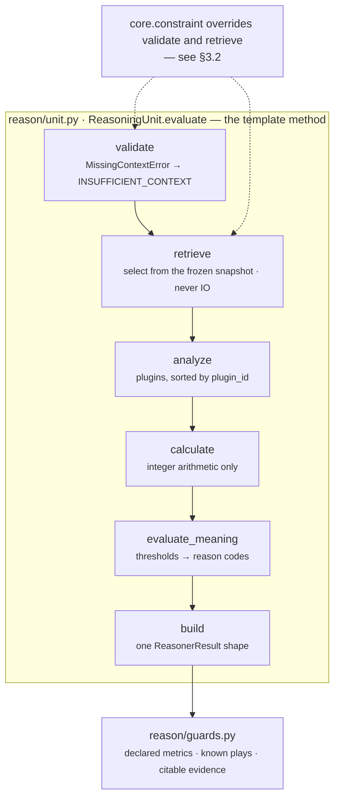
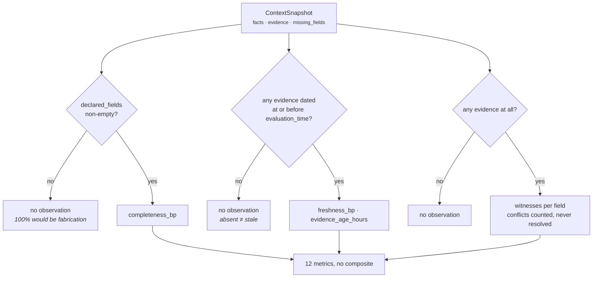
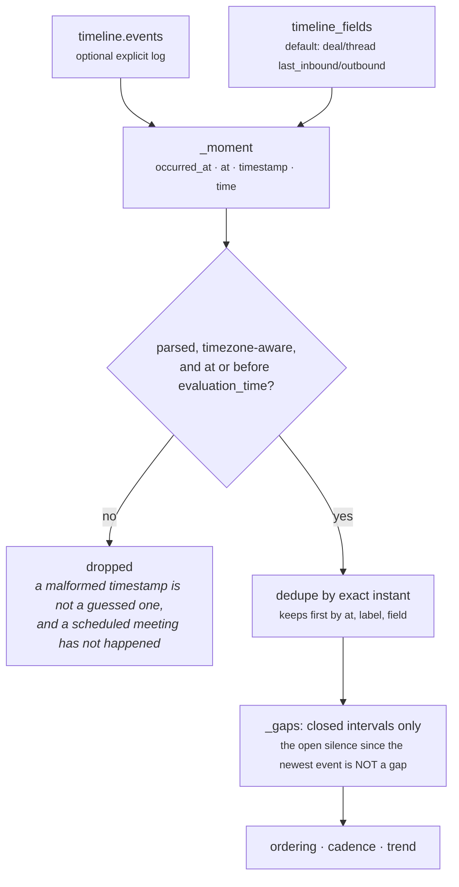
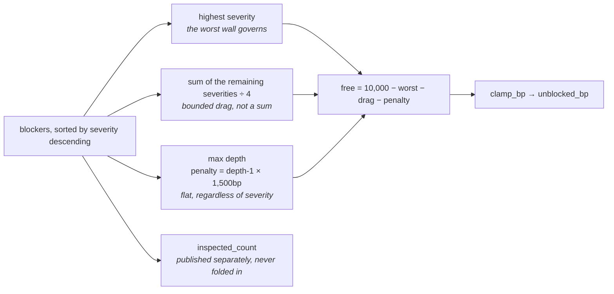
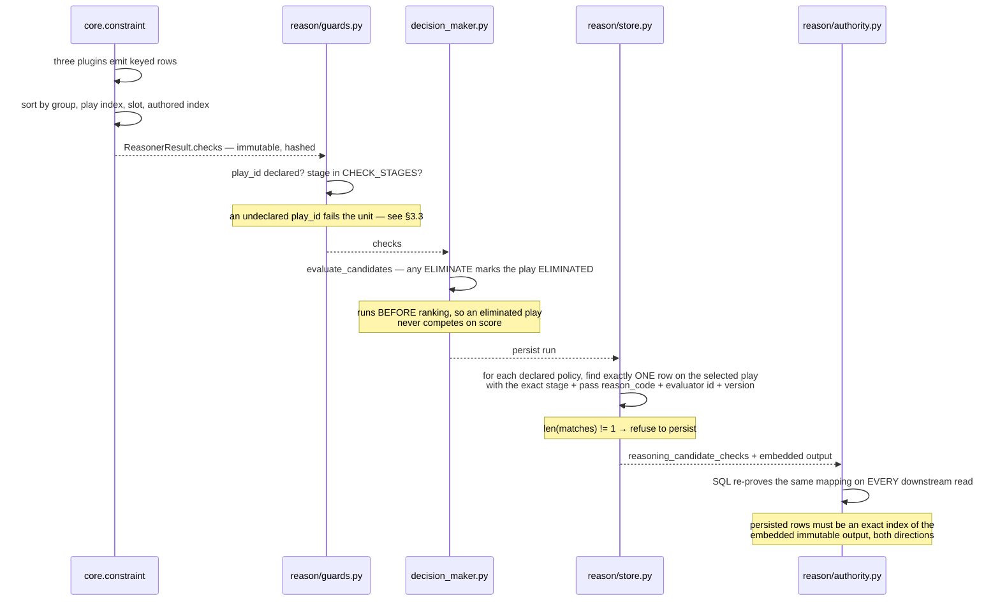
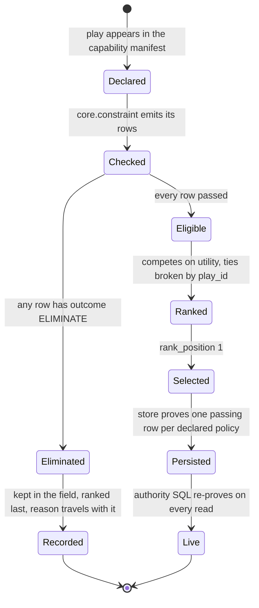

# Category 1 · Situation Understanding

**Package:** `genios_engine/reason/reasoners/`
**Units:** `core.context` · `core.timeline` · `core.dependency` · `core.constraint`
**Question they answer together:** *What is true, in what order did it happen, what blocks what, and
what is this situation not allowed to do?*

These four run first in every plan, and nothing downstream is entitled to an opinion until they have
spoken. Category 2 asks whether the situation is risky or valuable; Category 3 asks which path is
cheapest; Category 4 prepares the field. All three of those are reasoning *about* a situation. This
category is the only one that reasons about **the situation itself** — including, critically, about
how much of it we cannot see.

> **Basis points.** Every ratio in this layer is an integer in the range 0–10,000. `7,500bp` means
> 0.75. There are no floats anywhere below `reason/` — a float would make the decision hash depend
> on the machine that computed it, and replay is the only thing that makes a decision auditable
> rather than merely asserted. Division goes through `common.py:divide_half_up`, which is
> `(n + d//2) // d` for non-negative numerators: half-up, deterministic, and verifiable by hand from
> a trace.

---

## 1 · What the blueprint asked for

The architecture names seventeen units in four categories, and puts these four first:

| Category | Units | Purpose |
|---|---|---|
| **1 · Situation Understanding** | **Context, Timeline, Dependency, Constraint** | **Understand the current situation** |
| 2 · Business Evaluation | Risk, Opportunity, Impact, Priority, Confidence | Evaluate the situation |
| 3 · Optimization | Tradeoff, Resource, Scheduling, Cost, Policy | Find the best path |
| 4 · Decision Support | Alternative, Validation, Recommendation | Prepare inputs for the final decision |

The blueprint's constraint on all of them is the one that shapes this document:

> *"It NEVER reasons. It NEVER calculates. It NEVER makes decisions."* — of the orchestrator. And of
> the layer above: *"If it starts making decisions, then you've accidentally created two reasoning
> engines. That's architectural leakage. There should only be one place where thinking happens."*

Applied downward, that sentence means a **unit must not decide either**. A unit that publishes a
verdict has become a second decision authority, and the Decision Maker's ranking is then a formality
over judgements somebody else already made. Every design choice in these four files falls out of
that: they report, they never rule.

The blueprint also specifies the anatomy — *Input → Validator → Retriever → Analyzer → Calculator →
Evaluator → Output Builder* — and one level deeper: *"Analyzer should itself have plugins. Now Risk
isn't one algorithm. It's 20 small deterministic algorithms."* That plugin seam is where all the
detail below lives.



Three of the four publish **numbers**. The fourth publishes **rows**, and those rows are the only
output in Layer 4 that can remove a candidate outright. That asymmetry is the single most important
thing to understand about this category, and it is why `core.constraint` gets its own long section
below.

---

## 2 · What exists

All four units, all on the common framework, all with plugin analyzers.

| Unit | File | Plugins | Publishes | Tests |
|---|---|---|---|---|
| `core.context` | `reasoners/context_unit.py` | 3 | 12 metrics | 28 |
| `core.timeline` | `reasoners/timeline_unit.py` | 3 | 9 metrics | 29 |
| `core.dependency` | `reasoners/dependency_unit.py` | 3 | 6 metrics | 27 |
| `core.constraint` | `reasoners/constraint.py` | 3 | 0 metrics, N `CandidateCheck` rows | 45 |

**129 tests, all passing.** Registration is explicit in
`reasoners/__init__.py:SITUATION_UNDERSTANDING` — there is no auto-discovery, because a unit
appearing in the runtime because a file happened to be importable is how a decision gets made by
something nobody reviewed.



Two framework properties matter for everything below.

**Plugin order cannot reach the output.** `unit.py:ReasoningUnit.analyze` iterates
`sorted(self.plugins, key=plugin_id)`, so the observation sequence is a property of the unit's
composition rather than of the order somebody happened to type the tuple. `core.constraint` needs a
stronger guarantee than that and builds its own — §4.4.

**A unit cannot publish a metric it did not declare.** `unit.py:ReasoningUnit.evaluate` compares the
verdict's metric names against `publishes` and raises if anything is undeclared. That is the
mechanism which stops a shared value like `confidence_bp` from being moved by something nobody knew
was moving it, and `tests/test_unit_roster.py:test_no_unit_publishes_a_metric_another_unit_owns`
enforces one declared publisher per name across the whole roster.

### Who actually runs these

Honest inventory, because "the unit exists" and "the unit influences a decision" are different
claims:

| Capability | Category 1 units named | Live? |
|---|---|---|
| `sales.deal_cooling` v1 (`packs/capabilities/deal_cooling.py`) | `core.constraint` only | shipped baseline |
| `sales.deal_health` (`packs/capabilities/deal_health.py`) | `core.constraint` only | shipped |
| `sales.deal_cooling_full` v2 (`packs/capabilities/deal_cooling_v2.py`) | all four | `live_delivery_enabled=False` — shadow only |

So `core.constraint` is in production and re-proved on every downstream read. `core.context`,
`core.timeline` and `core.dependency` have **never influenced a delivered decision**. Their
thresholds are the module defaults, and the defaults are reasoned, not tuned. That is stated again in
§3 because it is the most important caveat in this document.

---

## 3 · The gap, and why

### 3.1 · Three of the four are unproven, and their thresholds are untuned

`deal_cooling_v2` is the only capability that names `core.context`, `core.timeline` and
`core.dependency`, and it ships with `live_delivery_enabled=False` and
`metadata["activation"] = "shadow_first"`. Its own module docstring is explicit that this is
deliberate: *"v1 is the shipped baseline, this is the candidate, and comparing their decisions on the
same situation is how you find out whether twelve more units actually made the reasoning better."*

Every threshold in §4.1–§4.3 — `completeness_floor_bp = 6,000`, `freshness_horizon_hours = 168`,
`gate_pending_severity_bp = 6,000`, `depth_penalty_bp = 1,500` and the rest — is a default chosen by
argument, not by measurement against outcomes. They are all per-capability config keys precisely so
that tuning them later is a Layer 3 authoring change rather than a code change, but nobody has tuned
them yet. **Treat every number in those three units as a starting position.**

### 3.2 · `core.constraint` was migrated as a byte-identical refactor, on purpose

The other sixteen units were written onto the framework. `core.constraint` was **moved** onto it with
an explicit requirement that its output not change by a single byte.

The reason is that this unit's output is re-verified in two places outside Layer 4:

- `reason/store.py` refuses to persist a decision whose selected play does not carry exactly one
  passing check per declared policy, evaluated by `core.constraint` at the version the capability
  declared.
- `reason/authority.py` re-proves the same rows in SQL on every downstream read, so a signal or card
  cannot be surfaced unless the check rows still index the constraint unit's immutable output.

Both re-provers key on exact strings — `stage`, `outcome`, `reason_code`, `evaluator_id`,
`evaluator_version`. As the module docstring puts it: *"Changing one is not a refactor; it is a schema
migration with a replay break attached."*

So the migration shipped with a **frozen reference copy** of the pre-migration implementation
transcribed verbatim into `tests/test_unit_constraint.py:_LegacyConstraintReasoner`, and a
parametrised differential test over 25 scenarios asserting `semantic_hash` equality between old and
new:

```
tests/test_unit_constraint.py:test_migrated_unit_is_hash_identical_to_the_frozen_reference
```

Importing the old class was not possible — the migration rewrote the module in place — and a frozen
copy is better anyway: it keeps proving parity against the *shipped* semantics rather than against
whatever the module says next month. Two stages of the framework had to be overridden for the parity
to hold, and both overrides are documented in §4.4.

### 3.3 · A tenant block on a retired play id fails the run instead of retiring the play

`PolicyEnforcementPlugin` emits a `tenant_policy_block` ELIMINATE row for every id in the
`blocked_play_ids` config list, and the code comments call this *"deliberately unconditional — a
blocked id is eliminated whether or not the capability still declares that play."*
`tests/test_unit_constraint.py:test_policy_plugin_blocks_ids_the_capability_never_declared` asserts
that behaviour at the plugin level.

It does not survive the kernel boundary. `reason/guards.py:validate_candidate_effects` rejects any
check whose `play_id` is not in the capability's declared plays:

```
ValueError: check references unknown play: retired
```

`orchestrator.py:_evaluate` catches that and converts the whole unit result to `FAILED`. Because
`core.constraint` is declared `FailurePolicy.REQUIRED` in every shipped capability, the run then
produces no advice at all.

**Verified against the shipped guard, not inferred.** The net effect: a tenant who blocks an id that
the capability no longer declares does not quietly retire a play — they take the capability offline.
Either the plugin should skip undeclared ids or the guard should exempt `tenant_policy_block`; today
neither is true, and the failure mode is silent from the tenant's point of view.

### 3.4 · `core.timeline`'s only shipped configuration is a dead key

`deal_cooling_v2.py:_full_roster` configures the timeline unit with:

```python
_spec("core.timeline", config={"cadence_hours": 336})
```

`CadenceAdherencePlugin._declared_hours` reads the per-relationship fact `timeline.cadence_hours`
from the snapshot and, failing that, calls `_config_hours(view, "expected_cadence_hours")`. The key
`cadence_hours` is never read from config. So the authored intent — *"a fortnight of silence on a
deal that was in active dialogue is the point at which the relationship, not just the thread, has
gone quiet"* — has no effect unless Layer 2 happens to supply the fact.

This is a one-word fix in the manifest, not in the unit. It is recorded here rather than fixed
because the manifest is Layer 3 content and changing it changes a capability snapshot hash.

### 3.5 · `completeness_bp` has two emitters, one declared

`core.context` declares `completeness_bp` in `publishes`. `core.confidence` also emits
`completeness_bp` into its result and finding, and deliberately does *not* declare it — see
`reasoners/confidence.py:UNDECLARED_METRICS`, whose comment states the position plainly:

> *"`completeness_bp` is already owned by `core.context`, and the roster invariant allows exactly
> one declared publisher per metric name. The value is preserved byte-for-byte because removing or
> renaming it would change every decision hash; the name collision is recorded here rather than
> fixed."*

The roster test only inspects `publishes`, so the collision passes. A consumer reading
`completeness_bp` off a result must therefore check *which* result it came from. Both units compute
it differently — context divides present fields by declared fields; confidence composes independence
groups at `2,500bp` each, saturating at four.

### 3.6 · Two claims ship with no evidence attached

`TrendDirectionPlugin` produces an `Observation` with no `evidence_ids`. So does
`PrerequisiteAbsencePlugin` for the absent-field case. Both are defensible — a trend is derived from
intervals rather than from any one fact, and an absent fact has no evidence row by definition — but
it means a reader of the trace cannot follow `acceleration_bp` back to a source the way they can
follow `freshness_bp`. If evidence-grounded reasoning becomes a hard requirement rather than a
policy, these two are the first places it breaks.

---

## 4 · How it works inside

### 4.1 · `core.context` — what is actually true right now

> **Purpose in one sentence:** state, without flattery, which declared facts are present, how old the
> freshest evidence is, and how many genuinely independent witnesses stand behind what we believe.

The unit's own docstring names the failure it exists to prevent: *"the most expensive failure in an
intelligence system is not a wrong answer — it is a confident answer drawn from two known fields,
month-old evidence, and a single source that reported itself twice."*

#### The three plugins, and when each stays silent

| Plugin | `plugin_id` | Claims | Silent when |
|---|---|---|---|
| `FactCoveragePlugin` | `fact_coverage` | `completeness_bp`, `declared_field_count`, `known_field_count`, `missing_field_count` | Nothing declared what "complete" means — `declared_fields` returns empty |
| `EvidenceFreshnessPlugin` | `evidence_freshness` | `freshness_bp`, `evidence_age_hours`, `dated_evidence_count` | No evidence row carries an `occurred_at` at or before `evaluation_time` |
| `SourceCorroborationPlugin` | `source_corroboration` | `corroboration_count`, `corroborated_field_count`, `single_sourced_field_count`, `evidenced_field_count`, `conflict_count` | The snapshot carries no evidence at all |

Silence is the point. From the module docstring: *"a unit whose job is to report what is known must
never invent a zero. No dated evidence means no freshness metric, not `freshness_bp = 0`. A
fabricated zero would read downstream as 'we checked, and it is stale', which is a different and much
stronger claim than 'we do not know'."*



#### The denominator is the capability's own, not the unit's

`context_unit.py:declared_fields` builds the completeness denominator from three sources, deduped and
sorted:

1. `request.capability.required_fields`
2. every `spec.required_fields` across `request.capability.reasoners`
3. `request.context.missing_fields` — the fields Layer 2 *tried* to supply and could not

The third is the interesting one. Known absences belong in the denominator or *"a snapshot could look
complete precisely because retrieval failed."* A capability may override the whole set with the
`context_fields` config key when its reasoner declarations are not the right yardstick.

> **Narrow edge case.** `FactCoveragePlugin` computes absences via `common.py:missing_fields`, which
> only checks `field not in context.facts`. `guards.py:required_missing` additionally treats a field
> as missing if it appears in `context.missing_fields`. If Layer 2 ever both lists a field as missing
> *and* supplies a stale value for it, the context unit counts it present while the kernel counts it
> missing. The two definitions have not been reconciled.

#### One witness, at most

`context_unit.py:independence_key` decides how many observers an evidence row represents:

```text
if item.independence_group:  "group:{independence_group}"
elif item.source_ref_id:     "source:{source_ref_id}"
else:                        "evidence:{evidence_id}"
```

The namespace prefixes are not decoration — they stop an `independence_group` named `crm` and a
`source_ref_id` named `crm` from collapsing into the same witness. The rule they enforce: *"A mailbox
sync that ingests the same thread twice, or two CRM fields written by the same integration, is a
single observer repeating itself; counting it as two would let the system manufacture corroboration
out of duplication."*

#### The exact arithmetic

```text
FactCoveragePlugin
    declared = declared_fields(view)                        # sorted, deduped
    absent   = missing_fields(request, declared)
    present  = [name for name in declared if name not in absent]
    completeness_bp = clamp_bp(divide_half_up(len(present) * 10_000, len(declared)))

EvidenceFreshnessPlugin
    horizon = config["freshness_horizon_hours"]  default 168        # one week
    dated   = [e for e in evidence if e.occurred_at is not None
                                   and e.occurred_at <= evaluation_time]
    newest  = max(e.occurred_at for e in dated)
    age_hours   = int((evaluation_time - newest).total_seconds()) // 3600
    freshness_bp = clamp_bp(10_000 - divide_half_up(min(age_hours, horizon) * 10_000, horizon))

SourceCorroborationPlugin
    witnesses[field][independence_key(e)] ← semantic_hash(e.value)   # evidence sorted by id
    best = min(witnesses, key=lambda f: (-len(witnesses[f]), f))     # most witnesses, name tie-break
    corroboration_count        = len(witnesses[best])
    corroborated_field_count   = |{f : len(witnesses[f]) >= min_corroboration}|
    single_sourced_field_count = |{f : len(witnesses[f]) == 1}|
    conflict_count             = |{f : len(witnesses[f]) > 1
                                       and |{value hashes across those witnesses}| > 1}|

ContextUnit.calculate
    for observation in sorted(observations, by plugin_id):
        for name in sorted(observation.metrics):
            metrics[name] = int(observation.metrics[name])
    # no composite. deliberately.
```

#### Why that arithmetic

**Freshness is measured from the newest evidence, not an average.** Staleness is about whether
anything has happened recently: *"one message yesterday makes a situation current no matter how much
of the file is a year old."*

**Decay is linear, not exponential.** The horizon belongs to the capability because *"'fresh' is
domain-specific — a week-old touch is current on an enterprise deal and ancient on a live support
thread — and a straight line is the only decay curve a reviewer can verify by hand from the trace."*

**Evidence dated after `evaluation_time` is excluded entirely.** It cannot describe the situation
being reasoned about, and *"treating it as 'zero hours old' would let a clock skew read as perfect
freshness."*

**A conflict needs two independent witnesses.** One source citing two values for a list-valued fact
is describing facets of the same fact, not contradicting itself.

**No composite score.** `calculate` republishes each plugin's reading verbatim and refuses to blend:
*"A situation that is fully known but a month old is not 'half good' — it is complete and stale, and
both halves of that sentence matter to a different reader."* Averaging would produce a number that
means nothing in particular while inviting downstream units to treat it as a verdict.

#### `evaluate_meaning` — thresholds and their config keys

| Reading | Crossed | Not crossed | Config key | Default |
|---|---|---|---|---|
| `completeness_bp` | `context_incomplete` when `< floor` | `context_substantially_known` | `completeness_floor_bp` | `6,000bp` |
| `freshness_bp` | `context_stale` when `< floor` | `context_current` | `freshness_floor_bp` | `3,000bp` |
| `corroboration_count` | `context_corroborated` when `>= min` | `context_single_sourced` | `min_corroboration` | `2` |
| — | — | — | `freshness_horizon_hours` | `168` |
| — | — | — | `context_fields` | derived |

`_config_bp` and `_config_count` **raise** on a malformed value rather than defaulting. That is
deliberate: *"a threshold that quietly became zero would make every situation look complete."* A bad
config value is a deployment fault, and `test_a_malformed_threshold_is_rejected_rather_than_rounded`
pins it.

**`matched` is always `None`.** Not `False` — `None`. A matched verdict is a claim that some
condition the capability cares about has been met, and *"the context is adequate"* is exactly the
judgement this unit is forbidden to make, because adequacy depends on what is about to be decided.
Every plugin's reading becomes a `Finding` with `matched=None`, present on every run including the
ones that went badly: *"the value of this unit is the written record of what was known at decision
time, which is only useful if it is always there."*

**Publishes (12):** `completeness_bp`, `declared_field_count`, `known_field_count`,
`missing_field_count`, `freshness_bp`, `evidence_age_hours`, `dated_evidence_count`,
`corroboration_count`, `corroborated_field_count`, `single_sourced_field_count`,
`evidenced_field_count`, `conflict_count`.

#### Worked example — the thin situation

Two known fields of five declared, one CRM evidence row dated 720 hours ago, default config
(`tests/test_unit_context_unit.py:test_a_thin_situation_is_described_as_thin_end_to_end`):

```text
completeness_bp = divide_half_up(2 * 10_000, 5)                       = 4,000
freshness_bp    = 10_000 - divide_half_up(min(720,168) * 10_000, 168) = 0
corroboration_count                                                    = 1
reason codes ⊇ {context_incomplete, context_stale, context_single_sourced}
```

At three hours old instead of 720, the same formula gives
`10,000 - divide_half_up(30,000, 168) = 10,000 - 179 = 9,821bp`. The linearity is the property that
makes that recomputable from the trace with a calculator.

---

### 4.2 · `core.timeline` — what shape the situation has over time

> **Purpose in one sentence:** report the arrangement of events in time — how many, how recent, how
> far apart, whether the rhythm is tightening or unravelling, and whether the last event is older
> than the cadence somebody declared.

The case for the unit, from its docstring: *"a deal quiet for nine days after eleven exchanges in a
fortnight is a break in a strong rhythm; a deal quiet for nine days after two emails ever never had a
rhythm to break. Only the ordering tells them apart, and acting on the present alone treats those two
as the same situation."*

**Why this is not `core.temporal`.** `core.temporal` measures how far one deal's engagement has
fallen — a magnitude for a single relationship. This unit never publishes `drop_bp`. It reads
`drop_bp` in exactly one place, as corroboration for a reason code, and that reading *"can never move
a number here, so adding `core.temporal` to a plan can never silently re-score the timeline."*

#### Building the event list



Two rules in `_known_events` earn their place. **Future timestamps are excluded** — otherwise *"the
newest 'event' would be something nobody has done yet."* **Identical instants collapse to one
event** — `deal.last_inbound` and `thread.last_inbound` are routinely the same message seen through
two joins, and counting it twice *"would invent an extra event and a zero-hour gap that never
existed."* Ties at the same instant resolve by `(at, label, field)` sort, which is total and
deterministic but arbitrary in which join wins; nothing downstream depends on which.

`_gaps` deliberately excludes the stretch of silence since the newest event: *"it is still open, and
may close tomorrow. Treating it as a gap would let a live situation look like a dead one."*

#### The three plugins, and when each stays silent

| Plugin | `plugin_id` | Claims | Silent when |
|---|---|---|---|
| `EventOrderingPlugin` | `event_ordering` | `event_count`, `latest_age_hours`, `span_hours`, and — only with ≥2 events — `gap_hours`, `max_gap_hours` | No event can be dated |
| `CadenceAdherencePlugin` | `cadence_adherence` | `cadence_hours`, `overdue_hours`, `breach_bp` | No cadence is declared, by fact or by config; or no events |
| `TrendDirectionPlugin` | `trend_direction` | `acceleration_bp`, `earlier_gap_hours`, `recent_gap_hours`, `gap_sample` | Fewer than 2 closed gaps, i.e. fewer than 3 events |

Cadence silence is the design point: *"'three weeks quiet' is negligence on a weekly account and
completely normal on a quarterly one"*, so without a declaration there is no such thing as overdue.
Trend silence likewise: with two events you have one gap and no trend, and *"reporting a trend from
one gap would be a fabrication dressed as arithmetic."*

#### The exact arithmetic

```text
EventOrderingPlugin
    latest_age_hours = (evaluation_time - events[-1].at) // 1h        # truncated whole hours
    span_hours       = (events[-1].at - events[0].at) // 1h
    gaps             = [events[i+1].at - events[i].at for i in 0..n-2]   # whole hours
    gap_hours        = median(gaps)          # odd: middle; even: divide_half_up(a + b, 2)
    max_gap_hours    = max(gaps)
    reason code "silence_exceeds_prior_gaps" when latest_age_hours > max(gaps)
    reason code "timeline_single_event"      when there are no gaps

CadenceAdherencePlugin
    cadence   = fact "timeline.cadence_hours"  if 1 <= int <= 8_760
                else config["expected_cadence_hours"]                 # no default
    age       = latest_age_hours
    overdue   = max(0, age - cadence)
    breach_bp = clamp_bp(divide_half_up(overdue * 10_000, cadence))

TrendDirectionPlugin                                  # STEADY_BP = 5_000
    split        = len(gaps) // 2
    earlier      = gaps[:split]                       # oldest half
    recent       = gaps[len(gaps) - split:]           # newest half; odd pivot in neither
    earlier_mean = divide_half_up(sum(earlier), len(earlier))
    recent_mean  = divide_half_up(sum(recent),  len(recent))

    if earlier_mean <= 0 and recent_mean <= 0:   acceleration_bp = 5_000
    elif earlier_mean <= 0:                      acceleration_bp = 0
    elif recent_mean  <= 0:                      acceleration_bp = 10_000
    elif recent_mean < earlier_mean:             acceleration_bp = 5_000
                                     + divide_half_up((earlier_mean - recent_mean) * 5_000, earlier_mean)
    elif recent_mean > earlier_mean:             acceleration_bp = 5_000
                                     - divide_half_up((recent_mean - earlier_mean) * 5_000, recent_mean)
    else:                                        acceleration_bp = 5_000
    acceleration_bp = clamp_bp(acceleration_bp)

TimelineUnit.calculate
    metrics = {"event_count": 0}                 # the one metric always present
    from timeline.ordering:  event_count, elapsed_hours ← latest_age_hours, span_hours,
                             and gap_hours / max_gap_hours only if the plugin measured them
    from timeline.cadence:   cadence_hours, overdue_hours, cadence_breach_bp ← breach_bp
    from timeline.trend:     acceleration_bp
```

#### Why that arithmetic

**Median, not mean, for the typical gap.** *"One dormant summer must not redefine what a normal gap
looks like."* A single 3,000-hour interval in an otherwise weekly relationship would drag a mean
until nothing ever looked late again.

**One full cadence period past due reads as 10,000bp, and stops there.** *"Being one whole period
late is as late as the metric needs to distinguish, and everything beyond it is equally, maximally
overdue."* A deal 40 weeks past a weekly review is not usefully more overdue than one 2 weeks past;
both need the same intervention.

**Trend is expressed around a 5,000bp midpoint rather than as a signed number.** Above is
accelerating, below is decaying, and a single unsigned integer carries both directions — which
matters because the whole layer is unsigned basis points. Each side is scaled by its own larger term
so both directions are bounded and symmetric: shortening gaps divide by `earlier_mean`, stretching
gaps by `recent_mean`. Without that, one direction would saturate long before the other.

**The pivot gap on an odd count belongs to neither half.** *"A pivot counted on both sides would let
one interval vote twice on its own trend."*

**Momentum is a derivative, not a level.** *"A deal with three exchanges a week and slowing is a
different situation from one with three exchanges a week and speeding up, even though both look
identically busy today."*

#### `evaluate_meaning` — thresholds and their config keys

| Condition | Reason code added | Config key | Default |
|---|---|---|---|
| `cadence_breach_bp >= threshold` | `cadence_materially_overdue` | `cadence_breach_threshold_bp` | `2,000bp` |
| `acceleration_bp <= threshold` | `timeline_shape_decaying` | `decay_threshold_bp` | `3,000bp` |
| decaying **and** `core.temporal.drop_bp >= threshold` | `decay_corroborated_by_engagement_drop` | `corroborating_drop_bp` | `5,000bp` |
| — | — | `timeline_fields` | `deal.last_inbound`, `deal.last_outbound`, `thread.last_inbound`, `thread.last_outbound` |
| — | — | `expected_cadence_hours` | none; 1–8,760 |

`matched = bool(breached or decaying)`. **ORed, never summed:** *"either one alone is a real break —
a weekly account nine days silent is late even if its historical gaps were shrinking."* Findings
carry per-kind `matched` — ordering always `None`, cadence `breached`, trend `decaying` — so a reader
can see which of the two independent breaks fired.

With **no observations at all**, `matched` is `None` rather than `False`: *"'we cannot see the shape'
and 'the shape is fine' are different claims, and collapsing them would let an empty snapshot read as
a healthy one."*

A malformed `expected_cadence_hours` in config **raises**; a malformed `timeline.cadence_hours`
*fact* falls back to config silently. That asymmetry is intentional — *"bad data must not raise,
whereas bad config does."*

**Publishes (9):** `event_count`, `elapsed_hours`, `span_hours`, `gap_hours`, `max_gap_hours`,
`cadence_hours`, `cadence_breach_bp`, `overdue_hours`, `acceleration_bp`.

#### Worked example — Northwind, a weekly account that is late and slowing

Declared cadence 168h; four touches at 912h, 720h, 552h and 216h ago
(`tests/test_unit_timeline_unit.py:test_northwind_renewal_a_weekly_account_that_is_late_and_slowing`):

```text
gaps oldest-first     = [192, 168, 336]
gap_hours             = median([168, 192, 336])                 = 192
max_gap_hours                                                    = 336
span_hours            = 912 - 216                                = 696
elapsed_hours                                                    = 216
overdue_hours         = max(0, 216 - 168)                        = 48
cadence_breach_bp     = divide_half_up(48 * 10_000, 168)         = 2,857
trend: split=1, earlier=[192], recent=[336]
acceleration_bp       = 5_000 - divide_half_up(144 * 5_000, 336) = 2,857
matched               = (2,857 >= 2,000) or (2,857 <= 3,000)     = True
```

Both breaks fired, and the trace names both. Note what did *not* fire: `silence_exceeds_prior_gaps`
is absent, because 216h of silence is overdue against the **declared** cadence without being
unprecedented for this **relationship** — its historical maximum gap was 336h. That distinction is
the entire reason cadence and ordering are kept as separate claims rather than one "lateness" score.

---

### 4.3 · `core.dependency` — what is blocked by what

> **Purpose in one sentence:** report the graph of things that must happen before this work can
> happen and have not happened — how many, how deep the chain, and how free the work is to proceed.

The gap it closes: *"Every other unit in Layer 4 reasons about whether something is worth doing. None
of them ask whether it can be started."* Without it, GeniOS confidently recommends chasing the buyer
whose contract sits in an unfinished legal review. *"The recommendation is not wrong about the value;
it is wrong about the world, and a human who follows it burns trust discovering that."*

#### The three plugins, and when each stays silent

| Plugin | `plugin_id` | Reads | Silent when |
|---|---|---|---|
| `ApprovalGatePlugin` | `approval_gate` | `gate_fields` — default `approval.status`, `finance.approval_status`, `legal.review_status`, `procurement.status`, `security.review_status` | Every configured gate field is absent or carries a status word in none of the three vocabularies |
| `PrerequisiteAbsencePlugin` | `prerequisite_absent` | `prerequisite_fields`, defaulting to `capability.required_fields` | Neither is declared — *"a capability that never stated what it needs has not given us grounds to call anything missing"* |
| `UpstreamOwnerPlugin` | `upstream_owner` | `owner_field` (`deal.owner`), `owner_status_field` (`owner.availability`), `blocked_by_field` (`deal.blocked_by`) | None of the three fields is present in the snapshot |

Gate vocabulary is **matched, never inferred**. A status token outside all three sets produces no
observation at all, because *"an unrecognised gate value means we do not know the gate's state, and
guessing 'probably fine' is precisely the failure this unit exists to prevent."*

| Set | Members |
|---|---|
| `GATE_PENDING` | `awaiting`, `awaiting_approval`, `blocked`, `in_review`, `not_started`, `on_hold`, `pending`, `pending_approval`, `requested`, `submitted`, `under_review`, `waiting` |
| `GATE_CLEARED` | `approved`, `cleared`, `complete`, `completed`, `done`, `granted`, `not_required`, `passed`, `signed`, `waived` |
| `GATE_REJECTED` | `declined`, `denied`, `failed`, `rejected`, `revoked` |
| `OWNER_UNAVAILABLE` | `away`, `inactive`, `offboarded`, `on_leave`, `out_of_office`, `terminated`, `unavailable` |
| `OWNER_AVAILABLE` | `active`, `available`, `online`, `working` |

Tokens are normalised first — `strip().lower()`, spaces and hyphens to underscores — so `"In Review"`
and `"in-review"` both match. Non-strings and booleans fold to `""` and stay silent.

#### The blocker table

Every blocking observation carries five integers: `blocked`, `inspected`, `depth`, `severity_bp`,
`hard`.

| Blocker | Kind | Depth | Severity | Config key | Default | Hard |
|---|---|---|---|---|---|---|
| Gate awaiting a decision | `dependency.gate_pending` | 1 | tunable | `gate_pending_severity_bp` | `6,000bp` | no |
| Gate refused | `dependency.gate_rejected` | 2 | fixed `10,000bp` | — | — | **yes** |
| Declared prerequisite absent | `dependency.prerequisite_absent` | 1 | tunable | `prerequisite_severity_bp` | `5,000bp` | no |
| Nobody assigned | `dependency.owner_unassigned` | 1 | tunable | `unassigned_severity_bp` | `4,000bp` | no |
| Owner unavailable | `dependency.owner_unavailable` | 2 if a gate is pending, else 1 | tunable | `unavailable_severity_bp` | `7,000bp` | **yes** |
| Named upstream party | `dependency.upstream_party` | 2 | tunable | `upstream_severity_bp` | `6,500bp` | **yes** |
| — depth charge — | — | — | flat per extra link | `depth_penalty_bp` | `1,500bp` | — |

A refusal is fixed at maximum and not tunable because *"a refusal is not a queue. Waiting will never
clear it… the work does not resume until someone changes the decision itself."* A pending gate is
tunable because *"how long a capability tolerates a queue is a business judgement, not a fact."*

Every plugin also emits a **zero-blockage inspection row** — `dependency.gates_cleared`,
`dependency.prerequisites_met`, `dependency.ownership_clear` — carrying `blocked: 0` and an
`inspected` count. That row is the entire reason the unit can distinguish a clean bill of health from
an empty room.

#### The exact arithmetic

```text
DependencyUnit.calculate

    blockers  = [o for o in observations if o.metrics["blocked"] == 1]
    inspected = Σ o.metrics["inspected"] over ALL observations

    if not blockers:
        return { blocked_count: 0, blocking_depth: 0, hard_blocked_count: 0,
                 blocker_severity_bp: 0, inspected_count: inspected,
                 unblocked_bp: 10_000 }

    severities = sorted([clamp_bp(o.metrics["severity_bp"]) for o in blockers], descending)
    depth      = max(o.metrics["depth"] for o in blockers)
    penalty    = (depth - 1) * config["depth_penalty_bp"]           # default 1_500

    free = 10_000
         - severities[0]                                  # the worst blocker governs
         - divide_half_up(sum(severities[1:]), 4)         # the rest at a quarter weight
         - penalty                                        # flat, per extra link

    unblocked_bp        = clamp_bp(free)
    blocked_count       = len(blockers)
    blocking_depth      = depth
    hard_blocked_count  = Σ o.metrics["hard"] over blockers
    blocker_severity_bp = severities[0]
    inspected_count     = inspected
```

#### Why that arithmetic

This is the formula whose shape carries the most business reasoning, and the docstring argues it
directly.

**Deliberately not a sum.** *"Five soft blockers do not make work five times more impossible than one
— you are blocked or you are not, and the hardest wall governs how blocked you are."* Summing three
severities of `8,000`, `4,000` and `2,000` gives `14,000bp` of blockage against a `10,000bp` scale,
which saturates to zero freedom and erases the difference between an annoying situation and an
impossible one.

**But additional blockers still count, at a quarter weight.** *"Each is another thing that must be
cleared before anything moves."* Quarter weight is a judgement, not a measurement — it is a
deliberately bounded drag that can move the number without letting it dominate.

**Depth is charged separately and flatly.** *"A chain that runs through someone outside this workflow
is worse than the same severity held in-house, regardless of what the severity is."* Multiplying
severity by depth would make a mild upstream blocker look worse than a severe in-house one, which
inverts the reality: severity says how hard the wall is, depth says whether you are the one holding
the hammer.

**`inspected_count` is published alongside `unblocked_bp` and never folded into it.** *"10,000
unblocked with 0 inspected means 'we saw no blockage because we looked at nothing', and a consumer
that cannot tell those apart will eventually act on silence."* The unit refuses to editorialise by
lowering a number it has no evidence to lower.



#### `evaluate_meaning` — no thresholds at all

This is the only unit of the four with no configurable evaluation threshold. `matched` is simply
`metrics["blocked_count"] > 0`, and it means *"something stands in the way", and nothing stronger*:

> *"It is not 'do not act' — a blocked deal may still be worth a call to the person blocking it.
> Turning blockage into a veto is a decision, and this unit does not make decisions; it hands Part 3
> the graph and lets Part 3 weigh it."*

The unblocked case emits exactly one of two reason codes, and the distinction is the point of the
unit:

| Situation | Reason code |
|---|---|
| `blocked_count == 0` and `inspected_count > 0` | `no_blocking_dependency_observed` |
| `blocked_count == 0` and `inspected_count == 0` | `dependency_not_observable` |

Findings are emitted only for blockers, with ids of the form
`dependency.{plugin_id}.{blocking_field}` — recovered by `_blocker_key` from the `blocker:<field>`
reason code that every blocking observation carries. Field-carrying ids exist so that *"if one of
three blockers clears, the remaining two should still be recognisable as the same findings rather
than shifting position in a numbered list."* The unit-level `reason_codes` strip the `blocker:`
prefix and stay categorical, *"so consumers can match on it without parsing field names."*

**Publishes (6):** `blocked_count`, `blocking_depth`, `unblocked_bp`, `hard_blocked_count`,
`blocker_severity_bp`, `inspected_count`. None of them is a reserved shared metric —
`confidence_bp`, `urgency_bp` and `priority_override_bp` belong to `core.confidence` and
`core.priority`, and *"letting a second unit move confidence or urgency would silently re-score every
decision in the system."*

#### Worked example — Acme's stalled renewal

Legal is still reviewing; the only person who can push legal is on leave; the signatory's email is a
declared prerequisite we do not have
(`tests/test_unit_dependency_unit.py:test_a_stalled_enterprise_renewal_reports_its_whole_blocking_graph`):

```text
blockers   legal.review_status = in_review     severity 6,000  depth 1  hard 0
           owner.availability  = on_leave      severity 7,000  depth 2  hard 1   ← gate pending, so the chain deepens
           deal.signatory_email absent         severity 5,000  depth 1  hard 0

severities sorted             = [7,000, 6,000, 5,000]
depth                         = 2
penalty                       = (2 - 1) × 1,500                 = 1,500
free = 10,000 - 7,000 - divide_half_up(6,000 + 5,000, 4) - 1,500
     = 10,000 - 7,000 - 2,750 - 1,500                           = -1,250
unblocked_bp = clamp_bp(-1,250)                                 = 0

blocked_count 3 · blocking_depth 2 · hard_blocked_count 1 · blocker_severity_bp 7,000
inspected_count 6            # 2 gates, 2 prerequisites, 2 owner facts
```

The two-link chain is the single most useful thing the unit reports here: the owner's unavailability
is *why* the gate is not clearing, and the depth only deepens because a gate is actually pending on
that person. *"Claiming a two-link chain without a second link would be inventing structure that is
not in the facts."*

Downstream, `core.recommendation`'s `ActionReadinessPlugin` reads `unblocked_bp` as a ceiling —
readiness cannot exceed it — because *"preconditions being readable is no comfort when a named
blocker sits in front of the work"* (`reasoners/recommendation_unit.py`, `dependency_source` config).

---

### 4.4 · `core.constraint` — what this situation is not allowed to do

> **Purpose in one sentence:** for every declared play, emit a row saying whether that play is still
> on the table — and emit those rows in an order that two independent re-provers can reconstruct.

This unit is different in kind from the other three. *"Every other unit in Layer 4 measures something
— how late, how big, how risky. This one measures nothing."* It publishes zero metrics. Its output is
a tuple of `CandidateCheck` rows, and an `ELIMINATE` row removes a candidate from the field before
ranking ever sees it.

#### The check row is a five-part claim

```python
CandidateCheck(
    play_id,            # which play this row is about
    stage,              # one of guards.CHECK_STAGES
    outcome,            # PASS | ELIMINATE
    reason_code,        # different string for pass and fail — never the same
    evaluator_id,       # "core.constraint", stamped from the module constant
    evaluator_version,  # "1.0.0", stamped from the module constant
    detail,             # mapping an auditor reads to understand why
)
```

`_check` builds pass and fail with **different** reason codes deliberately: *"a downstream re-prover
looks for the exact passing code, so 'not eliminated' can never be mistaken for 'affirmatively
allowed'."*

The identity fields are stamped from `CONSTRAINT_UNIT_ID` / `CONSTRAINT_UNIT_VERSION` rather than
read from the capability's declared spec. That inversion is the whole proof: `store.py` compares
`evaluator_version` against the *declared* spec version, so *"a unit that stamped rows with whatever
version the manifest happened to name would make that comparison vacuous instead of a proof."*

#### The three plugins and the policies they own

| Plugin | `plugin_id` | `stage` | Policy | Pass code | Fail code |
|---|---|---|---|---|---|
| `PolicyEnforcementPlugin` | `policy_enforcement` | `policy` | `read_only` | `read_only_policy_pass` | `read_only_policy` |
| `PolicyEnforcementPlugin` | `policy_enforcement` | `policy` | `evidence_required` | `evidence_policy_pass` | `evidence_required` |
| `PolicyEnforcementPlugin` | `policy_enforcement` | `policy` | tenant block list | — always ELIMINATE — | `tenant_policy_block` |
| `PermissionVerificationPlugin` | `permission_verification` | `permission` | `human_approval_required` | `human_approval_boundary_pass` | `human_approval_boundary_missing` |
| `PermissionVerificationPlugin` | `permission_verification` | `permission` | `no_unverified_recipient` | `verified_recipient_guard_pass` | `verified_recipient_guard_missing` |
| `PreconditionPlugin` | `precondition` | `precondition` | per authored condition | `precondition_pass` | `precondition_failed` |

A plugin emits nothing for a policy the capability did not declare. `PreconditionPlugin` emits one
row per authored condition per play regardless of policy — preconditions are the play author's own
statement of what must be true.

**Both permission policies fail closed on omission rather than on assertion.** A play that simply
never mentions approval, or never guards its external reach, is eliminated: *"the absence of a
declaration is exactly the state this gate exists to catch."* Two spellings of the approval boundary
are accepted — the typed `metadata["execution_boundary"] == "human_approval_required"` and the
`human_approval` tag — *"because both predate the policy and both are load-bearing in shipped
packs."*

Recipient guarding requires a precondition whose field ends in one of
`.verified_recipient`, `.recipient_verified`, `.stakeholder_verified`, `_stakeholder_verified`, whose
`value` is literally `True`, and whose operator is in `{=, ==, eq}`. Equality only, because *"a guard
must assert the verification is true; `>=` on a boolean is not a guard, it is an accident."*

`play.metadata["external_recipient_required"]` is **indexed, not `.get()`-ed**. A malformed play
raises `KeyError` and the run fails, because capability validation already requires that typed
declaration and *"a malformed object crossing that boundary should fail loudly here rather than be
read as 'no external reach'."*
`tests/test_unit_constraint.py:test_missing_recipient_effect_declaration_still_fails_closed_in_both`
pins it in both implementations.

#### Grounding, for `evidence_required`

```text
_grounded_evidence_ids(view) =
    { evidence_id
      for result in view.prior.values()
      for evidence_id in result.evidence_ids
                       ∪ {ids on every finding}
                       ∪ {ids on every adjustment}
      if evidence_id in {e.evidence_id for e in request.context.evidence} }

evidence_present = bool(grounded)
detail = { context_evidence_count: |context.evidence|, used_evidence_count: |grounded| }
```

*"Merely carrying an unrelated `EvidenceRef` is not grounding."* Some upstream unit must have cited
an evidence item that exists in **this** frozen snapshot, *"otherwise a stale citation from another
run would satisfy the policy without anything in this situation supporting the action."* The check is
capability-wide — one grounding fact serves every play — so the same verdict is stamped onto each
play's row rather than recomputed per play.

Because it folds a mapping into a set, the fold cannot depend on insertion order;
`test_prior_result_insertion_order_cannot_change_the_result` proves it.

#### The precondition evaluator

`PreconditionPlugin.evaluate_condition` resolves one authored condition to
`(passed, field, neighbor, operator, expected, actual)`:

| Operator | Semantics |
|---|---|
| `exists` | passes iff the field is present in the chosen fact space |
| `absent` | passes iff the field is missing |
| `=`, `==`, `eq` | Python equality |
| `!=`, `ne` | Python inequality |
| `in` | membership, and `False` if `expected` is not a tuple/list/set/frozenset |
| `>`, `>=`, `<`, `<=` | `Decimal` comparison; `False` if either side will not parse as a number |
| anything else | **raises** `ValueError: unsupported precondition operator` |

Three properties are load-bearing. **Absence is handled before comparison, not inside it**, because
*"'the field is missing' and 'the field is present and smaller' are different facts and an auditor
needs to tell them apart from the `detail` alone."* Every operator except `exists`/`absent` fails
closed on a missing field. **Numeric comparison goes through `Decimal`, never float**, so
`value >= 50000` *"resolves identically on every machine and in replay."* **An unsupported operator
raises rather than failing the check**, because that is an authoring fault in Layer 3 and *"silently
treating it as a failure would hide a broken play behind a plausible-looking elimination."*

`neighbor: true` selects `context.neighbor_facts` instead of `context.facts`. Each row records its
authored `index`, *"so a play with three conditions produces three independently attributable rows
rather than one aggregate verdict."*

#### The emission order — and why it is part of the hash

This is the property most easily broken by a well-meaning refactor.

```text
sort key per row = (group, index, slot, authored_index)

group 0 = _GROUP_PLAY        rows about a declared play
group 1 = _GROUP_TENANT      the tenant block list, always last

within group 0:
    index = the play's position in capability.plays        # declaration order
    slot  = 0  _SLOT_READ_ONLY         PolicyEnforcementPlugin
            1  _SLOT_HUMAN_APPROVAL    PermissionVerificationPlugin
            2  _SLOT_EVIDENCE          PolicyEnforcementPlugin
            3  _SLOT_RECIPIENT         PermissionVerificationPlugin
            4  _SLOT_PRECONDITION      PreconditionPlugin
    authored_index = the condition's position in play.preconditions   # 0 for non-precondition slots

within group 1:
    index = the id's position in config["blocked_play_ids"]
```

Look at the slot column: **the plugins interleave.** `policy_enforcement` owns slots 0 and 2,
`permission_verification` owns 1 and 3. No ordering of plugins can produce that sequence. That is
exactly why each plugin stamps every row with an explicit key and `ConstraintUnit.evaluate_meaning`
merges and sorts on it — *"a total order that is a property of the claim, not of registration."* The
key is unique per row, so the sort is total and the hash is stable.

The slot order itself carries an argument: capability-wide policy is asked before play-authored
preconditions *"because 'this capability may not act at all' is a bigger statement than 'this play
needs a date'."* The tenant block list comes last so *"the audit trail reads 'here is what the
capability decided, and here is what the tenant then removed'."*

`blocked_play_ids` is iterated in authored sequence rather than sorted, because *"this is a list in
config, and a list survives the audit store's JSON round-trip with its order intact."* Mapping keys
would not, which is why `test_config_key_order_cannot_change_the_result` exists.

For `sales.deal_cooling`, whose first play is `restore_momentum` with two preconditions and all four
policies declared, the emitted sequence for that play is exactly
(`test_emission_order_is_grouped_by_play_then_slot_then_authored_index`):

```text
read_only_policy_pass · human_approval_boundary_pass · evidence_policy_pass
· verified_recipient_guard_pass · precondition_pass · precondition_pass
```

Note that this is **not** the manifest's `policies` tuple order, which is
`("evidence_required", "human_approval_required", "no_unverified_recipient", "read_only")`. The slot
order is the unit's own, fixed in code, and independent of how a pack author happened to list its
policies.

#### Why the order is re-proved, and by whom



The mapping the re-provers key on lives in two places and must agree:

| Policy | `stage` | Required passing `reason_code` |
|---|---|---|
| `read_only` | `policy` | `read_only_policy_pass` |
| `evidence_required` | `policy` | `evidence_policy_pass` |
| `human_approval_required` | `permission` | `human_approval_boundary_pass` |
| `no_unverified_recipient` | `permission` | `verified_recipient_guard_pass` |

In Python that is `store.py:_POLICY_CHECK_REQUIREMENTS`. In SQL it is a `CASE` expression inside
`authority.py:AUDITED_SIGNAL_PREDICATE`. They are literally the same four pairs written twice, on
purpose — *"two independent callers proving the same law, so a forged or drifted audit row cannot
pass verification by satisfying a weaker copy of the rule."*

`authority.py` additionally proves the persisted `reasoning_candidate_checks` rows are an exact index
of the constraint result's embedded `output->'checks'` in **both** directions: no extra persisted row
without a matching embedded one, and no embedded row without a matching persisted one. Its comment
states the threat model: *"This prevents a forged pass row or a hidden elimination from becoming live
authority even if child tables are corrupted independently."*



An eliminated candidate is **not deleted**. `decision_maker.py:evaluate_candidates` marks it
`ELIMINATED` and attaches the checks that removed it, and `rank_candidates` sorts eliminated
candidates after the survivors. *"A rejection without its reason is indistinguishable from an
oversight."*

One subtlety worth knowing: the Decision Maker re-sorts a play's checks with its own
`ordered_checks`, keyed on `(stage, evaluator_id, evaluator_version, reason_code, hash(detail))`.
That is the order in the **candidate's** audit rows. The unit's emission order is preserved in the
**immutable `ReasonerResult`**, which is what `store.py` and `authority.py` compare against. Two
different orders for two different purposes — one grouped by claim for the auditor reading the gate,
one grouped by stage for the auditor reading the candidate.

#### The two framework stages this unit overrides

Both overrides exist because the base behaviour would change the emitted result, and both were
required for the byte-identical migration to hold.

**`validate` is emptied.** The base validator raises `MissingContextError` for absent
`required_fields`, which the orchestrator converts to an `INSUFFICIENT_CONTEXT` result carrying no
checks. For a gate that is backwards:

> *"Thin context is the condition under which the gate matters most, and a missing precondition field
> is reported as an ELIMINATE row naming the field, not as an abstention. Removing the gate because
> the room is dark is not fail-closed."*

`test_thin_context_produces_eliminations_rather_than_insufficient_context` pins this.

**`retrieve` returns the whole snapshot and cites nothing.** No fact pre-selection, because
precondition fields are authored per play in Layer 3 and are not knowable from `required_fields` —
*"any narrowing here would be a window that lies about what the unit actually reads."* And no
evidence ids, because *"this unit cites nothing… attaching evidence ids would add unproven provenance
to a result whose entire value is that every part of it is independently re-provable."* The shipped
result carries `evidence_ids == ()`, asserted by
`test_declared_required_fields_never_leak_evidence_into_the_result`.

#### `calculate` and `evaluate_meaning`

```text
ConstraintUnit.calculate(view, observations) -> {}
```

Zero metrics, and the emptiness is *"deliberate, not an omission"*:

> *"A gate's answer is a set of per-play rows; any scalar summary of them — '3 eliminations' — would
> be a number downstream units could weigh, and weighing a constraint is exactly how a hard block
> turns into a soft penalty."*

`publishes = ("constraint_check_count", "constraint_elimination_count")` is therefore *a ceiling, not
a promise*. The names are declared so no other unit may claim them and so that the day a gate summary
is genuinely wanted, publishing it is *"a deliberate, reviewable, version-bumped change rather than a
metric that appears in the decision record by accident."* The observations do carry those counts —
`checks_emitted` and `eliminated` per plugin — for testing and tracing only.

`evaluate_meaning` returns `matched=None`. Not `True`, not `False`:

> *"Some plays may be blocked and others clear, and collapsing that into one boolean would invent a
> verdict the rows do not support."*

The single unit-level reason code is `constraints_evaluated`, which says only that the gate ran.
*"What it decided is in the rows, where the re-provers look."*

**Publishes (0 emitted, 2 reserved):** `constraint_check_count`, `constraint_elimination_count`.

---

## Related

| Document | Covers |
|---|---|
| [00 · Overview](../../00-Overview.md) | The three parts, the five laws, the four ways a run can end |
| [01 · Orchestrator](../../01-Reasoning-Orchestrator/README.md) | Planning, scheduling, the guards that reject a bad check row |
| [02 · Unit Framework](../README.md) | The eight stages and the plugin seam these four implement |
| [04 · Business Evaluation](../02-Business-Evaluation/README.md) | Risk · Opportunity · Impact · Priority · Confidence — the first readers of these metrics |
| [06 · Decision Support](../04-Decision-Support/README.md) | Recommendation, which reads `unblocked_bp` as a readiness ceiling |
| [07 · Decision Maker](../../03-Decision-Maker/README.md) | How an ELIMINATE row removes a candidate before ranking |
| [09 · Determinism, Audit & Replay](../../_reference/Determinism-Audit-Replay.md) | `store.py` and `authority.py` — the two re-provers of the constraint rows |
