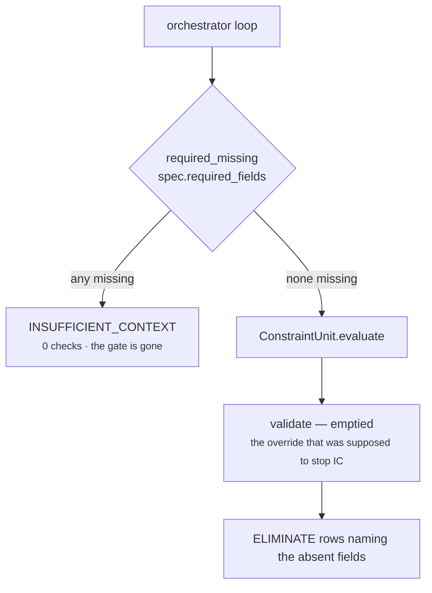

# 01 · Input and Validator

**Source:** `genios_engine/reason/reasoners/constraint.py:ConstraintUnit.validate`
**Base:** `genios_engine/reason/unit.py:ReasoningUnit.validate`
**Test:** `tests/test_unit_constraint.py:test_thin_context_produces_eliminations_rather_than_insufficient_context`

---

## 1 · What it is for

Stage 2 of the framework exists so a unit can say *"I will not guess"*. For every other unit that is
the right instinct. For a gate it is backwards: the moment the room goes dark is the moment you most
want the door locked. This unit therefore refuses to refuse.

---

## 2 · What arrives

`ReasoningUnit.evaluate` takes two arguments and nothing else:

```python
def evaluate(self, request: ReasoningRequest,
             prior_results: Mapping[str, ReasonerResult]) -> ReasonerResult:
```

| Input | Type | What this unit reads out of it |
|---|---|---|
| `request.capability.policies` | `tuple[str, ...]`, sorted and deduped at manifest construction | which policy rows exist at all |
| `request.capability.plays` | `tuple[PlayDefinition, ...]` | `play_id`, `read_only`, `tags`, `metadata`, `preconditions` — and **declaration order**, which becomes the emission order |
| `request.context.facts` | `Mapping[str, Any]` | root-scope precondition lookups |
| `request.context.neighbor_facts` | `Mapping[str, Any]` | precondition lookups when the condition sets `neighbor: true` |
| `request.context.evidence` | `tuple[EvidenceRef, ...]` | the id set that grounding is checked against, and `context_evidence_count` in the detail |
| `prior_results` | `Mapping[str, ReasonerResult]` | evidence ids cited by declared dependencies, for `evidence_required` |
| `spec.config["blocked_play_ids"]` | sequence | the tenant block list |

`spec` is not passed in — it is resolved inside `evaluate` by
`common.py:active_spec(request, "core.constraint")`, which scans `request.capability.reasoners` and
**raises** if the capability does not declare this unit:

```
ValueError: capability does not declare reasoner core.constraint
```

`test_a_capability_that_does_not_declare_this_unit_is_rejected_identically` pins that, in both the
migrated unit and the frozen legacy reference.

`prior_results` contains **only the dependencies the capability declared**. The orchestrator builds
it as `{item: prior[item] for item in spec.dependencies if item in prior}`. For
`sales.deal_cooling`, `core.constraint` declares `dependencies=("core.temporal", "core.relationship")`;
for `sales.deal_health` it declares `("core.signal_composition",)`. Anything those units did not cite
cannot ground the `evidence_required` policy, no matter what else ran in the plan.

---

## 3 · `required_fields`, and what the unit does with them

**Nothing.** `ConstraintUnit` declares no `required_fields` of its own, and neither shipped
capability declares any on its `core.constraint` spec:

```python
# packs/capabilities/deal_cooling.py
constraint = ReasonerSpec(
    reasoner_id="core.constraint", version=REASONER_VERSION,
    input_kind="candidate_plays", output_kind="candidate_checks",
    dependencies=("core.temporal", "core.relationship"),
    latency_budget_ms=25, failure_policy=FailurePolicy.REQUIRED,
    config={"blocked_play_ids": ()},
)
```

`required_fields` defaults to `()`. The two places the framework would normally consume it are both
overridden away:

- `validate()` — emptied (this file).
- `retrieve()` — replaced, so `required_fields` never selects facts either
  ([02-Retriever](02-Retriever.md)).

---

## 4 · The override, and the exact code

```python
def validate(self, view: UnitView) -> None:
    """Never refuse."""
```

That is the entire body — a docstring and an implicit `return None`. The base it replaces:

```python
def validate(self, view: UnitView) -> None:
    absent = missing_fields(view.request, view.spec.required_fields)
    if absent:
        raise MissingContextError(*absent)
```

`protocols.py:MissingContextError` is what `orchestrator.py:_evaluate` converts into
`ResultStatus.INSUFFICIENT_CONTEXT` carrying `exc.fields`. A result in that status **cannot carry
checks at all** — `contracts/reasoning.py:ReasonerResult.__post_init__` forbids a non-`COMPLETED`
result from carrying `matched`, metrics, findings, adjustments, checks or evidence ids. So a
`MissingContextError` from this unit would not produce a cautious gate; it would produce *no gate*.

The docstring states the position without hedging:

> *"Thin context is the condition under which the gate matters most, and a missing precondition field
> is reported as an ELIMINATE row naming the field, not as an abstention. Removing the gate because
> the room is dark is not fail-closed."*

### What "reported as a row" looks like

`tests/test_unit_constraint.py:test_thin_context_produces_eliminations_rather_than_insufficient_context`
builds a capability that declares `required_fields=("deal.status", "deal.value")` on the constraint
spec, supplies an entirely empty fact space, and calls the unit directly:

```text
result.status         = COMPLETED
result.missing_fields = ()
result.checks         = [ read_only_policy_pass , precondition_failed ]
```

The second row carries `detail = {"index": 0, "field": "deal.status", "neighbor": False,
"operator": "exists", "expected": None, "actual": None}`. An auditor reading that row learns which
field was absent — strictly more than `INSUFFICIENT_CONTEXT: deal.status` would have told them, and
with the play removed rather than the run abandoned.

---

## 5 · The gap: the override is unreachable in the orchestrated path

`orchestrator.py` applies its own, **stricter** missing-field test *before* the unit is constructed
into the call:

```python
missing = required_missing(request, spec.required_fields)
if missing:
    result = ReasonerResult(..., status=ResultStatus.INSUFFICIENT_CONTEXT,
                            missing_fields=missing,
                            reason_codes=("required_context_missing",))
else:
    result = self._evaluate(reasoners[spec.reasoner_id], spec, request, dependencies, play_ids)
```

`guards.py:required_missing` treats a field as missing when it is absent **or** when Layer 2
explicitly published it in `context.missing_fields` — a superset of what `common.py:missing_fields`
checks. The unit's emptied validator is never consulted.

**Verified by running the orchestrator on a capability that declares one required field this unit's
own tests use:**

| `core.constraint` spec `required_fields` | Facts supplied | Decision outcome | Result status | Checks emitted |
|---|---|---|---|---|
| `("deal.status",)` | `{}` | `INSUFFICIENT_CONTEXT` | `INSUFFICIENT_CONTEXT`, `missing_fields=("deal.status",)`, `reason_codes=("required_context_missing",)` | **0** |
| `()` | `{}` | `BLOCKED` | `COMPLETED`, `reason_codes=("constraints_evaluated",)` | **2** — `read_only_policy_pass`, `precondition_failed` |

The second row is the intended behaviour: the play is eliminated, every candidate is eliminated, and
the run ends `BLOCKED` with the reason attached. The first row is the failure mode this override was
written to prevent, arriving one layer earlier where the override cannot see it.



**Why it is latent rather than live:** neither shipped capability declares `required_fields` on this
spec, so `required_missing` is called with `()` and always returns `()`. The hazard is a Layer 3
authoring change — one well-meant `required_fields=("deal.status",)` added to a constraint spec to
"document what it needs" would silently convert every thin-context run from *fail-closed with reasons*
to *no gate at all*.

The two candidate fixes, neither built: exempt `core.constraint` from the orchestrator's pre-check, or
have `CapabilityManifest` reject a `core.constraint` spec that declares `required_fields`. The second
is cheaper and states the invariant where an author will read it.

---

## 6 · Edge cases

| Input | Behaviour |
|---|---|
| Capability does not declare `core.constraint` | `active_spec` raises `ValueError`; `_evaluate` converts it to `FAILED` with the message in `diagnostics` |
| Capability declares zero policies and zero preconditions | legal — `requires_constraint` is false, so the manifest need not declare this unit at all. If it does, the unit runs, emits zero rows, and returns `COMPLETED`. `test_migrated_unit_is_hash_identical_to_the_frozen_reference[no_policies_no_preconditions]` |
| Capability declares a policy but no required `core.constraint` | `CapabilityManifest.__post_init__` raises at construction: *"capability policies and play preconditions require a required core.constraint"* — the run never starts |
| `prior_results` is empty | legal. `evidence_required`, if declared, eliminates every play with `used_evidence_count: 0`. `test_migrated_unit_is_hash_identical_to_the_frozen_reference[deal_cooling_no_prior_results]` |
| A dependency ran but returned `FAILED` | its checks and evidence ids are unreachable — `ReasonerResult` forbids a non-`COMPLETED` result from carrying them — so it contributes nothing to grounding, without any special-casing in this unit |
| Facts present but wrapped as `{"value": ..., "confidence_bp": ...}` | `common.py:fact_value` unwraps the `value` key. `test_migrated_unit_is_hash_identical_to_the_frozen_reference[wrapped_fact_record]` |

---

**Next:** [02-Retriever](02-Retriever.md) — the second override, and why the unit cites nothing.
