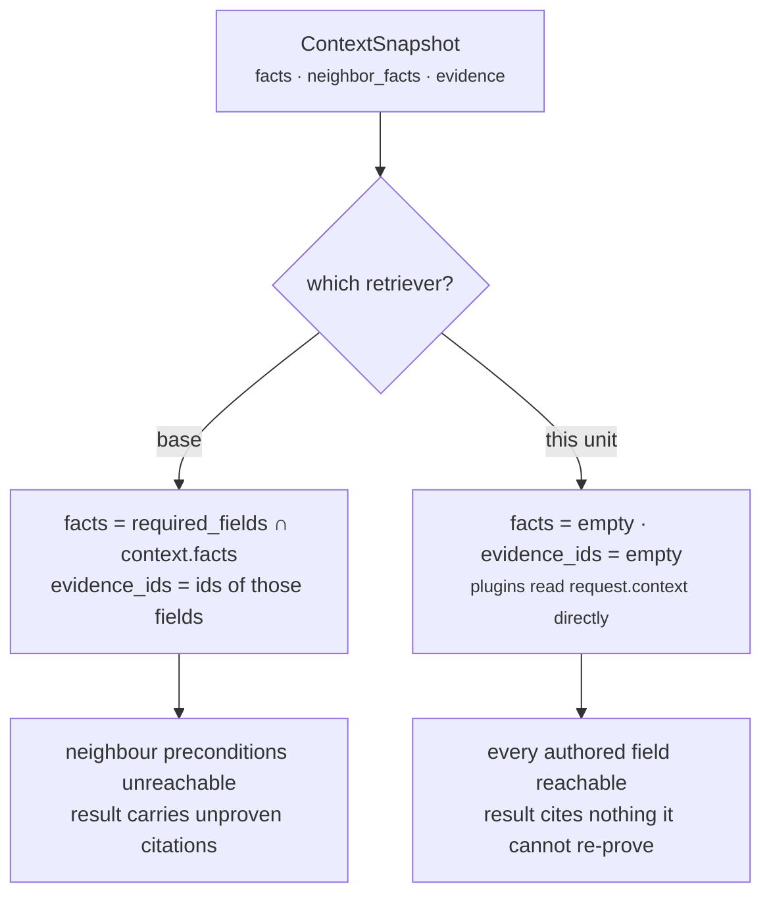

# 02 · Retriever

**Source:** `genios_engine/reason/reasoners/constraint.py:ConstraintUnit.retrieve`
**Base:** `genios_engine/reason/unit.py:ReasoningUnit.retrieve`
**Test:** `tests/test_unit_constraint.py:test_declared_required_fields_never_leak_evidence_into_the_result`

---

## 1 · What it is for

Stage 3 selects the slice of the frozen snapshot a unit is allowed to look at, and — as a byproduct —
the evidence ids it is entitled to cite. The `UnitView` it produces is the artefact a reviewer reads
to answer *"what could this unit see?"* without reading the unit's body.

For this unit the honest answer is *everything, and it cites none of it*. Both halves are overrides.

---

## 2 · What exists

```python
def retrieve(self, request: ReasoningRequest, spec: ReasonerSpec,
             prior: Mapping[str, ReasonerResult]) -> UnitView:
    """The whole snapshot, and no evidence citation."""
    return UnitView(request=request, spec=spec, prior=prior)
```

Three of the five `UnitView` fields are populated; two take their dataclass defaults.

| `UnitView` field | Base retriever sets it to | This unit sets it to |
|---|---|---|
| `request` | the request | the request |
| `spec` | the capability's spec for this unit | same |
| `prior` | declared dependencies' results | same |
| `facts` | `{name: context.facts[name] for name in spec.required_fields if present}`, as a `MappingProxyType` | `{}` — the dataclass default |
| `evidence_ids` | `tuple(sorted(e.evidence_id for e in context.evidence if e.field in facts))` | `()` — the dataclass default |

`view.config` (the `spec.config` property) still works, and is where `blocked_play_ids` is read from.
`view.prior_metric(...)` is available and is never called — this unit reads dependency **evidence
ids**, not dependency metrics.

---

## 3 · How it works

### 3.1 · No fact pre-selection

The base retriever narrows to `spec.required_fields`. That is exactly the wrong window here, because
the fields this unit actually reads are **authored per play in Layer 3** and are not knowable from
the reasoner spec:

```python
# sales.deal_cooling, play restore_momentum
preconditions=(
    {"field": "deal.status", "op": "=", "value": "open"},
    {"field": "contact.verified_recipient", "neighbor": True, "op": "=", "value": True},
)
```

Neither `deal.status` nor `contact.verified_recipient` appears in the constraint spec's
`required_fields` (which is `()`). Under the base retriever, `view.facts` would be empty and the
plugins would still have to reach past it into `request.context` to do their job. From the docstring:

> *"any narrowing here would be a window that lies about what the unit actually reads."*

So the plugins read `request.context.facts` and `request.context.neighbor_facts` directly, via
`common.py:fact_value(request, field, neighbor=...)`. There is also a structural reason the base
window could never be right: the base retriever **drops every `neighbor:`-prefixed field** from
`wanted`, so neighbour-space preconditions — half of `sales.deal_cooling`'s — are unreachable through
`view.facts` by construction.

### 3.2 · No evidence citation

The base retriever derives `evidence_ids` from the fields it selected, which is what makes a unit's
citations impossible to forge — it cannot cite a row it was not allowed to look at, and
`guards.py:validate_evidence_references` re-checks at the orchestrator boundary anyway.

This unit cites nothing at all:

> *"Its output is check rows, and `store.py` and `authority.py` re-verify those rows directly against
> the capability's declared policies — attaching evidence ids would add unproven provenance to a
> result whose entire value is that every part of it is independently re-provable."*

The shipped result carries `evidence_ids == ()`, asserted twice:
`test_the_gate_publishes_no_metrics` and
`test_declared_required_fields_never_leak_evidence_into_the_result`.

That second test is the sharp one. It builds a capability whose constraint spec **does** declare
`required_fields=("deal.status",)` and whose snapshot **does** carry
`EvidenceRef("ev_status", "deal.status", "open")` — precisely the shape under which the base
retriever would attach `("ev_status",)` — and asserts both that the result cites nothing and that its
`semantic_hash` still equals the frozen legacy reference's. The citation is not merely unwanted; it
would be a hash break.



---

## 4 · Which facts and evidence ids actually land in the view

None. That is the whole point, and it is worth being blunt because a reader expecting a populated
window will look for one:

- `view.facts` is `{}` on **every** run of this unit, for every capability.
- `view.evidence_ids` is `()` on **every** run.
- The evidence ids the unit *reasons about* — for the `evidence_required` policy — are computed on
  demand inside `constraint.py:_grounded_evidence_ids(view)`, from `view.prior` intersected against
  `{item.evidence_id for item in view.request.context.evidence}`. They are used to decide a
  `PASS`/`ELIMINATE`, counted into `detail["used_evidence_count"]`, and then discarded. They are
  never carried on the result.

---

## 5 · Worked example — `sales.deal_cooling`

Snapshot: `facts = {deal.status: "open", deal.value: 250000, derived.engagement: 1800,
thread.last_inbound: "2026-07-28T12:00:00+00:00"}`, `neighbor_facts = {contact.verified_recipient:
True, account.alternate_stakeholder_verified: True}`, `evidence = (EvidenceRef("ev_status",
"deal.status", "open"),)`, and `prior = {"core.temporal": ReasonerResult(..., COMPLETED,
evidence_ids=("ev_status",))}`.

```text
UnitView.request        → the whole request, unmodified
UnitView.spec           → ReasonerSpec("core.constraint", "1.0.0",
                            dependencies=("core.temporal","core.relationship"),
                            config={"blocked_play_ids": ()})
UnitView.prior          → {"core.temporal": <COMPLETED>}
UnitView.facts          → {}
UnitView.evidence_ids   → ()
UnitView.config         → {"blocked_play_ids": ()}

read during analysis, none of it via view.facts:
  context.facts["deal.status"]                          → "open"      (3 precondition rows)
  context.neighbor_facts["contact.verified_recipient"]  → True        (1 precondition row)
  context.neighbor_facts["account.alternate_..."]       → True        (1 precondition row)
  _grounded_evidence_ids(view)                          → {"ev_status"}
                                                          |context.evidence| = 1
                                                          |grounded|         = 1

result.evidence_ids                                     → ()
```

Note `derived.engagement` and `thread.last_inbound` are in the snapshot and are read by
`core.temporal`, not by this unit. The gate touched exactly three fact names out of six available.

---

## 6 · Edge cases

| Situation | Behaviour |
|---|---|
| A precondition names a field in neither fact space | `exists` is `False`, `actual` is `None`, every operator except `absent` eliminates. No error. |
| A precondition sets `neighbor: true` but the fact sits in root facts | it is *not* found — the two spaces are disjoint lookups. `test_precondition_plugin_reads_the_neighbour_space_when_asked` asserts `PASS` for the neighbour placement and `ELIMINATE` for the misplaced one. |
| The snapshot carries evidence but no dependency cited it | `evidence_required` eliminates with `detail = {"context_evidence_count": 1, "used_evidence_count": 0}`. Scenario `deal_cooling_stale_citation_is_not_grounding`. |
| The snapshot carries no evidence but a dependency cites an id | that id is not in the snapshot's id set, so it does not ground. Scenario `deal_cooling_no_snapshot_evidence`. |
| `spec.config` carries unrelated keys in a different order | irrelevant — only `blocked_play_ids` is read, and it is a list. `test_config_key_order_cannot_change_the_result`. |
| `prior` mapping built in a different insertion order | irrelevant — grounding folds into a `set`. `test_prior_result_insertion_order_cannot_change_the_result`. |

---

**Next:** [03-Analyzer](03-Analyzer.md) — the plugin seam.
