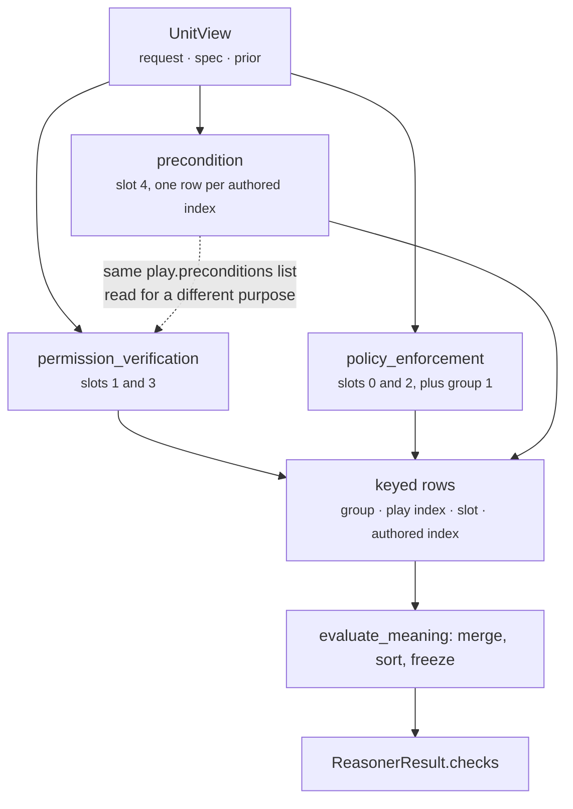

# 03 · Analyzer — the plugin seam

**Source:** `genios_engine/reason/reasoners/constraint.py:_ConstraintPlugin` and its three subclasses
**Base:** `genios_engine/reason/unit.py:ReasoningUnit.analyze` — **not overridden**
**Tests:** `test_every_plugin_summarises_its_own_rows_as_an_observation`,
`test_a_plugin_with_nothing_to_say_contributes_no_observation`, and the three per-plugin sections of
`tests/test_unit_constraint.py`

---

## 1 · What it is for

The framework's plugin seam exists so a unit is a composition of small, separately testable,
separately versionable claims rather than a monolith wearing a base class. For this unit the
decomposition is not arbitrary: **the three plugins are the three `stage` values the two external
re-provers index on.**

| Plugin | Question it answers | `stage` |
|---|---|---|
| `PolicyEnforcementPlugin` | What has the capability — or the tenant — forbidden outright? | `policy` |
| `PermissionVerificationPlugin` | Who is allowed to be affected, and who had to say yes first? | `permission` |
| `PreconditionPlugin` | What did the play author say must already be true? | `precondition` |

`store.py:_POLICY_CHECK_REQUIREMENTS` and `authority.py:AUDITED_SIGNAL_PREDICATE` both key on
`(stage, reason_code)` pairs. Split the plugins differently and you change which stage a row carries,
which breaks both re-provers. The seam is a schema boundary, not a code-organisation preference.

---

## 2 · What exists — the shared base

```python
class _ConstraintPlugin:
    plugin_id = ""
    kind = ""

    def checks(self, view: UnitView) -> tuple[_KeyedCheck, ...]:
        raise NotImplementedError

    def contribute(self, view: UnitView) -> tuple[Observation, ...]:
        rows = self.checks(view)
        if not rows:
            return ()
        eliminated = sum(1 for _, check in rows if check.outcome == CheckOutcome.ELIMINATE)
        return (Observation(
            plugin_id=self.plugin_id,
            kind=self.kind,
            metrics={"checks_emitted": len(rows), "eliminated": eliminated},
        ),)
```

The inversion is the point. For every other unit in the roster, `contribute()` is the real work and
returns the plugin's claim. Here `checks()` is the real work and `contribute()` is a thin derivation
that exists only to satisfy `unit.py:AnalyzerPlugin`.

The docstring explains why the derivation is counts and nothing more:

> *"An observation that tried to carry a check's `detail` mapping would be lying about the
> framework's integer-only metric contract."*

`Observation.__post_init__` rejects any metric that is not an `int` (and rejects `bool` explicitly,
since `isinstance(True, int)` is `True` in Python). A `detail` mapping like
`{"index": 0, "field": "deal.status", "expected": "open", "actual": "closed"}` has no legal
representation as an `Observation`. So the observation says *how many rows and how many of them
eliminated*, and the rows themselves travel by a different route.

### The `_KeyedCheck` contract

```python
_KeyedCheck = tuple[tuple[int, int, int, int], CandidateCheck]
```

Every plugin returns rows already stamped with their position in the unit's total emission order:
`(group, index, slot, authored_index)`. A plugin that returned a bare `CandidateCheck` would force
the unit to reconstruct ordering from row content, and the ordering would stop being a property of
the claim. See [05-Evaluator](05-Evaluator.md) §3 for the merge and the sort.

### The shared row builder

```python
def _check(play_id, stage, passed, pass_code, fail_code, detail=None) -> CandidateCheck:
    return CandidateCheck(
        play_id=play_id, stage=stage,
        outcome=CheckOutcome.PASS if passed else CheckOutcome.ELIMINATE,
        reason_code=pass_code if passed else fail_code,
        evaluator_id=CONSTRAINT_UNIT_ID, evaluator_version=CONSTRAINT_UNIT_VERSION,
        detail=dict(detail or {}))
```

Two properties both re-provers depend on:

**Pass and fail carry different reason codes.** Never one code plus an outcome flag. *"A downstream
re-prover looks for the exact passing code, so 'not eliminated' can never be mistaken for
'affirmatively allowed'."*

**Identity is stamped from module constants, not from the declared spec.** `store.py` compares the
row's `evaluator_version` against the version the *capability manifest* declared for
`core.constraint`. A unit that stamped rows with `spec.version` would make that comparison compare a
value to itself:

> *"a unit that stamped rows with whatever version the manifest happened to name would make that
> comparison vacuous instead of a proof."*

`test_policy_plugin_eliminates_a_mutating_play_under_read_only` asserts
`(check.evaluator_id, check.evaluator_version) == (CONSTRAINT_UNIT_ID, CONSTRAINT_UNIT_VERSION)`
directly.

The one row that does **not** go through `_check` is the tenant block, which is built inline because
it has no passing counterpart at all — see [03b](03b-plugin-policy_enforcement.md) §5.

---

## 3 · Execution order

`analyze()` is the base implementation, unchanged:

```python
observations = []
for plugin in sorted(self.plugins, key=lambda item: item.plugin_id):
    observations.extend(plugin.contribute(view))
return tuple(observations)
```

Registration order in the class body is
`(PolicyEnforcementPlugin(), PermissionVerificationPlugin(), PreconditionPlugin())`. Execution order
is alphabetical by `plugin_id`:

```text
1. permission_verification
2. policy_enforcement
3. precondition
```

Observed directly, on a `sales.deal_cooling` request with a closed deal and an empty neighbour space
and no prior results:

| Order | `plugin_id` | `kind` | `checks_emitted` | `eliminated` |
|---|---|---|---|---|
| 1 | `permission_verification` | `constraint.permission` | 6 | 0 |
| 2 | `policy_enforcement` | `constraint.policy` | 6 | 3 |
| 3 | `precondition` | `constraint.precondition` | 6 | 5 |

Three plays × two permission policies = 6; three plays × two capability policies = 6; three plays ×
two authored conditions = 6. The `policy_enforcement` eliminations are the three `evidence_required`
rows (no prior result cited anything). The `precondition` eliminations are three `deal.status = open`
failures against `"closed"` plus two neighbour lookups that found nothing; the surviving row is
`clarify_next_step`'s `deal.next_step absent`, which passes precisely because the fact is missing.

Note what `permission_verification` reports: **zero eliminations, on a run where the recipient is not
verified.** That is not a bug, but it is the unit's least intuitive property — see
[03a](03a-plugin-permission_verification.md) §5.

---

## 4 · How the plugins interact

They do not, directly. Each reads the same frozen `UnitView` and returns rows; none reads another's
output; none can be made to run before another matters. Three couplings are worth naming anyway,
because they are the ones a refactor breaks.



**1 · Two plugins read `play.preconditions`, for different questions.** `PreconditionPlugin` asks
*does this condition hold against the snapshot?* `PermissionVerificationPlugin` asks *does a condition
of this shape exist at all?* — it inspects the authored condition without ever evaluating it. A
recipient-guarded play therefore produces two rows about the same authored line, and they can
disagree: `verified_recipient_guard_pass` (the guard is declared) alongside `precondition_failed`
(the guard does not hold).

**2 · The plugins interleave in the emission order.** `policy_enforcement` owns slots 0 and 2;
`permission_verification` owns 1 and 3. No ordering of plugin *execution* can produce
`read_only → human_approval → evidence → recipient`. That sequence exists only because every row is
keyed and the unit sorts. This is the single strongest argument for the `_KeyedCheck` shape:

> *"a total order that is a property of the claim, not of registration."*

**3 · Every plugin runs twice per evaluation.** `analyze()` calls `contribute()`, which calls
`checks()`. Then `evaluate_meaning()` calls `checks()` again. The observations from the first pass
are consumed by nothing: `calculate()` ignores them and returns `{}`, and `build()` reads only
`observation.evidence_ids`, which is empty for all three. Both passes are pure functions of the same
frozen view so they cannot disagree, but the work is done twice and the observations are dead weight
in the shipped path. They are load-bearing in the test suite —
`test_every_plugin_summarises_its_own_rows_as_an_observation` reconciles each observation's counts
against a fresh `checks()` call — and in a trace, which is the honest justification for keeping them.

---

## 5 · Silence

`contribute()` returns `()` — not a zero-valued observation — when `checks()` produced no rows.

```python
rows = self.checks(view)
if not rows:
    return ()
```

`test_a_plugin_with_nothing_to_say_contributes_no_observation` asserts this for
`PermissionVerificationPlugin` and `PreconditionPlugin` against a capability with no policies and no
preconditions. The distinction matters for the same reason it matters everywhere in Layer 4: an
observation reading `checks_emitted: 0, eliminated: 0` says *"I looked at every play and found
nothing to object to"*, which is a materially stronger claim than *"this policy was never declared,
so I was never asked"*.

Each plugin's precise silence conditions:

| Plugin | Silent when |
|---|---|
| `permission_verification` | neither `human_approval_required` nor `no_unverified_recipient` is in `capability.policies` |
| `policy_enforcement` | neither `read_only` nor `evidence_required` is declared, **and** `blocked_play_ids` is empty or absent |
| `precondition` | no play declares any precondition |

`PolicyEnforcementPlugin` has an asymmetry the other two do not: it can be silent on policies and
still speak, because the tenant block list is unconditional and independent of every declared policy.

---

**Plugin detail:** [03a · permission_verification](03a-plugin-permission_verification.md) ·
[03b · policy_enforcement](03b-plugin-policy_enforcement.md) ·
[03c · precondition](03c-plugin-precondition.md)
