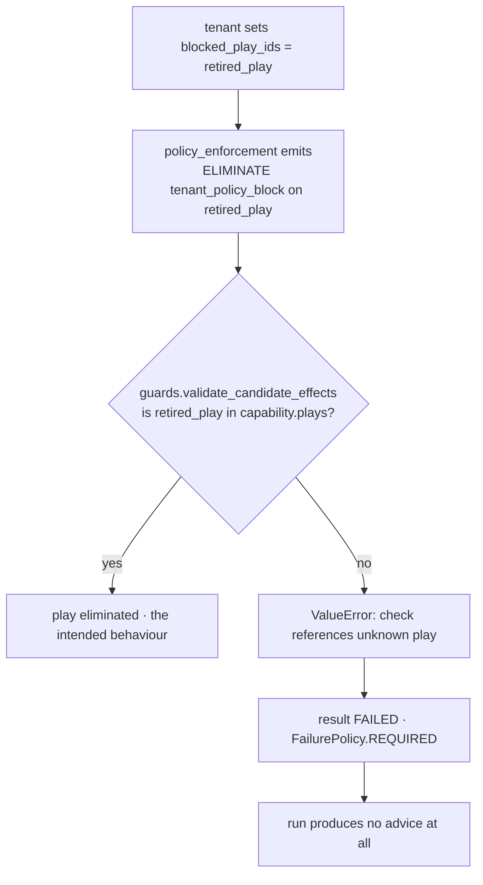

# 03b · Plugin `policy_enforcement`

**Class:** `genios_engine/reason/reasoners/constraint.py:PolicyEnforcementPlugin`
**`plugin_id`:** `policy_enforcement` · **`kind`:** `constraint.policy` · **`stage`:** `policy`
**Slots owned:** `_SLOT_READ_ONLY = 0`, `_SLOT_EVIDENCE = 2`, plus the whole of `_GROUP_TENANT = 1`
**Tests:** `test_policy_plugin_emits_read_only_and_evidence_rows_only_when_declared`,
`test_policy_plugin_eliminates_a_mutating_play_under_read_only`,
`test_policy_plugin_requires_grounding_in_this_exact_snapshot`,
`test_policy_plugin_blocks_ids_the_capability_never_declared`,
`test_tenant_blocks_are_emitted_after_every_play_row`

---

## 1 · The claim it makes

*What the capability — and separately, the tenant — has forbidden outright.*

Three claims, of which the first two are statements about the **capability as a whole** rather than
about any one play, and the third is not about the capability at all.

| Claim | Trigger | Pass code | Fail code | Slot |
|---|---|---|---|---|
| `read_only` | policy declared | `read_only_policy_pass` | `read_only_policy` | 0 |
| `evidence_required` | policy declared | `evidence_policy_pass` | `evidence_required` | 2 |
| tenant block list | `spec.config["blocked_play_ids"]` non-empty | *none — never passes* | `tenant_policy_block` | group 1 |

Note the second row's asymmetry: the failing code is the policy name itself, `evidence_required`, and
the passing code is `evidence_policy_pass`. That is not a naming slip — it is a shape the two
re-provers depend on, and it is frozen. `store.py` looks for `evidence_policy_pass` and would not
recognise `evidence_required` as a pass under any circumstances.

---

## 2 · When it stays silent

| Condition | Rows emitted |
|---|---|
| `read_only` not declared | no slot-0 rows |
| `evidence_required` not declared | no slot-2 rows, **and `_grounded_evidence_ids` is never computed** |
| `blocked_play_ids` absent, `None`, or empty | no group-1 rows |
| All three of the above | `checks()` returns `()`, `contribute()` returns `()` |

`test_policy_plugin_emits_read_only_and_evidence_rows_only_when_declared` asserts both halves: with
`policies=("read_only",)` exactly one row comes out, `["read_only_policy_pass"]`; with `policies=()`
and no block list, `plugin.checks(view) == ()`.

The short-circuit on grounding is deliberate and visible in the code:

```python
grounded = _grounded_evidence_ids(view) if evidence_declared else set()
```

A capability that does not declare `evidence_required` never pays for the fold over prior results.

---

## 3 · The full arithmetic

### 3.1 · `read_only`

```text
for play_index, play in enumerate(capability.plays):
    passed = play.read_only                       # the play's own boolean, nothing else
    detail = {"required": True, "play_read_only": play.read_only}
    key    = (_GROUP_PLAY=0, play_index, _SLOT_READ_ONLY=0, 0)
```

`detail["required"]` is the literal `True`, not a computed value — the row only exists when the
policy is declared, so "required" is unconditionally true whenever the row is present. It is written
into the detail anyway so an auditor reading a persisted row in isolation does not have to go find
the manifest to know the policy was on.

The claim: *"the capability was deployed in an observe-only posture, so a play that mutates anything
is not merely risky, it is out of scope."*

### 3.2 · `evidence_required`

Computed once per run, before the play loop:

```python
def _grounded_evidence_ids(view: UnitView) -> set[str]:
    request = view.request
    context_evidence_ids = {item.evidence_id for item in request.context.evidence}
    return {
        evidence_id
        for result in view.prior.values()
        for evidence_id in (
            result.evidence_ids
            + tuple(evidence_id for finding in result.findings
                    for evidence_id in finding.evidence_ids)
            + tuple(evidence_id for adjustment in result.adjustments
                    for evidence_id in adjustment.evidence_ids)
        )
        if evidence_id in context_evidence_ids
    }
```

```text
context_ids  = { e.evidence_id for e in request.context.evidence }
cited_ids    = ⋃ over prior.values() of
                   result.evidence_ids
                 ∪ { id on every finding.evidence_ids }
                 ∪ { id on every adjustment.evidence_ids }
grounded     = cited_ids ∩ context_ids

evidence_present = bool(grounded)                      # one boolean for the whole capability
detail           = { "context_evidence_count": len(request.context.evidence),
                     "used_evidence_count":    len(grounded) }

for play_index, play in enumerate(capability.plays):
    key = (0, play_index, _SLOT_EVIDENCE=2, 0)
    → the SAME verdict and the SAME detail object stamped on every play's row
```

Three properties.

**Grounding must be in *this* snapshot.** The intersection is the whole mechanism:

> *"Merely carrying an unrelated `EvidenceRef` is not grounding… otherwise a stale citation from
> another run would satisfy the policy without anything in this situation supporting the action."*

**All three citation surfaces count.** A dependency can cite evidence on its result, on a `Finding`,
or on a `CandidateAdjustment`. Three differential scenarios pin one each:
`deal_cooling_all_clear` (result), `deal_cooling_grounded_via_finding`,
`deal_cooling_grounded_via_adjustment`.

**The fold is into a `set`, so insertion order cannot reach the result.**
`test_prior_result_insertion_order_cannot_change_the_result` builds the same two prior results in
both orders and asserts `semantic_hash` equality.

**It is capability-wide, not per play.** *"one grounding fact serves every play, which is why the
same verdict is stamped onto each play's row rather than recomputed per play."* A consequence worth
knowing: the policy cannot express *"this specific play needs evidence"*. It is all plays or none.

### 3.3 · The tenant block list

```python
for block_index, play_id in enumerate(tuple(view.spec.config.get("blocked_play_ids") or ())):
    rows.append((
        (_GROUP_TENANT, block_index, 0, 0),
        CandidateCheck(str(play_id), "policy", CheckOutcome.ELIMINATE,
                       "tenant_policy_block", CONSTRAINT_UNIT_ID, CONSTRAINT_UNIT_VERSION),
    ))
```

```text
ids   = tuple(spec.config.get("blocked_play_ids") or ())   # authored order preserved
row   = ELIMINATE, reason_code "tenant_policy_block", detail {} (the dataclass default)
key   = (_GROUP_TENANT=1, block_index, 0, 0)
```

This is the one row in the unit that does **not** go through `_check`, because `_check` takes a
pass code and a fail code and this row has no passing counterpart. It is unconditional:

> *"a blocked id is eliminated whether or not the capability still declares that play."*

It also carries an **empty `detail`**, asserted by
`test_policy_plugin_blocks_ids_the_capability_never_declared`. There is nothing to record — the id
was on a list, and the list is in the persisted config snapshot.

`or ()` handles three absent-ish shapes identically: key missing, value `None`, value empty. The
result is the same in all three — no rows. `test_migrated_unit_is_hash_identical_to_the_frozen_reference`
covers `empty_block_list` and `config_absent` as separate scenarios.

Iteration is in **authored order**, not sorted, and the comment says why:

> *"this is a list in config, and a list survives the audit store's JSON round-trip with its order
> intact."*

A mapping's key order would not, which is what `test_config_key_order_cannot_change_the_result`
guards: two configs with the same `blocked_play_ids` but the other keys typed in opposite orders
produce the same `semantic_hash`.

---

## 4 · Worked example 1 — read-only against a mutating play, with a block list

Capability: `policies=("read_only",)`, two plays, and
`config={"blocked_play_ids": ("auto_send", "auto_send", "retired_play")}`. Actual rows:

| key | `play_id` | outcome | `reason_code` | `detail` |
|---|---|---|---|---|
| `(0,0,0,0)` | `observe` — `read_only=True` | `pass` | `read_only_policy_pass` | `{"required": True, "play_read_only": True}` |
| `(0,1,0,0)` | `auto_send` — `read_only=False` | **`eliminate`** | `read_only_policy` | `{"required": True, "play_read_only": False}` |
| `(1,0,0,0)` | `auto_send` | **`eliminate`** | `tenant_policy_block` | `{}` |
| `(1,1,0,0)` | `auto_send` | **`eliminate`** | `tenant_policy_block` | `{}` |
| `(1,2,0,0)` | `retired_play` | **`eliminate`** | `tenant_policy_block` | `{}` |

`Observation`: `{"checks_emitted": 5, "eliminated": 4}`.

Three things to read off it. A duplicate id in the block list produces a **duplicate row**, not a
deduplicated one — the sort key differs (`block_index` 0 and 1) so both survive the total order, and
both reach the persisted record. `auto_send` is now eliminated twice by two different rules, and both
reasons travel with the candidate. And `retired_play` gets a row despite matching no declared play —
which is the behaviour §6 is about.

## 5 · Worked example 2 — grounding, three ways

`sales.deal_cooling` declares all four policies. Snapshot carries exactly one evidence row,
`EvidenceRef("ev_status", "deal.status", "open")`, so `context_evidence_count = 1` on every run below.
Only the `prior` mapping changes.

| Scenario | `prior` content | `grounded` | `used_evidence_count` | Outcome on all 3 plays |
|---|---|---|---|---|
| `deal_cooling_all_clear` | `core.temporal` result with `evidence_ids=("ev_status",)` | `{"ev_status"}` | 1 | `pass` · `evidence_policy_pass` |
| `deal_cooling_grounded_via_finding` | same unit, id only on a `Finding` | `{"ev_status"}` | 1 | `pass` |
| `deal_cooling_grounded_via_adjustment` | same unit, id only on a `CandidateAdjustment` | `{"ev_status"}` | 1 | `pass` |
| `deal_cooling_ungrounded` / `deal_cooling_no_prior_results` | `{}` | `∅` | 0 | **`eliminate`** · `evidence_required` |
| `deal_cooling_stale_citation_is_not_grounding` | `core.temporal` cites `"ev_from_another_run"` | `∅` | 0 | **`eliminate`** |
| `deal_cooling_no_snapshot_evidence` | cites `"ev_status"`, but the snapshot carries no evidence at all | `∅` | 0 | **`eliminate`**, with `context_evidence_count: 0` |

The stale-citation row is the one worth staring at. `test_policy_plugin_requires_grounding_in_this_exact_snapshot`
asserts its exact detail:

```text
{"context_evidence_count": 1, "used_evidence_count": 0}
```

Read plainly: *this snapshot contains one piece of evidence, and nothing that reasoned about this
situation used it.* A single integer pair that tells an auditor the difference between "we have no
evidence" and "we have evidence nobody stood on".

On the full `sales.deal_cooling` all-clear run the plugin emits 6 rows — 3 plays × 2 policies —
with `Observation` `{"checks_emitted": 6, "eliminated": 0}`. On the ungrounded run the same 6 rows
come out with `{"checks_emitted": 6, "eliminated": 3}`.

---

## 6 · The gap: a tenant block on an undeclared id takes the capability offline

The plugin's behaviour is deliberate and tested. It does not survive the kernel boundary.

`guards.py:validate_candidate_effects` runs on every result inside `orchestrator.py:_evaluate`:

```python
for check in result.checks:
    if check.play_id not in play_ids:
        raise ValueError(f"check references unknown play: {check.play_id}")
```

**Verified end to end**, running the orchestrator over a capability with plays `p1` and `p2`:

| `blocked_play_ids` | Result status | Decision outcome | `diagnostics` |
|---|---|---|---|
| `("p2",)` | `COMPLETED` | `DECISION` | `{}` |
| `("retired_play",)` | **`FAILED`** | **`FAILED`** | `{"exception_type": "ValueError", "message": "check references unknown play: retired_play"}` |

Because every shipped capability declares `core.constraint` with `FailurePolicy.REQUIRED`, a `FAILED`
constraint result ends the run. The tenant who thought they were retiring one play has taken the
whole capability offline, and nothing in the tenant-facing path says so.



Two one-line fixes, neither built: skip ids that are not in `capability.plays` when emitting the
tenant rows, or exempt `tenant_policy_block` from the guard's unknown-play test. The first is
preferable — it keeps the guard absolute — but it changes the emitted row set, and therefore the
semantic hash of any run that currently blocks an undeclared id. Since such a run currently fails, no
successful decision hash would move; the differential test's `tenant_block_list` scenario, which
blocks `retired_play`, would have to be rewritten.

---

## 7 · Edge cases

| Input | Behaviour |
|---|---|
| `blocked_play_ids` contains a non-string, e.g. `7` | coerced with `str(play_id)` before the `CandidateCheck` is built; `_identifier` in the contract then validates the shape |
| `blocked_play_ids` contains the same id twice | two rows, distinct sort keys, both persisted. No dedup |
| `blocked_play_ids` is a `list` rather than a `tuple` | fine — wrapped in `tuple(...)` at read time |
| `capability.policies` declares `read_only` and every play is `read_only=True` | every row passes; the policy still costs one row per play, which is what makes `store.py`'s proof possible |
| A dependency completed but cited nothing | contributes no ids; identical to it not having run, from this plugin's point of view |
| A dependency is `FAILED` or `INSUFFICIENT_CONTEXT` | `ReasonerResult.__post_init__` forbids a non-`COMPLETED` result from carrying evidence ids, findings or adjustments, so it contributes nothing — no status check is needed in `_grounded_evidence_ids` |
| `evidence_required` declared, snapshot has evidence, but the capability declares no dependencies for `core.constraint` | `prior` is empty, so **nothing can ever ground** and every play is eliminated on every run. A Layer 3 authoring hazard with no guard against it |
