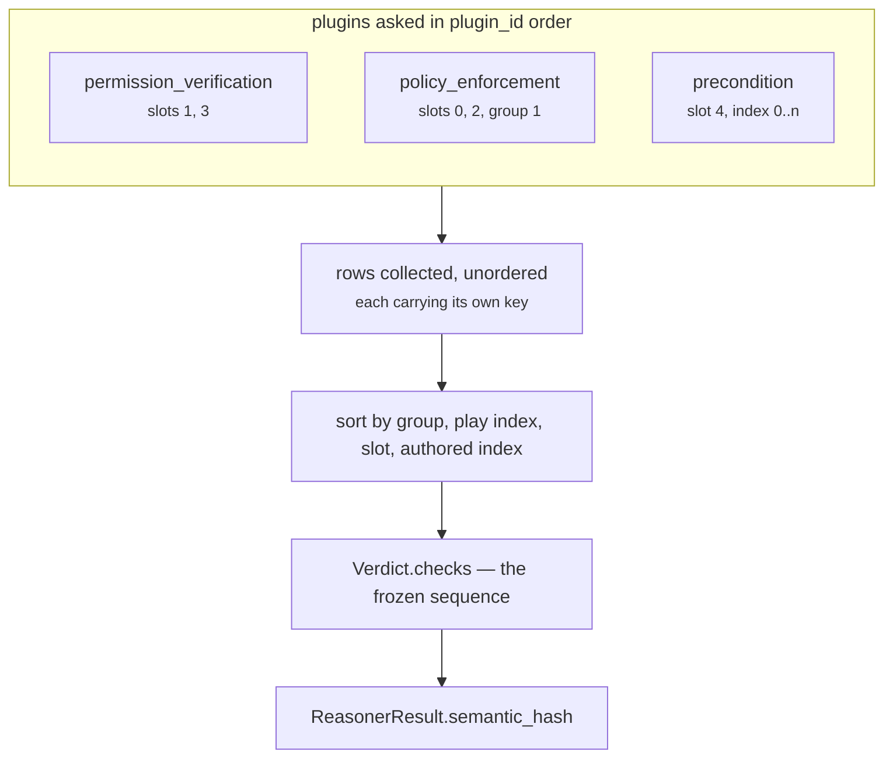

# 05 · Evaluator

**Source:** `genios_engine/reason/reasoners/constraint.py:ConstraintUnit.evaluate_meaning`
**Framework contract:** `unit.py:ReasoningUnit.evaluate_meaning` — `@abstractmethod`
**Tests:** `test_emission_order_is_grouped_by_play_then_slot_then_authored_index`,
`test_tenant_blocks_are_emitted_after_every_play_row`,
`test_identical_input_produces_an_identical_hash`,
`test_config_key_order_cannot_change_the_result`,
`test_prior_result_insertion_order_cannot_change_the_result`

---

## 1 · What it is for

Stage 6 turns numbers into meaning. For most units that means applying a threshold: `82 → high risk`.
This unit has no numbers, and it is forbidden from reaching a verdict. So the stage does the only
other thing an evaluator can do — it **assembles**, and it imposes the total order that makes the
assembly reproducible.

This is where the unit's real output is produced. `analyze()` ran earlier and its observations are
ignored; the rows that ship are the ones built here.

---

## 2 · What exists

```python
def evaluate_meaning(self, view: UnitView, metrics: Mapping[str, int],
                     observations: Sequence[Observation]) -> Verdict:
    rows: list[_KeyedCheck] = []
    for plugin in sorted(self.plugins, key=lambda item: item.plugin_id):
        rows.extend(plugin.checks(view))
    rows.sort(key=lambda item: item[0])
    return Verdict(
        matched=None,
        metrics={},
        checks=tuple(check for _, check in rows),
        reason_codes=("constraints_evaluated",),
    )
```

`metrics` and `observations` are both accepted and both unused.

The `Verdict` it returns, field by field:

| `Verdict` field | Value | Why |
|---|---|---|
| `matched` | `None` | this unit makes no single true/false claim — §5 |
| `metrics` | `{}` | mirrors `calculate` — see [04](04-Calculator.md) |
| `reason_codes` | `("constraints_evaluated",)` | the gate ran; what it decided is in the rows |
| `checks` | the sorted tuple | the entire output |
| `findings` | `()` — the dataclass default | §6 |
| `adjustments` | `()` — the dataclass default | §6 |

---

## 3 · The merge and the sort

Two sorts, doing different jobs.

**The outer loop's sort is cosmetic here.** `sorted(self.plugins, key=plugin_id)` fixes the order in
which plugins are asked, but every row is about to be re-sorted by its own key, so the plugin order
cannot reach the output. It is kept because it costs nothing and because a reader comparing this
method to `analyze()` should see the same idiom in both places.

**The inner sort is the contract.** `rows.sort(key=lambda item: item[0])` sorts on the four-tuple each
plugin stamped:

```text
key = (group, index, slot, authored_index)

group 0  _GROUP_PLAY     ─ rows about a declared play
group 1  _GROUP_TENANT   ─ the tenant block list

group 0, index = the play's position in capability.plays
group 0, slot:
    0  _SLOT_READ_ONLY        policy_enforcement       stage "policy"
    1  _SLOT_HUMAN_APPROVAL   permission_verification  stage "permission"
    2  _SLOT_EVIDENCE         policy_enforcement       stage "policy"
    3  _SLOT_RECIPIENT        permission_verification  stage "permission"
    4  _SLOT_PRECONDITION     precondition             stage "precondition"
group 0, authored_index = the condition's index in play.preconditions; 0 in slots 0-3

group 1, index = the id's position in config["blocked_play_ids"]; slot and authored_index both 0
```

The key is **unique per row**, so the sort is total and `list.sort`'s stability never has to be
relied on. Three facts follow.

**The plugins interleave.** `policy_enforcement` owns slots 0 and 2, `permission_verification` owns 1
and 3. No arrangement of plugin execution can produce the sequence
`read_only → human_approval → evidence → recipient`. From the docstring:

> *"the sequence is a property of the claim (which play, which slot, which authored index) rather
> than of registration order or of how many rows a plugin happened to produce."*

**The order is part of the semantic hash.** `ReasonerResult.to_semantic_dict` includes `checks` as an
ordered tuple, and `store.py` and `authority.py` compare persisted rows against those exact bytes.
Reordering rows is a replay break, not a cosmetic change.

**The slot order carries an argument.** Capability-wide policy is asked before play-authored
preconditions:

> *"because 'this capability may not act at all' is a bigger statement than 'this play needs a
> date'."*

And the tenant block list is last so *"the audit trail reads 'here is what the capability decided,
and here is what the tenant then removed'."*



---

## 4 · Thresholds

**There are none.** No config key, no basis-point comparison, no cut-off anywhere in this stage.

That is unusual enough to be worth stating plainly rather than leaving as an absence. `core.context`
has three thresholds, `core.timeline` has three, `core.dependency` has none but does compute
`unblocked_bp` from a formula. This unit computes nothing at all — every `PASS`/`ELIMINATE` was
already decided inside a plugin, from a boolean, and the evaluator only orders them.

The one thing that looks like a threshold and is not: `evidence_present = bool(grounded)` inside
`policy_enforcement`. One grounded evidence id is enough; a hundred is no better. There is no
`minimum_grounded_evidence_count`, and adding one would be a policy change rather than a tuning
change.

---

## 5 · What `matched` means for this unit

`matched=None`. Not `True`, not `False`.

> *"this unit makes no single true/false claim about the situation. Some plays may be blocked and
> others clear, and collapsing that into one boolean would invent a verdict the rows do not
> support."*

The three values are three different claims, and only `None` is honest here:

| Value | Would mean | Why it is wrong here |
|---|---|---|
| `True` | "the constraint condition is satisfied" | satisfied *for which play?* The unit evaluates all of them |
| `False` | "the constraint condition is not satisfied" | reads as "everything is blocked" even when two of three plays are clear |
| `None` | "this unit does not make that kind of claim" | correct |

`test_the_gate_publishes_no_metrics` asserts `result.matched is None` on the full
`sales.deal_cooling` run — a run in which every single row passes. Even total success does not produce
`matched=True`.

There is a mechanical consequence in `store.py`. Its replay integrity check refuses a decision that
*"bypasses a gating reasoner"* by testing `result.get("matched") is not True` — for reasoners the
capability marked `gating=True`. `sales.deal_cooling` marks `core.temporal` and `core.relationship`
as gating and **does not mark `core.constraint`**, which is consistent: a unit whose `matched` is
permanently `None` could never satisfy a gating test, and marking it gating would make every decision
unpersistable.

---

## 6 · Findings, adjustments and reason codes

### Findings: none, ever

`Verdict.findings` takes its default `()`. Every other Situation Understanding unit emits one
`Finding` per plugin — `core.context` emits three on every run *"including the ones that went
badly"*. This unit emits zero.

The reason is that a `Finding` would be a second, weaker representation of information the rows
already carry exactly. A finding named `constraint.policy_enforcement` with `matched=False` would be
derived from the same rows, would not be re-proved by `store.py` or `authority.py`, and would give a
downstream consumer a cheaper thing to read than the rows — which is precisely the path by which a
hard block becomes a soft signal.

### Adjustments: none, ever

`CandidateAdjustment` moves a candidate's score component by a signed delta. That is the soft-penalty
mechanism this unit exists to *not* be. `core.temporal` emits them (`play_adjustments` config in
`sales.deal_cooling` nudges `restore_momentum` urgency by `+1,200bp`); this unit never does.

### Reason codes: exactly one, always

```python
reason_codes=("constraints_evaluated",)
```

Emitted on every run, including a run that produced zero rows. It says only that the gate ran:

> *"What it *decided* is in the rows, where the re-provers look."*

Compare `core.dependency`, which distinguishes `no_blocking_dependency_observed` from
`dependency_not_observable` at the unit level. This unit deliberately does not make that distinction
in its reason codes — the row set already carries it, and a second encoding could drift from the
first.

---

## 7 · Worked example — `sales.deal_cooling`, all clear

Three plays, four policies, two preconditions each, `blocked_play_ids = ()`. Snapshot:
`deal.status = "open"`, both neighbour verification facts `True`, one evidence row `ev_status`, and
`core.temporal` citing `ev_status`.

Rows arrive from the plugins in this order, keyed:

```text
from permission_verification:  (0,0,1,0) (0,0,3,0) (0,1,1,0) (0,1,3,0) (0,2,1,0) (0,2,3,0)
from policy_enforcement:       (0,0,0,0) (0,0,2,0) (0,1,0,0) (0,1,2,0) (0,2,0,0) (0,2,2,0)
from precondition:             (0,0,4,0) (0,0,4,1) (0,1,4,0) (0,1,4,1) (0,2,4,0) (0,2,4,1)
```

After `rows.sort(key=item[0])`, the emitted sequence — verified by running the unit:

| # | key | `play_id` | `stage` | `reason_code` |
|---|---|---|---|---|
| 1 | `(0,0,0,0)` | `restore_momentum` | `policy` | `read_only_policy_pass` |
| 2 | `(0,0,1,0)` | `restore_momentum` | `permission` | `human_approval_boundary_pass` |
| 3 | `(0,0,2,0)` | `restore_momentum` | `policy` | `evidence_policy_pass` |
| 4 | `(0,0,3,0)` | `restore_momentum` | `permission` | `verified_recipient_guard_pass` |
| 5 | `(0,0,4,0)` | `restore_momentum` | `precondition` | `precondition_pass` |
| 6 | `(0,0,4,1)` | `restore_momentum` | `precondition` | `precondition_pass` |
| 7–12 | `(0,1,*,*)` | `multithread_account` | | the same six codes |
| 13–18 | `(0,2,*,*)` | `clarify_next_step` | | the same six codes |

`test_emission_order_is_grouped_by_play_then_slot_then_authored_index` asserts rows 1–6 by name.

The result's `semantic_hash` for that exact input is
`c9d696fb85c1dc1173702451b180b8db8e83ba86767e338e73584214b3f6e4a5`, and running the unit twice on the
same inputs reproduces it (`test_identical_input_produces_an_identical_hash`).

**The manifest's policy order does not appear anywhere in that sequence.** `DEAL_COOLING_V1.policies`
is `("evidence_required", "human_approval_required", "no_unverified_recipient", "read_only")` — sorted
alphabetically by `CapabilityManifest.__post_init__`. The emitted slot order is
`read_only → human_approval → evidence → recipient`, which is the unit's own, fixed in code. A pack
author reordering their `policies` tuple cannot move a single row.

### The same capability, gate closed

Same manifest, with `deal.status = "closed"`, `contact.verified_recipient = False`, and no prior
results. Eighteen rows, same order, different outcomes:

| `play_id` | pass | eliminate | eliminated by |
|---|---|---|---|
| `restore_momentum` | 3 | 3 | `evidence_required`, `precondition_failed` ×2 |
| `multithread_account` | 4 | 2 | `evidence_required`, `precondition_failed` |
| `clarify_next_step` | 4 | 2 | `evidence_required`, `precondition_failed` |

Every play carries at least one `ELIMINATE`, so `decision_maker.evaluate_candidates` marks all three
`ELIMINATED` and the run ends without a decision. `matched` is still `None`; `metrics` is still `{}`;
`reason_codes` is still `("constraints_evaluated",)`. Nothing at the unit level distinguishes this run
from the all-clear one — which is exactly the design. `semantic_hash`
`7a3bcc95cebfb70764ad10fd3240e8896627e7ed1f2388baa4aa951f8cb7a72f`.

---

## 8 · Edge cases

| Situation | Behaviour |
|---|---|
| Zero rows from every plugin | `Verdict(matched=None, metrics={}, checks=(), reason_codes=("constraints_evaluated",))`. `COMPLETED`, no checks. Scenario `no_policies_no_preconditions` |
| A duplicate id in `blocked_play_ids` | two rows with distinct `block_index`, so the sort is still total and both survive |
| Two conditions on one play resolving identically | distinct `authored_index`, both survive, both persisted |
| `spec.config` keys reordered by a JSON round-trip | no effect — only `blocked_play_ids` is read and it is a list. `test_config_key_order_cannot_change_the_result` |
| `prior` mapping built in a different insertion order | no effect — grounding folds into a set. `test_prior_result_insertion_order_cannot_change_the_result` |
| A plugin raises — e.g. `_compare` on an unsupported operator, or the `external_recipient_required` `KeyError` | propagates out of `evaluate_meaning`, out of `evaluate`, and `orchestrator._evaluate` converts it to `FAILED` with the type and message in `diagnostics` |

---

**Next:** [06-Builder-and-Metrics](06-Builder-and-Metrics.md) — the result shape and who reads it.
