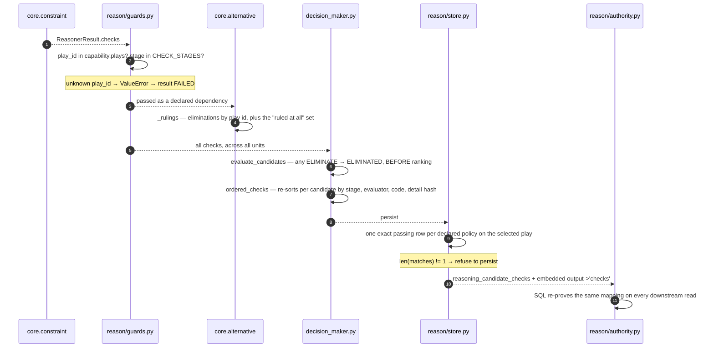

# 06 · Builder and Metrics

**Builder:** `genios_engine/reason/unit.py:ReasoningUnit.build` — **not overridden**
**Metrics:** `constraint.py:ConstraintUnit.publishes`
**Tests:** `test_the_gate_publishes_no_metrics`,
`test_declared_required_fields_never_leak_evidence_into_the_result`,
`test_identity_is_unchanged`, `test_the_registered_name_still_resolves_to_this_unit`

---

## 1 · What it is for

Stage 7 assembles the one object shape every unit returns, and stage 8 is the declaration of what
that object is allowed to publish. This unit uses the base builder unchanged and declares two metrics
it never emits.

---

## 2 · `build()` is the base implementation

`ConstraintUnit` does **not** override `build`. It runs this, from `unit.py`:

```python
def build(self, view: UnitView, verdict: Verdict,
          observations: Sequence[Observation]) -> ReasonerResult:
    evidence = set(view.evidence_ids)
    for observation in observations:
        evidence.update(observation.evidence_ids)
    return ReasonerResult(
        reasoner_id=self.unit_id,
        reasoner_version=self.version,
        status=ResultStatus.COMPLETED,
        matched=verdict.matched,
        metrics={name: clamp_bp(value) if name.endswith("_bp") else value
                 for name, value in verdict.metrics.items()},
        findings=verdict.findings,
        adjustments=verdict.adjustments,
        checks=verdict.checks,
        evidence_ids=tuple(sorted(evidence)),
        reason_codes=verdict.reason_codes,
    )
```

What each of its four behaviours does *for this unit specifically*:

| Base behaviour | Effect here |
|---|---|
| Unions `view.evidence_ids` with every observation's `evidence_ids` | both are empty on every run — `retrieve` returns a view with `evidence_ids=()` ([02](02-Retriever.md)) and all three plugins build `Observation`s without evidence — so the union is `set()` and `evidence_ids` is `()` |
| Clamps every `_bp`-suffixed metric through `common.py:clamp_bp` | no-op — `verdict.metrics` is empty ([04](04-Calculator.md)) |
| Stamps `reasoner_id` / `reasoner_version` from the class attributes | `"core.constraint"` / `"1.0.0"` — the same constants the plugins stamp on every row, so the result's identity and its rows' identity cannot drift apart |
| Hard-codes `status=ResultStatus.COMPLETED` | this unit can only ever return `COMPLETED` or raise. There is no code path to `INSUFFICIENT_CONTEXT` (validate is emptied) or to `SKIPPED` (which the orchestrator would convert to `FAILED` anyway) |

The reason the base is sufficient is that the base's only real work — evidence union and `_bp`
clamping — operates on two things this unit deliberately keeps empty. Overriding it would be
ceremony. `core.confidence` is the one unit in the roster that *does* override `build`, and it does so
to route around the `publishes` guard; nothing like that is needed here.

---

## 3 · What the ReasonerResult carries

For the `sales.deal_cooling` all-clear run:

```python
ReasonerResult(
    reasoner_id       = "core.constraint",
    reasoner_version  = "1.0.0",
    status            = ResultStatus.COMPLETED,
    matched           = None,
    metrics           = {},
    findings          = (),
    adjustments       = (),
    checks            = (18 CandidateCheck rows, in the unit's emission order),
    evidence_ids      = (),
    missing_fields    = (),
    reason_codes      = ("constraints_evaluated",),
    diagnostics       = {},          # set by the orchestrator on failure only
)
```

Five of the ten semantic fields are permanently empty for this unit — `metrics`, `findings`,
`adjustments`, `evidence_ids`, `missing_fields` — and `matched` is permanently `None`. Everything the
unit has to say is in `checks`.

### The check row

```python
CandidateCheck(
    play_id: str,             # which play — validated as an identifier
    stage: str,               # must be in guards.CHECK_STAGES
    outcome: CheckOutcome,    # PASS | ELIMINATE. The enum also carries WARN and ADJUST,
                              # which this unit never emits — a gate does not warn or nudge.
    reason_code: str,         # a different string for pass and for fail
    evaluator_id: str,        # "core.constraint", from CONSTRAINT_UNIT_ID
    evaluator_version: str,   # "1.0.0", from CONSTRAINT_UNIT_VERSION
    detail: Mapping[str, Any] = {},
    score_before_bp: int | None = None,   # never set by this unit
    score_after_bp:  int | None = None,   # never set by this unit
)
```

`guards.py:CHECK_STAGES` is a closed set: `precondition`, `constraint`, `policy`, `permission`,
`safety`, `cost_benefit`, `ranking`. This unit emits three of them — `policy`, `permission`,
`precondition`. It notably never emits `constraint`, despite being the constraint unit; the stage
names describe the *kind of rule*, not the unit that evaluated it.

The two score fields exist so a check can record a soft score adjustment. This unit leaves both
`None`, which is the structural expression of the same argument that keeps `calculate` empty: a gate
does not nudge a score.

### The complete reason-code vocabulary

Nine strings, and they are a frozen interface — `store.py` and `authority.py` both key on the four
passing ones by exact match.

| `reason_code` | Outcome | `stage` | Plugin |
|---|---|---|---|
| `read_only_policy_pass` | PASS | `policy` | `policy_enforcement` |
| `read_only_policy` | ELIMINATE | `policy` | `policy_enforcement` |
| `evidence_policy_pass` | PASS | `policy` | `policy_enforcement` |
| `evidence_required` | ELIMINATE | `policy` | `policy_enforcement` |
| `tenant_policy_block` | ELIMINATE | `policy` | `policy_enforcement` |
| `human_approval_boundary_pass` | PASS | `permission` | `permission_verification` |
| `human_approval_boundary_missing` | ELIMINATE | `permission` | `permission_verification` |
| `verified_recipient_guard_pass` | PASS | `permission` | `permission_verification` |
| `verified_recipient_guard_missing` | ELIMINATE | `permission` | `permission_verification` |
| `precondition_pass` | PASS | `precondition` | `precondition` |
| `precondition_failed` | ELIMINATE | `precondition` | `precondition` |

Plus one unit-level code on the result itself: `constraints_evaluated`.

---

## 4 · Evidence attachment: none

`result.evidence_ids == ()` on every run, asserted twice
(`test_the_gate_publishes_no_metrics` and
`test_declared_required_fields_never_leak_evidence_into_the_result`). The second test is the load-bearing
one: it constructs the exact conditions under which the base retriever *would* have attached a
citation — a declared `required_fields`, a present fact, and an `EvidenceRef` on that field — and
asserts both that nothing is cited and that the `semantic_hash` still matches the frozen legacy
reference.

The argument, from `retrieve`'s docstring:

> *"attaching evidence ids would add unproven provenance to a result whose entire value is that every
> part of it is independently re-provable."*

An evidence id on this result would be a claim nobody re-checks. `store.py` and `authority.py` prove
the *rows*; neither proves that a cited evidence item had anything to do with a check outcome. Adding
a citation would make the result look better sourced without making it any more provable — which is
the opposite of what this unit is for.

The one place evidence *is* reasoned about is `policy_enforcement`'s grounding fold, whose ids are
counted into `detail["used_evidence_count"]` and then discarded ([03b](03b-plugin-policy_enforcement.md) §3.2).

---

## 5 · `publishes` — two names, zero emissions

```python
publishes: tuple[str, ...] = ("constraint_check_count", "constraint_elimination_count")
```

| Metric | Meaning if it were ever emitted | Range | Emitted by v1.0.0 |
|---|---|---|---|
| `constraint_check_count` | total rows the gate produced this run | non-negative integer, unbounded; equals `Σ checks_emitted` over the three observations | **no** |
| `constraint_elimination_count` | how many of those rows were `ELIMINATE` | `0 ≤ n ≤ constraint_check_count`; equals `Σ eliminated` | **no** |

Neither is a basis-point metric, so neither would pass through `clamp_bp` in `build`. Both are counts,
and their natural ceiling is `plays × policies + Σ preconditions + |blocked_play_ids|` — for
`sales.deal_cooling`, `3 × 4 + 6 + 0 = 18`.

The stage-8 guard in `unit.py:evaluate`:

```python
undeclared = sorted(set(verdict.metrics) - set(self.publishes)) if self.publishes else []
if undeclared:
    raise ValueError(f"{self.unit_id} published undeclared metrics: {', '.join(undeclared)}")
```

For this unit `set(verdict.metrics)` is always empty, so the guard can never fire. It protects a
future version, not this one. Full argument in [04-Calculator](04-Calculator.md) §3.

The plugin observations do carry the counts and they die in `analyze()`'s return value — `calculate`
ignores its `observations` argument, `evaluate_meaning` ignores its own, and `build` reads only
`observation.evidence_ids`, which is empty. Nothing in the shipped path consumes them.

---

## 6 · Who consumes this result

**Nobody reads its metrics, because there are none.** Five consumers read its rows, in this order.



### 6.1 · `guards.py:validate_candidate_effects` — the kernel boundary

Runs inside `orchestrator._evaluate` immediately after the unit returns. Rejects any row whose
`play_id` is not in `capability.plays`, or whose `stage` is outside `CHECK_STAGES`. Any exception
becomes `ResultStatus.FAILED`. This is where the tenant-block gap bites —
[03b](03b-plugin-policy_enforcement.md) §6.

### 6.2 · `core.alternative` — the only unit that reads them

`alternative_unit.py:_rulings` folds every completed prior result's checks into two things:

```python
for _, result in sorted(view.prior.items()):
    if result.status != ResultStatus.COMPLETED:
        continue
    for check in result.checks:
        ruled.add(check.play_id)
        if check.outcome == CheckOutcome.ELIMINATE:
            eliminated.setdefault(check.play_id, set()).add(check.reason_code)
```

The second return value — the set of plays anyone ruled on at all — exists so that unit can
distinguish *"screened and clean"* from *"nobody looked"*:

> *"reporting an unscreened roster as fully viable would be exactly the fabrication Layer 4 exists to
> prevent."*

It is generic over prior results, not specific to `core.constraint`; in practice this unit is the
dominant source of rows. `sales.deal_cooling` declares seven reasoners — `core.temporal`,
`core.relationship`, `core.risk`, `core.constraint`, `core.priority`, `core.confidence`,
`core.planning` — and `core.alternative` is not among them, nor is it in `sales.deal_health`. So this
consumer is live only in `sales.deal_cooling_full` v2, which ships with
`live_delivery_enabled=False`.

### 6.3 · `decision_maker.evaluate_candidates` — the elimination

```python
play_checks = ordered_checks([item for item in checks if item.play_id == proposal.play.play_id])
eliminated = any(item.outcome == CheckOutcome.ELIMINATE for item in play_checks)
```

Runs **before** `rank_candidates`, and that order is the safety property:

> *"a play eliminated by policy never competes on score, so it can never win and then be quietly
> demoted."*

An eliminated candidate is not deleted. `rank_candidates` sorts eligible candidates by
`(-utility_bp, play_id)` and appends the eliminated ones, sorted by `play_id`, unranked — with the
checks that removed them attached. *"A rejection without its reason is indistinguishable from an
oversight."*

**Two different orders, for two different readers.** `decision_maker.ordered_checks` re-sorts a
candidate's checks by `(stage, evaluator_id, evaluator_version, reason_code, semantic_hash(detail))`.
That is the order in the *candidate's* audit rows. The unit's own emission order survives untouched in
the immutable `ReasonerResult`, which is what `store.py` and `authority.py` compare against. One order
grouped by claim for the auditor reading the gate; one grouped by stage for the auditor reading the
candidate.

### 6.4 · `store.py` — the persist-time proof

```python
_POLICY_CHECK_REQUIREMENTS: dict[str, tuple[str, str]] = {
    "read_only":               ("policy",     "read_only_policy_pass"),
    "human_approval_required": ("permission", "human_approval_boundary_pass"),
    "evidence_required":       ("policy",     "evidence_policy_pass"),
    "no_unverified_recipient": ("permission", "verified_recipient_guard_pass"),
}
```

For every policy the capability declared, the store counts rows on the **selected** candidate matching
all six of:

```text
candidate_id      == the selected candidate
stage             == the mapped stage
reason_code       == the mapped passing code
evaluator_id      == "core.constraint"
evaluator_version == the version the MANIFEST declared for core.constraint
outcome           == "pass"
```

`len(matches) != 1` → `ReasoningStoreError: selected play lacks one exact passing check for policy
<policy>`. Not `>= 1`: exactly one. A duplicate passing row is as fatal as none.

The `evaluator_version` comparison is why the plugins stamp rows from `CONSTRAINT_UNIT_VERSION` rather
than from `spec.version` — a unit that stamped rows with the manifest's declared version would be
comparing the manifest to itself.

### 6.5 · `authority.py` — the SQL re-proof on every read

`AUDITED_SIGNAL_PREDICATE` contains the same four pairs as a `CASE` expression:

```sql
and authority_policy_check.stage = case authority_policy.policy_id
      when 'read_only' then 'policy' when 'human_approval_required' then 'permission'
      when 'evidence_required' then 'policy' when 'no_unverified_recipient' then 'permission' end
and authority_policy_check.reason_code = case authority_policy.policy_id
      when 'read_only' then 'read_only_policy_pass'
      when 'human_approval_required' then 'human_approval_boundary_pass'
      when 'evidence_required' then 'evidence_policy_pass'
      when 'no_unverified_recipient' then 'verified_recipient_guard_pass' end
```

The same law, written twice on purpose — *"two independent callers proving the same law, so a forged
or drifted audit row cannot pass verification by satisfying a weaker copy of the rule."*

It additionally proves the persisted `reasoning_candidate_checks` rows are an exact index of the
constraint result's embedded `output->'checks'` in **both** directions: no persisted row without a
matching embedded one, and no embedded row without a matching persisted one. The stated threat model:
*"This prevents a forged pass row or a hidden elimination from becoming live authority even if child
tables are corrupted independently."*

The practical consequence for anyone maintaining this unit: **renaming one reason code is a
three-file, two-language change plus a replay break.** The Python constant, the SQL `CASE`, and every
persisted decision that already carries the old string.

---

## 7 · Identity and registration

```python
CONSTRAINT_UNIT_ID      = "core.constraint"
CONSTRAINT_UNIT_VERSION = "1.0.0"

ConstraintReasoner = ConstraintUnit          # the name the roster imports
```

The alias is not vestigial. From the module:

> *"Kept as the class's public identity because `reasoners/__init__.py`, the capability manifests, and
> the persisted traces all name it."*

`reasoners/__init__.py` registers `ConstraintReasoner` in `SITUATION_UNDERSTANDING`;
`test_the_registered_name_still_resolves_to_this_unit` asserts
`RegisteredConstraint is ConstraintUnit is ConstraintReasoner`.

`test_identity_is_unchanged` pins the four identity facts:
`unit_id == "core.constraint"`, `version == "1.0.0"`,
`category == UnitCategory.SITUATION_UNDERSTANDING`, and
`spec == ReasonerSpec("core.constraint", "1.0.0")`.

`__all__` exports the two constants, both class names, and the three plugin classes — the plugins are
public because the test suite exercises them in isolation, which is what the plugin seam is for.

---

## 8 · The migration contract

`tests/test_unit_constraint.py` carries a verbatim transcription of the pre-migration implementation
as `_LegacyConstraintReasoner`, and asserts `semantic_hash` equality across **21 parametrised
scenarios** — counted from `pytest --collect-only`, which reports 21 ids for
`test_migrated_unit_is_hash_identical_to_the_frozen_reference`. (The category README at
`../README.md` §3.2 says 25; that figure is wrong.) That is the strongest statement made about any
unit in the roster, and it is made because this unit's output is re-verified outside Layer 4:

> *"'the behaviour is the same' is not a claim that can be made by inspection."*

The frozen copy is deliberately not an import — the migration rewrote the module in place — and the
docstring argues the copy is better anyway: *"it keeps proving parity against the shipped semantics
rather than against whatever the module happens to say next month."*

**What this means for a maintainer:** any change to this unit that alters a row's `stage`, `outcome`,
`reason_code`, `evaluator_id`, `evaluator_version`, `detail` contents, or **position** will fail
`test_migrated_unit_is_hash_identical_to_the_frozen_reference` on at least one of the 21 scenarios. That
is not a test to update. It is a schema migration with a replay break attached, and it needs a version
bump on `CONSTRAINT_UNIT_VERSION`, a coordinated change in `store.py` and `authority.py`, and a
decision about every decision already persisted at `1.0.0`.

Verify with:

```
cd /Users/rohitswerashi/genios-brain && .venv/bin/python -m pytest tests/test_unit_constraint.py -q
45 passed
```
