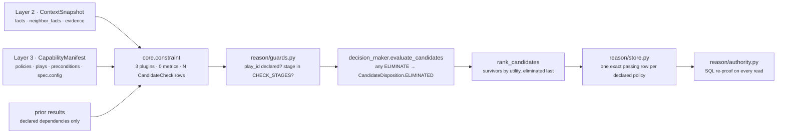
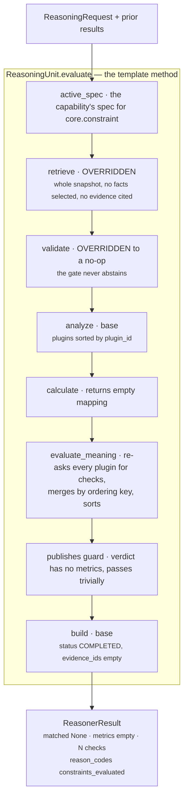

# `core.constraint` — the gate

**Module:** `genios_engine/reason/reasoners/constraint.py` (466 lines, 3 plugins)
**Tests:** `tests/test_unit_constraint.py` — 45 passing
**Identity:** `CONSTRAINT_UNIT_ID = "core.constraint"` · `CONSTRAINT_UNIT_VERSION = "1.0.0"`
**Category:** `UnitCategory.SITUATION_UNDERSTANDING`
**Registered as:** `reasoners/__init__.py:SITUATION_UNDERSTANDING` — `ConstraintReasoner`, an alias for `ConstraintUnit`

---

## 1 · What it is for

**The business question:** *for every play this capability declares, is that play still allowed to be
on the table — and if not, exactly which rule removed it?*

Every other unit in Layer 4 measures something: how late, how big, how risky. This one measures
nothing. It reads the policies the capability declared and the preconditions the play author wrote,
and emits one row per claim. An `ELIMINATE` row removes a candidate from the field **before ranking
ever runs**, so a blocked play can never win on score and then be quietly demoted.

Those rows are also the only Layer 4 output that is re-proved outside Layer 4. `reason/store.py`
refuses to persist a decision whose selected play does not carry exactly one passing row per declared
policy; `reason/authority.py` re-proves the same mapping in SQL on every downstream read. That is why
this unit's output shape is frozen harder than a metric is — from the module docstring:

> *"Changing one is not a refactor; it is a schema migration with a replay break attached."*

---

## 2 · Its place in the pipeline



The unit runs in the Situation Understanding stage alongside `core.context`, `core.timeline` and
`core.dependency`. Unlike those three it is **live in production**: `sales.deal_cooling` and
`sales.deal_health` both declare it, both with `FailurePolicy.REQUIRED`, and
`contracts/reasoning.py:CapabilityManifest.__post_init__` refuses to build a manifest that declares
any policy or any play precondition without a required `core.constraint`.

| Capability | Policies declared | Preconditions | `blocked_play_ids` |
|---|---|---|---|
| `sales.deal_cooling` v1 | all four | 2 per play, 3 plays | `()` |
| `sales.deal_health` | `read_only`, `human_approval_required`, `evidence_required` | none | not configured |
| `sales.deal_cooling_full` v2 | inherits v1's spec and policies verbatim | inherits | inherits |

---

## 3 · The plugins

Three seams, matching the three questions a gate actually asks, and matching the `stage` values the
two re-provers index on. `analyze()` runs them in `plugin_id` order, which is alphabetical — and
that is *not* the order the rows come out in (see §5).

| # | Plugin | `plugin_id` | `kind` | `stage` it stamps | Rows per run | Doc |
|---|---|---|---|---|---|---|
| 1 | `PermissionVerificationPlugin` | `permission_verification` | `constraint.permission` | `permission` | 0–2 per play | [03a](03a-plugin-permission_verification.md) |
| 2 | `PolicyEnforcementPlugin` | `policy_enforcement` | `constraint.policy` | `policy` | 0–2 per play, plus one per blocked id | [03b](03b-plugin-policy_enforcement.md) |
| 3 | `PreconditionPlugin` | `precondition` | `constraint.precondition` | `precondition` | one per authored condition per play | [03c](03c-plugin-precondition.md) |

Every plugin subclasses `constraint.py:_ConstraintPlugin`, whose real work is `checks()` — returning
`_KeyedCheck` tuples of `((group, index, slot, authored_index), CandidateCheck)`. `contribute()` is
derived from `checks()` and exists only to satisfy the framework's `AnalyzerPlugin` protocol.

### Published metrics

| Metric | Declared in `publishes` | Emitted by v1.0.0 | Range |
|---|---|---|---|
| `constraint_check_count` | yes | **no** | — |
| `constraint_elimination_count` | yes | **no** | — |

`publishes` is *a ceiling, not a promise*. `calculate()` returns `{}` and the shipped result carries
`metrics == {}`, asserted by `test_the_gate_publishes_no_metrics`. The names are reserved so no other
unit may claim them, and so that publishing a gate summary one day is a deliberate, version-bumped
change rather than a number that appears in the decision record by accident. Full argument in
[04-Calculator](04-Calculator.md).

The plugins *do* produce counts — `checks_emitted` and `eliminated` per plugin, on their
`Observation` — but those observations are consumed by nothing. `build()` reads only
`observation.evidence_ids`, which are empty here, so the counts never reach the result. They exist
for tests and traces. See [06-Builder-and-Metrics](06-Builder-and-Metrics.md).

---

## 4 · Internal flow



Note the shape that looks like duplication and is not: `analyze()` calls every plugin's
`contribute()`, which internally calls `checks()`; then `evaluate_meaning()` calls `checks()` again
directly. The observations are a byproduct the unit does not consume, and the second call is the one
whose rows become the result. Both calls are pure functions of the same frozen view, so they cannot
disagree — but a reader should know the plugins run twice per evaluation.

---

## 5 · Emission order — the property most easily broken

The row sequence is part of `ReasonerResult.semantic_hash`, so it cannot be a byproduct of which
plugin happened to run first. Each plugin stamps every row with an explicit four-part key and
`evaluate_meaning()` sorts on it.

```text
sort key = (group, index, slot, authored_index)

group 0  _GROUP_PLAY     rows about a declared play
group 1  _GROUP_TENANT   the tenant block list, always last

within group 0:
    index = the play's position in capability.plays          # declaration order
    slot  = 0  _SLOT_READ_ONLY        ← policy_enforcement
            1  _SLOT_HUMAN_APPROVAL   ← permission_verification
            2  _SLOT_EVIDENCE         ← policy_enforcement
            3  _SLOT_RECIPIENT        ← permission_verification
            4  _SLOT_PRECONDITION     ← precondition
    authored_index = the condition's index in play.preconditions, 0 for every other slot

within group 1:
    index = the id's position in config["blocked_play_ids"]
```

**Look at the slot column: the plugins interleave.** `policy_enforcement` owns slots 0 and 2,
`permission_verification` owns 1 and 3. No ordering of plugins can produce that sequence — which is
exactly why the order is a property of the *claim*, not of registration.
`test_emission_order_is_grouped_by_play_then_slot_then_authored_index` and
`test_tenant_blocks_are_emitted_after_every_play_row` pin both halves.

The slot order carries an argument of its own: capability-wide policy is asked before play-authored
preconditions, *"because 'this capability may not act at all' is a bigger statement than 'this play
needs a date'."* The tenant block list is last so the audit trail reads *"here is what the capability
decided, and here is what the tenant then removed"*.

---

## 6 · Configuration

The unit reads exactly **one** key out of `spec.config`.

| Config key | Where | Default | Type | Effect |
|---|---|---|---|---|
| `blocked_play_ids` | `ReasonerSpec.config` for `core.constraint` | `()` — via `config.get("blocked_play_ids") or ()` | sequence of ids | One unconditional `ELIMINATE` row per id, `reason_code = tenant_policy_block`, emitted last in authored order |

Everything else that steers this unit is authored elsewhere and is not tunable per deployment:

| Input | Source | Read by |
|---|---|---|
| `capability.policies` | `CapabilityManifest.policies`, sorted+deduped at construction | both policy plugins — decides which rows exist at all |
| `play.read_only` | `PlayDefinition.read_only` | `policy_enforcement`, `read_only` policy |
| `play.metadata["execution_boundary"]` | `PlayDefinition.metadata`, `.get()` | `permission_verification`, `human_approval_required` |
| `play.tags` | `PlayDefinition.tags` | `permission_verification` — the `human_approval` tag, second accepted spelling |
| `play.metadata["external_recipient_required"]` | `PlayDefinition.metadata`, **indexed, not `.get()`** | `permission_verification`, `no_unverified_recipient` |
| `play.preconditions` | `PlayDefinition.preconditions` | `precondition` (all of them) and `permission_verification` (recipient guards only) |
| `spec.required_fields` | `ReasonerSpec.required_fields` | **not read by this unit** — but read by `guards.py:required_missing` before the unit is called. See [01-Input-and-Validator](01-Input-and-Validator.md) §4 |

`SUPPORTED_CAPABILITY_POLICIES` is a closed set of four —
`read_only`, `human_approval_required`, `evidence_required`, `no_unverified_recipient` — enforced at
manifest construction, so this unit never has to handle an unknown policy name.

Module-level constants that behave as tuning but live in code, not config:

```python
_RECIPIENT_GUARD_SUFFIXES = (".verified_recipient", ".recipient_verified",
                             ".stakeholder_verified", "_stakeholder_verified")
_EQUALITY_OPERATORS = frozenset({"=", "==", "eq"})
```

---

## 7 · Silence semantics

The gate has no silent mode. This is the deliberate inversion at the heart of the unit:

| Situation | What this unit does |
|---|---|
| A declared policy the capability did not list | emits **nothing** for it — no row, not a passing row |
| A play with no preconditions | emits no precondition rows for that play |
| A capability with no policies and no preconditions | emits **zero rows** and still returns `COMPLETED` with `reason_codes=("constraints_evaluated",)` — the gate ran and found nothing to say |
| A missing precondition field | emits an `ELIMINATE` row naming the field — **not** an abstention |
| `blocked_play_ids` empty or absent | emits no tenant rows |
| A plugin with nothing to say | `contribute()` returns `()` — no zero-valued observation |

> *"A unit that returned INSUFFICIENT_CONTEXT here would silently drop the gate rather than close
> it."*

Never emitting a metric is the other half. Zero eliminations and three eliminations both produce
`metrics == {}`, because a scalar summary is a number a downstream unit could weigh, *"and weighing a
constraint is exactly how a hard block turns into a soft penalty."*

---

## 8 · Known gaps and compromises

Each is expanded in the file named.

| # | Gap | Where |
|---|---|---|
| 1 | The emptied `validate()` does not protect the gate through the orchestrator — `guards.py:required_missing` runs *first* and pre-empts the unit with `INSUFFICIENT_CONTEXT` and zero checks. Latent today because no shipped capability declares `required_fields` on this spec. **Verified by running the orchestrator.** | [01](01-Input-and-Validator.md) §4 |
| 2 | A tenant block on an id the capability no longer declares does not retire a play — it fails the whole run. `guards.py:validate_candidate_effects` raises `check references unknown play`, and `FailurePolicy.REQUIRED` turns that into no advice at all. **Verified end to end.** | [03b](03b-plugin-policy_enforcement.md) §6 |
| 3 | `verified_recipient_guard_pass` proves the play *declares* a guard, not that the guard *holds*. A play whose `contact.verified_recipient` is `False` still passes the permission row; the elimination arrives from the precondition row instead. The two-row split is intentional but the pass code reads stronger than it is. | [03a](03a-plugin-permission_verification.md) §5 |
| 4 | Every plugin runs twice per evaluation — once through `analyze()` for observations nothing consumes, once through `evaluate_meaning()` for the rows that matter. | §4 above, and [03-Analyzer](03-Analyzer.md) §4 |
| 5 | `_compare` raises on an unsupported operator, so one typo in one authored precondition fails the entire capability run rather than eliminating one play. Deliberate — an authoring fault must not hide behind a plausible elimination — but the blast radius is the whole capability. | [03c](03c-plugin-precondition.md) §7 |

---

## 9 · The files

| File | Covers |
|---|---|
| [01-Input-and-Validator.md](01-Input-and-Validator.md) | What arrives, `required_fields`, why `validate()` is emptied, and where that override is unreachable |
| [02-Retriever.md](02-Retriever.md) | Why `retrieve()` returns the whole snapshot and cites nothing |
| [03-Analyzer.md](03-Analyzer.md) | The plugin seam: composition, execution order, the `_KeyedCheck` contract, how the three interact |
| [03a-plugin-permission_verification.md](03a-plugin-permission_verification.md) | `human_approval_required` and `no_unverified_recipient` |
| [03b-plugin-policy_enforcement.md](03b-plugin-policy_enforcement.md) | `read_only`, `evidence_required`, and the tenant block list |
| [03c-plugin-precondition.md](03c-plugin-precondition.md) | The authored-condition evaluator and every operator |
| [04-Calculator.md](04-Calculator.md) | Why `calculate()` returns `{}` |
| [05-Evaluator.md](05-Evaluator.md) | `evaluate_meaning()` — the merge, the sort, and why `matched` is `None` |
| [06-Builder-and-Metrics.md](06-Builder-and-Metrics.md) | The base `build()`, the result's exact shape, and the five downstream consumers |

## Related

| Document | Covers |
|---|---|
| [../README.md](../README.md) | Category 1 as a whole; §4.4 is the summary this folder expands |
| [../../README.md](../../README.md) | The unit framework — the eight stages this unit overrides two of |
| [../../../_reference/Determinism-Audit-Replay.md](../../../_reference/Determinism-Audit-Replay.md) | `store.py` and `authority.py`, the two re-provers |
| [../../../03-Decision-Maker/README.md](../../../03-Decision-Maker/README.md) | How an `ELIMINATE` row removes a candidate before ranking |
