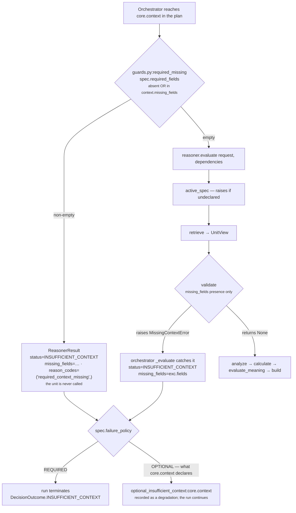

# 01 · Input and Validator

**Stages 1 and 2 of eight.** Neither is overridden. Both are the base-class implementations from
`genios_engine/reason/unit.py`.

---

## 1 · What it is for

Stage 1 is the contract for what the unit is handed. Stage 2 is the unit's one chance to say *"I
will not guess"* — to refuse inputs that cannot support a conclusion, so the orchestrator produces a
typed insufficient-context result rather than letting a fabricated answer through.

For `core.context` the answer to stage 2 turns out to be: **it never refuses.** That is correct for
what this unit does, and the reason is worth stating precisely, because the mechanism that makes it
true is accidental rather than declared — see §5.

---

## 2 · What exists

### 2.1 · The input pair

```python
# unit.py:ReasoningUnit.evaluate
def evaluate(self, request: ReasoningRequest,
             prior_results: Mapping[str, ReasonerResult]) -> ReasonerResult:
```

| Argument | Type | What the Context Unit actually reads from it |
|---|---|---|
| `request` | `contracts/reasoning.py:ReasoningRequest` | `capability.required_fields`, `capability.reasoners[*].required_fields`, `context.facts`, `context.neighbor_facts`, `context.missing_fields`, `context.evidence`, `evaluation_time` |
| `prior_results` | `Mapping[str, ReasonerResult]` | **nothing** — `view.prior` and `view.prior_metric` do not appear anywhere in `context_unit.py` |

`ReasoningRequest` is frozen and content-addressed: `request_id` is derived by
`stable_id("req", self.to_semantic_dict())` and re-derived on construction, so an id that does not
match its own bytes raises. `evaluation_time` is validated to equal `context.evaluation_time`. That
is what makes the Context Unit's freshness reading replayable — it is measured against an instant
frozen into the request, never against a clock.

**`prior_results` is always `{}` for this unit.** The orchestrator builds it as
`{item: prior[item] for item in spec.dependencies if item in prior}`, and `core.context`'s spec in
`sales.deal_cooling_full` declares `dependencies=()`. Nothing the unit sees depends on what ran
before it, which is why it can sit first in the plan.

### 2.2 · The spec lookup, before either stage

```python
# unit.py:ReasoningUnit.evaluate
spec = active_spec(request, self.unit_id)
```

```python
# reasoners/common.py
def active_spec(request, reasoner_id):
    for spec in request.capability.reasoners:
        if spec.reasoner_id == reasoner_id:
            return spec
    raise ValueError(f"capability does not declare reasoner {reasoner_id}")
```

A capability that runs `ContextUnit` without declaring `core.context` in its manifest raises before
any stage runs. In the orchestrated path this cannot happen — the registry resolves units *from*
the manifest — but it is what makes the unit safe to call directly from a test or a replay harness.

### 2.3 · The declared requirement

`required_fields` is a property of the **spec**, not of the unit class. `ReasoningUnit` has no
`required_fields` attribute at all; the base validator reads `view.spec.required_fields`.

| Where | Value | Effect |
|---|---|---|
| `ContextUnit` class body | *(no such attribute)* | the unit itself declares nothing |
| `deal_cooling_v2.py:_full_roster` → `_spec("core.context")` | `required_fields=()` | the validator has nothing to check |
| `tests/test_unit_context_unit.py:_request` | `ReasonerSpec("core.context", "1.0.0", config=...)` | same — every test runs with an empty requirement |

`ReasonerSpec.__post_init__` sorts and deduplicates `required_fields` at construction, so the order
a pack author types them in can never reach a result.

### 2.4 · The validator, verbatim

```python
# unit.py:ReasoningUnit.validate — NOT overridden by ContextUnit
def validate(self, view: UnitView) -> None:
    """Refuse inputs that cannot support a conclusion.

    The default enforces the unit's declared `required_fields`.  Raising `MissingContextError`
    is how a unit says "I will not guess" — the orchestrator turns it into a typed
    insufficient-context result instead of letting a fabricated answer through.
    """
    absent = missing_fields(view.request, view.spec.required_fields)
    if absent:
        raise MissingContextError(*absent)
```

```python
# reasoners/common.py:missing_fields
def missing_fields(request, fields):
    missing = []
    for field in fields:
        if field.startswith("neighbor:"):
            if field.split(":", 1)[1] not in request.context.neighbor_facts:
                missing.append(field)
        elif field not in request.context.facts:
            missing.append(field)
    return tuple(sorted(missing))
```

With `fields == ()` the loop body never executes, the result is `()`, and `validate` returns
`None`. **The Context Unit's validator is a no-op in every shipped and tested configuration.**

---

## 3 · How it works — the refusal path it never takes



Three properties of that path matter for this unit specifically.

**The orchestrator's check is stricter than the unit's, and runs first.**
`guards.py:required_missing` treats a field as missing when it is absent **or** when Layer 2
explicitly published it in `context.missing_fields`. The unit's `common.py:missing_fields` checks
presence only. In the orchestrated path the stricter one runs first, so the unit's own validator is
effectively unreachable — it matters only when the unit is invoked directly, which is exactly what
every test in `tests/test_unit_context_unit.py` does.

**`MissingContextError` carries the field names.** Its constructor is
`self.fields = tuple(sorted(set(fields)))`, and `orchestrator.py:_evaluate` copies them into
`ReasonerResult.missing_fields`. A refusal names what was missing rather than merely refusing.

**An INSUFFICIENT_CONTEXT result cannot carry anything else.**
`ReasonerResult.__post_init__` raises if a non-`COMPLETED` result carries `matched`, metrics,
findings, adjustments, checks or evidence ids. So a refusal from this unit would produce *no
reading at all* — no completeness, no freshness, no corroboration. That is the trap in §5.

---

## 4 · Examples and edge cases

### 4.1 · The normal case — nothing declared, nothing refused

```text
spec.required_fields = ()
context.facts        = {} or {…anything…}

missing_fields(request, ()) → ()
validate → None
analyze runs
```

`test_an_empty_snapshot_completes_with_no_fabricated_readings` is the boundary:

```text
request  facts={} · evidence=() · missing_fields=() · capability.required_fields=()
result   status = COMPLETED
         metrics = {}
         findings = ()
```

Knowing nothing is a legitimate, reportable state. Not a crash, not a set of zeroes, and — because
validate did not refuse — not an `INSUFFICIENT_CONTEXT` either. The distinction is load-bearing:
`INSUFFICIENT_CONTEXT` says *"I was asked for something I did not get"*; `COMPLETED` with empty
metrics says *"I looked and there was nothing to report"*.

### 4.2 · If a capability author declared a field on this spec

Not shipped anywhere, but nothing prevents it. Suppose a pack author writes
`_spec("core.context", required_fields=("deal.owner",))` and the snapshot has no `deal.owner`:

```text
missing_fields(request, ("deal.owner",)) → ("deal.owner",)
validate raises MissingContextError("deal.owner")
orchestrator → status=INSUFFICIENT_CONTEXT, missing_fields=("deal.owner",)
             → failure_policy=OPTIONAL, so: optional_insufficient_context:core.context
             → the run continues WITHOUT any context reading at all
```

The situation is thinner than expected, and the unit whose entire job is to report thin situations
has just gone silent about it. §5.

### 4.3 · A `neighbor:`-scoped requirement

`missing_fields` honours the prefix; the retriever does not. If a spec declared
`required_fields=("neighbor:account.tier",)`:

| Stage | Behaviour |
|---|---|
| `retrieve` | filters `neighbor:`-prefixed names out of `wanted`, so the fact never enters `view.facts` |
| `validate` | strips the prefix and checks `context.neighbor_facts`, so it passes if the neighbour fact is present |

A field can therefore be validated as present and still be invisible to the view. No shipped
capability declares a `neighbor:` requirement — the prefix appears in production only inside
`context.missing_fields`, generated by `adapters/native.py`, where `fact_coverage` picks it up as
part of the denominator. See [03b](03b-plugin-fact_coverage.md) §5.

### 4.4 · Undeclared capability

```text
ContextUnit().evaluate(request_without_core_context_in_manifest, {})
→ ValueError: capability does not declare reasoner core.context
```

In the orchestrated path this becomes a `FAILED` result with
`diagnostics={"exception_type": "ValueError", "message": …}`. `diagnostics` is
`compare=False, repr=False` and sits outside `to_semantic_dict`, so a failure message can never
move a decision hash.

---

## 5 · The compromise: the no-op validator is accidental, not declared

Two other units in the roster face exactly this problem and both solved it explicitly.

`core.confidence` overrides `validate` with an empty body and argues it directly:

> *"The default validator raises `MissingContextError` when a declared field is absent, which the
> orchestrator turns into an insufficient-context result. That would be exactly backwards here: the
> whole point of the completeness axis is to answer a thin snapshot with a low confidence rather
> than with silence… A confidence unit that declined to run on incomplete input would remove the
> only signal that the input was incomplete."*

`core.constraint` does the same for its gate:

> *"Thin context is the condition under which the gate matters most… Removing the gate because the
> room is dark is not fail-closed."*

**The identical argument applies verbatim to `core.context`, and it has not been applied.** This
unit inherits the refusing validator. It never fires today only because the one capability that
runs it happens to declare `required_fields=()` on that spec — a manifest fact, not a code
guarantee. The day someone adds a field to that spec, thinking they are documenting what the
context unit reads, the unit will start abstaining on exactly the snapshots it exists to describe.

The fix is three lines and matches two existing precedents:

```python
def validate(self, view: UnitView) -> None:
    """Never refuse. A missing field is this unit's subject matter, not an obstacle to it."""
```

It is not built. Recorded here rather than fixed because the module is under a hash-stability
regime and the change, while behaviour-preserving on every current manifest, is a unit-version
question rather than a doc question.

There is a second-order version of the same gap: **no test pins the no-op.**
`tests/test_unit_context_unit.py` has 28 tests carrying 63 assertions, and none of them constructs
a spec with `required_fields` set. The behaviour above is derived from reading `unit.py:validate` and
`common.py:missing_fields`, not from an executable contract.

---

## Related

| File | Covers |
|---|---|
| [README](README.md) | The unit's map, config table, and worked example |
| [02 · Retriever](02-Retriever.md) | Why the empty `required_fields` also empties the `UnitView` |
| [05 · Evaluator](05-Evaluator.md) | The other place a malformed input can raise, and why it raises lazily |
| [Part 2 · The Unit Framework](../../README.md) §4.1 | The full orchestrator boundary, and the two definitions of "missing" |
