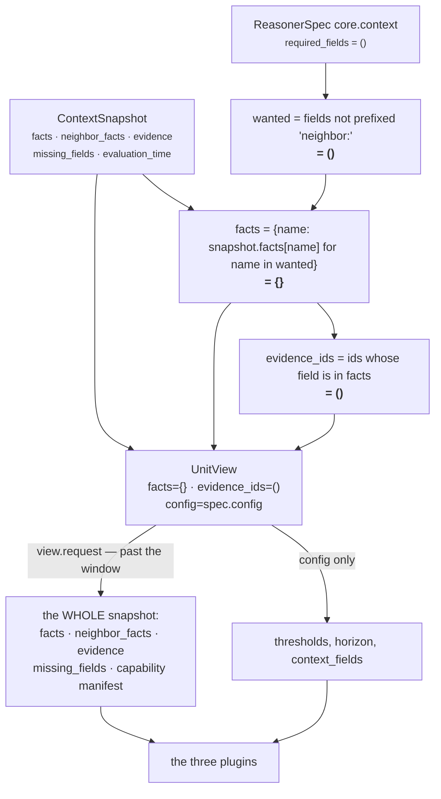

# 02 · Retriever

**Stage 3 of eight.** Not overridden. `ContextUnit` uses `unit.py:ReasoningUnit.retrieve` unchanged.

---

## 1 · What it is for

The Retriever selects the slice of the frozen snapshot this unit needs and shapes it into a
`UnitView` — the bounded window a reviewer can inspect to answer *"what was this unit allowed to
look at?"* without reading its body.

**It does not fetch.** From the framework docstring:

> *"Units are forbidden to touch a database, network, or clock — that is what makes a decision
> replayable months later. Retrieval already happened when Layer 2 froze the ContextSnapshot. So
> 'Retriever' here means select and shape from that frozen input, which is the only form of
> retrieval that can survive replay."*

For `core.context` the selection is empty, and the unit reads past the window it was given. That is
the substance of this file.

---

## 2 · What exists

### 2.1 · The base implementation, verbatim

```python
# unit.py:ReasoningUnit.retrieve — NOT overridden by ContextUnit
def retrieve(self, request: ReasoningRequest, spec: ReasonerSpec,
             prior: Mapping[str, ReasonerResult]) -> UnitView:
    """Select this unit's window on the frozen snapshot. Selection only — never IO."""
    wanted = tuple(field for field in spec.required_fields
                   if not field.startswith("neighbor:"))
    facts = {name: request.context.facts[name]
             for name in wanted if name in request.context.facts}
    evidence = tuple(sorted(item.evidence_id for item in request.context.evidence
                            if item.field in facts))
    return UnitView(request=request, spec=spec, prior=prior,
                    facts=MappingProxyType(facts), evidence_ids=evidence)
```

### 2.2 · The UnitView it produces here

`core.context`'s spec declares `required_fields=()` in every shipped manifest and in every test.
Substituting that in:

| Field | Type | Value for `core.context` |
|---|---|---|
| `request` | `ReasoningRequest` | the whole frozen request |
| `spec` | `ReasonerSpec` | `ReasonerSpec('core.context', '1.0.0', dependencies=(), required_fields=(), latency_budget_ms=60, failure_policy=OPTIONAL, config={})` |
| `prior` | `Mapping[str, ReasonerResult]` | `{}` — no declared dependencies |
| `facts` | `MappingProxyType` | **`{}`** — `wanted` is empty, so the dict comprehension yields nothing |
| `evidence_ids` | `tuple[str, ...]` | **`()`** — no field in `facts` means no evidence matches |

`UnitView` is `@dataclass(frozen=True, slots=True)`. It exposes one convenience property and one
method:

```python
@property
def config(self) -> Mapping[str, Any]:
    return self.spec.config

def prior_metric(self, reasoner_id: str, name: str, default: int = 0) -> int: ...
```

### 2.3 · What the unit actually reads

Every access to the view across all 310 lines of `context_unit.py`:

| Line | Expression | Used by |
|---|---|---|
| 46 | `view.config.get(key, default)` | `_config_bp` — `completeness_floor_bp`, `freshness_floor_bp` |
| 54 | `view.config.get(key, default)` | `_config_count` — `freshness_horizon_hours`, `min_corroboration` |
| 75 | `view.config.get("context_fields")` | `declared_fields` |
| 81 | `view.request.capability.required_fields` | `declared_fields` |
| 82 | `view.request.capability.reasoners` | `declared_fields` |
| 84 | `view.request.context.missing_fields` | `declared_fields` |
| 124 | `missing_fields(view.request, declared)` | `FactCoveragePlugin` |
| 135 | `evidence_ids(view.request, *present)` | `FactCoveragePlugin` |
| 156 | `view.request.evaluation_time` | `EvidenceFreshnessPlugin` |
| 159 | `view.request.context.evidence` | `EvidenceFreshnessPlugin` |
| 201 | `view.request.context.evidence` | `SourceCorroborationPlugin` |

`view.facts` is never read. `view.evidence_ids` is never read by the unit — only by
`unit.py:build`, where it seeds the evidence union with an empty set. `view.prior` and
`view.prior_metric` are never read.

---

## 3 · How it works — and why the window is empty



### 3.1 · Why an empty selection is the right shape for this unit

The base retriever selects *the fields the unit declared it needs*. That is the correct model for a
unit that reasons about a handful of named facts — `core.opportunity` reads `deal.last_inbound`,
`core.temporal` reads `derived.engagement` — because it makes the input surface auditable and it
makes the evidence citation automatic.

`core.context` does not reason about named facts. It reasons about **the shape of the snapshot as a
whole**: how many of the declared fields arrived, how old the newest of *any* evidence row is, how
many witnesses stand behind *every* field. A selection narrowed to a declared list would be a
window that lies about what the unit reads — the same argument `core.constraint` makes when it
overrides the stage:

> *"any narrowing here would be a window that lies about what the unit actually reads."*

The difference is that `core.constraint` overrode `retrieve` to return the whole snapshot
explicitly, with a docstring saying so. `core.context` gets the same effect by declaring nothing and
then reading `view.request` anyway. Both units end up reading everything; only one says so.

### 3.2 · Which facts and evidence ids land in the UnitView

None. That is the honest answer, and it has one concrete consequence downstream.

`unit.py:build` assembles the result's evidence set as:

```python
evidence = set(view.evidence_ids)          # empty for core.context
for observation in observations:
    evidence.update(observation.evidence_ids)
```

So **every evidence id on a `core.context` result comes from a plugin's own citation**, never from
the retriever. Three plugins cite three different things:

| Plugin | Cites | Rule |
|---|---|---|
| `fact_coverage` | `evidence_ids(request, *present)` — every row whose field is a present declared field | breadth: what the coverage claim rests on |
| `evidence_freshness` | `cited[:1]` — one row at the newest instant | a single representative, not the set |
| `source_corroboration` | `citations[best]` — every row on the best-corroborated field | the field the count is about |

`guards.py:validate_evidence_references` re-checks at the orchestrator boundary that every cited id
exists in `request.context.evidence`. Since all three plugins draw their ids from that same tuple,
this can only fail if the snapshot itself is inconsistent.

---

## 4 · Examples and edge cases

### 4.1 · The shipped configuration

```text
spec.required_fields = ()
snapshot.facts       = {deal.status, deal.value, derived.engagement, thread.last_inbound}
snapshot.evidence    = 5 rows

view.facts       = {}          # ← nothing selected
view.evidence_ids = ()         # ← nothing cited by the retriever
result.evidence_ids = ('ev_crm_status','ev_crm_value','ev_eng','ev_mail_status','ev_thread')
                               # ← all five, contributed by the plugins
```

The result cites more evidence than the view contains. That inversion is unique to this unit among
the four in Category 1 and is a direct consequence of the empty selection.

### 4.2 · If the spec did declare fields

Suppose `_spec("core.context", required_fields=("deal.status",))` and the snapshot has
`deal.status` with two evidence rows `ev_a`, `ev_b`:

```text
wanted           = ('deal.status',)
view.facts       = {'deal.status': {...}}
view.evidence_ids = ('ev_a', 'ev_b')
```

Nothing in the unit's arithmetic would change — no plugin reads `view.facts`, and the two ids would
already have been cited by `fact_coverage` and `source_corroboration`. The only effect would be on
`build`'s union, which is idempotent over ids already present. So declaring fields on this spec
changes the validator's behaviour (see [01](01-Input-and-Validator.md) §5) and nothing else.

### 4.3 · The `context_scope` filter that is not applied

`EvidenceRef` carries `context_scope` of `"root"` or `"neighbor"`. The base retriever matches only
on `item.field in facts` and ignores the scope entirely.

For `core.context` this is not a latent bug the way it is for other units, because the retriever
selects nothing — but the same blindness reappears one level down. `EvidenceFreshnessPlugin` and
`SourceCorroborationPlugin` iterate `view.request.context.evidence` in full, so **neighbour-scoped
evidence counts toward `dated_evidence_count`, `freshness_bp`, `evidenced_field_count` and the
witness tally**. Verified:

```text
facts          = {deal.status: open}
neighbor_facts = {account.tier: gold}
evidence       = ev_r (deal.status, root, group crm)
                 ev_n (account.tier, neighbor, group crm)

source_corroboration → evidenced_field_count = 2
                       single_sourced_field_count = 2
```

That is arguably correct — a neighbour fact is still something the system knows, and its age is
still information about how current the picture is. It is undocumented in the module, so record it
as a behaviour rather than a decision: the unit's readings are over the whole snapshot, root and
neighbourhood alike.

`fact_coverage` behaves differently, because it cites through `common.py:evidence_ids`, which
matches on field name without regard to scope. A neighbour-scoped row whose field name collides
with a selected root field would be cited as though the unit had observed it at the root. No
shipped capability has a colliding name; it is a one-line fix waiting for the first one that does.

### 4.4 · What replay guarantees

`retrieve` performs a dict comprehension and a `sorted()` over an immutable snapshot. It reads no
clock, opens no connection, and cannot fail on data a later stage would reject. That is why
`evaluate` inverts the spec's stated Validator → Retriever order and runs `retrieve` first:
building the view is what turns a raw request into the bounded object the validator reasons about,
and validating afterwards is strictly the same decision made with more information in hand.

---

## Related

| File | Covers |
|---|---|
| [README](README.md) | The unit's map and the internal-flow diagram |
| [01 · Input and Validator](01-Input-and-Validator.md) | Why `required_fields=()` and what it costs |
| [03 · Analyzer](03-Analyzer.md) | What the plugins do with `view.request` once they have it |
| [06 · Builder and Metrics](06-Builder-and-Metrics.md) | The evidence union, and the guard that re-checks every citation |
| [Part 2 · The Unit Framework](../../README.md) §3.1 | The three consequences of selection-not-fetching, across the whole roster |
