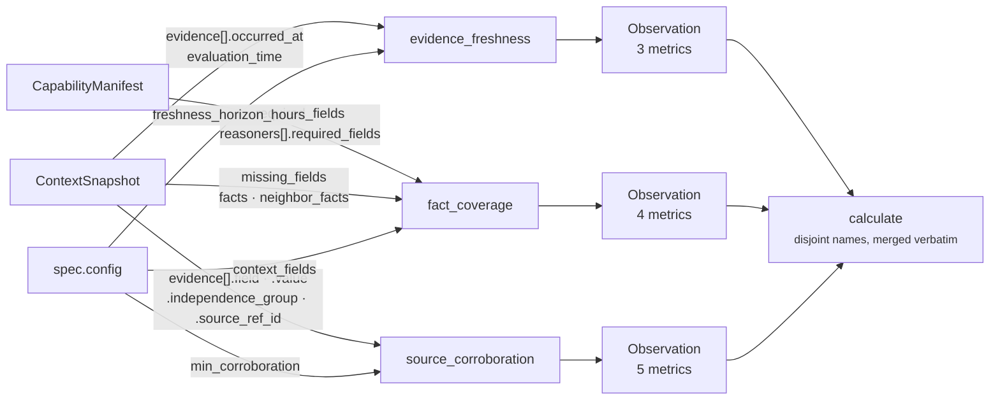

# 03 · Analyzer — the plugin seam

**Stage 4 of eight.** Not overridden. `ContextUnit` uses `unit.py:ReasoningUnit.analyze` unchanged.

---

## 1 · What it is for

The Analyzer is where this unit's intellectual property lives. The framework's demand is that a
unit compose small deterministic contributions rather than hide a monolith:

> *"Risk is not one algorithm. It is time decay plus revenue exposure plus relationship health plus
> policy — each a small deterministic contribution that can be tested, tuned, and versioned alone.
> A unit composes plugins; it does not hide a monolith."*

For `core.context` the decomposition is not an implementation convenience — it *is* the argument.
Completeness, freshness and corroboration are three different facts about the world. The unit
refuses to blend them ([04 · Calculator](04-Calculator.md)), and the only way to keep them apart
end to end is to have three separate authors of three separate claims, each free to say nothing.

---

## 2 · What exists

### 2.1 · Registration

```python
# context_unit.py:ContextUnit
plugins = (FactCoveragePlugin(), EvidenceFreshnessPlugin(), SourceCorroborationPlugin())
```

`ReasoningUnit.__init__` rejects a duplicate `plugin_id` at construction:

```python
seen = [plugin.plugin_id for plugin in self.plugins]
if len(seen) != len(set(seen)):
    raise ValueError(f"{self.unit_id} registers a duplicate analyzer plugin")
```

That check exists because `analyze` sorts on `plugin_id`; a duplicate would make the sort ambiguous
and every hash below it ambiguous with it.

### 2.2 · The base analyzer, verbatim

```python
# unit.py:ReasoningUnit.analyze — NOT overridden
def analyze(self, view: UnitView) -> tuple[Observation, ...]:
    """Run every plugin and collect partial evidence.

    Sorted by plugin id so the observation order — and therefore every hash downstream of it —
    is a property of the unit's composition, not of registration order.
    """
    observations: list[Observation] = []
    for plugin in sorted(self.plugins, key=lambda item: item.plugin_id):
        observations.extend(plugin.contribute(view))
    return tuple(observations)
```

### 2.3 · Execution order

Registration order and execution order differ. `analyze` sorts alphabetically by `plugin_id`:

| Registration order | Execution order (`plugin_id` sorted) |
|---|---|
| 1. `FactCoveragePlugin` (`fact_coverage`) | 1. `evidence_freshness` |
| 2. `EvidenceFreshnessPlugin` (`evidence_freshness`) | 2. `fact_coverage` |
| 3. `SourceCorroborationPlugin` (`source_corroboration`) | 3. `source_corroboration` |

This is observable. `evaluate_meaning` builds findings in the same sorted order, and
`test_every_reading_is_written_down_even_when_it_is_unflattering` asserts it:

```python
assert [item.finding_id for item in findings] == [
    "context.evidence_freshness", "context.fact_coverage", "context.source_corroboration"]
```

Alphabetical order looks arbitrary until you consider the alternative: registration order is
whatever the class body happened to say the day someone added a plugin, and findings order reaches
`ReasonerResult.semantic_hash`. A sort on a stable identifier makes the hash a property of *which*
plugins the unit composes rather than of *how they were typed*.

### 2.4 · What each plugin contributes

| `plugin_id` | Observation `kind` | Metrics | Cites | Reason codes |
|---|---|---|---|---|
| `evidence_freshness` | `context.evidence_freshness` | `freshness_bp`, `evidence_age_hours`, `dated_evidence_count` | one row at the newest instant | `context_evidence_dated` |
| `fact_coverage` | `context.fact_coverage` | `completeness_bp`, `declared_field_count`, `known_field_count`, `missing_field_count` | every row on a present declared field | `context_fields_absent` or `context_fields_all_present` |
| `source_corroboration` | `context.source_corroboration` | `corroboration_count`, `corroborated_field_count`, `single_sourced_field_count`, `evidenced_field_count`, `conflict_count` | every row on the best-corroborated field | `context_sources_conflict` or `context_sources_agree` |

Each returns either a one-element tuple or `()`. No plugin in this unit ever returns two
observations.

### 2.5 · What an Observation is allowed to say

`unit.py:Observation` is `frozen=True, slots=True` and normalises itself in `__post_init__`:

```python
for name, value in self.metrics.items():
    if isinstance(value, bool) or not isinstance(value, int):
        raise ValueError(f"observation metric {name} must be an integer")
object.__setattr__(self, "metrics", MappingProxyType(dict(self.metrics)))
object.__setattr__(self, "evidence_ids", tuple(sorted(set(self.evidence_ids))))
object.__setattr__(self, "reason_codes", tuple(sorted(set(self.reason_codes))))
```

Three consequences for this unit:

- **Integers only, `bool` explicitly rejected.** `isinstance(True, int)` is `True` in Python, and a
  boolean masquerading as a metric is exactly the accident that reaches a ranking formula. Every
  metric here is a count or a basis-point value, so none is tempted.
- **Evidence ids and reason codes are deduplicated and sorted at construction.** The plugins do not
  need to sort their citations for determinism — though `source_corroboration` sorts its input
  anyway, for a different reason (§4.2).
- **Partial by contract.** An Observation is never a conclusion. It says *"three of five declared
  fields are present"*, never *"the context is inadequate"*.

---

## 3 · How the three claims compose

### 3.1 · They do not

The seam here is unusually clean, and it is worth being explicit about how little coupling there is:



| Property | Status |
|---|---|
| Does any plugin read another's Observation? | No. `contribute(view)` receives only the view. |
| Do any two share a metric name? | No. 3 + 4 + 5 = 12 distinct names. |
| Do any two share a config key? | No. |
| Do any two read the same snapshot field? | Only `context.evidence`, and for different properties: freshness reads `occurred_at`, corroboration reads `field`/`value`/`independence_group`. |
| Can one plugin's silence change another's numbers? | No. |

That independence is what licenses the Calculator to be a merge rather than a formula. If the
plugins interacted, republishing them verbatim would be publishing a partial computation.

### 3.2 · The one shared value

`min_corroboration` is read twice: by `SourceCorroborationPlugin.contribute` for
`corroborated_field_count`, and by `evaluate_meaning` for the `context_corroborated` reason code.

```python
# in the plugin
corroborated = sum(1 for groups in witnesses.values() if len(groups) >= minimum)

# in the evaluator
codes.add("context_corroborated"
          if corroboration >= _config_count(view, "min_corroboration", 2)
          else "context_single_sourced")
```

Same key, same default, so the count and the code can never disagree about where the bar is. They
measure different things against it: the plugin counts *how many fields* clear the bar, the
evaluator asks whether *the best-corroborated field* clears it. Because `best` is by definition the
field with the most witnesses, the two are linked in one direction only and the link always holds:

```text
context_corroborated  ⟺  corroboration_count >= min_corroboration
                      ⟺  corroborated_field_count >= 1
```

The reverse framing — inferring the count from the code — is safe here for exactly that reason, but
it is a coincidence of `best` being a maximum, not a contract. A future plugin that picked a
different representative field would break it silently.

### 3.3 · Silence combinations

Each plugin has its own independent silence condition, so a run can produce 0, 1, 2 or 3
observations. Six of the eight combinations are reachable; two are not, because dated evidence is
evidence:

| `fact_coverage` | `evidence_freshness` | `source_corroboration` | Metrics | Situation |
|---|---|---|---|---|
| silent | silent | silent | 0 | empty snapshot, capability declared nothing |
| speaks | silent | silent | 4 | declarations present, no evidence rows at all |
| silent | silent | speaks | 5 | evidence present but all undated or future-dated; nothing declared |
| speaks | silent | speaks | 9 | the same, with declarations |
| silent | speaks | speaks | 8 | dated evidence, nothing declared |
| speaks | speaks | speaks | 12 | the full reading |
| *silent* | *speaks* | *silent* | — | **unreachable** — freshness requires a dated row, which is a row |
| *speaks* | *speaks* | *silent* | — | **unreachable**, same reason |

A consumer must therefore treat every one of the twelve metrics as optional. `metrics.get(name)`
returning `None` means *nobody looked or nobody could look*, and that is a different claim from any
value the metric could carry.

---

## 4 · Determinism inside the seam

Three sorts, each load-bearing for a different reason.

### 4.1 · `analyze` sorts plugins

Discussed in §2.3. Fixes the findings order, which is inside `ReasonerResult.semantic_hash`.

### 4.2 · `source_corroboration` sorts its evidence input

```python
for item in sorted(view.request.context.evidence, key=lambda ref: ref.evidence_id):
```

The comment states the purpose: *"Sorted so neither the grouping nor the cited evidence depends on
snapshot iteration order."* This is belt-and-braces —
`ContextSnapshot.__post_init__` already sorts `evidence` by `evidence_id` at construction:

```python
object.__setattr__(self, "evidence", tuple(sorted(self.evidence, key=lambda item: item.evidence_id)))
```

So the plugin's sort is redundant against the shipped contract. It is cheap, it documents the
requirement at the point of use, and it keeps the plugin correct if it is ever handed a hand-built
tuple in a test. Recorded as redundancy, not as a defect.

### 4.3 · `source_corroboration` picks its best field deterministically

```python
best = min(witnesses, key=lambda name: (-len(witnesses[name]), name))
```

Most witnesses first, field name as the tie-break — never dict insertion order. Detailed in
[03c](03c-plugin-source_corroboration.md) §3.3.

### 4.4 · What the framework guarantees on top

`Observation.__post_init__` sorts `evidence_ids` and `reason_codes`. `unit.py:build` sorts the
evidence union. `Finding.__post_init__` sorts both again. `ReasonerResult.__post_init__` sorts
`reason_codes` and `evidence_ids` a third time. Five layers of sorting over the same values, which
looks like paranoia until you notice each is enforced by a different frozen dataclass and none of
them trusts its caller.

`test_the_same_snapshot_reasoned_twice_yields_identical_metrics` closes the loop by asserting
`first.semantic_hash == second.semantic_hash` on two independent evaluations of one request.

---

## 5 · Examples and edge cases

### 5.1 · All three speak

The [README](README.md) §6 worked example, on the real `sales.deal_cooling_full` manifest:

```text
observations, in analyze order
  1  context.evidence_freshness    {freshness_bp: 0, evidence_age_hours: 288, dated_evidence_count: 4}
                                   cites ev_mail_status
  2  context.fact_coverage         {completeness_bp: 8000, declared_field_count: 5,
                                    known_field_count: 4, missing_field_count: 1}
                                   cites ev_crm_status, ev_crm_value, ev_eng, ev_mail_status, ev_thread
  3  context.source_corroboration  {corroboration_count: 2, corroborated_field_count: 1,
                                    single_sourced_field_count: 3, evidenced_field_count: 4,
                                    conflict_count: 0}
                                   cites ev_crm_status, ev_mail_status
```

Three observations, twelve metrics, no overlap, and three different citation sets over the same
five rows.

### 5.2 · Two speak, one is silent

`test_undated_evidence_produces_no_freshness_claim_rather_than_a_zero`:

```text
facts    = {deal.status: open}
evidence = (EvidenceRef("ev_1", "deal.status", "open"),)     # no occurred_at
required = ()                                                # nothing declared

evidence_freshness   → ()      # no dated row
fact_coverage        → ()      # declared_fields is empty
source_corroboration → 1 observation, 5 metrics

result.metrics = {corroboration_count: 1, corroborated_field_count: 0,
                  single_sourced_field_count: 1, evidenced_field_count: 1, conflict_count: 0}
"freshness_bp" not in result.metrics
```

The absent key is the claim. A `freshness_bp: 0` here would read downstream as *"we checked, and it
is stale"* — a much stronger statement than *"we do not know how old this is"*.

### 5.3 · All three are silent

`test_an_empty_snapshot_completes_with_no_fabricated_readings`:

```text
observations = ()
metrics      = {}
findings     = ()
reason_codes = ()
matched      = None
status       = COMPLETED
```

`analyze` returning an empty tuple is not an error condition. It flows through `calculate` (empty
loop, empty dict), through `evaluate_meaning` (no metric is not `None`, so no threshold code is
added; the findings comprehension is empty), and through the `publishes` guard, which computes
`set({}) - set(publishes) = ∅`.

### 5.4 · Adding a fourth plugin

The seam is open — `AnalyzerPlugin` is a `runtime_checkable` Protocol requiring only `plugin_id` and
`contribute(view)`. Two things would catch a careless addition:

```text
duplicate plugin_id  → ValueError at ContextUnit() construction
undeclared metric    → ValueError: core.context published undeclared metrics: <name>
                       raised by evaluate() between evaluate_meaning and build
```

The second is the one that matters. A fourth plugin emitting, say, `context_quality_bp` would fail
on its first test run rather than six months later when something downstream started reading a
number nobody knew was moving.

What would *not* be caught: a fourth plugin that reads one of the other three's inputs and produces
a correlated claim. The independence in §3.1 is a property of the current composition, not an
invariant the framework enforces.

---

## Related

| File | Covers |
|---|---|
| [README](README.md) | The plugin table, published metrics, config keys |
| [03a · `evidence_freshness`](03a-plugin-evidence_freshness.md) | First in execution order |
| [03b · `fact_coverage`](03b-plugin-fact_coverage.md) | Second |
| [03c · `source_corroboration`](03c-plugin-source_corroboration.md) | Third |
| [04 · Calculator](04-Calculator.md) | Why disjoint metric names let the merge be verbatim |
| [Part 2 · The Unit Framework](../../README.md) §4.2 | Why plugins, and what an Observation may say, across the roster |
