# 06 · Builder and Metrics

**Stages 7 and 8 of eight.** Neither is overridden. `ContextUnit` uses `unit.py:ReasoningUnit.build`
unchanged, and stage 8 is a class attribute plus a guard inside `evaluate()`.

**Source:** `genios_engine/reason/reasoners/context_unit.py:ContextUnit.publishes` ·
`genios_engine/reason/unit.py:ReasoningUnit.build` ·
`genios_engine/reason/unit.py:ReasoningUnit.evaluate` (the guard)

---

## 1 · What it is for

Stage 7 turns the Verdict into the one object shape every unit in Layer 4 returns, so a consumer
can read a `core.context` result with exactly the same code it reads a `core.risk` result.

Stage 8 is the declaration: the list of metric names this unit is *allowed* to publish, written in
the class body rather than discovered from what a run happened to emit. The declaration is the
safety mechanism — the framework refuses a run that emits anything not on the list, which is how a
shared number like `confidence_bp` is prevented from acquiring a second author by accident.

For this unit both stages are the base implementations. That is worth saying explicitly rather than
leaving to inference: **`ContextUnit` defines no `build`, and defines no `publishes` logic beyond
the tuple.** The whole of stages 7 and 8 for `core.context` is twelve strings and one inherited
method.

---

## 2 · What exists

### 2.1 · The Builder, verbatim

```python
# unit.py:ReasoningUnit.build — NOT overridden by ContextUnit
def build(self, view: UnitView, verdict: Verdict,
          observations: Sequence[Observation]) -> ReasonerResult:
    """Assemble the one object shape every unit returns."""
    evidence = set(view.evidence_ids)
    for observation in observations:
        evidence.update(observation.evidence_ids)
    return ReasonerResult(
        reasoner_id=self.unit_id,
        reasoner_version=self.version,
        status=ResultStatus.COMPLETED,
        matched=verdict.matched,
        metrics={name: clamp_bp(value) if name.endswith("_bp") else value
                 for name, value in verdict.metrics.items()},
        findings=verdict.findings,
        adjustments=verdict.adjustments,
        checks=verdict.checks,
        evidence_ids=tuple(sorted(evidence)),
        reason_codes=verdict.reason_codes,
    )
```

Substituting what this unit actually supplies:

| `ReasonerResult` field | Value on a `core.context` result | Where it came from |
|---|---|---|
| `reasoner_id` | `"core.context"` | the class attribute |
| `reasoner_version` | `"1.0.0"` | the class attribute |
| `status` | always `ResultStatus.COMPLETED` | hard-coded in `build`; a non-completed result can only be produced by the orchestrator's boundary, never by this method |
| `matched` | always `None` | `Verdict.matched`, §3.3 |
| `metrics` | 0, 4, 5, 8, 9 or 12 integers | the Calculator's merge, re-clamped on the two `_bp` names |
| `findings` | 0 to 3 `Finding` objects, `plugin_id`-sorted | `evaluate_meaning` |
| `adjustments` | always `()` | the `Verdict` default; this unit never sets it |
| `checks` | always `()` | the `Verdict` default; this unit never sets it |
| `evidence_ids` | union of the plugins' citations, sorted | §3.1 — `view.evidence_ids` is empty for this unit |
| `missing_fields` | always `()` | not a `build` argument at all; only the orchestrator's `MissingContextError` path sets it |
| `reason_codes` | 0 to 6 strings, sorted | `evaluate_meaning` |
| `diagnostics` | always `{}` | only the orchestrator's failure path sets it |

`ReasonerResult` is a frozen dataclass. Its `__post_init__` sorts and deduplicates `evidence_ids`,
`missing_fields` and `reason_codes` again, and runs `contracts/reasoning.py:_bp` over every
`_bp`-suffixed metric — so a `completeness_bp` outside `0..10_000` would raise at the contract
layer even if `clamp_bp` had somehow been bypassed. Three independent guards on the same two
numbers.

### 2.2 · The declaration — stage 8

```python
# context_unit.py:ContextUnit
publishes = (
    "completeness_bp", "declared_field_count", "known_field_count", "missing_field_count",
    "freshness_bp", "evidence_age_hours", "dated_evidence_count",
    "corroboration_count", "corroborated_field_count", "single_sourced_field_count",
    "evidenced_field_count", "conflict_count",
)
```

Twelve names, grouped in the source by their producing plugin — coverage, freshness,
corroboration — rather than alphabetically. Two end in `_bp` and are basis points, integers
`0..10_000` where `7,500bp` means 0.75. The other ten are raw counts with no upper bound.

| Metric | Range when present | Meaning | Producer | Present when |
|---|---|---|---|---|
| `completeness_bp` | 0–10,000 | Share of the declared facts that actually arrived | `fact_coverage` | something declared a field set |
| `declared_field_count` | ≥ 1 | Size of the completeness denominator | `fact_coverage` | ″ |
| `known_field_count` | 0 … declared | How many of them are in the snapshot | `fact_coverage` | ″ |
| `missing_field_count` | 0 … declared | How many are not | `fact_coverage` | ″ |
| `freshness_bp` | 0–10,000 | Linear decay of the **newest** dated evidence across the horizon | `evidence_freshness` | at least one evidence row is dated at or before `evaluation_time` |
| `evidence_age_hours` | ≥ 0, **uncapped** | Whole hours since that newest row, truncated | `evidence_freshness` | ″ |
| `dated_evidence_count` | ≥ 1 | Evidence rows carrying a usable `occurred_at` | `evidence_freshness` | ″ |
| `corroboration_count` | ≥ 1 | Independent witnesses behind the **best-corroborated single field** | `source_corroboration` | the snapshot carries at least one evidence row |
| `corroborated_field_count` | ≥ 0 | Fields with at least `min_corroboration` witnesses | `source_corroboration` | ″ |
| `single_sourced_field_count` | ≥ 0 | Fields resting on exactly one witness | `source_corroboration` | ″ |
| `evidenced_field_count` | ≥ 1 | Distinct fields any evidence row speaks to | `source_corroboration` | ″ |
| `conflict_count` | ≥ 0 | Fields where independent witnesses cite different values | `source_corroboration` | ″ |

Three lower bounds in that table are `≥ 1` rather than `≥ 0`, and each is a consequence of a
silence guard rather than of arithmetic: `declared_field_count` cannot be 0 because
`fact_coverage` returns `()` on an empty denominator; `dated_evidence_count` and
`evidenced_field_count` cannot be 0 because their plugins return `()` on an empty input.
**A zero in those three names is unreachable, and that is the design.**

`corroboration_count ≥ 1` has the same shape but a sharper reading: it is a *single field's* witness
count presented as the unit's headline corroboration number. See
[03c](03c-plugin-source_corroboration.md) §3.3 for why `single_sourced_field_count` is published
beside it as the corrective.

### 2.3 · The guard, and where it sits

```python
# unit.py:ReasoningUnit.evaluate — between evaluate_meaning and build
undeclared = sorted(set(verdict.metrics) - set(self.publishes)) if self.publishes else []
if undeclared:
    raise ValueError(f"{self.unit_id} published undeclared metrics: {', '.join(undeclared)}")
return self.build(view, verdict, observations)
```

The guard runs **before** `build`, not inside it. A unit that published an undeclared metric would
still produce a well-formed `ReasonerResult`; refusing before that object exists makes the failure
read as *"this unit is misdeclared"* rather than *"this result contains something surprising"*.

The `if self.publishes else []` clause is an escape hatch for a unit with an empty tuple.
`core.context` declares twelve names, so it is fully guarded — the hatch is documented at
[Part 2 · The Unit Framework](../../README.md) §3.4 for the units it does affect.

---

## 3 · How it works

### 3.1 · The evidence union — the only thing this unit actually pushes downstream

```mermaid
flowchart TD
    VW["UnitView.evidence_ids<br/><small>empty — required_fields is empty,<br/>so the retriever selected nothing</small>"]

    subgraph OBS["observations, each with its own citation rule"]
        direction TB
        EF["evidence_freshness<br/><small>one row at the newest instant, lowest id wins</small>"]
        FC["fact_coverage<br/><small>every row whose field is a present declared field</small>"]
        SC["source_corroboration<br/><small>every row on the best-corroborated field</small>"]
    end

    VW --> U["build: set union, then sorted"]
    EF --> U
    FC --> U
    SC --> U

    U --> RES["ReasonerResult.evidence_ids"]
    RES --> G["guards.py:validate_evidence_references<br/><small>every id must exist in the frozen snapshot</small>"]
    G --> AGG["decision_maker.py:aggregate_evidence<br/><small>union across ALL results, incl. their findings</small>"]
    AGG --> CAND["every DecisionCandidate.evidence_ids"]
    CAND --> EXEC["executive/interpret.py<br/>ExecutionContext.evidence_ids"]
    EXEC --> CARD["persisted evidence_refs →<br/>the card a human reads"]
```



`view.evidence_ids` is empty for this unit — the base retriever selects on
`spec.required_fields`, which is `()` in every shipped manifest and every test
([02 · Retriever](02-Retriever.md) §2.2). So **every evidence id on a `core.context` result was
cited by a plugin**, and the union is the union of three deliberately different citation sets over
the same snapshot rows.

Note the second edge into `aggregate_evidence`: it unions `result.evidence_ids` *plus* every
`finding.evidence_ids` *plus* every `adjustment.evidence_ids`. For this unit that adds nothing new —
the findings carry the same per-plugin citations the result already unioned — but it means a
downstream reader cannot lose a citation by reading only one of the two places.

That chain is verified end to end and it is the unit's **only** effect on a delivered decision. The
twelve metrics move nothing; the citations widen the evidential basis every candidate carries. §5.

### 3.2 · The clamp is the third guard on two numbers

```python
metrics={name: clamp_bp(value) if name.endswith("_bp") else value
         for name, value in verdict.metrics.items()}
```

`common.py:clamp_bp` is `min(10_000, max(0, int(value)))`. Two of the twelve names end in `_bp`, and
both were already bounded by construction inside their plugins:

```text
completeness_bp   present ⊆ declared  ⇒  divide_half_up(|present|×10_000, |declared|) ∈ [0, 10_000]
freshness_bp      min(age, horizon) ≤ horizon  ⇒  10_000 − decayed ∈ [0, 10_000]
```

Both plugins then call `clamp_bp` themselves, and `ReasonerResult.__post_init__` runs `_bp` over
them a third time. **The base clamp here never binds.** It is a belt on a unit that already wears
two, which is correct for a method shared by seventeen units that do not all have this property.

The ten counts pass through untouched, and that matters: `evidence_age_hours = 720` must not be
squeezed into a basis-point range, and because the name does not end in `_bp`, it is not.

### 3.3 · `matched=None`, and the one deployment consequence

`Verdict.matched` is `None` on every path through `evaluate_meaning`, so `ReasonerResult.matched` is
`None` on every `core.context` result. The argument is in [05 · Evaluator](05-Evaluator.md) §3: a
`matched` verdict claims some condition the capability cares about has been met, and *"the context
is adequate"* depends on what is about to be decided, which this unit cannot see.

The consequence lives in the orchestrator:

```python
# orchestrator.py:_evaluate
if (spec.gating and result.status == ResultStatus.COMPLETED
        and not isinstance(result.matched, bool)):
    raise ValueError("a completed gating reasoner must return matched=true or false")
```

**Declaring `core.context` with `gating=True` fails on every run.** The `ValueError` is caught by
the same method's boundary handler and becomes:

```text
status       = ResultStatus.FAILED
reason_codes = ('reasoner_failure',)
diagnostics  = {"exception_type": "ValueError",
                "message": "a completed gating reasoner must return matched=true or false"}
```

Because the shipped spec is `FailurePolicy.OPTIONAL`, that would degrade the run
(`optional_failed:core.context` in `uncertainty`) rather than terminate it — so the misdeclaration
would be *survivable and silent*, appearing only as a degradation string and a diagnostics blob that
is excluded from `to_semantic_dict` and therefore from every hash. Correct behaviour, and an easy
one to miss.

### 3.4 · The guard arithmetic, on a real run

```text
verdict.metrics keys (full run)  = 12 names
publishes                        = the same 12 names
undeclared = sorted(set(verdict) − set(publishes)) = []          → build proceeds

verdict.metrics keys (empty run) = ∅
undeclared = sorted(∅ − set(publishes))            = []          → build proceeds
```

Because `calculate()` republishes plugin readings verbatim ([04 · Calculator](04-Calculator.md)),
the guard is effectively a check on the *plugins*: any plugin that starts emitting a new metric name
trips it on the first run. A fourth plugin emitting `context_quality_bp` would raise

```text
ValueError: core.context published undeclared metrics: context_quality_bp
```

at development time rather than six months later, when something downstream had started reading a
number nobody knew was moving. **If you add a metric to a plugin, add it to `publishes` in the same
change** — that pairing is the entire point of the stage.

What the guard does *not* catch: a plugin reusing a name another plugin already declared. The merge
in `calculate` is last-writer-wins in ascending `plugin_id` order, deterministic and completely
silent, and the name is declared so the guard is satisfied. See
[04 · Calculator](04-Calculator.md) §4.3.

---

## 4 · Examples and edge cases

All five are real `ContextUnit().evaluate(request, {})` outputs, not reconstructions.

### 4.1 · A well-evidenced situation — all twelve metrics

Five declared fields, all present; six evidence rows; `derived.engagement` witnessed independently
by `crm` and `mailbox`; the newest row six hours old. Default config.

```text
completeness_bp             10,000     divide_half_up(5 × 10_000, 5)
declared_field_count             5
known_field_count                5
missing_field_count              0

freshness_bp                 9,643     10,000 − divide_half_up(6 × 10_000, 168)
                                       = 10,000 − (60,000 + 84)//168 = 10,000 − 357
evidence_age_hours               6
dated_evidence_count             6     all six rows are dated

corroboration_count              2     derived.engagement: group:crm + group:mailbox
corroborated_field_count         1
single_sourced_field_count       4
evidenced_field_count            5
conflict_count                   0

matched      = None
reason_codes = context_corroborated · context_current · context_evidence_dated
             · context_fields_all_present · context_sources_agree
             · context_substantially_known
evidence_ids = ev_crm_status · ev_crm_value · ev_eng_crm · ev_eng_mail · ev_owner · ev_thread
findings     = context.evidence_freshness    cites ev_eng_crm
               context.fact_coverage         cites all six
               context.source_corroboration  cites ev_eng_crm, ev_eng_mail
```

Three different citation sets over the same six rows, and the union is all six. `fact_coverage`
subsumes the other two here — which is usual, not guaranteed.

### 4.2 · The thin situation — all twelve metrics, every threshold crossed the wrong way

`test_a_thin_situation_is_described_as_thin_end_to_end`. Two of five declared fields, one CRM row
dated 720 hours ago, one witness.

```text
completeness_bp              4,000     2 of 5
declared_field_count             5 · known_field_count 2 · missing_field_count 3
freshness_bp                     0     720h is past the 168h horizon
evidence_age_hours             720     uncapped — the score saturates, the fact does not
dated_evidence_count             1
corroboration_count              1
corroborated_field_count         0 · single_sourced_field_count 1
evidenced_field_count            1 · conflict_count 0

matched      = None
reason_codes = context_evidence_dated · context_fields_absent · context_incomplete
             · context_single_sourced · context_sources_agree · context_stale
evidence_ids = ('ev_crm',)
findings     = 3, all matched=None
```

`freshness_bp = 0` here is a **measured** zero — evidence existed and was old. Contrast 4.4, where
the same name is absent. The distinction between *measured zero* and *absent metric* runs through
the whole unit and is the reason `metrics.get(name)` returning `None` must never be defaulted to 0
by a consumer.

### 4.3 · Declarations but no evidence at all — four metrics

Two declared fields, one present, `context.evidence` empty.

```text
completeness_bp              5,000
declared_field_count             2 · known_field_count 1 · missing_field_count 1

matched      = None
reason_codes = context_fields_absent · context_incomplete
evidence_ids = ()
findings     = context.fact_coverage    cites nothing
```

Eight of the twelve names are simply absent. Both evidence-reading plugins stayed silent, so no
`freshness_bp: 0` and no `corroboration_count: 0` were invented. A result with an empty
`evidence_ids` is legitimate and contributes nothing to `aggregate_evidence`.

### 4.4 · Evidence present but undated, nothing declared — five metrics

```text
corroboration_count              1
corroborated_field_count         0 · single_sourced_field_count 1
evidenced_field_count            1 · conflict_count 0

reason_codes = context_single_sourced · context_sources_agree
evidence_ids = ('ev_1',)
"freshness_bp"    ∉ metrics
"completeness_bp" ∉ metrics
```

The row counts as a witness and does not count as a date. Provenance and time are different
questions and the two plugins answer them independently.

### 4.5 · The empty snapshot — the boundary

`test_an_empty_snapshot_completes_with_no_fabricated_readings`.

```text
status       = ResultStatus.COMPLETED
matched      = None
metrics      = {}
findings     = ()
reason_codes = ()
evidence_ids = ()
```

**A completed result carrying nothing is a valid, meaningful output of this unit.** It says *"the
snapshot was empty and nothing declared what it should have contained"* — which is a different
statement from `INSUFFICIENT_CONTEXT` (*"I was asked for something I did not get"*) and different
again from `FAILED` (*"something broke"*). `build` handles it without a special case: the evidence
set is empty, the metrics comprehension is empty, and the guard computes `set({}) − publishes = ∅`.

The result still has a stable `semantic_hash` and still occupies a `StepTrace` with an `input_hash`
and an `output_hash`, so the run records that the unit looked and found nothing. Silence is written
down; it is not absence.

---

## 5 · Who consumes this

The honest answer has two halves, and the second one is uncomfortable.

### 5.1 · The metrics: nothing reads them

Verified by grep across `genios_engine/` for all twelve names and all eleven reason codes: **no
unit, no orchestrator path, no Layer 5 or Layer 5.2 module reads any metric or any reason code this
unit publishes.** The only hits outside `context_unit.py` are `core.confidence`'s independently
computed `completeness_bp` and `declared_field_count`, which are its own numbers on its own
denominator (§5.3).

`core.validation:ContradictionPlugin._divergent_metrics` is the one mechanism that *would* notice —
it scans every `_bp` metric across completed results looking for two publishers of one name more
than `contradiction_gap_bp` (default 5,000) apart. It cannot see this unit, because
`validation_unit.py:completed_results` reads `view.prior`, and the orchestrator populates `prior`
with **declared dependencies only**. In `deal_cooling_v2`, `core.validation` depends on
`core.risk`, `core.opportunity`, `core.impact` and `core.confidence` — not `core.context`. So the
`completeness_bp` collision described in [03b](03b-plugin-fact_coverage.md) §8 is invisible from
every direction.

### 5.2 · The citations: they reach the card

| Hop | Symbol | What it does with this unit's output |
|---|---|---|
| 1 | `guards.py:validate_evidence_references` | re-checks every cited id — including ids cited only inside a `Finding` — against `request.context.evidence`; raises if any is unknown |
| 2 | `decision_maker.py:aggregate_evidence` | unions `evidence_ids` across **all** results plus their findings and adjustments |
| 3 | `decision_maker.py:build_candidate_objects` | hands that one tuple to **every** candidate, so each carries the whole evidential basis of the run |
| 4 | `executive/interpret.py:interpret_decision` | copies the selected candidate's `evidence_ids` into `ExecutionContext` |
| 5 | `reason/store.py` → `executive/brief.py`, `deliver/pipeline.py` | persisted as `reasoning_candidates.evidence_refs`, read back to ground the brief and the delivered card |

*"A candidate carries the whole evidential basis of the run rather than one unit's slice, so the
explanation a human sees can never cite less than what actually moved the score."* —
`aggregate_evidence`

This is the unit's live effect. On a run where `fact_coverage` cites a row no other unit touched,
that row appears in the card's evidence because `core.context` looked at it.

### 5.3 · The record: persisted in full, read by nobody yet

`audit.py:_result_rows` hands `result.to_semantic_dict()` to the store, which splits it across the
`reasoning_reasoner_results` row: `reasoner_id`, `reasoner_version` and `status` become columns,
`evidence_ids` becomes the `evidence_refs` column, and everything that carries the reading —
`matched`, `metrics`, `findings`, `adjustments`, `checks`, `missing_fields`, `reason_codes` — is
packed into the `output` JSONB column.

```python
# store.py — the native ReasonerResult branch
output = {key: value[key] for key in (
    "matched", "metrics", "findings", "adjustments", "checks",
    "missing_fields", "reason_codes") if key in value}
```

`output_hash` is a semantic hash over that material plus the ordinal and the input hash, and
`replay.py` re-derives it to prove a decision reproduces. So all twelve numbers are durable,
queryable and hash-protected.

The one API surface that reads the rows,
`api/intelligence_routes.py`'s explainability endpoint, uses only `reasoner_id` — to build
`decision_path` as `" → ".join(...)`. **The twelve numbers are stored, hashed, replayable, and
displayed nowhere.**

That is the compromise to be clear-eyed about. This unit's value proposition is *"the written record
of what was known at decision time"*, and the record is genuinely written and genuinely durable. But
no surface renders it and no unit acts on it, so today a thin situation is described accurately and
then recommended on anyway. The wiring that would close it is small and specific: declaring
`core.context` as a dependency of `core.validation` would put `completeness_bp` in front of the one
unit built to notice metric disagreement, and surfacing `completeness_bp` / `freshness_bp` /
`conflict_count` in the explain response would put the reading in front of the human. Neither is
built.

---

## 6 · Gaps in these two stages

| # | Finding | Consequence |
|---|---|---|
| 1 | **The metrics have no reader.** Twelve numbers, persisted and hashed, consumed by nothing. | The unit cannot influence a decision; only its citations do. §5 |
| 2 | **`gating=True` on this spec degrades silently.** The `ValueError` becomes a `FAILED` result, and `FailurePolicy.OPTIONAL` turns that into a degradation string. | A misdeclared capability loses its context reading with no loud failure. §3.3 |
| 3 | **A duplicate metric name across plugins would be silently last-writer-wins.** `publishes` cannot catch it because the name is declared. | Deterministic and wrong. One line — `if name in metrics: raise` — would close it. [04](04-Calculator.md) §4.3 |
| 4 | **`declared_field_count`, `dated_evidence_count`, `evidenced_field_count` can never be 0.** A consumer that treats `0` as "measured none" will never see it and may not realise absence is the signal. | Documented here because it is nowhere in the module. §2.2 |
| 5 | **No test asserts the shape of the built result beyond `matched`/`adjustments`/`checks`.** `test_the_unit_reports_and_never_rules` pins three fields; nothing pins that `build` is un-overridden or that the evidence union is the plugins' union. | The behaviour in §3.1 is derived from reading `unit.py`, not from an executable contract. |

---

## Related

| File | Covers |
|---|---|
| [README](README.md) | The unit's map, the config table, the worked example on the shipped manifest |
| [04 · Calculator](04-Calculator.md) | Where these metrics are produced, and why there is no thirteenth |
| [05 · Evaluator](05-Evaluator.md) | The Verdict this stage assembles, and the reason codes attached alongside |
| [02 · Retriever](02-Retriever.md) | Why `view.evidence_ids` is empty, which is why the union is entirely the plugins' |
| [03b · `fact_coverage`](03b-plugin-fact_coverage.md) §8 | The `completeness_bp` name collision with `core.confidence`, in full |
| [Part 2 · The Unit Framework](../../README.md) §3.4 | The `publishes` guard's escape hatch, and the one unit that routes around it |
