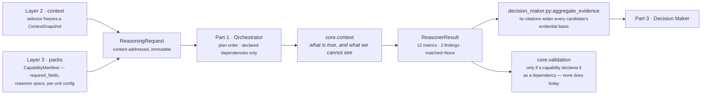
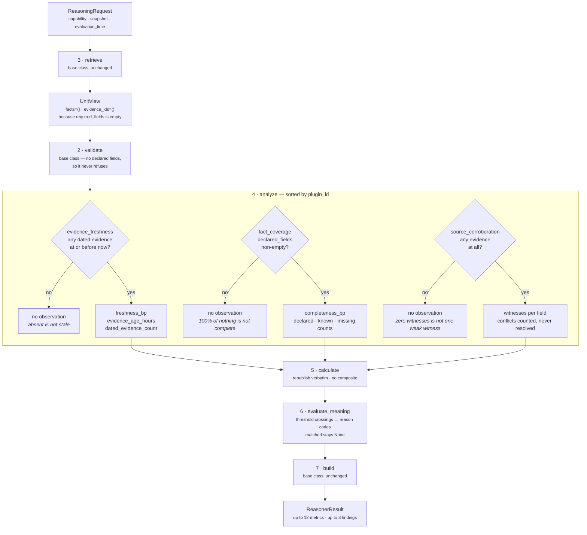

# `core.context` — the Context Unit

**Module:** `genios_engine/reason/reasoners/context_unit.py` (310 lines)
**Framework:** `genios_engine/reason/unit.py:ReasoningUnit`
**Tests:** `tests/test_unit_context_unit.py` — 28 tests, 63 assertions, all passing
**Category:** `UnitCategory.SITUATION_UNDERSTANDING` · **Version:** `1.0.0`
**Registered in:** `reasoners/__init__.py:SITUATION_UNDERSTANDING` (first of four)

---

## 1 · What it is for

> **The business question:** *what is actually true right now, and how much of the picture is
> missing?*

Every other unit in a plan reasons on top of the situation this one describes. Before anyone asks
whether a deal is at risk or whether there is headroom to win, somebody has to state, plainly and
without flattery, what the system actually knows: which of the facts this capability declared it
needs are present, which are explicitly absent, how old the freshest piece of evidence is, and how
many genuinely independent sources stand behind it.

The unit's own docstring names the failure it exists to prevent:

> *"the most expensive failure in an intelligence system is not a wrong answer — it is a confident
> answer drawn from two known fields, month-old evidence, and a single source that reported itself
> twice."*

**It states what is known; it never judges whether that is good or bad.** It publishes no
`confidence_bp`, it does not gate, it emits no `CandidateAdjustment` and no `CandidateCheck`, and it
returns `matched=None` on every run. Whether the reading it produces is *adequate* depends on what
is about to be decided, and only the Decision Maker knows that.

### The three readings stay three numbers

The unit deliberately refuses to blend completeness, freshness and corroboration into a single
"context quality" score:

> *"A situation that is fully known but a month old is not 'half good' — it is complete and stale,
> and both halves of that sentence matter to a different reader."*

A single number would be read downstream as a verdict on the situation, and this unit has no
authority to render one.

### Silence over fabrication

The rule that matters most here:

> *"a unit whose job is to report what is known must never invent a zero. No dated evidence means
> *no freshness metric*, not `freshness_bp = 0`. A fabricated zero would read downstream as 'we
> checked, and it is stale', which is a different and much stronger claim than 'we do not know'."*

Each of the three plugins can return `()` independently, so a run can legitimately publish twelve
metrics, four, or none at all. `test_an_empty_snapshot_completes_with_no_fabricated_readings`
pins the extreme: an empty snapshot produces `status=COMPLETED`, `metrics == {}`, `findings == ()`.

---

## 2 · Its place in the pipeline



`core.context` runs first among the four Situation Understanding units, and first in the plan for
the one capability that names it. It declares **no dependencies** and reads **no prior results** —
`view.prior` is never touched anywhere in the module — so it is the only unit in the plan whose
output depends on nothing but the frozen snapshot and the manifest.

### Who actually runs it

| Capability | Names `core.context`? | Live? |
|---|---|---|
| `sales.deal_cooling` v1 (`packs/capabilities/deal_cooling.py`) | no | shipped baseline |
| `sales.deal_health` (`packs/capabilities/deal_health.py`) | no | shipped |
| `sales.deal_cooling_full` v2 (`packs/capabilities/deal_cooling_v2.py`) | yes — `_spec("core.context")` | `live_delivery_enabled=False`, shadow only |

Its one declaration is bare:

```python
ReasonerSpec(reasoner_id='core.context', version='1.0.0',
             dependencies=(), required_fields=(), latency_budget_ms=60,
             failure_policy=FailurePolicy.OPTIONAL, gating=False, config={})
```

No config, no required fields, optional failure policy. **Every threshold in this document is the
module default, chosen by argument rather than measured against an outcome.** This unit has never
influenced a delivered decision. Treat every number as a starting position.

---

## 3 · The plugin seam

Three plugins, registered in `ContextUnit.plugins`. `unit.py:ReasoningUnit.analyze` iterates
`sorted(self.plugins, key=plugin_id)`, so the execution order is alphabetical by `plugin_id`, not
registration order — and that order reaches the findings tuple and therefore the result's semantic
hash.

| Order | `plugin_id` | Class | Claims | Silent when |
|---|---|---|---|---|
| 1 | `evidence_freshness` | `EvidenceFreshnessPlugin` | `freshness_bp`, `evidence_age_hours`, `dated_evidence_count` | No evidence row carries an `occurred_at` at or before `evaluation_time` |
| 2 | `fact_coverage` | `FactCoveragePlugin` | `completeness_bp`, `declared_field_count`, `known_field_count`, `missing_field_count` | Nothing declared what "complete" means — `declared_fields()` returns empty |
| 3 | `source_corroboration` | `SourceCorroborationPlugin` | `corroboration_count`, `corroborated_field_count`, `single_sourced_field_count`, `evidenced_field_count`, `conflict_count` | The snapshot carries no evidence rows at all |

The three axes are **independent by construction**. No plugin reads another's output, the metric
names are disjoint, and each has its own silence condition. That is what lets the Calculator be a
verbatim republish rather than a blend — see [04 · Calculator](04-Calculator.md).

### Internal flow



The three diamonds are the whole design. Everything else in the unit is arithmetic; the decision
about *when to say nothing* is where the judgement lives.

---

## 4 · Published metrics

`publishes` declares twelve names. `unit.py:ReasoningUnit.evaluate` raises `ValueError` if the
Verdict carries anything outside this list, so a fourth plugin cannot start moving a shared number
by accident.

| Metric | Range | Meaning | Emitted by | Present when |
|---|---|---|---|---|
| `completeness_bp` | 0–10,000 | Share of declared facts actually present | `fact_coverage` | something declared a field set |
| `declared_field_count` | ≥ 1 | Size of the completeness denominator | `fact_coverage` | same |
| `known_field_count` | ≥ 0 | Declared fields present in the snapshot | `fact_coverage` | same |
| `missing_field_count` | ≥ 0 | Declared fields absent from the snapshot | `fact_coverage` | same |
| `freshness_bp` | 0–10,000 | Linear decay of the newest evidence across the horizon | `evidence_freshness` | at least one dated evidence row |
| `evidence_age_hours` | ≥ 0 | Whole hours since the newest dated evidence, truncated | `evidence_freshness` | same |
| `dated_evidence_count` | ≥ 1 | Evidence rows carrying a usable `occurred_at` | `evidence_freshness` | same |
| `corroboration_count` | ≥ 1 | Witnesses behind the best-corroborated field | `source_corroboration` | at least one evidence row |
| `corroborated_field_count` | ≥ 0 | Fields with at least `min_corroboration` witnesses | `source_corroboration` | same |
| `single_sourced_field_count` | ≥ 0 | Fields resting on exactly one witness | `source_corroboration` | same |
| `evidenced_field_count` | ≥ 1 | Distinct fields any evidence row speaks to | `source_corroboration` | same |
| `conflict_count` | ≥ 0 | Fields where independent witnesses cite different values | `source_corroboration` | same |

None of these is a reserved shared metric.
`tests/test_unit_context_unit.py:test_the_unit_never_publishes_a_metric_another_unit_owns` asserts
`{confidence_bp, urgency_bp, priority_override_bp}` is disjoint from `publishes` —
those belong to `core.confidence` and `core.priority`, and a second publisher would silently
re-score every ranked decision in the system.

**One name collides.** `core.confidence` also emits `completeness_bp` in its result, deliberately
undeclared via `confidence.py:UNDECLARED_METRICS`. The two compute it differently, and on the
shipped manifest they differ by 2,000bp. Full comparison in
[03b · fact_coverage](03b-plugin-fact_coverage.md) §8; why nothing detects the disagreement in
[06 · Builder and Metrics](06-Builder-and-Metrics.md) §5.1.

---

## 5 · Configuration

Every key is read from `view.config`, which is `spec.config` — per-capability tuning authored in
Layer 3 and versioned with the capability. Nothing is read from the environment, a database, or a
clock.

| Key | Type | Default | Read by | Validator | Eager? |
|---|---|---|---|---|---|
| `context_fields` | list of non-empty strings | derived (see below) | `declared_fields()` | inline — raises `ValueError("context_fields must be a list of non-empty field names")` | yes |
| `freshness_horizon_hours` | positive integer | `168` (7 days) | `EvidenceFreshnessPlugin` | `_config_count` | yes |
| `min_corroboration` | positive integer | `2` | `SourceCorroborationPlugin` **and** `evaluate_meaning` | `_config_count` | yes (plugin), lazy (evaluator) |
| `completeness_floor_bp` | integer 0–10,000 | `6_000` | `evaluate_meaning` | `_config_bp` | **no** |
| `freshness_floor_bp` | integer 0–10,000 | `3_000` | `evaluate_meaning` | `_config_bp` | **no** |

**When `context_fields` is absent, the denominator is derived** as the sorted union of
`capability.required_fields`, every `spec.required_fields` across `capability.reasoners`, and
`context.missing_fields`. Full argument in
[03b · fact_coverage](03b-plugin-fact_coverage.md) §2.

**A malformed value raises rather than defaults.** From `_config_bp`'s docstring: *"A malformed
value is a deployment fault, not something to silently round into range — a threshold that quietly
became zero would make every situation look complete."* Both validators reject `bool` explicitly,
because `isinstance(True, int)` is `True` in Python.

**"Eager?" is a real distinction and it is a compromise.** `freshness_horizon_hours`,
`min_corroboration` and `context_fields` are read at the top of their plugin's `contribute`, before
the silence check, so a malformed value raises on every run. `completeness_floor_bp` and
`freshness_floor_bp` are read inside `if metric is not None:` branches in `evaluate_meaning`, so a
malformed value **passes unnoticed** on any run where the corresponding plugin stayed silent.
Verified:

```text
config={"completeness_floor_bp": 20_000}, capability declares no fields
  → status=COMPLETED, metrics={}, no error       # the bad config is never seen

config={"completeness_floor_bp": 20_000}, capability declares one field
  → ValueError: completeness_floor_bp must be integer basis points
```

`tests/test_unit_context_unit.py:test_a_malformed_threshold_is_rejected_rather_than_rounded` only
covers the second case. A capability could ship a broken threshold and pass every run until the day
its first field is declared.

---

## 6 · Worked example — a real snapshot on the shipped manifest

`sales.deal_cooling_full` declares five fields between its capability header and its reasoner
specs:

```text
deal.status · deal.value · derived.engagement · thread.last_inbound
· relationship.verified_stakeholder_count        (declared by core.relationship)
```

Four arrive; `relationship.verified_stakeholder_count` is published by Layer 2 in
`context.missing_fields`. Five evidence rows, the newest dated 288 hours ago, default config.
Verified by running `ContextUnit().evaluate(request, {})` against the real manifest:

```text
completeness_bp   = divide_half_up(4 * 10_000, 5)                        = 8,000
declared_field_count 5 · known_field_count 4 · missing_field_count 1

freshness_bp      = 10_000 - divide_half_up(min(288,168) * 10_000, 168)
                  = 10_000 - 10_000                                      = 0
evidence_age_hours 288 · dated_evidence_count 4

corroboration_count 2        # deal.status seen by source:crm and source:gmail
corroborated_field_count 1 · single_sourced_field_count 3
evidenced_field_count 4 · conflict_count 0

reason_codes = context_corroborated · context_evidence_dated · context_fields_absent
             · context_sources_agree · context_stale · context_substantially_known
evidence_ids = ev_crm_status · ev_crm_value · ev_eng · ev_mail_status · ev_thread
matched      = None
```

Read it as a sentence: *four of the five facts this capability needs are here, nothing has happened
in twelve days, and the one thing two sources agree on is that the deal is open.* That is three
separate statements, and collapsing them into one score would lose the middle one — which is the
one that should stop a recommendation.

Note `context_substantially_known` and `context_stale` appear **together**. 8,000bp clears the
6,000bp completeness floor while 0bp sits under the 3,000bp freshness floor. A composite would have
averaged those into something meaningless.

---

## 7 · Known gaps and compromises

Each is argued in full in the file named beside it.

| # | Finding | Where |
|---|---|---|
| 1 | **Corroboration is structurally pinned at one witness in production.** Both shipped snapshot adapters emit exactly one `EvidenceRef` per field, so `corroboration_count` is always 1, `conflict_count` always 0, and `context_single_sourced` fires on every real run. The true source count sits unread in the fact record's `src_count`. | [03c](03c-plugin-source_corroboration.md) §6 |
| 2 | **A "conflict" is only representable for collection-valued facts.** `ContextSnapshot.__post_init__` requires each evidence value to equal its fact — or be a member of it, when the fact is a list. Two witnesses citing different members of one list is counted as a conflict; one witness doing the same is explicitly not. | [03c](03c-plugin-source_corroboration.md) §5 |
| 3 | **Two definitions of "missing" coexist.** `FactCoveragePlugin` uses `common.py:missing_fields` (presence only); the orchestrator uses `guards.py:required_missing` (presence **or** listed in `context.missing_fields`). A field both listed as missing and supplied with a stale value counts present here and missing there. | [03b](03b-plugin-fact_coverage.md) §5 |
| 4 | **Two evaluator thresholds are validated lazily.** A malformed `completeness_floor_bp` or `freshness_floor_bp` ships silently on any run where its plugin stayed silent. | §5 above, and [05](05-Evaluator.md) §4 |
| 5 | **Freshness cites one row even when several share the newest instant.** `evidence_ids=cited[:1]` keeps the lexicographically smallest id and drops the rest. | [03a](03a-plugin-evidence_freshness.md) §5 |
| 6 | **`neighbor:`-prefixed declared fields are counted but never cited.** `missing_fields` resolves the prefix against `neighbor_facts`, but `evidence_ids()` matches on the raw name, so a present neighbour fact contributes to `known_field_count` with no evidence attached. | [03b](03b-plugin-fact_coverage.md) §5 |
| 7 | **The unit is read by nothing.** No unit reads any of its twelve metrics, and `core.validation` — the one unit that would — does not declare it as a dependency in the only capability that runs it. Its sole live effect is widening the evidence set through `decision_maker.py:aggregate_evidence`. | [06](06-Builder-and-Metrics.md) §5 |

---

## 8 · The files

| File | Covers |
|---|---|
| [01 · Input and Validator](01-Input-and-Validator.md) | What arrives, `required_fields`, why `validate()` is the base implementation, and the `MissingContextError → INSUFFICIENT_CONTEXT` path it never actually takes |
| [02 · Retriever](02-Retriever.md) | Why the base `retrieve()` produces an empty `UnitView` here, and why the plugins reach past it to `view.request` |
| [03 · Analyzer](03-Analyzer.md) | The plugin seam: composition, execution order, independence, and how the three claims interact |
| [03a · `evidence_freshness`](03a-plugin-evidence_freshness.md) | Linear decay from the newest dated row; the future-evidence exclusion; hour truncation |
| [03b · `fact_coverage`](03b-plugin-fact_coverage.md) | `declared_fields()`, the three-source denominator, the `context_fields` override |
| [03c · `source_corroboration`](03c-plugin-source_corroboration.md) | `independence_key()`, witnesses versus rows, conflict counted and never resolved |
| [04 · Calculator](04-Calculator.md) | The verbatim republish, and the argument against a composite score |
| [05 · Evaluator](05-Evaluator.md) | Six threshold reason codes, why `matched` is `None` rather than `False`, why every reading becomes a Finding |
| [06 · Builder and Metrics](06-Builder-and-Metrics.md) | The base `build()`, evidence union, the `publishes` guard, and who consumes the output |

## Related

| Document | Covers |
|---|---|
| [Category 1 · Situation Understanding](../README.md) | This unit alongside `core.timeline`, `core.dependency`, `core.constraint` |
| [Part 2 · The Unit Framework](../../README.md) | The eight stages, `Observation`, `UnitView`, `Verdict`, the roster invariants |
| [Layer 4 · Overview](../../../00-Overview.md) | The three parts, the five laws, why the layer exists |
