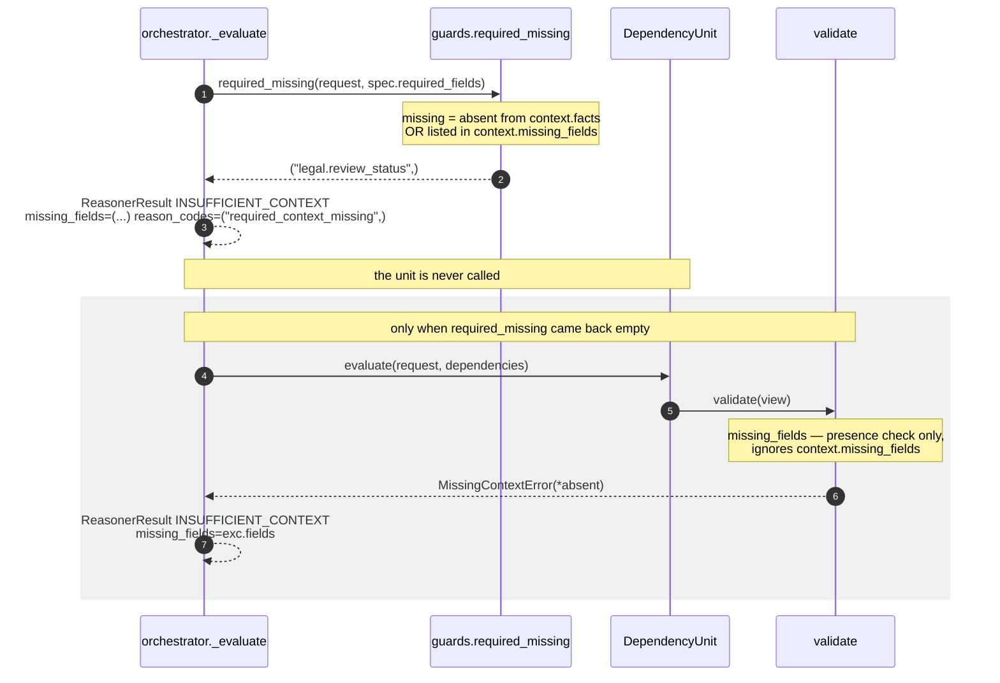

# 01 · Input and Validator

**Stage 1 (Input):** `unit.py:ReasoningUnit.evaluate(request, prior_results)` — fixed by the framework
**Stage 2 (Validator):** `unit.py:ReasoningUnit.validate(view)` — **base implementation, not overridden**

---

## 1 · What it is for

Before this unit reasons about blockage, two things must be settled: what it was handed, and whether
that is enough to reason from at all. For most units the second question has teeth. For
`core.dependency` it almost never fires, and understanding *why* is the point of this file.

---

## 2 · What exists

### 2.1 What arrives

`evaluate` takes exactly two arguments and the unit may look at nothing else:

```python
def evaluate(self, request: ReasoningRequest,
             prior_results: Mapping[str, ReasonerResult]) -> ReasonerResult
```

| Input | Type | What this unit uses it for |
|---|---|---|
| `request.context.facts` | `Mapping[str, Any]`, frozen | Every gate, prerequisite and owner field is read from here |
| `request.context.evidence` | `tuple[EvidenceRef, ...]` | Evidence ids attached to gate and owner observations |
| `request.capability.required_fields` | `tuple[str, ...]` | The **default** prerequisite list |
| `request.capability.reasoners` | `tuple[ReasonerSpec, ...]` | `active_spec` picks the `core.dependency` entry out of this |
| `spec.config` | `Mapping[str, Any]`, frozen | All eleven tuning keys — see the README table |
| `prior_results` | `Mapping[str, ReasonerResult]` | **Never read.** This unit declares no dependencies and calls `prior_metric` nowhere |

`request.context.neighbor_facts`, `request.context.observations`,
`request.context.missing_fields`, `request.evaluation_time` and `request.mode` are all available and
all unread. The last is worth stating explicitly: **this unit never touches a timestamp**, so it has
no `parse_time` or `elapsed_hours` call and no possible clock dependency. It is one of the purest
units in the roster.

### 2.2 The declaration that shapes validation

```python
class DependencyUnit(ReasoningUnit):
    unit_id  = "core.dependency"
    version  = "1.0.0"
    category = UnitCategory.SITUATION_UNDERSTANDING
    publishes = ("blocked_count", "blocking_depth", "unblocked_bp", "hard_blocked_count",
                 "blocker_severity_bp", "inspected_count")
    plugins  = (ApprovalGatePlugin(), PrerequisiteAbsencePlugin(), UpstreamOwnerPlugin())
```

There is **no `required_fields` class attribute**, and there is no such attribute anywhere in
`ReasoningUnit`. The framework reads required fields from the *capability's* spec for this unit —
`view.spec.required_fields`, a `ReasonerSpec` field defaulting to `()`.

`packs/capabilities/deal_cooling_v2.py` wires the unit as bare `_spec("core.dependency")`, which
leaves `required_fields=()`. **In shipped configuration this unit declares no required fields at
all.**

### 2.3 The validator, unchanged

```python
def validate(self, view: UnitView) -> None:
    absent = missing_fields(view.request, view.spec.required_fields)
    if absent:
        raise MissingContextError(*absent)
```

`common.py:missing_fields` walks the declared tuple, honours a `neighbor:` prefix by looking in
`context.neighbor_facts`, and returns the sorted names it could not find. With an empty tuple it
returns `()` and `validate` is a no-op.

---

## 3 · How it works

### 3.1 Why the unit does not override `validate()`

The override would have to argue one of two positions, and neither survives contact with the unit's
purpose.

**"Refuse to run without a gate field."** A capability whose deals have no `legal.review_status`
would be refused outright — but "there is no legal review on this deal" is a perfectly ordinary
situation and the unit already has a correct answer for it: report the gates it *can* see, count
them in `inspected_count`, and say nothing about the ones it cannot.

**"Refuse to run with nothing inspectable."** This is the tempting one, and it is wrong for the
same reason `core.constraint` empties its validator: an `INSUFFICIENT_CONTEXT` result carries no
metrics, no findings and no reason codes (enforced by `ReasonerResult.__post_init__`). A downstream
consumer would then see *nothing at all* — indistinguishable, at the result level, from a unit that
was never planned. Whereas the completed blind run says something precise:

```text
blocked_count 0 · blocking_depth 0 · hard_blocked_count 0
blocker_severity_bp 0 · inspected_count 0 · unblocked_bp 10,000
reason_codes ("dependency_not_observable",)
matched False
```

*That* is a usable record: the unit ran, it looked, it found nothing to look at, and it says so in a
reason code a consumer can match on. Refusing would have destroyed the distinction the whole unit
exists to preserve. `test_nothing_inspected_is_never_reported_as_nothing_blocking` pins exactly this
output.

### 3.2 The path a refusal would take, if one were ever declared

A Layer 3 author *can* make this unit refuse, by declaring `required_fields` on its spec. Two
independent gates then apply, in this order:



Two definitions of "missing" coexist, and the stricter one runs first:

| Checker | Field absent from `facts` | Field present but named in `context.missing_fields` |
|---|---|---|
| `guards.py:required_missing` (orchestrator, runs first) | missing | **missing** |
| `common.py:missing_fields` (the unit's validator) | missing | present |

In the orchestrated path the unit's own validator is therefore effectively unreachable. It matters
when the unit is invoked directly — which is how **every** one of the twenty-seven tests calls it:
15 call a plugin's `contribute`, 3 call `calculate`, 8 call `DependencyUnit().evaluate`, and one is
an `isinstance` protocol check. Not one goes through `ReasoningOrchestrator`, so the stricter
`required_missing` gate never runs in this file. Verified
directly: with `spec.required_fields = ("legal.review_status",)` and that field absent,
`unit.validate(view)` raises `MissingContextError` with `fields == ("legal.review_status",)`, and
`unit.evaluate(request, {})` propagates it.

### 3.3 The tension a Layer 3 author walks into

Declaring `required_fields` on this unit's spec is the only way to make `retrieve()` populate
`view.facts` and attach evidence at the view level (see [02 · Retriever](02-Retriever.md)). But it
has a second, larger effect: **the orchestrator will refuse to run the unit whenever one of those
fields is absent** — which is precisely the situation in which dependency reporting is most
valuable. A deal missing its `legal.review_status` is a deal whose legal gate nobody can see, and
the useful output there is `dependency_not_observable`, not silence.

So the two knobs are coupled in the wrong direction:

| Author's choice | `view.facts` | Behaviour when a declared field is absent |
|---|---|---|
| declare nothing (shipped) | empty | unit always runs; reports what it can see |
| declare the gate fields | populated | unit refuses to run on the deals that need it most |

There is no third option today short of overriding `retrieve()`. The unit chose the first, and it is
the right choice for a reporting unit — but it is a choice made by omission, and nothing in the code
records it. Worth a comment on the class if anyone revisits this.

---

## 4 · Examples and edge cases

### 4.1 The shipped case — no declaration, nothing refused

```text
spec.required_fields = ()
missing_fields(request, ())      = ()
validate                          → returns, no exception
```

Every shipped run of `core.dependency` takes this path. The unit has never produced an
`INSUFFICIENT_CONTEXT` result in any test or capability.

### 4.2 A declared field that is present

```python
ReasonerSpec("core.dependency", "1.0.0", required_fields=("legal.review_status",))
context.facts = {"legal.review_status": "in_review", "deal.owner": "rep_amara"}
```

```text
required_missing → ()        orchestrator proceeds
missing_fields   → ()        validate returns
view.facts       = {"legal.review_status": "in_review"}
view.evidence_ids = ("ev_legal",)          # the evidence row for that field
```

### 4.3 A declared field that is absent

```python
ReasonerSpec("core.dependency", "1.0.0", required_fields=("legal.review_status",))
context.facts = {"deal.owner": "rep_amara"}
```

```text
required_missing → ("legal.review_status",)
result = ReasonerResult(status=INSUFFICIENT_CONTEXT,
                        missing_fields=("legal.review_status",),
                        reason_codes=("required_context_missing",))
matched  = None      metrics = {}      findings = ()      evidence_ids = ()
```

The empty metrics are not a choice this unit made — `ReasonerResult.__post_init__` raises
`"non-completed reasoner results cannot carry decision effects or evidence"` if a non-`COMPLETED`
result carries any of them. The field also flows into `ReasoningDecision.uncertainty`, because
`orchestrator.py` extends uncertainty with `result.missing_fields` from every result.

### 4.4 A `neighbor:`-scoped declaration

`missing_fields` honours the prefix — `neighbor:account.legal_hold` is looked up in
`context.neighbor_facts`. But the base `retrieve()` filters `neighbor:` fields out of the selection,
so a neighbour field can **gate the run without ever reaching `view.facts`**, and none of this
unit's plugins call `fact_value(..., neighbor=True)`. Declaring a neighbour prerequisite here would
make the unit refuse to run on its absence and then ignore it on its presence. Nothing in the
roster does this; it is a trap rather than a bug.

### 4.5 Malformed config is not a validator concern

A bad `gate_pending_severity_bp` does not raise in `validate()` — it raises inside
`ApprovalGatePlugin.contribute` during stage 4, which the orchestrator converts to
`ResultStatus.FAILED` (not `INSUFFICIENT_CONTEXT`), with the exception type and message in
`diagnostics`. That is the correct classification: insufficient context is a fact about the world,
a bad severity is a fact about the manifest.

```text
config = {"gate_pending_severity_bp": 20_000}
→ ValueError: gate_pending_severity_bp must be integer basis points
→ ReasonerResult(status=FAILED, diagnostics={... ValueError ...})
```

`test_configuration_that_is_not_basis_points_is_a_manifest_fault` asserts the raise at plugin level.
Note the asymmetry documented in the README §5: only `gate_pending_severity_bp` is validated on
every run. The other five severity keys are read inside branches and can sit malformed in a manifest
indefinitely.

### 4.6 `prior_results` is accepted and discarded

`DependencyUnit` never calls `view.prior_metric` and never touches `view.prior`. Passing it a
populated mapping changes nothing — `test_the_same_situation_twice_produces_identical_metrics` runs
with `{}` and the end-to-end capability run passes it every earlier result; both produce the same
`semantic_hash` for the same facts. The unit is a pure function of
`(context.facts, context.evidence, capability.required_fields, spec.config)`.
