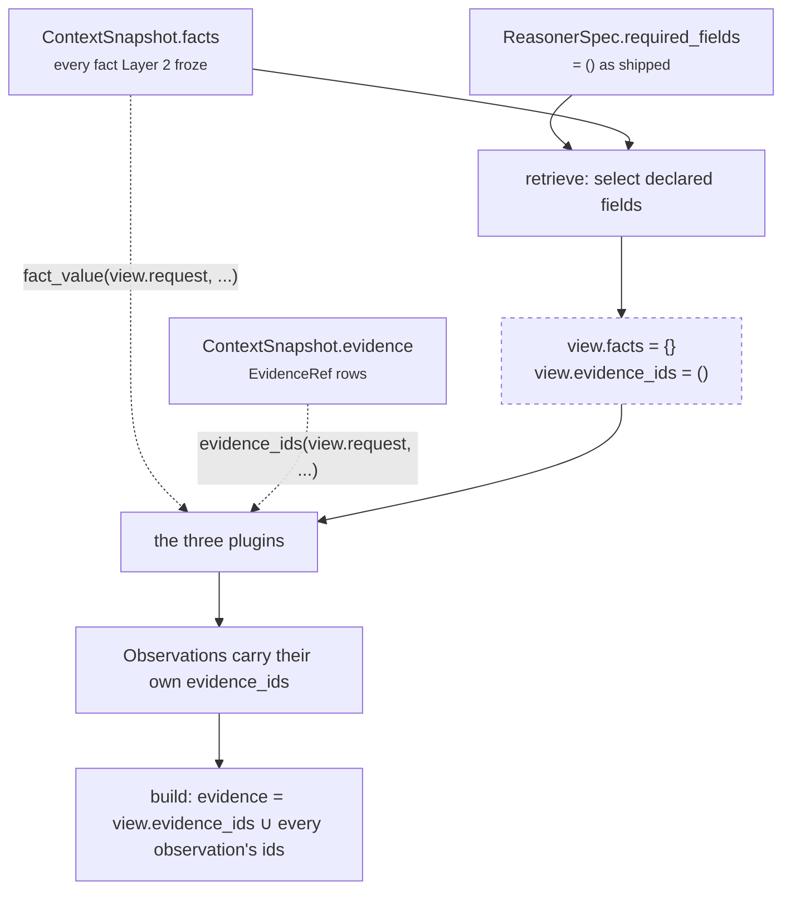

# 02 · Retriever

**Stage 3:** `unit.py:ReasoningUnit.retrieve(request, spec, prior)` — **base implementation, not overridden**

---

## 1 · What it is for

Select the slice of the frozen snapshot this unit is allowed to look at, and record the evidence ids
that back it. Selection only — the framework docstring is blunt about why:

> *"Units are forbidden to touch a database, network, or clock — that is what makes a decision
> replayable months later. Retrieval already happened when Layer 2 froze the ContextSnapshot. So
> 'Retriever' here means select and shape from that frozen input, which is the only form of
> retrieval that can survive replay."*

For `core.dependency` this stage is, in shipped configuration, a **no-op that produces an empty
window** — and all three plugins reach past it. That is the most important thing in this file.

---

## 2 · What exists

The base implementation, verbatim:

```python
def retrieve(self, request: ReasoningRequest, spec: ReasonerSpec,
             prior: Mapping[str, ReasonerResult]) -> UnitView:
    wanted = tuple(field for field in spec.required_fields
                   if not field.startswith("neighbor:"))
    facts = {name: request.context.facts[name]
             for name in wanted if name in request.context.facts}
    evidence = tuple(sorted(item.evidence_id for item in request.context.evidence
                            if item.field in facts))
    return UnitView(request=request, spec=spec, prior=prior,
                    facts=MappingProxyType(facts), evidence_ids=evidence)
```

The `UnitView` it produces carries five things:

| Field | Value for `core.dependency` as shipped |
|---|---|
| `request` | the whole frozen `ReasoningRequest` |
| `spec` | the capability's `ReasonerSpec` for `core.dependency` |
| `prior` | `{}` in every shipped plan — the unit declares no dependencies |
| `facts` | **`{}`** — because `spec.required_fields` is empty |
| `evidence_ids` | **`()`** — derived from `facts`, which is empty |

Verified by direct call:

```text
retrieve with no required_fields (the shipped wiring):
   view.facts        = {}
   view.evidence_ids = ()

retrieve with required_fields=("legal.review_status",):
   view.facts        = {'legal.review_status': 'in_review'}
   view.evidence_ids = ('ev_legal',)
```

---

## 3 · How it works

### 3.1 Which slice the unit actually reads

The window is empty, so the plugins read the snapshot directly. Every fact access in
`dependency_unit.py` goes through one of two calls, and **both take `view.request`, not `view`**:

| Access | Where | Reads |
|---|---|---|
| `fact_value(view.request, field)` | `_gate_state`, `_pending_gate_fields`, all three plugins | `request.context.facts[field]`, unwrapping a `{"value": …}` record |
| `view.request.context.facts` | `prerequisite_absent` (membership), `upstream_owner` (membership) | the raw mapping |
| `evidence_ids(view.request, field)` | gate, owner-unassigned, owner-unavailable, upstream-party observations | `request.context.evidence` filtered by field name |

So the *effective* slice — the set of fields this unit can touch — is not declared anywhere the
framework can see. It is the union of:

```text
config["gate_fields"]                      default: 5 gate fields
config["prerequisite_fields"]              default: capability.required_fields
config["owner_field"]                      default: deal.owner
config["owner_status_field"]               default: owner.availability
config["blocked_by_field"]                 default: deal.blocked_by
```

Eight field names by default, plus however many the capability declared as `required_fields`.

### 3.2 Why the unit does not override `retrieve()` — and what it costs

The framework's own README states the intent of `UnitView`: *"Units read this rather than the whole
request, so a unit's inputs are visible in one place and a reviewer can see exactly what it was
allowed to look at."* For `core.dependency` that property does not hold. A reviewer cannot answer
"what was this unit allowed to see?" from the view; they have to read three plugins and eleven
config keys.

Three concrete consequences.

**The `evidence_ids` guard is doing no work here.** `guards.py:validate_evidence_references`
re-checks at the orchestrator boundary that every cited id exists in the snapshot — and it does,
because `common.py:evidence_ids` derives ids by filtering `request.context.evidence`. But the
*framework's* intended safety property — a unit cannot cite a row it did not select — is
unenforceable when nothing was selected. It is replaced by a weaker property: a unit cannot cite a
row that does not exist.

**Evidence attachment is per-observation, not per-view.** Because `view.evidence_ids` is empty,
every id on the final result comes from `build()`'s union over observation `evidence_ids`. That
works — the Acme run attaches `("ev_legal", "ev_owner")` correctly — but it means an evidence row
is attached only if the plugin that read the field remembered to call `evidence_ids(...)`.
`PrerequisiteAbsencePlugin` does not, for either of its observation kinds. See
[03b](03b-plugin-prerequisite_absent.md).

**Declaring fields to fix the window breaks the run.** As set out in
[01 · Input and Validator](01-Input-and-Validator.md) §3.3, populating `view.facts` requires
declaring `spec.required_fields`, which makes the orchestrator refuse the run whenever one of those
fields is absent. The window and the refusal are the same knob.

`core.constraint` hit the identical problem and answered it explicitly rather than by omission. Its
`retrieve()` override returns a bare `UnitView(request=request, spec=spec, prior=prior)` — no facts,
no evidence ids — and says why:

> *"Precondition fields are authored per play in Layer 3 and are not knowable from `required_fields`,
> so any narrowing here would be a window that lies about what the unit actually reads. The plugins
> read `request.context` directly."*

Word for word, that sentence is true of gate fields, prerequisite fields and owner fields.
`core.dependency` ends up in the same place — an empty window, plugins reading `request.context`
directly — but reaches it by *not* overriding the stage, so the code records no decision at all. A
reader cannot tell the shipped behaviour from an oversight.

Two repairs are available and neither is built. The cheap one is `core.constraint`'s: override
`retrieve` to return the bare view and carry the same paragraph, which changes no behaviour and
turns an accident into a documented choice. The better one is a `retrieve` that *selects* the union
of the configured field names — the eight defaults above plus `prerequisite_fields` — which would
give the unit a truthful window without touching `required_fields` and would restore the framework's
cite-only-what-you-selected property. `core.constraint` could not take that second route because its
own field list is authored per *play*; `core.dependency` could, because its field list is fully
determined by `spec.config` before any fact is read.

### 3.3 What lands in the UnitView, drawn



The dashed box is the point: the declared path contributes nothing, and the dotted arrows —
the direct snapshot reads — carry the whole unit.

---

## 4 · Examples and edge cases

### 4.1 The Acme run — where the evidence actually comes from

```python
facts = {"deal.renewal_date": "2026-09-30", "approval.status": "approved",
         "legal.review_status": "in_review", "deal.owner": "rep_amara",
         "owner.availability": "on_leave"}
evidence = (EvidenceRef("ev_legal", "legal.review_status", "in_review"),
            EvidenceRef("ev_owner", "owner.availability", "on_leave"))
spec.required_fields = ()
```

```text
view.evidence_ids                       = ()             ← retrieve contributed nothing
observation gate_pending   evidence_ids = ("ev_legal",)  ← ApprovalGatePlugin called evidence_ids()
observation owner_unavail. evidence_ids = ("ev_owner",)  ← UpstreamOwnerPlugin called evidence_ids()
observation prerequisite   evidence_ids = ()             ← plugin never calls evidence_ids()
result.evidence_ids                     = ("ev_legal", "ev_owner")
```

Asserted by `test_a_stalled_enterprise_renewal_reports_its_whole_blocking_graph`.

### 4.2 An evidence row for a field nobody read

If the snapshot carries `EvidenceRef("ev_note", "deal.notes", …)` and no plugin reads `deal.notes`,
that id never appears anywhere in the result. Correct: this unit cites what it read.

### 4.3 A `{"value": …}` fact record

Layer 2 may write a fact as a bare value or as a record. `common.py:fact_value` unwraps the second
form:

```python
record.get("value") if isinstance(record, Mapping) and "value" in record else record
```

Verified: `{"legal.review_status": {"value": "pending", "source": "crm"}}` produces
`dependency.gate_pending` with `severity_bp: 6,000`, identical to the bare-string form. The
*membership* checks in `prerequisite_absent` and `upstream_owner` (`field in facts`) see the
record, not the value, which is what makes `{"value": None}` behave correctly — present as a key,
absent as a value.

### 4.4 A field present in `facts` and also listed in `context.missing_fields`

`retrieve()` reads `context.facts` only and never consults `context.missing_fields`. If Layer 2 ever
both lists a field as missing and supplies a stale value for it, this unit treats it as present and
reasons from the stale value. The orchestrator's `required_missing` would have caught it — but only
for fields the spec *declared*, and this unit declares none. The same unreconciled pair of
definitions noted for `core.context` applies here, with the additional wrinkle that the strict
checker never runs.

### 4.5 `prior` is populated and unread

In the `deal_cooling_v2` plan, `core.dependency` runs early and its `ReasonerSpec.dependencies` is
empty, so the orchestrator passes it `{}` — `dependencies = {item: prior[item] for item in
spec.dependencies if item in prior}`. Even if a future author declared a dependency, nothing in this
unit reads `view.prior`. The unit's output cannot be changed by adding units to the plan.
