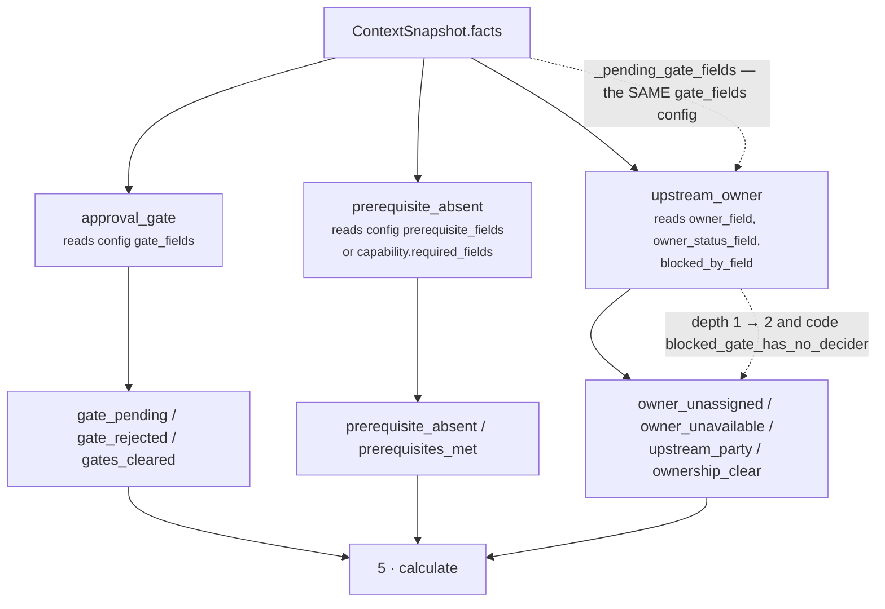

# 03 · Analyzer — the plugin seam

**Stage 4:** `unit.py:ReasoningUnit.analyze(view)` — **base implementation, not overridden**

---

## 1 · What it is for

Three separate claims about why work cannot start, each resolved by different evidence and each
cleared by a different person. The analyzer's job is to let all three speak without letting any of
them conclude anything.

The module docstring names the split and its rationale:

> *"It reports three families of them, one per plugin, because they are three different claims
> resolved three different ways: an **approval or gate** that has been asked for and not answered
> (chase the approver), a **prerequisite fact** the capability declared it needs and does not have
> (go find it), an **upstream owner** who is absent or unavailable (nothing moves until a person
> does)."*

Folding them into one "blocked" flag would lose the only detail that makes the output actionable:
*who to go to*.

---

## 2 · What exists

```python
plugins = (ApprovalGatePlugin(), PrerequisiteAbsencePlugin(), UpstreamOwnerPlugin())
```

Three instances, constructed at class-definition time, stateless, registered explicitly. The base
`__init__` checks their `plugin_id`s are unique and raises `"{unit_id} registers a duplicate
analyzer plugin"` otherwise.

The base analyzer:

```python
def analyze(self, view: UnitView) -> tuple[Observation, ...]:
    observations: list[Observation] = []
    for plugin in sorted(self.plugins, key=lambda item: item.plugin_id):
        observations.extend(plugin.contribute(view))
    return tuple(observations)
```

### 2.1 Execution order

Sorted by `plugin_id`, which for this unit is:

| # | `plugin_id` | Class |
|---|---|---|
| 1 | `approval_gate` | `ApprovalGatePlugin` |
| 2 | `prerequisite_absent` | `PrerequisiteAbsencePlugin` |
| 3 | `upstream_owner` | `UpstreamOwnerPlugin` |

Registration order and alphabetical order coincide here, which is a coincidence and not a
guarantee. The sort is load-bearing anyway: observation order determines **finding order**, and
finding order reaches `ReasonerResult.semantic_hash`. From the framework docstring: *"the observation
order — and therefore every hash downstream of it — is a property of the unit's composition, not of
registration order."*

Within a plugin, order is the plugin's own. All three iterate `_config_fields(...)`, which returns
a **sorted tuple** — the helper's docstring says so directly: *"sorted so iteration order can never
reach output."* `UpstreamOwnerPlugin` has a fixed three-step sequence instead: owner, then status,
then upstream party.

### 2.2 The uniform observation shape

Every plugin emits observations in exactly two shapes. This is what makes the Calculator seven lines
instead of three branches.

**Blocking observation** — five integers, always all five:

```python
Observation(
    plugin_id = <the plugin>,
    kind      = "dependency.<what kind of wall>",
    metrics   = {"blocked": 1, "inspected": 1, "depth": 1|2,
                 "severity_bp": 0..10_000, "hard": 0|1},
    evidence_ids = (...),                    # sometimes empty
    reason_codes = ("<categorical code>", "blocker:<field>", ...),
)
```

**Inspection observation** — two integers, no depth, no severity, no evidence:

```python
Observation(
    plugin_id = <the plugin>,
    kind      = "dependency.<something>_clear",
    metrics   = {"blocked": 0, "inspected": <count>},
    reason_codes = ("<categorical code>",),
)
```

| Metric | Meaning | Read by |
|---|---|---|
| `blocked` | `1` = this is a wall, `0` = this is a clean inspection | `calculate` (partition), `evaluate_meaning` (finding filter, code filter) |
| `inspected` | how many things this observation accounts for having looked at | `calculate` (`inspected_count`) |
| `depth` | 1 = ours to act on, 2 = held outside this workflow | `calculate` (`blocking_depth`, penalty) |
| `severity_bp` | how hard this particular wall is | `calculate` (`blocker_severity_bp`, drag) |
| `hard` | 1 = waiting will not clear it | `calculate` (`hard_blocked_count`) only |

`hard` is published as a count and **never enters the `unblocked_bp` arithmetic**. It is a label for
a human reading the trace, not a weight.

`Observation.__post_init__` rejects any non-`int` metric — including `bool`, explicitly, because
`isinstance(True, int)` is `True` in Python — and sorts and dedupes `evidence_ids` and
`reason_codes` at construction.

### 2.3 The complete observation catalogue

| Plugin | `kind` | blocked | depth | severity_bp | hard | evidence |
|---|---|---|---|---|---|---|
| `approval_gate` | `dependency.gate_pending` | 1 | 1 | `gate_pending_severity_bp` (6,000) | 0 | yes |
| `approval_gate` | `dependency.gate_rejected` | 1 | 2 | **10,000, fixed** | 1 | yes |
| `approval_gate` | `dependency.gates_cleared` | 0 | — | — | — | no |
| `prerequisite_absent` | `dependency.prerequisite_absent` | 1 | 1 | `prerequisite_severity_bp` (5,000) | 0 | **no** |
| `prerequisite_absent` | `dependency.prerequisites_met` | 0 | — | — | — | no |
| `upstream_owner` | `dependency.owner_unassigned` | 1 | 1 | `unassigned_severity_bp` (4,000) | 0 | yes |
| `upstream_owner` | `dependency.owner_unavailable` | 1 | **1 or 2** | `unavailable_severity_bp` (7,000) | 1 | yes |
| `upstream_owner` | `dependency.upstream_party` | 1 | 2 | `upstream_severity_bp` (6,500) | 1 | yes |
| `upstream_owner` | `dependency.ownership_clear` | 0 | — | — | — | no |

---

## 3 · How they compose

### 3.1 The three plugins are independent — with one exception

Two of the three never look at anything the other two touch. `upstream_owner` breaks that, once, on
purpose.



The dotted edge is the whole of the interaction, and it is the single most useful thing the unit
reports. `UpstreamOwnerPlugin` calls `_pending_gate_fields(view)` — the same helper, reading the
same `gate_fields` config — to ask *is any gate currently waiting?* If one is, and the owner is
unavailable, the unavailability is promoted from depth 1 to depth 2 and gains the reason code
`blocked_gate_has_no_decider`:

> *"The chain deepens only when a gate is actually waiting on this person. Otherwise an absent owner
> is a direct problem we can route around; claiming a two-link chain without a second link would be
> inventing structure that is not in the facts."*

Verified — identical facts, one gate added:

```text
owner out_of_office, no gate       → depth 1, codes (blocker:owner.availability, owner_unavailable)
owner out_of_office, legal pending → depth 2, codes (blocked_gate_has_no_decider,
                                                     blocker:owner.availability, owner_unavailable)
```

`test_an_unavailable_owner_deepens_the_chain_only_when_a_gate_waits_on_them` pins both.

**Consequence of the coupling.** `upstream_owner` reads `config["gate_fields"]` through
`_config_fields`, which raises on a malformed value. So a broken `gate_fields` fails **two** plugins,
not one — and it fails `upstream_owner` only when the owner is unavailable, because that is the only
branch that calls the helper. Another instance of the lazy-validation pattern from the README §5.

**Non-consequence.** The coupling is one-directional and read-only. `approval_gate` never learns
anything about the owner, the depth promotion never changes the gate observation, and neither plugin
mutates shared state. Reordering the plugins would produce identical observations in a different
sequence — but the sort makes that unreachable.

### 3.2 Silence is a return value, not a zero

Each plugin returns `()` under conditions that are specific to it and documented in its own file:

| Plugin | Returns `()` when |
|---|---|
| `approval_gate` | every configured gate field is absent, or carries a token in none of the three vocabularies |
| `prerequisite_absent` | neither `prerequisite_fields` nor `capability.required_fields` names anything |
| `upstream_owner` | the owner field is not in `facts`, the status token is unrecognised, and the blocked-by field is not in `facts` |

An empty tuple contributes nothing to `inspected_count`. A `dependency.*_cleared` row contributes to
it. That is exactly the difference between *"we looked and it was fine"* and *"we could not look"*,
and it is the reason the inspection rows exist at all rather than the plugins simply staying quiet
when nothing is wrong.

### 3.3 What a plugin is forbidden to do

None of the three sets `matched` (only `Verdict` and `Finding` carry that), proposes a
`CandidateAdjustment`, emits a `CandidateCheck`, or ranks anything. From the unit docstring: *"The
unit reports the graph of blockage. It never says which blocker to clear first, never ranks a play,
and never eliminates one."* `test_the_unit_reports_blockage_without_ranking_or_eliminating_anything`
asserts `result.adjustments == ()` and `result.checks == ()` on a maximally blocked run.

---

## 4 · Worked composition — all three speaking at once

Acme's stalled renewal (`test_a_stalled_enterprise_renewal_reports_its_whole_blocking_graph`):

```python
facts = {"deal.renewal_date": "2026-09-30",
         "approval.status":   "approved",
         "legal.review_status": "in_review",
         "deal.owner":        "rep_amara",
         "owner.availability": "on_leave"}
capability.required_fields = ("deal.renewal_date", "deal.signatory_email")
```

`analyze()` returns six observations, in this exact order:

```text
1  approval_gate       dependency.gate_pending
                       blocked 1 · inspected 1 · depth 1 · severity_bp 6,000 · hard 0
                       evidence ("ev_legal",)
                       codes (blocker:legal.review_status, gate_awaiting_decision)

2  approval_gate       dependency.gates_cleared
                       blocked 0 · inspected 1            ← approval.status = approved
                       codes (gates_cleared,)

3  prerequisite_absent dependency.prerequisite_absent
                       blocked 1 · inspected 1 · depth 1 · severity_bp 5,000 · hard 0
                       evidence ()                        ← this plugin cites nothing
                       codes (blocker:deal.signatory_email, prerequisite_not_available)

4  prerequisite_absent dependency.prerequisites_met
                       blocked 0 · inspected 1            ← deal.renewal_date is present

5  upstream_owner      dependency.owner_unavailable
                       blocked 1 · inspected 1 · depth 2 · severity_bp 7,000 · hard 1
                       evidence ("ev_owner",)
                       codes (blocked_gate_has_no_decider, blocker:owner.availability,
                              owner_unavailable)          ← depth 2 because obs 1 exists

6  upstream_owner      dependency.ownership_clear
                       blocked 0 · inspected 1            ← deal.owner is assigned
```

Three blockers, three inspection rows, `inspected_count = 6`. Note observation 2: the cleared
approval gate is what stops the unit from reporting "one gate, and it was blocked" as though only
one gate had ever been looked at.

---

## 5 · Edge cases in composition

### 5.1 A field named by two plugins

Nothing prevents `prerequisite_fields` from naming `legal.review_status`. If it did, and the field
were absent, both plugins would speak — `approval_gate` silently (absent field, no observation) and
`prerequisite_absent` with a blocker. Finding ids stay distinct because they are prefixed by
`plugin_id`: `dependency.prerequisite_absent.legal.review_status`. No collision, no double count of
the same wall — but two rows describing one field is a config smell.

### 5.2 Five gates pending at once

```text
facts: approval.status=pending, finance.approval_status=submitted,
       legal.review_status=in_review, procurement.status=waiting,
       security.review_status=under_review

analyze → 5 × dependency.gate_pending, each severity 6,000, depth 1, hard 0
          no gates_cleared row
metrics → blocked_count 5 · inspected_count 5 · blocker_severity_bp 6,000
          blocking_depth 1 · hard_blocked_count 0 · unblocked_bp 0
reason_codes = ("gate_awaiting_decision",)          ← one code, five findings
```

The unit-level code vocabulary is categorical and deduplicated, so five identical walls produce one
code. The five findings carry the five field names. That split — categorical codes, field-carrying
findings — is deliberate and covered in [05 · Evaluator](05-Evaluator.md).

### 5.3 Every plugin silent

`facts = {"deal.status": "open"}` with no declared `required_fields`: all three return `()`,
`analyze` returns `()`, and the run still completes with `inspected_count = 0` and reason code
`dependency_not_observable`. The analyzer has no minimum-observation requirement, and adding one
would destroy the blind-run signal.

### 5.4 Config that changes what the plugins can see

`_config_fields` dedupes, strips, drops blanks, and sorts:

```text
gate_fields = ["legal.review_status", "legal.review_status", " "]
            → ("legal.review_status",)          one observation, not two
```

`_config_fields` rejects a bare string (`"legal.review_status"`), a mapping, and an integer with
`ValueError: gate_fields must be a list of fact field names` — verified for all three. A single
field name passed unwrapped is the most likely authoring mistake, and it fails loudly rather than
iterating the string character by character.
