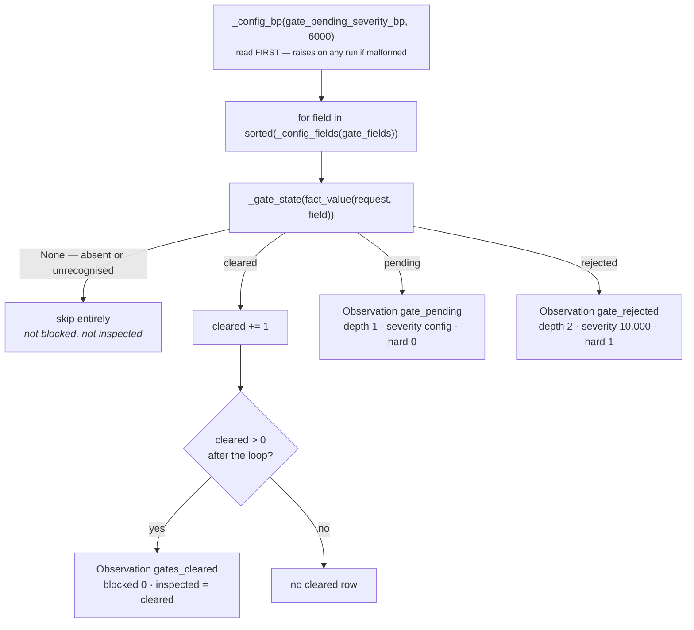

# 03a · Plugin `approval_gate`

**Class:** `dependency_unit.py:ApprovalGatePlugin`
**`plugin_id`:** `approval_gate` — runs **first** in `plugin_id` order

---

## 1 · The claim

*Something was submitted for a decision, and the decision has not come back.*

The plugin's own docstring makes the business case:

> *"This is the most common blocker in commercial work and the most invisible one, because a pending
> gate looks identical to a healthy deal in every metric that measures activity."*

A deal sitting in legal review has a recent last-touch, an engaged buyer, an owner, and a live
thread. Every activity signal says it is healthy. Only somebody asking *what is it waiting on* finds
the wall.

It reports each waiting gate **separately**: *"legal and procurement are chased by different people,
so folding them into one 'blocked' flag would lose the only detail that makes the observation
actionable downstream."*

---

## 2 · What exists

### 2.1 The fields it inspects

```python
DEFAULT_GATE_FIELDS: tuple[str, ...] = (
    "approval.status",
    "finance.approval_status",
    "legal.review_status",
    "procurement.status",
    "security.review_status",
)
```

> *"Gates GeniOS has seen in the wild across CRM, contracting, and procurement sources. A capability
> that names different ones overrides this wholesale via `gate_fields` — the defaults exist so a
> capability that never thought about gates still gets the common ones checked."*

Note **wholesale**, not additive: setting `gate_fields` replaces the default list entirely.

### 2.2 The vocabulary — matched, never inferred

Three frozen sets, 12 + 10 + 5 = 27 tokens:

| Set | Members |
|---|---|
| `GATE_PENDING` | `awaiting`, `awaiting_approval`, `blocked`, `in_review`, `not_started`, `on_hold`, `pending`, `pending_approval`, `requested`, `submitted`, `under_review`, `waiting` |
| `GATE_CLEARED` | `approved`, `cleared`, `complete`, `completed`, `done`, `granted`, `not_required`, `passed`, `signed`, `waived` |
| `GATE_REJECTED` | `declined`, `denied`, `failed`, `rejected`, `revoked` |

Resolution order in `_gate_state` is cleared → rejected → pending. The sets are disjoint, so the
order is not load-bearing today; it would become so if a token were ever added to two sets.

```python
def _normalize(value: Any) -> str:
    """Fold a status string to a single comparable token. Non-strings fold to '' and stay silent."""
    if isinstance(value, bool) or not isinstance(value, str):
        return ""
    return value.strip().lower().replace(" ", "_").replace("-", "_")
```

`bool` is rejected before `str`, which matters because a CRM boolean `approved: True` must not
become the token `"true"` and then silently fall through to "unrecognised" by accident — it is
rejected on type, deliberately and readably.

### 2.3 Config keys

| Key | Default | Effect |
|---|---|---|
| `gate_fields` | the five above | which fact fields count as gates |
| `gate_pending_severity_bp` | `6,000` | severity of a gate that is waiting |

A **rejected gate has no config key**. Its severity is the literal `10_000` in the code:

> *"A refusal cannot be waited out and is not ours to overturn, so it is both maximal and hard; a
> pending gate is tunable because how long a capability tolerates a queue is a business judgement,
> not a fact."*

### 2.4 The three outputs

| `kind` | blocked | inspected | depth | severity_bp | hard | reason codes |
|---|---|---|---|---|---|---|
| `dependency.gate_pending` | 1 | 1 | 1 | config, 6,000 | 0 | `gate_awaiting_decision`, `blocker:<field>` |
| `dependency.gate_rejected` | 1 | 1 | **2** | **10,000** | **1** | `gate_decision_refused`, `blocker:<field>` |
| `dependency.gates_cleared` | 0 | count of cleared gates | — | — | — | `gates_cleared` |

Evidence ids come from `evidence_ids(view.request, field)` on both blocking kinds — the ids of every
`EvidenceRef` whose `field` matches. The cleared row carries none.

---

## 3 · How it works



### 3.1 The arithmetic, in full

There is none worth the name — the plugin is a classifier, and every number it emits is a constant or
a config read:

```text
for field in sorted(gate_fields):
    token = normalize(fact_value(field))          strip().lower(), " "→"_", "-"→"_"
    state = "cleared"  if token in GATE_CLEARED
            "rejected" if token in GATE_REJECTED
            "pending"  if token in GATE_PENDING
            None       otherwise                  ← the silence branch

    None      → contribute nothing
    cleared   → cleared += 1
    rejected  → blocked=1 inspected=1 depth=2 severity_bp=10,000 hard=1
    pending   → blocked=1 inspected=1 depth=1 severity_bp=gate_pending_severity_bp hard=0

if cleared:   blocked=0 inspected=cleared
```

The design content is entirely in *which* branch a token lands in, and in the fact that the fourth
branch exists at all.

### 3.2 Why a refusal is depth 2

A pending gate is depth 1 because *this workflow can chase it* — send the reviewer a note, ask for a
decision date. A refusal is depth 2 because there is nothing to chase: someone outside this workflow
has to change a decision they already made. The comment on `UPSTREAM_DEPTH` states the general rule:
*"a blocker held by a party outside this workflow: two links in the chain, and the first is not ours
to pull. Reported separately because 'waiting' and 'able to act' are different situations."*

The practical consequence is that a single rejected gate always drives `unblocked_bp` to zero:
`10,000 − 10,000 − 0 − 1,500 = −2,500 → clamp → 0`. Verified.

### 3.3 Why cleared gates produce a row instead of silence

> *"A cleared gate is reported too — as a zero-blockage inspection rather than silence — because 'we
> checked five gates and all five are clear' and 'we checked nothing' must never produce the same
> result."*

The cleared row is aggregated into **one** observation carrying the count, not one row per cleared
gate. There is nothing to chase, so per-field identity earns nothing; the count is all a consumer
needs. Blockers get one row each because each names a different person to go to.

---

## 4 · Worked examples

### 4.1 A pending legal review — the whole unit's output

```python
facts = {"legal.review_status": "in_review"}    # default config, nothing else present
```

```text
gate_fields sorted → approval.status, finance.approval_status, legal.review_status,
                     procurement.status, security.review_status

approval.status            absent      → skip
finance.approval_status    absent      → skip
legal.review_status        "in_review" → normalize → "in_review" ∈ GATE_PENDING
                                       → gate_pending, severity 6,000, depth 1, hard 0
procurement.status         absent      → skip
security.review_status     absent      → skip
cleared = 0                            → no gates_cleared row

calculate:
    severities = [6,000]
    depth      = 1        penalty = (1-1) × 1,500 = 0
    free       = 10,000 − 6,000 − divide_half_up(0, 4) − 0 = 4,000
```

Full result, verified by execution:

```text
matched  True
metrics  blocked_count 1 · blocking_depth 1 · unblocked_bp 4,000
         hard_blocked_count 0 · blocker_severity_bp 6,000 · inspected_count 1
codes    ("gate_awaiting_decision",)
finding  dependency.approval_gate.legal.review_status
         metrics {blocked 1, depth 1, hard 0, inspected 1, severity_bp 6,000}
         codes   (blocker:legal.review_status, gate_awaiting_decision)
```

Note `inspected_count 1`: four of the five configured gates were not present, so they were not
inspected. The unit is honest that it checked one gate, not five.

### 4.2 A refusal and a queue together

```python
facts = {"security.review_status": "denied", "legal.review_status": "pending"}
```

```text
legal.review_status    "pending" ∈ GATE_PENDING  → severity 6,000, depth 1, hard 0
security.review_status "denied"  ∈ GATE_REJECTED → severity 10,000, depth 2, hard 1

severities sorted desc = [10,000, 6,000]
depth                  = max(1, 2) = 2
penalty                = (2 − 1) × 1,500 = 1,500
drag                   = divide_half_up(6,000, 4) = (6,000 + 2) // 4 = 1,500
free                   = 10,000 − 10,000 − 1,500 − 1,500 = −3,000 → clamp → 0
```

```text
matched  True
metrics  blocked_count 2 · blocking_depth 2 · unblocked_bp 0
         hard_blocked_count 1 · blocker_severity_bp 10,000 · inspected_count 2
codes    ("gate_awaiting_decision", "gate_decision_refused")
findings dependency.approval_gate.legal.review_status      (depth 1, 6,000)
         dependency.approval_gate.security.review_status   (depth 2, 10,000, hard 1)
```

Two findings emitted in **sorted-field order within the plugin**, because `_config_fields` sorts:
`legal.review_status` before `security.review_status`.

### 4.3 Five gates checked, all clear

```python
facts = {"approval.status": "approved", "legal.review_status": "waived"}
```

```text
cleared = 2      → one observation: dependency.gates_cleared, blocked 0, inspected 2
observations returned: exactly 1
```

`test_cleared_gates_are_recorded_as_inspection_rather_than_silence` asserts `len(observations) == 1`
and `inspected == 2`. Combined with a clear owner, the unit's headline output becomes
`unblocked_bp 10,000 · inspected_count 4 · reason code no_blocking_dependency_observed` — a clean
bill of health with the evidence of having looked.

### 4.4 Wording variants of one state

```text
"In Review"  → strip, lower, " "→"_"  → "in_review"  ∈ GATE_PENDING
"in-review"  → "-"→"_"                → "in_review"  ∈ GATE_PENDING
"IN_REVIEW"  → lower                  → "in_review"  ∈ GATE_PENDING
```

All three produce `dependency.gate_pending`, asserted by
`test_gate_status_wording_is_normalised_before_it_is_matched`. CRM exports write all three for one
state, and matching only the exact snake-case token would have made this plugin blind on most real
data.

---

## 5 · Silence and boundaries

### 5.1 The plugin returns `()` when

- every configured gate field is absent from `context.facts`; **and**
- no present gate field carries a token in any of the three vocabularies.

Absence and unrecognised-value are the same silence, deliberately.

### 5.2 An unrecognised token

```python
facts  = {"approval.status": "escalated"}
config = {"gate_fields": ["approval.status"]}
→ ApprovalGatePlugin().contribute(view) == ()
```

`test_an_unrecognised_gate_status_produces_no_claim_at_all` pins it, with the reasoning in its
docstring: *"We do not know what 'escalated' means for this tenant, and 'probably fine' is a
fabrication."*

**This is the plugin's sharpest edge, and it cuts both ways.** An unrecognised token is not counted
in `inspected_count` either, so a tenant whose entire vocabulary is bespoke —
`"stage_2_review"`, `"awaiting_cfo"` — produces `inspected_count 0` and the reason code
`dependency_not_observable`. That is the correct signal, and it is also completely silent: nothing
tells an operator *"we saw five gate values and understood none of them"*. A
`gate_vocabulary_unrecognised` reason code carrying the count would cost four lines and would turn a
misconfigured tenant from invisible into obvious. It is not built.

### 5.3 Non-string and boolean values

```text
{"legal.review_status": True}   → _normalize → ""  → no observation      (verified)
{"legal.review_status": None}   → _normalize → ""  → no observation
{"legal.review_status": 3}      → _normalize → ""  → no observation
{"legal.review_status": ""}     → _normalize → ""  → no observation
```

### 5.4 A wrapped fact record

```text
{"legal.review_status": {"value": "pending", "source": "crm"}}
→ fact_value unwraps → "pending" → dependency.gate_pending, severity 6,000    (verified)
```

### 5.5 Malformed config

`gate_pending_severity_bp` is read on the **first line** of `contribute`, before any field is
inspected. A malformed value therefore fails every run of every capability that carries it, even one
with no gate facts at all — verified: `{"gate_pending_severity_bp": 20_000}` with
`facts = {"deal.status": "open"}` still raises `gate_pending_severity_bp must be integer basis
points`. This is the *correct* behaviour and the other four severity keys do not share it; see the
README §5.

`gate_fields` set to a bare string, a mapping or an integer raises `gate_fields must be a list of
fact field names`. Duplicates and blanks are silently deduped and dropped.

### 5.6 A gate field name that is not a legal identifier

```python
config = {"gate_fields": ["legal review status"]}
facts  = {"legal review status": "pending"}
```

The plugin builds the observation happily — `Observation` does not validate reason-code grammar. The
failure comes two stages later, in `evaluate_meaning`, when `Finding` validates its id:

```text
ValueError: finding_id contains unsupported characters
→ orchestrator converts the whole unit result to ResultStatus.FAILED
```

Verified. The field name reaches the finding id through `_blocker_key`, and
`contracts/reasoning.py:_IDENTIFIER` is `^[A-Za-z0-9][A-Za-z0-9_.:@/-]{0,191}$` — no spaces. A gate
field with a space in its name takes the unit down. `_config_fields` strips surrounding whitespace
but does not validate the grammar; validating it there would move the failure to the manifest, where
it belongs.
