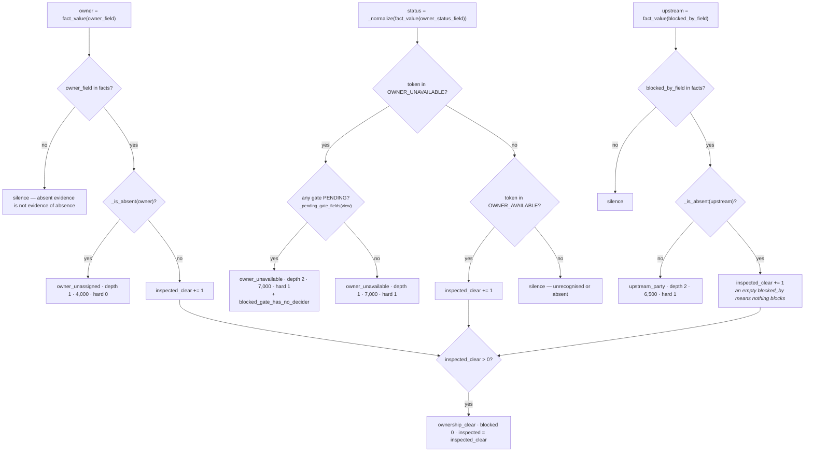

# 03c · Plugin `upstream_owner`

**Class:** `dependency_unit.py:UpstreamOwnerPlugin`
**`plugin_id`:** `upstream_owner` — runs **third** in `plugin_id` order

---

## 1 · The claim

*Work that waits on a person who is not there to move it.*

Three situations, deliberately not merged:

> *"Nobody is assigned, so the work has no hands at all. The assigned owner is out of office or gone,
> so the work has hands that cannot move — and if a gate is also pending, that unavailability is
> **why** the gate is not clearing, which is a two-link chain and the single most useful thing this
> unit ever reports. Or the situation names an external party it is waiting on, which is upstream by
> construction."*
>
> *"Everything here is reported, never resolved: reassigning an owner is an action, and this unit
> does not propose actions."*

This is the only plugin in the unit where depth is **earned from the facts** rather than declared by
the kind of blocker. That single branch is what the unit's whole depth concept exists for.

---

## 2 · What exists

### 2.1 The three fields it inspects

| Config key | Default | Question |
|---|---|---|
| `owner_field` | `deal.owner` | is anyone assigned? |
| `owner_status_field` | `owner.availability` | is that person able to act? |
| `blocked_by_field` | `deal.blocked_by` | is an external party named? |

Each is a single field name read through `_config_field`, which requires a non-empty string and
raises `"<key> must be a fact field name"` otherwise.

### 2.2 The availability vocabulary

```python
OWNER_UNAVAILABLE = frozenset({
    "away", "inactive", "offboarded", "on_leave", "out_of_office", "terminated", "unavailable",
})
OWNER_AVAILABLE = frozenset({"active", "available", "online", "working"})
```

Normalised by the same `_normalize` the gate vocabulary uses: `strip().lower()`, spaces and hyphens
to underscores, non-strings and booleans to `""`. A token in neither set produces **nothing** — not a
blocker, not an inspection.

### 2.3 Config keys

| Key | Default | Applies to |
|---|---|---|
| `owner_field` | `deal.owner` | which fact names the owner |
| `owner_status_field` | `owner.availability` | which fact carries availability |
| `blocked_by_field` | `deal.blocked_by` | which fact names an external blocker |
| `unassigned_severity_bp` | `4,000` | `dependency.owner_unassigned` |
| `unavailable_severity_bp` | `7,000` | `dependency.owner_unavailable` |
| `upstream_severity_bp` | `6,500` | `dependency.upstream_party` |
| `gate_fields` | the five gate defaults | **read indirectly**, via `_pending_gate_fields`, to decide depth |

The three severity keys are read **inside their branches**. A malformed `unassigned_severity_bp`
raises only on a run where the owner is actually unassigned — verified: `20_000` with an assigned
owner produces no error at all.

The severity ordering is a claim about how much each situation costs: an unavailable owner (7,000)
outranks a named external party (6,500) outranks nobody assigned (4,000). The reasoning is
recoverable from the docstrings — nobody assigned is the cheapest to fix, since assigning someone is
a single internal act, while an owner who is *gone* has already absorbed whatever context the work
had. None of the three is measured against outcomes.

### 2.4 The four outputs

| `kind` | blocked | inspected | depth | severity_bp | hard | evidence | reason codes |
|---|---|---|---|---|---|---|---|
| `dependency.owner_unassigned` | 1 | 1 | 1 | 4,000 | 0 | yes | `owner_unassigned`, `blocker:<owner_field>` |
| `dependency.owner_unavailable` | 1 | 1 | **1 or 2** | 7,000 | **1** | yes | `owner_unavailable`, `blocker:<status_field>`, and `blocked_gate_has_no_decider` when depth is 2 |
| `dependency.upstream_party` | 1 | 1 | 2 | 6,500 | **1** | yes | `waiting_on_upstream_party`, `blocker:<blocked_by_field>` |
| `dependency.ownership_clear` | 0 | 1–3 | — | — | — | no | `ownership_clear` |

---

## 3 · How it works



### 3.1 The depth promotion, in full

```python
status = _normalize(fact_value(view.request, status_field))
if status in OWNER_UNAVAILABLE:
    gated = bool(_pending_gate_fields(view))
    ... "depth": UPSTREAM_DEPTH if gated else DIRECT_DEPTH ...
    reason_codes=("owner_unavailable", f"{BLOCKER_PREFIX}{status_field}")
                 + (("blocked_gate_has_no_decider",) if gated else ())
```

and the helper it leans on:

```python
def _pending_gate_fields(view: UnitView) -> tuple[str, ...]:
    """Which gates are currently waiting — shared so the owner plugin can see the chain it sits in."""
    return tuple(field for field in _config_fields(view, "gate_fields", DEFAULT_GATE_FIELDS)
                 if _gate_state(fact_value(view.request, field)) == "pending")
```

Only `pending` counts. A **rejected** gate does not deepen an unavailable owner, and that is right:
if legal has refused, the owner's absence is not what is holding the decision — the refusal is, and
it already carries depth 2 on its own observation.

The comment states the discipline:

> *"The chain deepens only when a gate is actually waiting on this person. Otherwise an absent owner
> is a direct problem we can route around; claiming a two-link chain without a second link would be
> inventing structure that is not in the facts."*

`test_an_unavailable_owner_deepens_the_chain_only_when_a_gate_waits_on_them` runs both halves of
that sentence against each other. Verified output, identical facts plus one gate:

```text
no gate:       dependency.owner_unavailable  depth 1
               codes (blocker:owner.availability, owner_unavailable)

legal pending: dependency.owner_unavailable  depth 2
               codes (blocked_gate_has_no_decider, blocker:owner.availability, owner_unavailable)
```

**The promotion is a claim about structure, not about severity.** `severity_bp` stays 7,000 in both
cases. What changes is `depth`, which costs a flat 1,500bp in `calculate` and — more importantly —
tells a human reading the trace that chasing legal is pointless until somebody covers for the owner.

### 3.2 The three checks are independent

Nothing in the plugin requires an owner to exist before reading availability. A snapshot with
`owner.availability: "on_leave"` and no `deal.owner` key produces one `owner_unavailable` blocker and
no `owner_unassigned` observation. Odd on its face — unavailable *who*? — but the alternative,
suppressing a known-absent person because the join that names them failed, would hide a real
blocker behind a data-quality problem.

### 3.3 Two inversions of `_is_absent`, both deliberate

`_is_absent` is used twice, meaning opposite things:

| Field | `_is_absent` is true | Reading |
|---|---|---|
| `owner_field` | **blocker** — `owner_unassigned` | an empty owner means nobody is doing this |
| `blocked_by_field` | **clear inspection** | an empty blocked-by means nothing external is in the way |

That is semantically correct in both cases, and it is the kind of thing worth writing down because
it looks like an inconsistency until you say it out loud.

### 3.4 The asymmetry with `prerequisite_absent`

| Situation | `prerequisite_absent` | `upstream_owner` |
|---|---|---|
| key absent from `facts` | **blocker** | **silence** |
| key present, value empty | blocker | blocker (owner) / clear (blocked_by) |

The reasoning: a prerequisite was *declared*, so its absence is a stated need going unmet. An owner
field that Layer 2 never supplied is a field nobody asserted anything about, and reading it as
"unassigned" would be inventing a blocker out of a join that did not run.
`test_an_owner_field_l2_never_supplied_is_not_read_as_unassigned` pins it: *"Absent evidence is not
evidence of absence; the silent case must stay silent."*

---

## 4 · Worked examples

### 4.1 Nobody assigned, and an external party named

```python
facts = {"deal.owner": "", "deal.blocked_by": "customer_procurement"}
```

```text
deal.owner       in facts, "" is absent      → owner_unassigned  depth 1 severity 4,000 hard 0
owner.availability not present, token ""      → silence
deal.blocked_by  in facts, not absent         → upstream_party    depth 2 severity 6,500 hard 1
inspected_clear = 0                           → no ownership_clear row

calculate:
    severities sorted desc = [6,500, 4,000]
    depth                  = max(1, 2) = 2
    penalty                = (2 − 1) × 1,500 = 1,500
    drag                   = divide_half_up(4,000, 4) = (4,000 + 2) // 4 = 1,000
    free                   = 10,000 − 6,500 − 1,000 − 1,500 = 1,000
```

Verified whole-unit result:

```text
matched  True
metrics  blocked_count 2 · blocking_depth 2 · unblocked_bp 1,000
         hard_blocked_count 1 · blocker_severity_bp 6,500 · inspected_count 2
codes    ("owner_unassigned", "waiting_on_upstream_party")
findings dependency.upstream_owner.deal.owner       (depth 1, 4,000, hard 0)
         dependency.upstream_owner.deal.blocked_by  (depth 2, 6,500, hard 1)
```

Findings appear in the plugin's fixed internal order — owner, status, upstream — not sorted by field
name. That order is a property of the code and is stable across runs, which is all the hash requires.

### 4.2 The chain: an unavailable owner with a gate waiting on them

```python
facts = {"deal.owner": "rep_amara", "owner.availability": "out_of_office",
         "legal.review_status": "pending"}
```

`upstream_owner` alone produces:

```text
dependency.owner_unavailable  blocked 1 inspected 1 depth 2 severity_bp 7,000 hard 1
                              codes (blocked_gate_has_no_decider,
                                     blocker:owner.availability, owner_unavailable)
dependency.ownership_clear    blocked 0 inspected 1        ← the owner IS assigned
```

Combined with `approval_gate`'s `gate_pending` (6,000, depth 1) the unit reports:

```text
severities sorted = [7,000, 6,000]
depth             = 2      penalty = 1,500
drag              = divide_half_up(6,000, 4) = 1,500
free              = 10,000 − 7,000 − 1,500 − 1,500 = 0

blocked_count 2 · blocking_depth 2 · hard_blocked_count 1 · unblocked_bp 0 · inspected_count 3
```

Read the trace and the story is complete: legal is waiting, the person who would push legal is out,
and nothing this workflow does moves either. That is the sentence the unit was built to produce.

### 4.3 A healthy owner

```python
facts = {"deal.owner": "rep_amara", "owner.availability": "active"}
```

```text
deal.owner        assigned            → inspected_clear = 1
owner.availability "active" ∈ OWNER_AVAILABLE → inspected_clear = 2
deal.blocked_by   not in facts        → silence

observations: dependency.ownership_clear  blocked 0  inspected 2
```

`test_a_healthy_owner_records_the_inspection_it_performed` also asserts
`"dependency.owner_unavailable" not in observations` — the plugin must not emit a zero-severity
blocker to record that it checked.

---

## 5 · Silence and edge cases

### 5.1 The plugin returns `()` when

All three of the following hold: `owner_field` is not in `facts`; the availability token is in
neither vocabulary (including absent); and `blocked_by_field` is not in `facts`.

`test_an_owner_field_l2_never_supplied_is_not_read_as_unassigned` asserts `contribute(...) == ()`
for `facts = {"deal.status": "open"}`.

### 5.2 An unrecognised availability token

```text
{"deal.owner": "rep_amara", "owner.availability": "busy"}
→ "busy" is in neither set → no observation for the status field
→ ownership_clear inspected 1  (from the assigned owner only)
```

The same blind spot as the gate vocabulary: a tenant whose HR system writes `"pto"`, `"sabbatical"`
or `"parental_leave"` gets no unavailability blocker and no signal that the token was not understood.
`OWNER_UNAVAILABLE` has seven members and `"pto"` is not one of them. Extending the frozenset is a
code change, not a config change — unlike `gate_fields`, the *vocabulary* is not configurable
anywhere in this unit.

### 5.3 An empty `blocked_by`

```text
{"deal.blocked_by": ""}     → ownership_clear inspected 1        (verified)
{"deal.blocked_by": []}     → ownership_clear inspected 1
{"deal.blocked_by": None}   → ownership_clear inspected 1
```

Layer 2 writing a null placeholder for "we looked and nobody is blocking" is read exactly as
intended: an inspection that came back clean.

### 5.4 A list-valued `blocked_by`

```text
{"deal.blocked_by": ["legal", "procurement"]}
→ ONE dependency.upstream_party, depth 2, severity 6,500, hard 1          (verified)
```

Two named parties produce one blocker, because the plugin tests emptiness rather than iterating.
That under-counts `blocked_count` relative to what `approval_gate` would do with two gates. Whether
two external parties are one wall or two is a judgement, and the code silently takes the first
position. Nothing in the tests pins it.

### 5.5 Boolean and non-string values

```text
{"deal.owner": True}    → _is_absent(True) is False → inspected_clear (assigned)
{"owner.availability": True} → _normalize → "" → silence
```

`_is_absent` and `_normalize` disagree about booleans on purpose: `_is_absent` asks *is there
anything here*, `_normalize` asks *is this a status word*.

### 5.6 A malformed `gate_fields` fails this plugin too

`_pending_gate_fields` calls `_config_fields(view, "gate_fields", ...)`, which raises on a bad value.
So a manifest with `gate_fields: "legal.review_status"` (a bare string) fails
`ApprovalGatePlugin` on every run *and* `UpstreamOwnerPlugin` on runs where the owner is unavailable.
One bad key, two failing plugins, one of them intermittently. The unit's result is `FAILED` either
way, so the practical impact is nil — but a reader debugging the traceback should know the second
call site exists.
