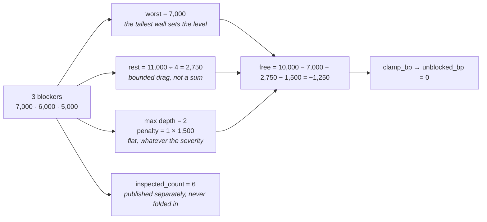

# 04 · Calculator

**Stage 5:** `dependency_unit.py:DependencyUnit.calculate(view, observations)` — `@abstractmethod`, implemented here
**Returns:** `Mapping[str, int]` — the six declared metrics, always all six

---

## 1 · What it is for

Turn a heterogeneous pile of blocker and inspection observations into six integers that describe the
**shape** of the blockage: how many walls, how tall the tallest, how long the chain, how much was
looked at, and how free the work is to proceed.

Every number is a pure integer function of the observations plus one config key. No clock, no
lookup, no float.

---

## 2 · What exists

```python
def calculate(self, view: UnitView,
              observations: Sequence[Observation]) -> Mapping[str, int]:
    blockers = [item for item in observations if int(item.metrics.get("blocked", 0)) == 1]
    inspected = sum(int(item.metrics.get("inspected", 0)) for item in observations)
    if not blockers:
        return {"blocked_count": 0, "blocking_depth": 0, "hard_blocked_count": 0,
                "blocker_severity_bp": 0, "inspected_count": inspected,
                "unblocked_bp": 10_000}
    severities = sorted((clamp_bp(int(item.metrics.get("severity_bp", 0)))
                         for item in blockers), reverse=True)
    depth = max(int(item.metrics.get("depth", DIRECT_DEPTH)) for item in blockers)
    penalty = (depth - 1) * _config_bp(view, "depth_penalty_bp", 1_500)
    free = 10_000 - severities[0] - divide_half_up(sum(severities[1:]), 4) - penalty
    return {
        "blocked_count": len(blockers),
        "blocking_depth": depth,
        "hard_blocked_count": sum(int(item.metrics.get("hard", 0)) for item in blockers),
        "blocker_severity_bp": severities[0],
        "inspected_count": inspected,
        "unblocked_bp": clamp_bp(free),
    }
```

### 2.1 The arithmetic, restated

```text
blockers  = observations where metrics["blocked"] == 1
inspected = Σ metrics["inspected"] over ALL observations, blockers included

── no blockers ──────────────────────────────────────────────────────────────
blocked_count       = 0
blocking_depth      = 0
hard_blocked_count  = 0
blocker_severity_bp = 0
inspected_count     = inspected
unblocked_bp        = 10,000

── at least one blocker ─────────────────────────────────────────────────────
severities = sorted([clamp_bp(metrics["severity_bp"]) for b in blockers], descending)
depth      = max(metrics["depth"] for b in blockers)
penalty    = (depth − 1) × config["depth_penalty_bp"]            # default 1,500

free = 10,000
     − severities[0]                                            # the worst wall governs
     − divide_half_up(Σ severities[1:], 4)                       # the rest at a quarter weight
     − penalty                                                   # flat, per extra link

blocked_count       = len(blockers)
blocking_depth      = depth
hard_blocked_count  = Σ metrics["hard"] over blockers
blocker_severity_bp = severities[0]
inspected_count     = inspected
unblocked_bp        = clamp_bp(free)                             # min(10,000, max(0, free))
```

`common.py:divide_half_up(n, 4)` is `(n + 2) // 4` for non-negative `n` — half-up, integer,
identical on every machine, and recomputable by hand from a trace.

### 2.2 Defaults inside the fold

| Read | Default when the key is absent | When that matters |
|---|---|---|
| `metrics["blocked"]` | `0` — treated as not-a-blocker | never; every observation sets it |
| `metrics["inspected"]` | `0` | never |
| `metrics["severity_bp"]` | `0` | a blocker without a severity contributes nothing to the level |
| `metrics["depth"]` | `DIRECT_DEPTH` = 1 | a blocker without a depth is assumed ours to act on |
| `metrics["hard"]` | `0` | a blocker without a hardness is assumed soft |

All five defaults are unreachable through the shipped plugins — every blocking observation sets all
five metrics. They exist so `calculate` is total over any observation a future plugin might emit, and
the tests' synthetic `_blocker()` helper relies on them.

---

## 3 · Why that shape

The code's docstring argues the whole formula, and it is a business argument rather than a
statistical one. Mining it rather than restating it:

### 3.1 Not a sum

> *"Deliberately not a sum of severities. Five soft blockers do not make work five times more
> impossible than one — you are blocked or you are not, and the hardest wall governs how blocked you
> are."*

Arithmetically, summing saturates immediately. Three blockers at 8,000, 4,000 and 2,000 sum to
14,000 against a 10,000 scale:

```text
sum-of-severities   10,000 − 14,000 = −4,000 → clamp → 0
max-plus-drag       10,000 − 8,000 − divide_half_up(6,000, 4) = 10,000 − 8,000 − 1,500 = 500
```

Zero and 500 are different claims. Zero says *nothing can move*. 500 says *this is nearly immovable
and there is one thing worth trying*. Under summation, three mild irritations and one absolute
refusal produce the same number, and the difference between an annoying situation and an impossible
one is erased at exactly the moment a human needs it.

`test_the_worst_blocker_governs_and_the_others_add_bounded_drag` asserts the 500, and its docstring
states the case in one line: *"Summing severities would call three mild blockers more impossible than
one absolute wall."*

### 3.2 But the others still count, at a quarter

> *"Additional blockers still matter, because each is another thing that must be cleared before
> anything moves, so they contribute a quarter of their weight."*

Not zero, because clearing the worst wall does not free the work if three more stand behind it. Not
full weight, because that is summation with extra steps. The quarter is **a judgement, not a
measurement** — a deliberately bounded drag that can move the number without dominating it. Nothing
has been tuned against outcomes, and the README says so.

Note the shape this gives: with N identical blockers of severity S,

```text
free = 10,000 − S − divide_half_up((N−1) × S, 4)
```

so the drag grows linearly in N and the number reaches zero at
`N − 1 ≈ 4 × (10,000 − S) / S`. At `S = 6,000` that is `N = 4` (three extra × 6,000 / 4 = 4,500;
10,000 − 6,000 − 4,500 = −500 → 0). At `S = 4,000` it takes seven blockers. Harder walls run out of
freedom faster, which is the intended ordering.

### 3.3 Depth is charged flatly, not multiplied

> *"Depth is charged separately and flatly: a chain that runs through someone outside this workflow
> is worse than the same severity held in-house, regardless of what the severity is."*

Multiplying severity by depth would make a mild upstream blocker look worse than a severe in-house
one. That inverts reality: **severity says how hard the wall is; depth says whether you are the one
holding the hammer.** They are orthogonal facts about a blocker and folding one into the other
destroys both.

`test_an_upstream_chain_costs_more_than_the_same_severity_held_in_house` pins the flat charge with
one blocker at each depth:

```text
depth 1:  free = 10,000 − 5,000 − 0 − (1−1)×1,500 = 5,000
depth 2:  free = 10,000 − 5,000 − 0 − (2−1)×1,500 = 3,500
```

Its docstring: *"Being unable to act yourself is materially worse than having work to do."*

### 3.4 `blocking_depth` is a max, not a count and not a sum

> *"``blocking_depth`` how long the chain is — 1 when this workflow can act on the blocker itself, 2
> when the blocker is held by a party outside this workflow… Depth is what separates 'chase it' from
> 'you are not the one who can chase it', and collapsing it into a single severity score would
> destroy exactly that distinction."*

`test_blocking_depth_reports_the_longest_chain_not_how_many_things_are_wrong` runs three blockers,
one of them at depth 2, and asserts `blocking_depth == 2` alongside `blocked_count == 3`. The two
numbers answer different questions and neither substitutes for the other.

**Nothing in the shipped code emits `depth > 2`.** `DIRECT_DEPTH = 1` and `UPSTREAM_DEPTH = 2` are
the only values any plugin sets, so `penalty` is always either `0` or `depth_penalty_bp`. The formula
generalises to longer chains; the observation vocabulary does not yet describe one.

### 3.5 `inspected_count` is never folded into `unblocked_bp`

The clean-run branch returns `unblocked_bp: 10_000` regardless of how much was inspected, with an
explicit comment:

> *"Nothing demonstrably blocks. `inspected_count` is what tells a consumer whether that is a clean
> bill of health or an empty room — this unit will not editorialise by lowering a number it has no
> evidence to lower."*

The tempting alternative — scale `unblocked_bp` by how much was inspected — would make the metric
mean two things at once and would let a consumer that reads only `unblocked_bp` silently confuse
*blocked* with *unobserved*. The unit refuses. The cost is that the consumer must read both, and
today's only consumer reads one; see [06 · Builder and Metrics](06-Builder-and-Metrics.md).

Note also that `inspected` sums over **all** observations, blockers included. A blocker is something
that was inspected and found to be a wall, so `inspected_count ≥ blocked_count` always holds.

---

## 4 · A worked combination

Acme's stalled renewal, all three plugins contributing
(`test_a_stalled_enterprise_renewal_reports_its_whole_blocking_graph`):

```text
observations in, from analyze:

  1  gate_pending          blocked 1  inspected 1  depth 1  severity 6,000  hard 0
  2  gates_cleared         blocked 0  inspected 1
  3  prerequisite_absent   blocked 1  inspected 1  depth 1  severity 5,000  hard 0
  4  prerequisites_met     blocked 0  inspected 1
  5  owner_unavailable     blocked 1  inspected 1  depth 2  severity 7,000  hard 1
  6  ownership_clear       blocked 0  inspected 1

partition:
  blockers  = [1, 3, 5]                              len 3
  inspected = 1 + 1 + 1 + 1 + 1 + 1                  = 6

level and drag:
  severities sorted desc = [7,000, 6,000, 5,000]
  severities[0]                                      = 7,000
  Σ severities[1:]       = 6,000 + 5,000             = 11,000
  drag = divide_half_up(11,000, 4) = (11,000 + 2)//4 = 2,750

depth:
  depth   = max(1, 1, 2)                             = 2
  penalty = (2 − 1) × 1,500                          = 1,500

free:
  10,000 − 7,000 − 2,750 − 1,500                     = −1,250
  clamp_bp(−1,250)                                   = 0

out:
  blocked_count       3
  blocking_depth      2
  hard_blocked_count  0 + 0 + 1                      = 1
  blocker_severity_bp                                = 7,000
  inspected_count                                    = 6
  unblocked_bp                                       = 0
```



Read the six numbers as a sentence: *three things are in the way, one of them cannot be waited out,
the worst is severe but not absolute, the chain runs through someone outside this workflow, we
inspected six things to find that out, and there is no freedom to proceed.* Every clause is a
separate metric because every clause changes what a human would do next.

---

## 5 · Examples and edge cases

### 5.1 One blocker, nothing else

```text
[gate_pending 6,000 depth 1]
severities [6,000] · Σ severities[1:] = 0 · drag = divide_half_up(0,4) = 0 · penalty 0
free = 10,000 − 6,000 = 4,000
→ blocked_count 1 · blocking_depth 1 · unblocked_bp 4,000 · inspected_count 1
```

### 5.2 The clamp at the top

`clamp_bp` also caps at 10,000, but `free` can never exceed 10,000 in the blocker branch: the
smallest possible subtraction is `severities[0] = 0`, giving exactly 10,000. A blocker with severity
0 therefore reports `blocked_count 1` and `unblocked_bp 10,000` simultaneously — inconsistent-looking
but honest, and unreachable through the shipped plugins whose minimum severity is 4,000.

### 5.3 The clamp at the bottom, and what it hides

Once `free` goes negative the number is 0 and stays 0. Acme's `−1,250` and a hypothetical `−9,000`
are indistinguishable in the output. That is the correct behaviour for a bounded scale — you cannot
be less free than not at all — but it means `unblocked_bp` **saturates** and stops discriminating
among badly-blocked situations. `blocked_count`, `hard_blocked_count` and `blocker_severity_bp`
remain readable below the floor, which is why they are published separately rather than folded in.

### 5.4 Five identical gates

```text
5 × [gate_pending 6,000 depth 1]
severities [6,000 ×5] · Σ severities[1:] = 24,000 · drag = (24,000+2)//4 = 6,000 · penalty 0
free = 10,000 − 6,000 − 6,000 = −2,000 → 0
→ blocked_count 5 · blocking_depth 1 · unblocked_bp 0 · hard_blocked_count 0 · inspected_count 5
```

Verified. Five ordinary queues with nobody refusing anything and nothing outside the workflow still
reads as no freedom to proceed, which is the intended behaviour of the linear drag.

### 5.5 Rounding at the quarter

`divide_half_up` rounds half up, so the drag is never truncated toward zero:

```text
Σ = 10       → (10 + 2) // 4 = 3        (2.5 → 3)
Σ = 6,000    → (6,000 + 2) // 4 = 1,500
Σ = 11,000   → (11,000 + 2) // 4 = 2,750
Σ = 4,001    → (4,001 + 2) // 4 = 1,000 (1000.25 → 1000)
```

`Σ severities[1:]` is always non-negative, so the negative branch of `divide_half_up` is unreachable
here.

### 5.6 A maximal depth penalty

`depth_penalty_bp` accepts anything in `0..10,000`. At the maximum, a single depth-2 blocker of
severity 6,500 gives `10,000 − 6,500 − 0 − 10,000 = −6,500 → 0`. Verified. There is no guard against
a penalty that makes every upstream situation report zero freedom; that is a Layer 3 authoring
decision the unit does not second-guess.

### 5.7 Determinism

`sorted(..., reverse=True)` on integers is stable and total. `sum` over integers is exact. The only
config read is `depth_penalty_bp`, which is frozen inside the capability snapshot and hashed into
the request id. `test_the_same_situation_twice_produces_identical_metrics` asserts equal metrics,
equal reason codes and equal `semantic_hash` across two independent evaluations of the same facts.
