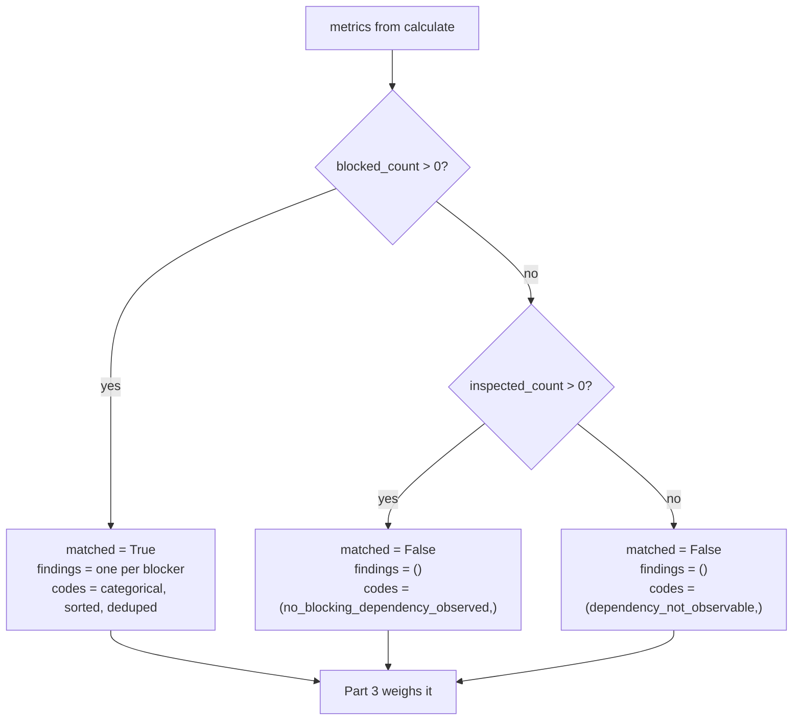

# 05 · Evaluator

**Stage 6:** `dependency_unit.py:DependencyUnit.evaluate_meaning(view, metrics, observations)` — `@abstractmethod`, implemented here
**Returns:** `unit.py:Verdict`

---

## 1 · What it is for

Turn six integers into a claim — and then stop, well short of a decision.

> *"`matched` means 'something stands in the way', and nothing stronger. It is not 'do not act' — a
> blocked deal may still be worth a call to the person blocking it. Turning blockage into a veto is
> a decision, and this unit does not make decisions; it hands Part 3 the graph and lets Part 3 weigh
> it."*

---

## 2 · What exists

```python
def evaluate_meaning(self, view: UnitView, metrics: Mapping[str, int],
                     observations: Sequence[Observation]) -> Verdict:
    blocked = metrics["blocked_count"] > 0
    findings = tuple(Finding(
        finding_id=f"dependency.{item.plugin_id}.{_blocker_key(item)}",
        kind="dependency",
        matched=True,
        metrics=item.metrics,
        evidence_ids=item.evidence_ids,
        reason_codes=item.reason_codes,
    ) for item in observations if int(item.metrics.get("blocked", 0)) == 1)
    if not blocked:
        return Verdict(
            matched=False,
            metrics=dict(metrics),
            reason_codes=("no_blocking_dependency_observed",) if metrics["inspected_count"]
            else ("dependency_not_observable",),
        )
    codes = tuple(sorted({code for item in observations for code in item.reason_codes
                          if not code.startswith(BLOCKER_PREFIX)
                          and int(item.metrics.get("blocked", 0)) == 1}))
    return Verdict(matched=True, metrics=dict(metrics), findings=findings, reason_codes=codes)
```

### 2.1 What the Verdict carries

| Field | Value |
|---|---|
| `matched` | `True` iff `blocked_count > 0`; `False` otherwise. **Never `None`** |
| `metrics` | a plain `dict` copy of all six calculated metrics, unmodified |
| `findings` | one `Finding` per blocking observation; `()` when nothing blocks |
| `reason_codes` | see §3.3 |
| `adjustments` | `()` — never set |
| `checks` | `()` — never set |

### 2.2 No thresholds

**This unit has no configurable evaluation threshold.** It is the only one of the four Situation
Understanding units without one — `core.context` has three, `core.timeline` has three,
`core.constraint` has none because it emits rows instead of numbers. Here there is nothing to tune:
`blocked_count > 0` is a fact about the observations, not a judgement about them, and any threshold
placed on top of it — *"only report blockage above 3,000bp"* — would be the unit deciding what
counts as worth mentioning. That is the Decision Maker's call.

---

## 3 · How it works

### 3.1 `matched`, and the three states it does not have



`matched=False` covers both unblocked states, and the *reason code* is what separates them. That is a
deliberate choice with a cost and a reason.

The cost: a consumer reading only `result.matched` cannot tell "clear" from "blind". The reason:
`matched` is a boolean in the contract, so a third state would have to be `None`, and `None`
conventionally means *this unit declines to judge* — which `core.context` and `core.constraint` both
use. Saying "we looked at nothing, therefore we decline to judge" would be defensible, but it would
make the blind run indistinguishable from a unit that abstains on principle. The unit instead makes
a positive claim — *no blockage was demonstrated* — and qualifies it in the code and in
`inspected_count`.

The comment is explicit that the two must stay apart:

> *"Distinguishing 'clear' from 'unobservable' is the whole reason `inspected_count` is published;
> the reason codes must make the same distinction or downstream readers of the trace will collapse
> them again."*

### 3.1a `matched` here is inverted relative to every gating unit — do not set `gating=True`

`ReasonerSpec.gating` defaults to `False` and no shipped capability sets it on this unit. That is
load-bearing, because the orchestrator reads a gating unit's verdict as a stop signal:

```python
elif spec.gating and result.matched is False:
    terminal = DecisionOutcome.NO_ACTION
```

For every other unit that convention is right: `matched=False` means *the condition this capability
cares about was not met*, so there is nothing to do. For `core.dependency` the polarity is the other
way round. `matched=True` means **something is in the way** and `matched=False` means **the road is
clear** — so marking this spec `gating=True` would terminate the run with `NO_ACTION` on precisely
the deals that are free to proceed, and let every blocked one through. The unit would look like it
was working; it would be a filter running backwards.

Nothing in the code prevents it, and the one accidental guard is unrelated to polarity:
`ReasonerSpec.__post_init__` raises *"gating reasoners must use required fail-closed policy"* if
`gating` is set on a non-`REQUIRED` spec. Since `deal_cooling_v2.py:_spec` builds this unit
`OPTIONAL`, flipping `gating=True` there fails at manifest construction — but only because of the
failure policy, and adding `core.dependency` to `_REQUIRED` (which §5.5 of
[06](06-Builder-and-Metrics.md) argues for on its own merits) removes that accident and leaves the
inversion unguarded. The real guard is that no capability has done it, and the `gating` flag lives
in the manifest, three layers from this file. A Layer 3 author reading *"matched means something
stands in the way"* has been told; a Layer 3 author reading a table of specs has not.

### 3.2 Findings, and why their ids carry the field name

```python
finding_id = f"dependency.{item.plugin_id}.{_blocker_key(item)}"
```

```python
def _blocker_key(observation: Observation) -> str:
    """Recover the blocking field from an observation so its finding keeps a stable identity.

    Finding ids must survive across runs: if one of three blockers clears, the remaining two should
    still be recognisable as the same findings rather than shifting position in a numbered list.
    """
    for code in observation.reason_codes:
        if code.startswith(BLOCKER_PREFIX):
            return code[len(BLOCKER_PREFIX):]
    return observation.plugin_id
```

`BLOCKER_PREFIX = "blocker:"`, and the module comment explains why the field travels in a reason code
rather than in a dedicated attribute:

> *"Reason codes carry the blocking field itself so a trace names the wall, not just its species.
> Colons are legal in the contract's identifier grammar, so this survives Finding validation."*

`Observation.__post_init__` sorts reason codes, so `_blocker_key` iterates a sorted tuple. Exactly one
code per blocking observation starts with `blocker:`, so the loop is deterministic and the fallback
to `plugin_id` is unreachable through the shipped plugins.

The stability property is pinned by
`test_findings_keep_a_stable_identity_when_another_blocker_clears`:

```text
run 1  legal.review_status = pending, deal.owner = ""
       findings ⊇ {dependency.approval_gate.legal.review_status,
                   dependency.upstream_owner.deal.owner}

run 2  legal.review_status = pending, deal.owner = "rep_amara"     ← owner assigned
       findings  = {dependency.approval_gate.legal.review_status}
```

The surviving finding keeps its id. A positional scheme — `dependency.blocker.1` — would have
renumbered it, and *"a positional id would make every clearance look like churn"* to anything
diffing findings across runs.

**Every finding carries `matched=True`.** There is no such thing as a finding for a cleared gate:
`evaluate_meaning` filters `observations` to `blocked == 1` before building any. The inspection rows
exist only to move `inspected_count`.

Finding metrics are the observation's metrics verbatim — `blocked`, `inspected`, `depth`,
`severity_bp`, `hard`. `Finding.__post_init__` runs `_bp()` on any key ending `_bp`, so
`severity_bp` is re-validated to `0..10,000` at the contract boundary.

### 3.3 Reason codes: categorical at the unit, specific at the finding

Two different vocabularies for two different readers.

```python
codes = tuple(sorted({code for item in observations for code in item.reason_codes
                      if not code.startswith(BLOCKER_PREFIX)
                      and int(item.metrics.get("blocked", 0)) == 1}))
```

> *"Per-blocker `blocker:<field>` codes stay on their findings; the unit-level vocabulary is kept
> categorical so consumers can match on it without parsing field names."*

| Level | Contains | Example |
|---|---|---|
| `ReasonerResult.reason_codes` | categorical only, deduped, sorted | `("blocked_gate_has_no_decider", "gate_awaiting_decision", "owner_unavailable", "prerequisite_not_available")` |
| `Finding.reason_codes` | categorical **plus** `blocker:<field>` | `("blocker:owner.availability", "blocked_gate_has_no_decider", "owner_unavailable")` |

The full categorical vocabulary this unit can emit:

| Code | Emitted when |
|---|---|
| `gate_awaiting_decision` | at least one gate is pending |
| `gate_decision_refused` | at least one gate is rejected |
| `prerequisite_not_available` | at least one declared prerequisite is absent |
| `owner_unassigned` | the owner field is present and empty |
| `owner_unavailable` | the availability token is in `OWNER_UNAVAILABLE` |
| `blocked_gate_has_no_decider` | an unavailable owner **and** a pending gate |
| `waiting_on_upstream_party` | the blocked-by field names something |
| `no_blocking_dependency_observed` | `blocked_count == 0`, `inspected_count > 0` |
| `dependency_not_observable` | `blocked_count == 0`, `inspected_count == 0` |

**The three inspection codes never reach the unit level.** `gates_cleared`, `prerequisites_met` and
`ownership_clear` live on observations with `blocked == 0`, and the comprehension filters those out.
So on the Acme run — where one gate *was* cleared and one prerequisite *was* satisfied — the result's
reason codes say nothing about it. Verified:

```text
result.reason_codes = ("blocked_gate_has_no_decider", "gate_awaiting_decision",
                       "owner_unavailable", "prerequisite_not_available")
```

That information is not lost, it moved: `inspected_count = 6` against `blocked_count = 3` says three
things were checked and found clear. But a human reading only the codes sees a list of problems and
no evidence of the clean checks, and the two unblocked codes they might look for are structurally
unavailable on a blocked run. It is a defensible split — codes are for matching, counts are for
reading — and it is worth knowing before someone writes a trace renderer that shows codes only.

### 3.4 What the Evaluator never emits

```python
adjustments = ()      # never moves a play's score
checks      = ()      # never eliminates a play
```

`test_the_unit_reports_blockage_without_ranking_or_eliminating_anything` runs the unit on a rejected
security review — the most blocked situation it can produce — and asserts both are empty while
`matched is True`. A `CandidateCheck` with `ELIMINATE` would remove a play before ranking; a
`CandidateAdjustment` would move its score. Either would make this unit a decision authority. Only
`core.constraint` and `core.validation` hold that power in Layer 4, and both hold it explicitly.

### 3.5 The publishes guard runs immediately after

`evaluate()` compares `set(verdict.metrics)` against `publishes` **before** calling `build`:

```python
undeclared = sorted(set(verdict.metrics) - set(self.publishes)) if self.publishes else []
if undeclared:
    raise ValueError(f"{self.unit_id} published undeclared metrics: {', '.join(undeclared)}")
```

`verdict.metrics` is `dict(metrics)` — the Calculator's six keys, unchanged — and `publishes` names
exactly those six, so the guard is always satisfied. `test_every_published_metric_is_declared`
asserts `set(result.metrics) <= set(DependencyUnit.publishes)`, and
`test_the_unit_publishes_no_reserved_shared_metric` asserts the six are disjoint from
`{confidence_bp, urgency_bp, priority_override_bp}`.

---

## 4 · Examples and edge cases

### 4.1 Blocked — the Acme run

```text
metrics  blocked_count 3 · blocking_depth 2 · hard_blocked_count 1
         blocker_severity_bp 7,000 · inspected_count 6 · unblocked_bp 0

Verdict
  matched      True
  metrics      all six, verbatim
  findings     dependency.approval_gate.legal.review_status
               dependency.prerequisite_absent.deal.signatory_email
               dependency.upstream_owner.owner.availability
  reason_codes ("blocked_gate_has_no_decider", "gate_awaiting_decision",
                "owner_unavailable", "prerequisite_not_available")
  adjustments  ()
  checks       ()
```

Findings are in observation order — `approval_gate`, `prerequisite_absent`, `upstream_owner` — which
is `plugin_id` order, which is a property of the unit's composition and therefore stable across
runs and machines.

### 4.2 Clear — four things checked, none blocking

```python
facts = {"approval.status": "approved", "legal.review_status": "signed",
         "deal.owner": "rep_amara", "owner.availability": "active"}
```

```text
observations  gates_cleared inspected 2 · ownership_clear inspected 2
metrics       blocked_count 0 · inspected_count 4 · unblocked_bp 10,000
Verdict       matched False · findings () · reason_codes ("no_blocking_dependency_observed",)
```

`test_a_genuinely_clear_situation_is_distinguishable_from_a_blind_run`.

### 4.3 Blind — nothing inspectable

```python
facts = {"deal.status": "open"}     # no gates, no declared prerequisites, no owner field
```

```text
observations  ()
metrics       blocked_count 0 · inspected_count 0 · unblocked_bp 10,000
Verdict       matched False · findings () · reason_codes ("dependency_not_observable",)
```

`test_nothing_inspected_is_never_reported_as_nothing_blocking`, whose docstring names the stake:
*"The most dangerous output this unit could produce is a confident all-clear from no evidence."*
Note that `unblocked_bp` is still 10,000 — the honesty is entirely in the code and in
`inspected_count`.

### 4.4 One blocker clears, ids hold

```text
before   findings {dependency.approval_gate.legal.review_status,
                   dependency.upstream_owner.deal.owner}
after    findings {dependency.approval_gate.legal.review_status}
```

The surviving id is byte-identical. Anything comparing findings across runs sees one removal, not
two changes.

### 4.5 A field name that breaks the identifier grammar

`finding_id` goes through `contracts/reasoning.py:_identifier`, which enforces
`^[A-Za-z0-9][A-Za-z0-9_.:@/-]{0,191}$`. A configured field containing a space produces:

```text
ValueError: finding_id contains unsupported characters
→ orchestrator converts the unit result to ResultStatus.FAILED
```

Verified with `gate_fields: ["legal review status"]`. The failure surfaces here, in the Evaluator,
even though the fault was authored three stages earlier in the manifest. Also note the 191-character
limit: `dependency.` + `plugin_id` + `.` + field name must fit, which caps a field name at roughly
160 characters — not a practical constraint, but it is a hard one.

### 4.6 Metrics are copied, not aliased

`dict(metrics)` makes a shallow copy of the Calculator's mapping before it enters the `Verdict`.
`Verdict` itself validates nothing — the framework README flags that a float `_bp` metric would be
silently truncated by `build`'s `clamp_bp`. Unreachable here: every value in `metrics` comes from
`len()`, `sum()`, `max()` or `clamp_bp()` over integers, so no float can enter.
