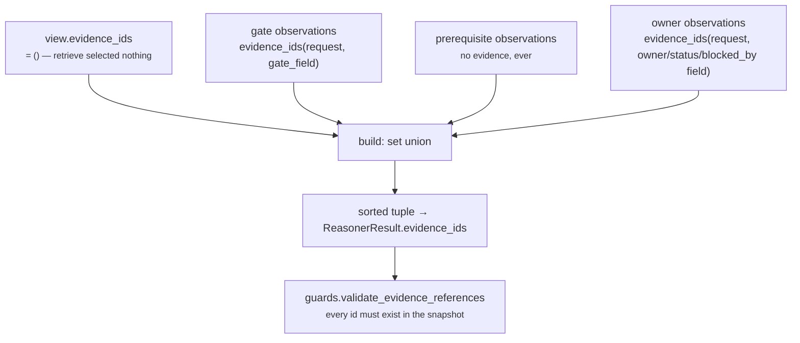

# 06 · Builder and Metrics

**Stage 7 (Builder):** `unit.py:ReasoningUnit.build(view, verdict, observations)` — **base implementation, not overridden**
**Stage 8 (Metrics):** `DependencyUnit.publishes` — six names, declared not discovered

---

## 1 · What it is for

Assemble the one object shape every unit in Layer 4 returns, and declare — in advance, in the class
body — exactly which metric names this unit is allowed to move.

---

## 2 · What exists

### 2.1 The Builder, unchanged

`DependencyUnit` does **not** override `build`. The base implementation does three things for it:

```python
def build(self, view: UnitView, verdict: Verdict,
          observations: Sequence[Observation]) -> ReasonerResult:
    evidence = set(view.evidence_ids)
    for observation in observations:
        evidence.update(observation.evidence_ids)
    return ReasonerResult(
        reasoner_id=self.unit_id,
        reasoner_version=self.version,
        status=ResultStatus.COMPLETED,
        matched=verdict.matched,
        metrics={name: clamp_bp(value) if name.endswith("_bp") else value
                 for name, value in verdict.metrics.items()},
        findings=verdict.findings,
        adjustments=verdict.adjustments,
        checks=verdict.checks,
        evidence_ids=tuple(sorted(evidence)),
        reason_codes=verdict.reason_codes,
    )
```

1. **Unions evidence** — `view.evidence_ids` plus every observation's ids, deduped and sorted.
2. **Clamps `_bp` metrics** — `unblocked_bp` and `blocker_severity_bp` pass through `clamp_bp` a
   second time. Both were already clamped in `calculate`, so this is a no-op here; it is the
   framework protecting itself against units that are less careful.
3. **Stamps identity and status** — `reasoner_id`, `reasoner_version`, `ResultStatus.COMPLETED`.

The unit has no reason to override it. `core.confidence` overrides `build` to smuggle an undeclared
metric back into its result; `core.constraint` does not override it but empties `retrieve` so it
cites nothing. `core.dependency` needs neither: its evidence is already attached where it was read,
and its metrics are exactly what it declared.

### 2.2 The ReasonerResult it produces

| Field | Value | Notes |
|---|---|---|
| `reasoner_id` | `"core.dependency"` | from the class, never from the manifest |
| `reasoner_version` | `"1.0.0"` | ditto |
| `status` | `COMPLETED` | the only status this unit ever produces itself |
| `matched` | `True` iff `blocked_count > 0` | never `None` |
| `metrics` | the six declared names | frozen to a `MappingProxyType` by the contract |
| `findings` | one per blocker, `kind="dependency"`, `matched=True` | `()` when nothing blocks |
| `adjustments` | `()` | always |
| `checks` | `()` | always |
| `evidence_ids` | union of observation evidence, sorted | `()` on runs whose only blockers are prerequisites |
| `missing_fields` | `()` | set only by the orchestrator on `INSUFFICIENT_CONTEXT` |
| `reason_codes` | categorical, sorted, deduped | see [05 · Evaluator](05-Evaluator.md) §3.3 |
| `diagnostics` | `{}` | `compare=False, repr=False`, outside `to_semantic_dict` |

### 2.3 The `publishes` list, in full

```python
publishes = ("blocked_count", "blocking_depth", "unblocked_bp", "hard_blocked_count",
             "blocker_severity_bp", "inspected_count")
```

| Metric | Type | Range | Meaning | Read it with |
|---|---|---|---|---|
| `blocked_count` | count | `0 … n`, unbounded | How many distinct things are in the way. One per blocking observation, so two pending gates count twice and a two-element `blocked_by` list counts once | `inspected_count` |
| `blocking_depth` | ordinal | `0`, `1`, `2` | `0` = nothing blocks. `1` = every blocker is ours to act on. `2` = at least one is held outside this workflow | `blocked_count` |
| `unblocked_bp` | basis points | `0 … 10,000` | Freedom to proceed. `10,000` = nothing demonstrably stands in the way. Saturates at `0` | **`inspected_count`, always** |
| `hard_blocked_count` | count | `0 … blocked_count` | Blockers that waiting will not clear: rejected gates, unavailable owners, named external parties | `blocked_count` |
| `blocker_severity_bp` | basis points | `0 … 10,000` | The severity of the single worst blocker. `10,000` means a refusal | `blocked_count` |
| `inspected_count` | count | `0 … n`, unbounded | How many gates, prerequisites and owner facts were actually looked at, blockers included. `0` means the unit was blind | everything |

Ranges observed in practice with default config: `blocker_severity_bp ∈ {4,000, 5,000, 6,000, 6,500,
7,000, 10,000}` and nothing between, because every severity is a constant or a config default.
`unblocked_bp` takes whatever the arithmetic gives.

**None of the six is reserved.** `confidence_bp` belongs to `core.confidence`; `urgency_bp` and
`priority_override_bp` belong to `core.priority`; `completeness_bp` is contested between
`core.context` and `core.confidence`. This unit stays clear of all of them, and the class docstring
says why: *"dependency changes how **achievable** work is, and letting a second unit move confidence
or urgency would silently re-score every decision in the system."*

Two names are also unique across the roster — `test_no_unit_publishes_a_metric_another_unit_owns`
enforces exactly one declared publisher per metric name — so `unblocked_bp` on any result is
unambiguously this unit's.

---

## 3 · How evidence attaches



Because `view.evidence_ids` is empty in shipped configuration (see
[02 · Retriever](02-Retriever.md)), **every** id on the result came from a plugin that explicitly
called `common.py:evidence_ids(view.request, field)`.

Acme, verified:

```text
observation gate_pending        evidence ("ev_legal",)
observation prerequisite_absent evidence ()
observation owner_unavailable   evidence ("ev_owner",)
result.evidence_ids           = ("ev_legal", "ev_owner")
```

`guards.py:validate_evidence_references` re-checks at the orchestrator boundary that every cited id
exists in `request.context.evidence`. It passes trivially here, since the ids were derived by
filtering that exact tuple.

**The unevidenced case is real.** A run whose only blocker is an absent prerequisite produces
`matched=True` with `evidence_ids == ()`. That is not a bug in the Builder — an absent fact has no
evidence row — but it has a downstream consequence in `core.validation`, covered in
[03b](03b-plugin-prerequisite_absent.md) §5.2.

---

## 4 · Who consumes these metrics

### 4.1 `core.recommendation` — the only metric consumer in the engine

`reasoners/recommendation_unit.py:ActionReadinessPlugin`:

```python
unblocked = view.prior_metric(
    _config_id(view, "dependency_source", "core.dependency"), "unblocked_bp", _ABSENT)
...
readiness = 0 if eliminated else (
    ratio if unblocked == _ABSENT else min(ratio, clamp_bp(unblocked)))
...
if unblocked != _ABSENT and not eliminated and clamp_bp(unblocked) < ratio:
    codes.append("readiness.limited_by_dependency")
```

`_ABSENT = -1`. The plugin's own rationale:

> *"And where a dependency authority published how free the work is to proceed, readiness cannot
> exceed it: preconditions being **readable** is no comfort when a named blocker sits in front of the
> work."*

So `unblocked_bp` acts as a **ceiling** on every play's `readiness_bp`:

| `unblocked_bp` | play's precondition ratio | `readiness_bp` | extra reason code |
|---|---|---|---|
| absent (`-1`) | 10,000 | 10,000 | — |
| 10,000 | 10,000 | 10,000 | — |
| 3,000 | 10,000 | **3,000** | `readiness.limited_by_dependency` |
| 3,000 | 2,500 | 2,500 | — |
| 0 | 10,000 | **0** | `readiness.limited_by_dependency` |
| 0 | 0 | **0** | — |

The last row is the one that reads wrong until you check the guard: the code appends the reason code
only when `clamp_bp(unblocked) < ratio`, so a play whose own preconditions are all unobservable
(`ratio 0`) is floored at zero by *itself* and the dependency ceiling never gets the credit. The
readiness number is right; the trace is one code short of explaining it.

`tests/test_unit_recommendation_unit.py:test_readiness_cannot_exceed_the_freedom_the_dependency_unit_measured`
exercises the 3,000bp case directly, and
`test_an_absent_dependency_unit_is_not_read_as_total_blockage` pins the `-1` row —
*"a unit that never ran is a blind spot; treating it as zero freedom would freeze every play."*
The wiring is
declared: `deal_cooling_v2.py` names `_spec("core.recommendation", ("core.validation",
"core.dependency"))`, so `view.prior` actually contains the dependency result.

Three things about this edge are worth writing down.

**The ceiling is capability-wide, not per-play.** A missing signatory email caps readiness for every
play the capability exposes, including plays that do not need a signatory. The unit publishes a
situation-level number and the consumer applies it uniformly, because nothing in either unit maps a
blocker to the plays it actually blocks. That mapping does not exist anywhere in Layer 4 today. It is
the obvious next thing this unit could publish — `blocker:<field>` codes already name the wall — and
it is not built.

**Nothing reads `inspected_count`.** `ActionReadinessPlugin` reads `unblocked_bp` alone, so a blind
run (`unblocked_bp 10,000`, `inspected_count 0`) and a genuinely clear run (`unblocked_bp 10,000`,
`inspected_count 4`) produce identical readiness. In this direction the confusion is benign — a blind
run simply applies no ceiling, which is what would happen if the unit had not run at all. But the
distinction the unit works hard to preserve is discarded by its only consumer, and a future consumer
that treated `unblocked_bp 10,000` as positive evidence of freedom would be wrong in exactly the way
the module docstring warns about.

**An undeclared dependency silently removes the ceiling.** `prior_metric` returns the default when
the dependency did not run, did not complete, or was never declared in `ReasonerSpec.dependencies`.
A capability author who wires `core.recommendation` without naming `core.dependency` gets
`_ABSENT`, no ceiling, no error, no reason code. The framework README calls this out as a general
hazard; this is one of the two places in the roster where it bites.

### 4.2 `core.validation` — consumes the result, not the metrics

`core.validation` inspects every completed result in the run:

| Plugin | What it does with `core.dependency` |
|---|---|
| `ContradictionPlugin` | Compares `_bp` metric names across units. `unblocked_bp` and `blocker_severity_bp` have no other publisher, so no divergence is detectable. Compares finding polarity across *different* units of the same `kind`; no other unit emits `kind="dependency"`, so no clash is possible |
| `EvidenceSufficiencyPlugin` | `matched=True` with `evidence_ids == ()` counts as an ungrounded claim → `claim_without_evidence`, `claimant:core.dependency` |
| `StalenessPlugin` | Reads the snapshot's evidence dates, not this unit's output |

`tests/test_unit_validation_unit.py:test_one_unit_reporting_both_polarities_is_describing_a_mixed_situation`
uses a `core.dependency`-shaped result — two findings of `kind="dependency"`, one `matched=True` and
one `matched=False` — to pin the rule that
*one* unit emitting mixed-polarity findings is describing a mixed situation, not contradicting
itself — which is a live concern for this unit only because it could plausibly emit both polarities.
Today it never does: every finding is `matched=True`.

### 4.3 The trace and the audit record

Every result becomes a `StepTrace` with `output_hash = result.semantic_hash`, which covers
`reasoner_id`, `reasoner_version`, `status`, `matched`, `metrics`, `findings`, `adjustments`,
`checks`, `evidence_ids`, `missing_fields` and `reason_codes` — everything except `diagnostics`.
`test_the_same_situation_twice_produces_identical_metrics` asserts hash equality across two
evaluations of the same facts.

Three sorts make that hash stable, and all three are load-bearing:

| Sort | Where | Protects |
|---|---|---|
| plugins by `plugin_id` | `analyze` | observation order, and therefore finding order |
| field names in `_config_fields` | all three plugins | which blocker is emitted first within a plugin |
| `sorted(...)` on codes and evidence ids | `Observation`, `Finding`, `build` | code and citation order |

### 4.4 What nothing consumes

`blocked_count`, `blocking_depth`, `hard_blocked_count`, `blocker_severity_bp` and `inspected_count`
have **no reader in the engine**. Verified by grep across `genios_engine/` (which contains `packs/`)
and `tests/`: the only files outside `reasoners/dependency_unit.py` that name any of the six are
`reason/reasoners/recommendation_unit.py`, `tests/test_unit_recommendation_unit.py` and
`tests/test_unit_dependency_unit.py`. Only the last of those names the other five, and it is this
unit's own contract.
They are trace output: a human reading a decision record, or a future consumer. Publishing them is
cheap and reversible; the alternative — folding them into `unblocked_bp` — is the exact collapse the
unit exists to prevent.

---

## 5 · Examples and edge cases

### 5.1 A complete result, blocked

```text
ReasonerResult(
  reasoner_id       "core.dependency"
  reasoner_version  "1.0.0"
  status            COMPLETED
  matched           True
  metrics           blocked_count 3 · blocking_depth 2 · hard_blocked_count 1
                    blocker_severity_bp 7,000 · inspected_count 6 · unblocked_bp 0
  findings          dependency.approval_gate.legal.review_status      ev ("ev_legal",)
                    dependency.prerequisite_absent.deal.signatory_email  ev ()
                    dependency.upstream_owner.owner.availability       ev ("ev_owner",)
  adjustments       ()
  checks            ()
  evidence_ids      ("ev_legal", "ev_owner")
  reason_codes      ("blocked_gate_has_no_decider", "gate_awaiting_decision",
                     "owner_unavailable", "prerequisite_not_available")
)
```

### 5.2 A complete result, clear

```text
matched False · findings () · evidence_ids ()
metrics blocked_count 0 · blocking_depth 0 · hard_blocked_count 0
        blocker_severity_bp 0 · inspected_count 4 · unblocked_bp 10,000
reason_codes ("no_blocking_dependency_observed",)
```

All six metrics are present. The unit never omits a metric to signal absence — an omitted key would
make `result.metrics["blocked_count"]` a `KeyError` for a consumer that reasonably expects a declared
publisher to publish.

### 5.3 A complete result, blind

Identical to §5.2 except `inspected_count 0` and
`reason_codes ("dependency_not_observable",)`. `unblocked_bp` is still `10,000`.

### 5.4 A skipped result — what the orchestrator writes instead

When a capability-level required field is absent, the whole run goes terminal before this unit is
called, and the orchestrator writes:

```text
ReasonerResult(reasoner_id="core.dependency", status=SKIPPED, metrics={},
               reason_codes=("skipped_after_insufficient_context",))
```

Verified through `ReasoningOrchestrator.execute`. `ReasonerResult.__post_init__` forbids a
non-`COMPLETED` result from carrying `matched`, metrics, findings, adjustments, checks or evidence
ids, so there is nothing for a downstream consumer to misread. `prior_metric` returns its default for
any non-`COMPLETED` result, so `ActionReadinessPlugin` correctly applies no ceiling.

### 5.5 A failed result — and the run continues without it

A malformed config value raises inside a plugin; `orchestrator._evaluate` catches it and produces
`ResultStatus.FAILED` with the exception type and message in `diagnostics`. `diagnostics` is
excluded from `to_semantic_dict`, so a failure message can never move a hash.

What happens next is not what the contract default suggests. `ReasonerSpec.failure_policy` defaults
to `FailurePolicy.REQUIRED`, but `deal_cooling_v2.py:_spec` overrides it — *"a unit added by v2.
Optional by default — see `_REQUIRED`"* — and the `_REQUIRED` set is:

```python
_REQUIRED = {"core.temporal", "core.relationship", "core.risk", "core.constraint",
             "core.priority", "core.confidence", "core.planning", "core.validation"}
```

`core.dependency` is not in it. **The only capability that names this unit declares it
`OPTIONAL`**, so a failure does *not* make the run terminal:

```python
if result.status in {ResultStatus.FAILED, ResultStatus.INSUFFICIENT_CONTEXT}:
    if spec.failure_policy == FailurePolicy.REQUIRED:
        terminal = ...
    else:
        optional_degradations.append(f"optional_{result.status.value}:{spec.reasoner_id}")
```

The run proceeds to a decision with `optional_failed:core.dependency` appended to
`ReasoningDecision.uncertainty` and `degraded=True` passed to the Decision Maker. Then
`ActionReadinessPlugin` calls `prior_metric`, which returns its default for any non-`COMPLETED`
result, so **the readiness ceiling silently disappears** and every play's `readiness_bp` reverts to
its own precondition ratio — no `readiness.limited_by_dependency` code, no ceiling, no sign in the
readiness observation that a blocker check was ever attempted.

That is the right failure mode for a shadow capability and the wrong one for a live one. The signal
is not lost — it is in `uncertainty` and in `degraded` — but it is one level away from the plugin
that would have used it. Before this unit goes live, `core.dependency` belongs in `_REQUIRED`, or
`ActionReadinessPlugin` needs a reason code for *the dependency authority was named and did not
answer*, which is a different thing from *no dependency authority was named*. `prior_metric` returns
`_ABSENT` for both.

The same override also sets `latency_budget_ms=60` rather than the contract's default of 100. The
unit does no IO and no parsing, so the tighter budget has never been exceeded; it is a diagnostic
threshold, not an abort.

### 5.6 Version discipline

`version = "1.0.0"` is stamped from the class, never from the capability's declared spec. Changing
any severity default, any vocabulary member, or the drag divisor changes every decision hash this
unit has ever contributed to. There is no frozen reference implementation for `core.dependency` —
unlike `core.constraint`, whose output is re-proved in SQL — so a change here is a replay break with
nothing pinning it beyond the 27 unit tests. Bump the version.
