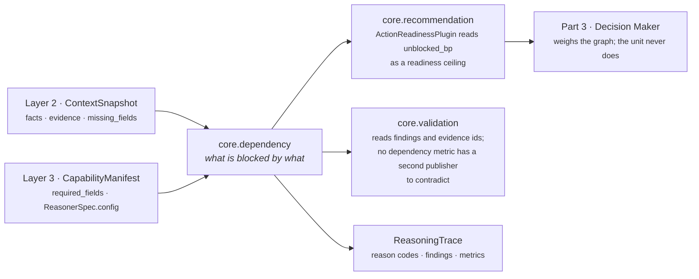
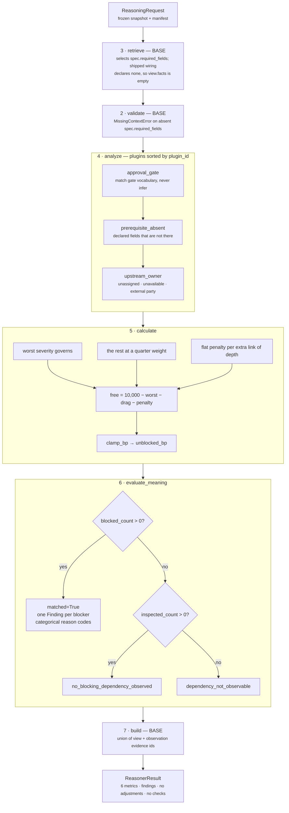

# `core.dependency` — what is blocked by what

**Module:** `genios_engine/reason/reasoners/dependency_unit.py` (430 lines)
**Tests:** `tests/test_unit_dependency_unit.py` — 27 tests, all passing (15 call a plugin's
`contribute` directly, 3 call `calculate`, 8 call `DependencyUnit().evaluate`, 1 is a protocol check;
none goes through the orchestrator)
**Category:** `UnitCategory.SITUATION_UNDERSTANDING`
**Version:** `1.0.0`
**Registered:** `reason/reasoners/__init__.py:SITUATION_UNDERSTANDING` — third of four, explicitly, no auto-discovery

---

## 1 · The business question

*What must happen before this work can happen, that has not happened?*

Every other unit in Layer 4 reasons about whether something is **worth** doing. None of them ask
whether it **can be started**. The module docstring names the failure precisely:

> *"Without that question, GeniOS confidently recommends work that hits a wall on contact — chase
> the buyer whose contract is sitting in an unfinished legal review, prepare the renewal whose owner
> left the company three weeks ago. The recommendation is not wrong about the value; it is wrong
> about the world, and a human who follows it burns trust discovering that."*

The unit reports the **graph** of blockage. It never says which blocker to clear first, never ranks
a play, never eliminates one. Choosing between chasing legal and reassigning an owner is a
judgement about cost and authority, and that belongs to the Decision Maker in Part 3.

Three families of blocker, one per plugin, because they are three different claims resolved three
different ways:

| Family | Claim | Who clears it |
|---|---|---|
| **Approval or gate** | Something was submitted for a decision and the decision has not come back | Chase the approver |
| **Prerequisite fact** | The capability declared it needs a fact and does not have it | Go and retrieve it |
| **Upstream owner** | Nobody is assigned, the assignee is unavailable, or an external party holds the work | A person has to move |

---

## 2 · Place in the pipeline

`core.dependency` runs in Category 1, before anything evaluates or optimises. It reads only the
frozen `ContextSnapshot` and the capability manifest — it declares **no `ReasonerSpec.dependencies`
in any shipped capability**, so it never reads another unit's output.



**Only one module in the repository reads a dependency metric.**
`reasoners/recommendation_unit.py:ActionReadinessPlugin` reads `unblocked_bp` via

```python
unblocked = view.prior_metric(
    _config_id(view, "dependency_source", "core.dependency"), "unblocked_bp", _ABSENT)
```

with `_ABSENT = -1`, and uses it as a **ceiling** on per-play readiness: *"preconditions being
readable is no comfort when a named blocker sits in front of the work."* The other five metrics have
no consumer in the engine today — they are trace and audit output. Verified by grep across
`genios_engine/` (which contains `packs/`) and `tests/`: outside this unit's own module the only
files naming any of the six are `reason/reasoners/recommendation_unit.py` and
`tests/test_unit_recommendation_unit.py`.

**Wiring.** The single capability that names this unit is `packs/capabilities/deal_cooling_v2.py`
(`sales.deal_cooling_full` v2), as bare `_spec("core.dependency")` — **no config overrides at all**,
so every number in this folder is the module default. That helper does set two things the contract
would not: `failure_policy=FailurePolicy.OPTIONAL` (this unit is absent from the module's `_REQUIRED`
set) and `latency_budget_ms=60`. The optional policy matters — a failed dependency run does not stop
the decision, it silently removes the readiness ceiling. See
[06 · Builder and Metrics](06-Builder-and-Metrics.md) §5.5.

That capability ships with `live_delivery_enabled=False`. `core.dependency` has never influenced a
delivered decision, and every threshold below is a **reasoned starting position, not a tuned one**.

---

## 3 · Plugins and published metrics

### The three plugins

`analyze()` is the base implementation, which iterates `sorted(self.plugins, key=plugin_id)`. For
this unit the alphabetical order happens to read as a sensible narrative: the gate, then the missing
fact, then the person.

| Order | Class | `plugin_id` | Emits (blocking) | Emits (inspection) | File |
|---|---|---|---|---|---|
| 1 | `ApprovalGatePlugin` | `approval_gate` | `dependency.gate_pending`, `dependency.gate_rejected` | `dependency.gates_cleared` | [03a](03a-plugin-approval_gate.md) |
| 2 | `PrerequisiteAbsencePlugin` | `prerequisite_absent` | `dependency.prerequisite_absent` | `dependency.prerequisites_met` | [03b](03b-plugin-prerequisite_absent.md) |
| 3 | `UpstreamOwnerPlugin` | `upstream_owner` | `dependency.owner_unassigned`, `dependency.owner_unavailable`, `dependency.upstream_party` | `dependency.ownership_clear` | [03c](03c-plugin-upstream_owner.md) |

Every blocking observation carries the same five integer metrics — `blocked`, `inspected`, `depth`,
`severity_bp`, `hard`. Every inspection observation carries two — `blocked: 0` and `inspected: N`.
That uniform shape is what lets `calculate()` be seven lines of arithmetic over a heterogeneous set
of claims.

### The six published metrics

`publishes = ("blocked_count", "blocking_depth", "unblocked_bp", "hard_blocked_count",
"blocker_severity_bp", "inspected_count")`

| Metric | Range observed | Meaning | Emitted when nothing blocks |
|---|---|---|---|
| `blocked_count` | 0 … n | How many distinct things are in the way | `0` |
| `blocking_depth` | 0, 1, 2 | Longest chain: 1 = this workflow can act, 2 = someone outside must move first | `0` |
| `unblocked_bp` | 0 … 10,000 | Freedom to proceed. 10,000bp means nothing demonstrably stands in the way | `10,000` |
| `hard_blocked_count` | 0 … n | Blockers that waiting will not clear | `0` |
| `blocker_severity_bp` | 0 … 10,000 | The severity of the single worst blocker | `0` |
| `inspected_count` | 0 … n | How many gates, prerequisites and owner facts were actually looked at | count of clear inspections |

**None of the six is a reserved shared metric.** `confidence_bp`, `urgency_bp` and
`priority_override_bp` belong to `core.confidence` and `core.priority`; the unit docstring is
explicit that *"letting a second unit move confidence or urgency would silently re-score every
decision in the system."* `test_the_unit_publishes_no_reserved_shared_metric` pins it.

`unblocked_bp` and `inspected_count` are a **pair and must be read as one**. The docstring:

> *"10,000 unblocked with 0 inspected means 'we saw no blockage because we looked at nothing', and
> a consumer that cannot tell those apart will eventually act on silence."*

`ActionReadinessPlugin` reads `unblocked_bp` alone and does not consult `inspected_count`. That is a
live gap, documented in [06 · Builder and Metrics](06-Builder-and-Metrics.md).

---

## 4 · Internal flow



The unit **overrides only `calculate()` and `evaluate_meaning()`** — the two `@abstractmethod`
stages every unit must implement. `validate()`, `retrieve()`, `analyze()` and `build()` are all the
base-class implementations, unchanged. Each of those inherited stages is covered in its own file
below, because "it uses the default" is a design decision with consequences, not an absence of one.

The one structural surprise: because the shipped `ReasonerSpec` for `core.dependency` declares no
`required_fields`, `retrieve()` produces an **empty `view.facts`**, and all three plugins read
`view.request.context.facts` directly rather than the bounded window the framework intends. See
[02 · Retriever](02-Retriever.md).

---

## 5 · Every config key, with its default

All eleven keys are read from `ReasonerSpec.config` — the per-capability tuning authored in Layer 3
and versioned with the manifest. **None is set by any shipped capability.**

| Key | Type | Default | Read by | Malformed value |
|---|---|---|---|---|
| `gate_fields` | list of field names | `approval.status`, `finance.approval_status`, `legal.review_status`, `procurement.status`, `security.review_status` | `approval_gate`, and `upstream_owner` via `_pending_gate_fields` | raises `ValueError: gate_fields must be a list of fact field names` |
| `gate_pending_severity_bp` | int 0–10,000 | `6,000` | `approval_gate` | raises — **eagerly, on every run** |
| `prerequisite_fields` | list of field names | `capability.required_fields` | `prerequisite_absent` | raises |
| `prerequisite_severity_bp` | int 0–10,000 | `5,000` | `prerequisite_absent` | raises — only when something is declared |
| `owner_field` | field name | `deal.owner` | `upstream_owner` | raises |
| `owner_status_field` | field name | `owner.availability` | `upstream_owner` | raises |
| `blocked_by_field` | field name | `deal.blocked_by` | `upstream_owner` | raises |
| `unassigned_severity_bp` | int 0–10,000 | `4,000` | `upstream_owner` | raises — **only when the owner is actually unassigned** |
| `unavailable_severity_bp` | int 0–10,000 | `7,000` | `upstream_owner` | raises — only when the owner is actually unavailable |
| `upstream_severity_bp` | int 0–10,000 | `6,500` | `upstream_owner` | raises — only when an upstream party is named |
| `depth_penalty_bp` | int 0–10,000 | `1,500` | `calculate` | raises — only when at least one blocker exists |

A **rejected gate is fixed at `10,000bp` and has no config key**, deliberately: *"a refusal cannot
be waited out and is not ours to overturn, so it is both maximal and hard; a pending gate is tunable
because how long a capability tolerates a queue is a business judgement, not a fact."*

### Compromise · config validation is lazy in three of four places

`_config_bp` raises on anything that is not an integer in `0..10_000` — the intent, per
`test_configuration_that_is_not_basis_points_is_a_manifest_fault`, is that *"bad tuning must fail
loudly at Layer 3 rather than quietly skew every renewal decision."*

But **when** it raises depends on where the call sits:

| Key | Call site | Fails on |
|---|---|---|
| `gate_pending_severity_bp` | first line of `ApprovalGatePlugin.contribute` | **every run** |
| `prerequisite_severity_bp` | after the `if not declared: return ()` guard | only runs where the capability declared prerequisites |
| `unassigned_severity_bp` | inside the unassigned branch | only runs where the owner is actually unassigned |
| `unavailable_severity_bp` | inside the unavailable branch | only runs where the owner is actually unavailable |
| `upstream_severity_bp` | inside the upstream branch | only runs where an upstream party is named |
| `depth_penalty_bp` | after the `if not blockers` early return | only runs with at least one blocker |

Verified by direct call: `unassigned_severity_bp: 20_000` with an assigned owner produces **no
error**, and `prerequisite_severity_bp: -5` with nothing declared produces no error. A manifest
authored with a bad severity can therefore pass a deploy, pass a week of clean runs, and raise a
`FAILED` result on the first situation that trips the branch. Hoisting the five lazy `_config_bp`
calls to the top of their `contribute` methods would cost nothing and close it.

---

## 6 · Silence semantics

Three distinct silences, and keeping them apart is most of this unit's value.

| Situation | What the unit emits | Reason code |
|---|---|---|
| A plugin has nothing it can honestly claim | **no observation at all** — not a zero | — |
| Things were inspected and none blocked | `blocked_count: 0`, `inspected_count: N`, `unblocked_bp: 10,000` | `no_blocking_dependency_observed` |
| Nothing was inspectable | `blocked_count: 0`, `inspected_count: 0`, `unblocked_bp: 10,000` | `dependency_not_observable` |

The unit **does not lower `unblocked_bp` to signal ignorance**. From `calculate()`: *"this unit will
not editorialise by lowering a number it has no evidence to lower."* The honesty lives in
`inspected_count` and in the reason code, never in the headline number.

An unrecognised status word — `"escalated"`, `"tier_2"` — produces no observation and does not count
as an inspection. *"An unrecognised gate value means we do not know the gate's state, and guessing
'probably fine' is precisely the failure this unit exists to prevent."*

---

## 7 · The files

| File | Covers |
|---|---|
| [01 · Input and Validator](01-Input-and-Validator.md) | What arrives, why `required_fields` is empty, the base validator, and the `MissingContextError` → `INSUFFICIENT_CONTEXT` path this unit almost never takes |
| [02 · Retriever](02-Retriever.md) | Why the base `retrieve()` gives this unit an empty window, how the plugins work around it, and what that costs |
| [03 · Analyzer](03-Analyzer.md) | The plugin seam: execution order, the shared observation shape, and the one place two plugins interact |
| [03a · `approval_gate`](03a-plugin-approval_gate.md) | Gate vocabulary, pending vs rejected, the cleared-inspection row |
| [03b · `prerequisite_absent`](03b-plugin-prerequisite_absent.md) | Declared prerequisites, null placeholders, and the plugin that cites no evidence |
| [03c · `upstream_owner`](03c-plugin-upstream_owner.md) | Unassigned, unavailable, external party — and the only place depth is earned rather than declared |
| [04 · Calculator](04-Calculator.md) | The full arithmetic, why max-plus-quarter-drag-plus-flat-penalty, and a worked combination |
| [05 · Evaluator](05-Evaluator.md) | `matched` semantics, finding identity, the two unblocked reason codes |
| [06 · Builder and Metrics](06-Builder-and-Metrics.md) | The `ReasonerResult` in full, evidence attachment, and who reads these metrics downstream |

---

## 8 · Verifying this document

```bash
cd /Users/rohitswerashi/genios-brain && .venv/bin/python -m pytest tests/test_unit_dependency_unit.py -q
# 27 passed
```

Every number in this folder was produced by executing the shipped code, not read off a docstring.
Where a docstring and the arithmetic disagree, the file says so.
