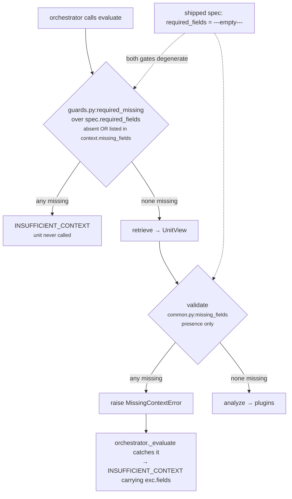

# 01 · Input and Validator — `core.timeline`

**Stages 1 and 2 of the eight.** Neither is overridden by this unit; both are the base-class
implementations in `genios_engine/reason/unit.py`.

---

## 1 · What it is for

Stage 1 answers *what did the capability hand this unit?* Stage 2 answers *is that enough to reason
from, or should the unit refuse?*

For `core.timeline` the answer to the second question is currently **it never refuses** — and that
is a consequence of how the shipped capability declares it, not of anything in the unit. The rest of
this file establishes exactly why, and what would have to change for the refusal path to become
reachable.

---

## 2 · What exists

### 2.1 · The input pair

`unit.py:ReasoningUnit.evaluate(request, prior_results)` takes two arguments and nothing else:

| Argument | Type | Contents for `core.timeline` |
|---|---|---|
| `request` | `contracts/reasoning.py:ReasoningRequest` | org id, the `CapabilityManifest`, the frozen `ContextSnapshot`, `evaluation_time`, `trigger_kind`, `config_snapshot_id` |
| `prior_results` | `Mapping[str, ReasonerResult]` | **only** the results of reasoners named in this unit's `spec.dependencies` |

The unit reads these parts of the request and no others:

```text
request.evaluation_time            the frozen "now" — the only clock a unit may read
request.context.facts              every fact Layer 2 published for the root entity
request.capability.reasoners       via active_spec, to find this unit's own ReasonerSpec
request.context.evidence           via common.py:evidence_ids, for attribution only
```

It never touches `request.context.neighbor_facts`, `request.context.missing_fields`,
`request.capability.plays`, `request.capability.policies` or `request.trigger_kind`.

### 2.2 · The facts it looks for

| Fact | Constant | Required? | Absent behaviour |
|---|---|---|---|
| `timeline.events` | `EVENT_LIST_FIELD` | no | contributes no events |
| `deal.last_inbound` | in `DEFAULT_TIMELINE_FIELDS` | no | contributes no event |
| `deal.last_outbound` | in `DEFAULT_TIMELINE_FIELDS` | no | contributes no event |
| `thread.last_inbound` | in `DEFAULT_TIMELINE_FIELDS` | no | contributes no event |
| `thread.last_outbound` | in `DEFAULT_TIMELINE_FIELDS` | no | contributes no event |
| `timeline.cadence_hours` | `CADENCE_FACT` | no | cadence plugin falls through to `expected_cadence_hours` config, and is silent if that is absent too |

**Every one of them is optional.** The unit is designed to degrade claim by claim rather than refuse
as a whole — an absent field contributes nothing rather than a zero, and the plugin whose claim
depended on it goes silent.

Values are read through `common.py:fact_value`, which unwraps a `{"value": …}` record if Layer 2
supplied one and otherwise takes the raw value. Verified: `{"deal.last_inbound": {"value": "<iso>"}}`
produces `event_count: 1`, identically to the bare string form.

### 2.3 · `required_fields`

**The unit declares none of its own.** `required_fields` is not a class attribute on
`ReasoningUnit` — it lives on the per-capability `ReasonerSpec`:

```python
# contracts/reasoning.py:ReasonerSpec
required_fields: tuple[str, ...] = ()
```

`TimelineUnit.__init__` builds a descriptor `ReasonerSpec(reasoner_id="core.timeline",
version="1.0.0")` with the default empty tuple, but that descriptor is only the unit's identity
card — `evaluate()` calls `common.py:active_spec(request, self.unit_id)`, which returns the
**capability's** spec for this unit. The requirement is authored in Layer 3, per capability.

What the one shipped capability authors (`packs/capabilities/deal_cooling_v2.py:80`):

```python
_spec("core.timeline", config={"cadence_hours": 336})
#     dependencies=()        required_fields=()        latency_budget_ms=60
#     failure_policy=OPTIONAL (core.timeline is not in _REQUIRED)
```

`required_fields=()`. So the declared requirement is: nothing.

### 2.4 · `validate()` — base implementation, unchanged

```python
# unit.py:ReasoningUnit.validate
def validate(self, view: UnitView) -> None:
    absent = missing_fields(view.request, view.spec.required_fields)
    if absent:
        raise MissingContextError(*absent)
```

`TimelineUnit` does **not** override it. Six of the seventeen framework units do; this is not one of
them.

`common.py:missing_fields` checks presence only:

```python
for field in fields:
    if field.startswith("neighbor:"):
        if field.split(":", 1)[1] not in request.context.neighbor_facts:
            missing.append(field)
    elif field not in request.context.facts:
        missing.append(field)
return tuple(sorted(missing))
```

---

## 3 · How it works

### 3.1 · The refusal path, and why it is currently unreachable



Two gates, two different definitions of "missing", and with `required_fields=()` **both are
vacuous**. `missing_fields(request, ())` iterates an empty tuple and returns `()`, so `validate`
cannot raise. The unit is therefore reached on every run of the capability, and can never produce
`ResultStatus.INSUFFICIENT_CONTEXT`.

The stricter of the two definitions lives in `guards.py:required_missing`, which also treats a field
as missing when Layer 2 explicitly listed it in `context.missing_fields`. In the orchestrated path
that gate runs first, so the unit's own validator is effectively unreachable even when
`required_fields` is non-empty. It matters mainly when the unit is invoked directly from a test.

### 3.2 · Why not overriding `validate` is the right call here

The base validator enforces a declaration; it does not invent one. Three arguments for leaving it
alone:

**A timeline has no single indispensable field.** The unit reads six possible sources and can form a
claim from any one of them. `deal.last_inbound` alone gives an ordering observation. A
`timeline.events` log alone gives ordering plus trend. There is no field whose absence makes every
claim impossible, so there is nothing honest to put in a hard-coded requirement.

**The absence is already the answer.** With no datable event, `calculate` returns
`{"event_count": 0}` and `evaluate_meaning` returns `matched=None`. That is a *more* informative
outcome than `INSUFFICIENT_CONTEXT`, which carries no metrics at all
(`ReasonerResult.__post_init__` forbids metrics on a non-`COMPLETED` result). The unit's own
docstring makes the distinction the point:

> *"With no datable event the verdict is `None`, not `False`: 'we cannot see the shape' and 'the
> shape is fine' are different claims, and collapsing them would let an empty snapshot read as a
> healthy one."*

Refusing would collapse a third state — *we looked and there was nothing* — into the same
`INSUFFICIENT_CONTEXT` bucket as *we were not given what we asked for*.

**The requirement belongs to the capability.** A capability that genuinely cannot act without a
timeline can author `required_fields=("timeline.events",)` in its `ReasonerSpec` and get the refusal
for free, without a code change. That is the framework paying for itself.

### 3.3 · What a refusal would look like

If a capability author wrote:

```python
_spec("core.timeline", required_fields=("timeline.events", "timeline.cadence_hours"))
```

and Layer 2 supplied neither, then:

```text
missing_fields(request, ("timeline.cadence_hours", "timeline.events"))
    → ("timeline.cadence_hours", "timeline.events")        # sorted
raise MissingContextError("timeline.cadence_hours", "timeline.events")

orchestrator._evaluate catches MissingContextError
    → ReasonerResult(reasoner_id="core.timeline",
                     status=ResultStatus.INSUFFICIENT_CONTEXT,
                     matched=None, metrics={}, findings=(), evidence_ids=())
```

Note `ReasonerSpec.__post_init__` sorts and dedupes `required_fields`, and `missing_fields` sorts
its output, so the field list in the error is deterministic regardless of authoring order.

---

## 4 · Examples and edge cases

### 4.1 · The empty snapshot — the case the unit is designed around

```python
facts = {"deal.status": "open"}
```

No timestamp fact, no event log, no cadence. Verified end to end
(`test_an_empty_snapshot_yields_unknown_rather_than_a_healthy_looking_zero`):

```text
validate            → no raise (required_fields is empty)
_known_events       → ()
event_ordering      → ()          no event can be dated
cadence_adherence   → ()          no cadence declared
trend_direction     → ()          no gaps
observations        → ()
calculate           → {"event_count": 0}
evaluate_meaning    → Verdict(matched=None, metrics={"event_count": 0})

result.status   == COMPLETED       ← not INSUFFICIENT_CONTEXT
result.matched  is None
result.metrics  == {"event_count": 0}
result.findings == ()
```

`COMPLETED` with `matched=None` is a stronger statement than a refusal: the unit ran, looked at
everything it was allowed to look at, and reports that the shape is not observable.

### 4.2 · A capability that declares nothing but supplies everything

```python
facts = {"deal.last_inbound": "<300h ago>",
         "deal.last_outbound": "<200h ago>",
         "thread.last_inbound": "<100h ago>"}
required_fields = ()
```

Verified output:

```text
event_count 3 · elapsed_hours 100 · span_hours 200
gap_hours 100 · max_gap_hours 100 · acceleration_bp 5,000
reason_codes ("timeline_steady",)
```

Three full claims from fields nobody required. The validator's silence costs nothing here.

### 4.3 · Malformed input never reaches the validator

`validate` checks *presence*, never *shape*. A field present with garbage in it passes validation and
is dropped later, inside `_moment`:

| Input | Passes `validate`? | Effect |
|---|---|---|
| `{"occurred_at": "last tuesday"}` | yes | `parse_time` raises `ValueError`, `_moment` returns `None`, the event is dropped |
| `{"occurred_at": "2026-08-06T12:00:00"}` (naive) | yes | `parse_time` raises "must be timezone-aware", event dropped |
| `{"event_id": "e1"}` (no moment key) | yes | `_moment` returns `None`, event dropped |
| `"timeline.events": "nope"` (a string, not a list) | yes | `isinstance(raw, (tuple, list))` is `False`; the whole log is ignored silently |
| `"timeline.cadence_hours": "weekly"` | yes | not an `int`, falls through to `expected_cadence_hours` config |
| `"timeline.cadence_hours": True` | yes | `isinstance(raw, bool)` guard rejects it explicitly — `True` is an `int` in Python |

`test_a_malformed_timestamp_drops_its_event_rather_than_guessing_a_moment` pins the first case with
the reason: *"half-parsed history is worse than less history: it silently moves every gap around
it."*

The string-log case is the quietest failure in the unit. `{"timeline.events": "nope"}` produces
`event_count: 0` and no diagnostic whatsoever, indistinguishable from a snapshot that never had an
event log. Nothing warns, nothing raises, no reason code is emitted.

### 4.4 · Bad config raises before the validator can matter

`validate` runs before `analyze`, but the config validators live *inside* the plugins, so a
malformed threshold surfaces as a `ValueError` out of stage 4 or 6 rather than as a
`MissingContextError` out of stage 2. The orchestrator converts it to `ResultStatus.FAILED`, not
`INSUFFICIENT_CONTEXT`:

| Config | Raised from | Message |
|---|---|---|
| `{"timeline_fields": "deal.last_inbound"}` | `_config_fields`, stage 4 | `timeline_fields must be a list of fact field names` |
| `{"expected_cadence_hours": "168"}` | `_config_hours`, stage 4 | `expected_cadence_hours must be a whole number of hours between 1 and 8760` |
| `{"expected_cadence_hours": 9000}` | `_config_hours`, stage 4 | same message — 9,000 exceeds `_MAX_CADENCE_HOURS` |
| `{"cadence_breach_threshold_bp": 20000}` | `_config_bp`, stage 6 | `cadence_breach_threshold_bp must be integer basis points` |
| `{"decay_threshold_bp": True}` | `_config_bp`, stage 6 | same message — `bool` is rejected before the `int` check |

The two classes of failure are meant to look different in the trace. A missing *fact* is
`INSUFFICIENT_CONTEXT` and says the situation was thin; a malformed *config value* is `FAILED` and
says the capability is misauthored.

### 4.5 · The boundary the validator does not guard

`required_fields` accepts a `neighbor:`-prefixed name, and `missing_fields` honours the prefix. But
`core.timeline` never reads `context.neighbor_facts` — every fact read goes through
`fact_value(view.request, name)` with `neighbor=False`. A capability author who wrote
`required_fields=("neighbor:account.last_review",)` would get a validator that refuses when the
neighbour fact is absent and a unit that ignores it when it is present. This is the framework-wide
asymmetry recorded in the unit-framework README §3.1, reaching this unit unchanged.

---

## Related

| Document | Covers |
|---|---|
| [README](README.md) | the unit's map, config keys, known problems |
| [02 · Retriever](02-Retriever.md) | what `UnitView` the validator was handed, and why it is empty |
| [05 · Evaluator](05-Evaluator.md) | the `matched=None` verdict that stands in for a refusal |
| `genios_engine/reason/protocols.py` | `MissingContextError` |
| `genios_engine/reason/guards.py` | `required_missing`, the stricter pre-call gate |
