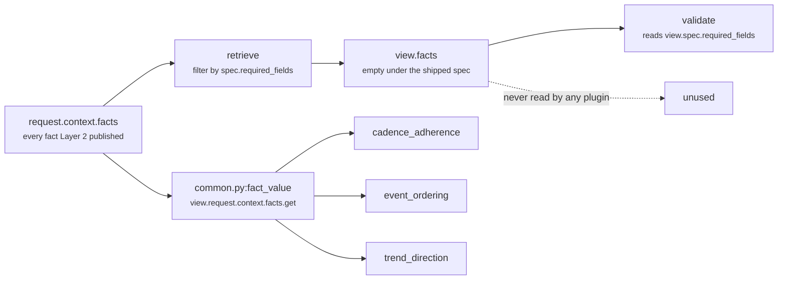

# 02 · Retriever — `core.timeline`

**Stage 3 of the eight.** Not overridden. `core.timeline` uses `unit.py:ReasoningUnit.retrieve`
exactly as written.

---

## 1 · What it is for

The Retriever's job is to select the slice of the frozen snapshot this unit is allowed to see, and
to hand it over as a `UnitView` — one object a reviewer can inspect to answer *what was this unit
looking at?* without reading the unit's body.

**The Retriever does not fetch.** Units are forbidden a database, network, clock, random source or
language model. Retrieval already happened when Layer 2 froze the `ContextSnapshot` and Layer 4
hashed its content into the request id. "Retrieve" here means *select and shape* from that frozen
input — the only form of retrieval that survives replay.

For this unit there is an honest complication, and it is the main content of this file: the view is
built, and then the plugins read around it.

---

## 2 · What exists

### 2.1 · The base implementation, unchanged

```python
# unit.py:ReasoningUnit.retrieve
def retrieve(self, request: ReasoningRequest, spec: ReasonerSpec,
             prior: Mapping[str, ReasonerResult]) -> UnitView:
    wanted = tuple(field for field in spec.required_fields
                   if not field.startswith("neighbor:"))
    facts = {name: request.context.facts[name]
             for name in wanted if name in request.context.facts}
    evidence = tuple(sorted(item.evidence_id for item in request.context.evidence
                            if item.field in facts))
    return UnitView(request=request, spec=spec, prior=prior,
                    facts=MappingProxyType(facts), evidence_ids=evidence)
```

`TimelineUnit` defines no `retrieve`. Three of the seventeen framework units override this stage;
this is not one of them.

### 2.2 · The `UnitView` it produces

| Field | Type | Contents for `core.timeline` under the shipped spec |
|---|---|---|
| `request` | `ReasoningRequest` | the whole frozen request, passed through untouched |
| `spec` | `ReasonerSpec` | the **capability's** spec for `core.timeline`, found by `active_spec` |
| `prior` | `Mapping[str, ReasonerResult]` | `{}` — the spec declares `dependencies=()` |
| `facts` | `MappingProxyType` | `{}` — the spec declares `required_fields=()` |
| `evidence_ids` | `tuple[str, ...]` | `()` — derived from `facts`, which is empty |

Plus one convenience property:

```python
@property
def config(self) -> Mapping[str, Any]:
    return self.spec.config
```

`view.config` is the only part of the view the unit reads heavily — every one of the five tuning
keys goes through it.

Verified directly:

```text
request facts    {"deal.last_inbound": "<30h ago>"}
evidence         (EvidenceRef(evidence_id="ev1", field="deal.last_inbound", …),)
spec             required_fields=()

view.facts        → {}
view.evidence_ids → ()
result.evidence_ids → ("ev1",)     ← attached by the plugin, not by the retriever
```

---

## 3 · How it works

### 3.1 · The plugins bypass `view.facts` entirely

This is the fact that matters most about this stage, and it is not documented in the module.



Every fact read in `timeline_unit.py` goes through `common.py:fact_value(view.request, name)`, which
reads `request.context.facts` — the **whole** snapshot, not the selected window:

```python
# every read site in the module
fact_value(view.request, EVENT_LIST_FIELD)      # _known_events
fact_value(view.request, name)                  # _known_events, per timeline field
fact_value(view.request, CADENCE_FACT)          # CadenceAdherencePlugin._declared_hours
```

`view.facts` appears nowhere in the file.

**Why it is not a bug, and why it is still worth writing down.** The unit's fact set is *dynamic* —
`timeline_fields` is a config key, so which facts constitute the timeline is decided per capability
at analysis time, not at spec-authoring time. The base retriever can only select `required_fields`,
which is a different declaration for a different purpose. Selecting through it would give the unit a
window that lies: it would look narrow while the code reads wide.

The cost is that `UnitView`'s promise — *"a unit's inputs are visible in one place and a reviewer can
see exactly what it was allowed to look at"* — does not hold for this unit. To answer *what did
`core.timeline` read?* you must read `_config_fields`, `DEFAULT_TIMELINE_FIELDS`, `EVENT_LIST_FIELD`
and `CADENCE_FACT`, not the view. `core.constraint` faced the same problem and solved it by
overriding `retrieve` to return the whole snapshot explicitly, on the argument that *"any narrowing
here would be a window that lies about what the unit actually reads."* `core.timeline` inherits the
narrow window and reads around it instead. The two units resolve the identical tension in opposite
directions, and only one of them says so in code.

### 3.2 · The slice the unit actually selects

Stated plainly, `core.timeline`'s real retrieval is `_known_events` plus one cadence read, and both
run inside stage 4:

```text
from request.context.facts:
    timeline.events              → 0..n dated records
    <timeline_fields>            → 0..4 timestamps, default deal/thread last_inbound/outbound
    timeline.cadence_hours       → an int, or nothing

from request:
    evaluation_time              → the frozen "now"; every age is measured against it

from request.context.evidence:
    evidence_ids whose .field matches a field an accepted event came from
```

`_known_events` iterates the configured fields in `sorted(_config_fields(view))` order. The sort is
not cosmetic: it feeds the `(at, label, field)` tie-break that decides which of two facts sharing an
instant survives deduplication, so ordering the iteration makes that decision independent of how the
config list was authored.

### 3.3 · Which evidence ids land where

Evidence is attached by the plugins, through `common.py:evidence_ids`, never by the retriever:

```python
def _evidence(view: UnitView, events: Sequence[_Event]) -> tuple[str, ...]:
    return evidence_ids(view.request, *{event.field for event in events})

# common.py
def evidence_ids(request, *fields):
    wanted = set(fields)
    return tuple(sorted(item.evidence_id for item in request.context.evidence
                        if item.field in wanted))
```

| Plugin | Fields it cites | Result |
|---|---|---|
| `event_ordering` | `{event.field for event in events}` — every source that contributed a surviving event | the union of their evidence ids |
| `cadence_adherence` | `events[-1:]` — the **newest** event's field only | the evidence for the moment the breach is measured from |
| `trend_direction` | none — no `_evidence` call at all | `()` |

The cadence plugin's narrowing is deliberate and correct: the breach is a claim about one moment, so
citing the whole history would over-attribute. Verified on a three-fact snapshot with one evidence
row per fact:

```text
facts        deal.last_inbound 300h ago   → ev_in
             thread.last_inbound 200h ago → ev_thr
             deal.last_outbound 100h ago  → ev_out
             timeline.cadence_hours 168

finding timeline.event_ordering      evidence_ids ("ev_in", "ev_out", "ev_thr")
finding timeline.cadence_adherence   evidence_ids ("ev_out",)      ← newest event only
finding timeline.trend_direction     evidence_ids ()
result.evidence_ids                  ("ev_in", "ev_out", "ev_thr")
```

`test_ordering_carries_the_evidence_of_the_facts_it_read` pins the ordering case with the reason: *"a
shape nobody can trace back to a source cannot be defended in a review."*

### 3.4 · Two known limits of the evidence match

**`context_scope` is ignored.** `EvidenceRef` carries `context_scope` of `"root"` or `"neighbor"`;
`evidence_ids` matches only on `item.field in wanted`. A neighbour-scoped evidence row whose field
name collides with a timeline field would be attached as though the unit had observed it. Harmless
today because no shipped capability has a colliding name.

**An event log cites almost nothing.** Events taken from `timeline.events` all carry
`field == "timeline.events"`, so the whole log resolves to whatever evidence rows exist for that one
field name — typically none. A snapshot whose timeline comes entirely from the explicit log produces
`result.evidence_ids == ()` even though every event in it was dated. The per-event provenance that
`_Event.field` exists to preserve is real inside the unit and invisible outside it.

---

## 4 · Examples and edge cases

### 4.1 · A capability that does declare required fields

```python
_spec("core.timeline", required_fields=("deal.last_inbound",))
```

Now the retriever does something visible:

```text
wanted            = ("deal.last_inbound",)
view.facts        = {"deal.last_inbound": "<30h ago>"}
view.evidence_ids = ("ev_in",)                 # rows whose .field is deal.last_inbound
```

and `build` unions `view.evidence_ids` with the observation evidence. Because the ordering plugin
already cites `deal.last_inbound`, the union is the same set — the declaration changes what the view
records, not what the result carries. The only case where a declared field would *add* an evidence
id is one where the field is required but contributes no event: a required
`deal.last_inbound` holding a malformed timestamp, whose evidence row would reach
`result.evidence_ids` through the view while contributing nothing to the shape.

### 4.2 · `prior` under the shipped spec

`view.prior` is `{}` because `dependencies=()`. The one consumer is in stage 6:

```python
view.prior_metric("core.temporal", "drop_bp", 0)
```

`prior_metric` substitutes its default silently in three cases — the dependency did not run, did not
complete, or published a non-integer. Here it is a fourth: the dependency was **never passed in**,
because the orchestrator builds `prior` as
`{item: prior[item] for item in spec.dependencies if item in prior}` (`orchestrator.py:158`).
`core.temporal` runs in the same plan and completes; the timeline unit simply never sees it. The
corroboration reason code is therefore dead in production. Covered in the README §7.2 and in `05`.

### 4.3 · What a `timeline_fields` override changes, and what it does not

```python
config = {"timeline_fields": ["ticket.opened_at", "ticket.replied_at"]}
facts  = {"ticket.opened_at": "<300h ago>", "ticket.replied_at": "<100h ago>",
          "deal.last_inbound": "<5h ago>"}
```

Verified result:

```text
event_count 2 · elapsed_hours 100 · span_hours 200 · gap_hours 200 · max_gap_hours 200
```

`deal.last_inbound` is 5 hours old and is **completely ignored** — the override *replaces*
`DEFAULT_TIMELINE_FIELDS` rather than extending it. That is the intended semantics ("a capability
with different field names overrides the list") but it is a sharp edge: an author adding one ticket
field silently switches off all four deal and thread fields. Note also that `view.facts` is still
`{}` throughout — the override is a config read, invisible to the retriever.

### 4.4 · Boundary: `timeline_fields` shapes that are rejected

```python
_config_fields(view):
    raw = view.config.get("timeline_fields")
    if raw is None:                                    return DEFAULT_TIMELINE_FIELDS
    if isinstance(raw, (str, bytes)) or not isinstance(raw, (tuple, list)):
        raise ValueError("timeline_fields must be a list of fact field names")
    fields = tuple(str(item).strip() for item in raw)
    if any(not name for name in fields):
        raise ValueError("timeline_fields must not contain empty field names")
    return fields
```

| Value | Outcome |
|---|---|
| absent | the four defaults |
| `["a.b", "c.d"]` | `("a.b", "c.d")` |
| `("a.b",)` | `("a.b",)` — tuples accepted |
| `"deal.last_inbound"` | **raises** — a bare string is rejected explicitly, because iterating it would produce one field per character |
| `["a.b", "  "]` | **raises** — `strip()` leaves `""` |
| `[]` | accepted; the timeline then comes only from `timeline.events` |
| `[123]` | accepted — `str(123)` is `"123"`, which simply matches no fact |

The empty-list case is worth noting: it is a legal way to say *"this capability's timeline is the
explicit event log and nothing else"*, and nothing in the code flags it as suspicious.

---

## Related

| Document | Covers |
|---|---|
| [README](README.md) | the unit's map and config keys |
| [01 · Input and Validator](01-Input-and-Validator.md) | why `required_fields` is empty in the shipped spec |
| [03 · Analyzer](03-Analyzer.md) | `_known_events`, which is where retrieval really happens |
| [06 · Builder and Metrics](06-Builder-and-Metrics.md) | how `view.evidence_ids` and observation evidence are unioned |
| Unit framework README §3.1 | the base retriever's three consequences, `neighbor:` included |
