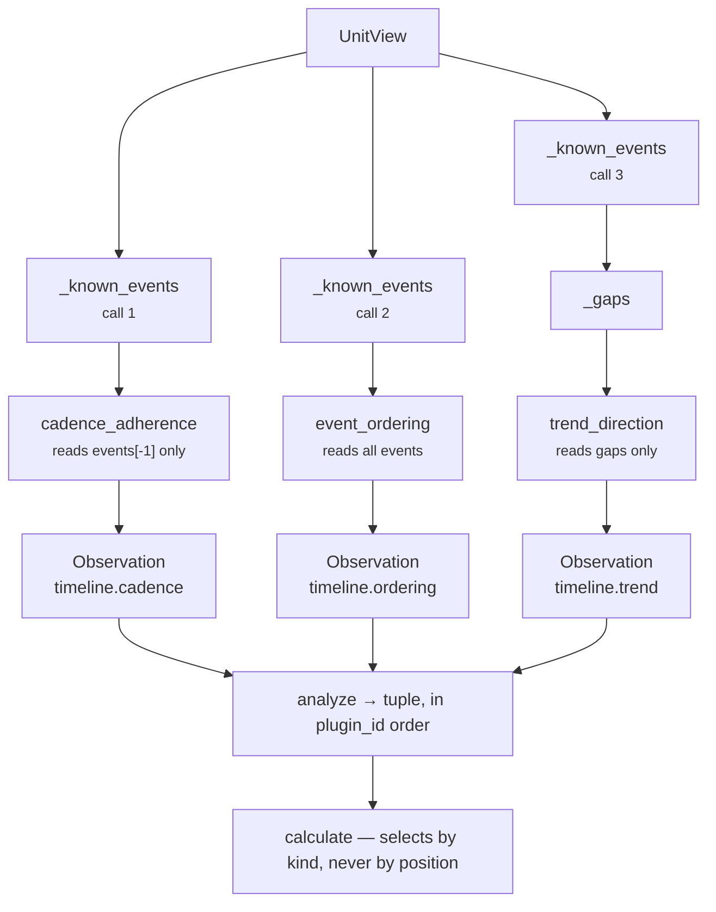
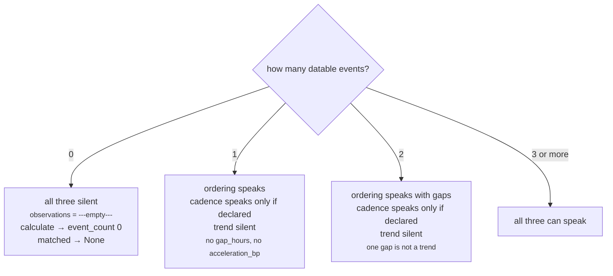
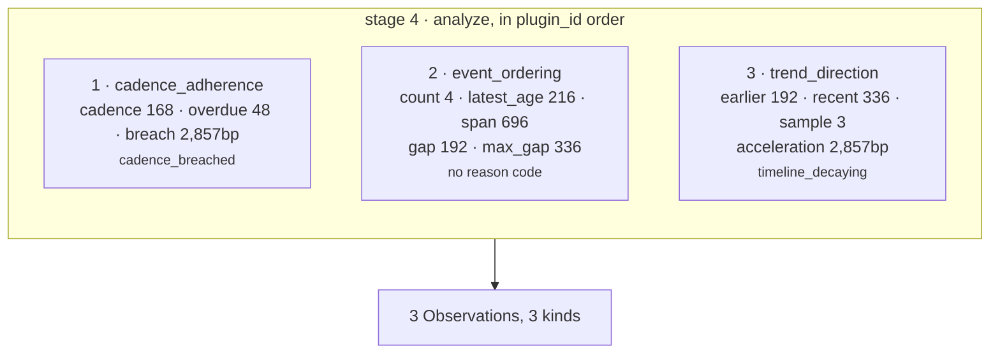

# 03 · Analyzer — the plugin seam for `core.timeline`

**Stage 4 of the eight.** Not overridden. `core.timeline` uses `unit.py:ReasoningUnit.analyze`
exactly as written. No unit in the roster overrides this stage.

---

## 1 · What it is for

The Analyzer is where the intellectual property lives. Its job is to produce *partial evidence* —
several small deterministic claims, each testable and tunable alone — rather than one opaque number.

For this unit the decomposition is stated in the module docstring, and the argument for it is that
the three claims **fail independently**:

> *"Three separate claims, therefore three plugins, because they fail independently: **ordering** —
> the only plugin that needs no declared intent. **cadence** — without a declared cadence there is no
> such thing as overdue. **trend** — needs at least three events; reporting a trend from one gap
> would be a fabrication dressed as arithmetic."*

Three different preconditions, three different silences. A monolithic `analyze_timeline()` would
have to pick one behaviour when any of them was unmet.

---

## 2 · What exists

### 2.1 · Registration

```python
# timeline_unit.py:TimelineUnit
plugins = (CadenceAdherencePlugin(), EventOrderingPlugin(), TrendDirectionPlugin())
```

Three singleton instances, constructed at class-definition time. All three are stateless — none has
`__init__`, none holds an attribute other than the class-level `plugin_id` string. `ReasoningUnit.__init__`
checks the ids are unique and raises `ValueError: core.timeline registers a duplicate analyzer plugin`
otherwise.

### 2.2 · The base `analyze`

```python
# unit.py:ReasoningUnit.analyze
def analyze(self, view: UnitView) -> tuple[Observation, ...]:
    observations: list[Observation] = []
    for plugin in sorted(self.plugins, key=lambda item: item.plugin_id):
        observations.extend(plugin.contribute(view))
    return tuple(observations)
```

### 2.3 · Execution order

`sorted(..., key=plugin_id)` gives **alphabetical** order, which for this unit is:

| Order | `plugin_id` | Class | Registration position |
|---|---|---|---|
| 1 | `cadence_adherence` | `CadenceAdherencePlugin` | 1 |
| 2 | `event_ordering` | `EventOrderingPlugin` | 2 |
| 3 | `trend_direction` | `TrendDirectionPlugin` | 3 |

Registration and alphabetical order coincide here by accident, not by design. The sort is what
matters: observation order reaches the result's `semantic_hash` through `findings`, so it must be a
property of the unit's composition rather than of the order somebody happened to type the tuple.
`test_identical_input_produces_identical_metrics` asserts `first.semantic_hash == second.semantic_hash`
across two independent evaluations.

### 2.4 · What each plugin emits

Every plugin returns either `()` or a one-element tuple. No plugin in this unit ever emits two
observations.

| `plugin_id` | `kind` | Metric keys | Reason codes | Evidence |
|---|---|---|---|---|
| `cadence_adherence` | `timeline.cadence` | `cadence_hours`, `overdue_hours`, `breach_bp` | `cadence_breached` **xor** `cadence_on_track` | the newest event's field |
| `event_ordering` | `timeline.ordering` | `event_count`, `latest_age_hours`, `span_hours`, and with ≥2 events `gap_hours`, `max_gap_hours` | at most one of `silence_exceeds_prior_gaps` / `timeline_single_event`, or none — they live in opposite branches of `if gaps:` and cannot co-occur | every contributing field |
| `trend_direction` | `timeline.trend` | `acceleration_bp`, `earlier_gap_hours`, `recent_gap_hours`, `gap_sample` | exactly one of `timeline_accelerating` / `timeline_decaying` / `timeline_steady` | none |

`Observation.__post_init__` enforces the contract on all of them: every metric must be an `int` and
not a `bool`; `evidence_ids` and `reason_codes` are deduplicated and sorted at construction; `metrics`
becomes a `MappingProxyType`.

---

## 3 · How they compose

### 3.1 · The plugins do not communicate



There is no shared state, no ordering dependency and no data path between the three. Each rebuilds
the event list from the `UnitView` for itself. The consequence a reviewer should internalise:
**deleting any one plugin changes exactly the metrics that plugin produced, and nothing else.**

The cost is that `_known_events` — which parses every timestamp, filters futures, and deduplicates —
runs three times per evaluation. At the input sizes involved (four facts plus a short event log) this
is negligible, and the alternative would be caching state on the unit instance, which the
determinism argument does not want. It is a deliberate trade, not an oversight, but nothing in the
code says so.

### 3.2 · The shared substrate

All three plugins stand on the same four module-level helpers. They are the real analyzer; the
plugins are thin readings of their output.

| Helper | Signature | Does |
|---|---|---|
| `_known_events` | `(view) -> tuple[_Event, ...]` | collect, parse, filter, dedupe, sort — oldest first |
| `_gaps` | `(events) -> tuple[int, ...]` | closed intervals between consecutive events, oldest gap first |
| `_median` | `(values) -> int` | odd → middle; even → `divide_half_up(a + b, 2)` |
| `_hours_between` | `(earlier, later) -> int` | `int(total_seconds()) // 3600`, truncated |

`_Event` is the record they pass around:

```python
@dataclass(frozen=True, slots=True)
class _Event:
    at: datetime        # the moment, normalised to UTC by parse_time
    label: str          # event_id / id / kind / type / label, or "timeline.events#0007"
    field: str          # the fact this came from — keeps evidence attributable
```

### 3.3 · `_known_events`, step by step

```text
now = view.request.evaluation_time

1. explicit log
   raw = fact_value(request, "timeline.events")
   if raw is a tuple or list:
       for ordinal, entry in enumerate(raw):
           label = _entry_label(entry, ordinal)     # first non-empty of event_id/id/kind/type/label
                                                    # else "timeline.events#0000" style fallback
           at    = _moment(entry, label)            # first present of occurred_at/at/timestamp/time
           if at is not None and at <= now:
               collect _Event(at, label, field="timeline.events")

2. timestamp facts
   for name in sorted(_config_fields(view)):        # sorted → tie-break independent of authoring
       at = _moment(fact_value(request, name), name)
       if at is not None and at <= now:
           collect _Event(at, label=name, field=name)

3. dedupe by exact instant
   for event in sorted(collected, key=(at, label, field)):
       deduped.setdefault(event.at, event)          # first wins

4. return sorted(deduped.values(), key=(at, label)) # oldest first
```

Two rules earn their comments in the source.

**Future timestamps are excluded.** *"A scheduled meeting has not happened, and letting it in would
make the newest 'event' something nobody has done yet."* The comparison is `at <= now`, so an event
landing exactly on `evaluation_time` is included and reads as `latest_age_hours: 0`.

**Identical instants collapse to one event.** *"`deal.last_inbound` and `thread.last_inbound` are
routinely the same message seen through two joins, and counting it twice would invent an extra event
and a zero-hour gap that never existed."* The dedupe key is the exact `datetime`, so two events one
second apart survive as two events with a zero-hour gap between them — the collapse is on identity,
not on proximity.

The tie-break `(at, label, field)` decides which record represents a shared instant, and therefore
which evidence gets cited. Verified: with `{"timeline.events": [{"event_id": "evt_a", …}],
"deal.last_inbound": <same instant>}`, the survivor is `("deal.last_inbound", "deal.last_inbound")` —
`"deal.last_inbound"` sorts before `"evt_a"`. The choice is total and deterministic but arbitrary in
which join wins, and nothing downstream depends on it beyond evidence attribution.

### 3.4 · Silence is the composition mechanism



A plugin returning `()` is the normal way to say *this axis has nothing to contribute here* —
silence, not a zero. That distinction is load-bearing three stages later: `calculate` copies only the
keys the observations actually carry, so an unmeasured quantity is **absent** from the published
metrics rather than present with a fabricated value.

The four preconditions, precisely:

| Plugin | Speaks when |
|---|---|
| `event_ordering` | `len(events) >= 1` |
| `cadence_adherence` | a cadence resolves (fact `1..8760`, else config `expected_cadence_hours`) **and** `len(events) >= 1` |
| `trend_direction` | `len(_gaps(events)) >= 2`, i.e. `len(events) >= 3` |

Note the ordering inside `CadenceAdherencePlugin.contribute`: the cadence is resolved **before** the
event list is built. So a malformed `expected_cadence_hours` raises even on a snapshot with no
events at all — a misauthored capability fails loudly regardless of how thin the situation is.

### 3.5 · Cross-plugin interaction — the only one there is

The three plugins never read each other's output, but two of them make claims that are *about* the
same number and can legitimately disagree in tone:

```text
event_ordering    "silence_exceeds_prior_gaps"   latest_age > max(historical gaps)
cadence_adherence "cadence_breached"             latest_age > declared cadence
```

These are independent statements and both can be absent, present, or present alone. The Northwind
case is exactly the interesting one: 216 hours of silence against a declared 168-hour cadence is
**breached**, but the relationship's historical maximum gap was 336 hours, so the silence is *not*
unprecedented. The test docstring names this as the whole point of keeping them as separate claims:

> *"216h of silence is overdue against the **declared** cadence without being unprecedented for this
> **relationship**. That distinction is the point of keeping cadence and ordering as separate
> claims."*

Collapsing them into one "lateness" score would erase the difference between *this account is late
by its own standard* and *this account is behaving unusually for itself*.

---

## 4 · Examples and edge cases

### 4.1 · A full three-plugin run — Northwind

Facts: `timeline.cadence_hours = 168`; events 912h, 720h, 552h and 216h ago.



Verified output, exactly as the unit produced it:

```text
observations
  timeline.cadence    {cadence_hours 168, overdue_hours 48, breach_bp 2857}      ("cadence_breached",)
  timeline.ordering   {event_count 4, latest_age_hours 216, span_hours 696,
                       gap_hours 192, max_gap_hours 336}                          ()
  timeline.trend      {acceleration_bp 2857, earlier_gap_hours 192,
                       recent_gap_hours 336, gap_sample 3}                        ("timeline_decaying",)
```

The two `2,857bp` values are a coincidence of this fixture, not a relationship. One is
`divide_half_up(48 × 10,000, 168)`; the other is `5,000 − divide_half_up(144 × 5,000, 336)`.

### 4.2 · One message through two joins — one observation

```python
facts = {"deal.last_inbound": "<30h ago>", "thread.last_inbound": "<30h ago>"}
```

Both facts parse, both are in the past, both land on the same instant. Dedupe collapses them:

```text
collected      2 events at the same datetime
deduped        1 event  (deal.last_inbound wins the (at, label, field) tie-break)
_gaps          ()       ← no closed interval exists

event_ordering    {event_count 1, latest_age_hours 30, span_hours 0}
                  reason_codes ("timeline_single_event",)
cadence_adherence ()    no cadence declared
trend_direction   ()    zero gaps

result metrics    {event_count 1, elapsed_hours 30, span_hours 0}
                  no gap_hours, no max_gap_hours, no acceleration_bp
matched           False
```

`test_one_message_seen_through_two_joins_counts_as_one_moment` pins this: *"counting it twice would
invent an extra event and a zero-hour gap that nobody ever lived."*

Note `matched` is `False`, not `None` — one datable event is enough for the unit to consider the
shape observed. That wrinkle is examined in `05`.

### 4.3 · A booked meeting does not become the newest event

```python
facts = {"timeline.events": [{"event_id": "evt_past",   "occurred_at": "<72h ago>"},
                             {"event_id": "evt_booked", "occurred_at": "<48h ahead>"}]}
```

```text
evt_booked   at > now   → dropped in _known_events
event_count      1
latest_age_hours 72      ← not 0, and not negative
```

Had the future event been admitted, `_hours_between(events[-1].at, now)` would be negative, giving a
negative `latest_age_hours`, a negative `overdue_hours` that `max(0, …)` would silently absorb, and
a `span_hours` that included time nobody has lived. Excluding at the source is the only place the fix
is one line.

### 4.4 · A malformed timestamp drops one event, not the run

```python
facts = {"timeline.events": [{"event_id": "evt_ok",  "occurred_at": "<48h ago>"},
                             {"event_id": "evt_bad", "occurred_at": "last tuesday"}]}
```

`_moment` catches the `ValueError` from `parse_time` and returns `None`. `event_count == 1`.
The alternative — guessing a moment, or failing the run — is worse in both directions: *"half-parsed
history is worse than less history: it silently moves every gap around it."*

The same catch swallows a naive (non-timezone-aware) datetime, which `parse_time` rejects with
`"must be timezone-aware"`.

### 4.5 · Boundary: a record with no moment key at all

`_moment` checks `_MOMENT_KEYS` in order — `occurred_at`, `at`, `timestamp`, `time` — and returns the
**first key present**, even if its value is unparseable. A record carrying both
`{"occurred_at": "garbage", "timestamp": "<valid iso>"}` is dropped: the first present key wins and
its failure ends the lookup. That is defensible — a record whose primary timestamp is corrupt should
not be salvaged from a secondary one — but it is a silent preference, not a documented one.

A record that is not a `Mapping` at all is passed straight to `parse_time`, so a bare list of ISO
strings works:

```python
facts = {"timeline.events": ["<300h ago>", "<100h ago>"]}   # legal
```

Those entries get the fallback label `timeline.events#0000`, `timeline.events#0001`, zero-padded to
four digits so the label sort stays lexicographic up to 10,000 events.

### 4.6 · Boundary: sub-hour events

`_hours_between` truncates: `int(total_seconds()) // 3600`. Four events at 50, 40, 30 and 20 minutes
ago produce three gaps of `0` hours each. The ordering plugin reports `gap_hours: 0`,
`max_gap_hours: 0`, `latest_age_hours: 0`, `span_hours: 0` — every one of them a *measured* zero,
which is exactly the value the unit's silence rules exist to distinguish from an unmeasured one. The
trend plugin has a dedicated branch for it (`03c` §3.3). The docstring's justification is plain:
*"Sub-hour precision is noise at a timeline's timescales."*

---

## Related

| Document | Covers |
|---|---|
| [03a · `cadence_adherence`](03a-plugin-cadence_adherence.md) | overdue against a declaration |
| [03b · `event_ordering`](03b-plugin-event_ordering.md) | count, recency, span, typical gap |
| [03c · `trend_direction`](03c-plugin-trend_direction.md) | gaps shortening or stretching |
| [04 · Calculator](04-Calculator.md) | how the three observations become nine metrics |
| Unit framework README §4.2 | what an `Observation` is allowed to say |
