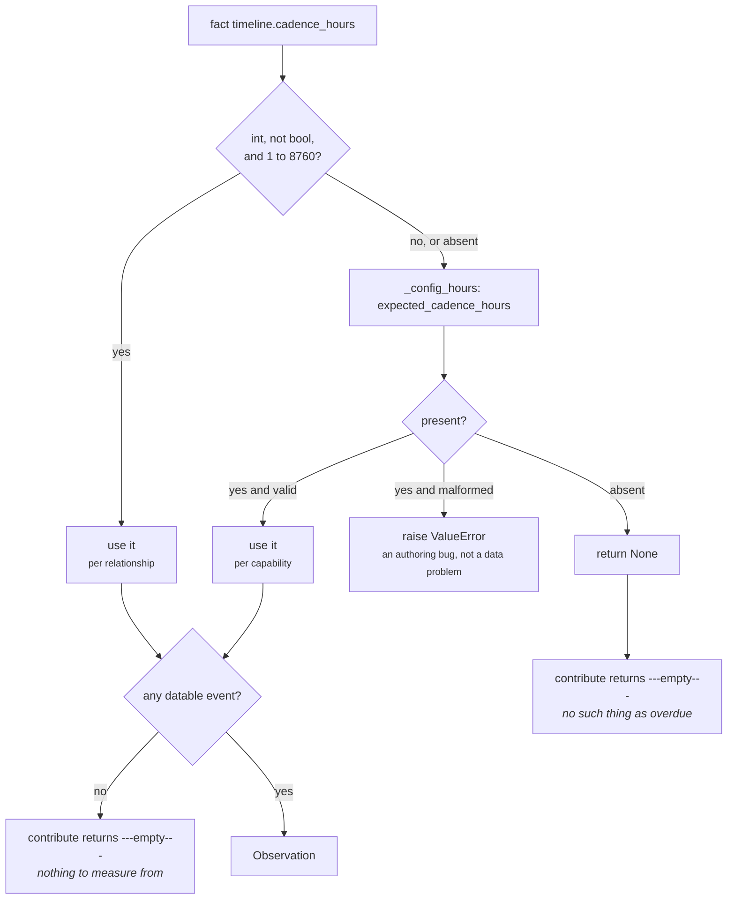

# 03a · Plugin `cadence_adherence`

**Class:** `timeline_unit.py:CadenceAdherencePlugin`
**`plugin_id`:** `cadence_adherence`
**Observation `kind`:** `timeline.cadence`
**Executes:** first of three (alphabetically)

---

## 1 · The claim it makes

*Is the newest event older than the rhythm somebody declared for this relationship?*

That is the whole claim, and the word **declared** is doing all the work. From the class docstring:

> *"Overdue is meaningless without a declaration — 'three weeks quiet' is negligence on a weekly
> account and completely normal on a quarterly one. So this plugin speaks only when a cadence exists
> as a fact (per relationship) or as capability config (per capability), and stays silent otherwise
> rather than inventing a norm the business never agreed to."*

The plugin does not observe a rhythm and does not infer one from the gap history. `event_ordering`
already publishes `gap_hours` — the median observed gap — and a plugin that used *that* as the
yardstick would be measuring the relationship against its own habits, which is a different and
weaker claim. A declared cadence is a statement of business intent, which is why breaching it means
something an operator can act on.

---

## 2 · What exists

```python
class CadenceAdherencePlugin:
    plugin_id = "cadence_adherence"

    def _declared_hours(self, view: UnitView) -> int | None:
        raw = fact_value(view.request, CADENCE_FACT)
        if not isinstance(raw, bool) and isinstance(raw, int) \
                and 1 <= raw <= _MAX_CADENCE_HOURS:
            return raw
        return _config_hours(view, "expected_cadence_hours")

    def contribute(self, view: UnitView) -> tuple[Observation, ...]:
        cadence = self._declared_hours(view)
        if cadence is None:
            return ()
        events = _known_events(view)
        if not events:
            return ()
        age = _hours_between(events[-1].at, view.request.evaluation_time)
        overdue = max(0, age - cadence)
        breach = clamp_bp(divide_half_up(overdue * 10_000, cadence))
        return (Observation(
            plugin_id=self.plugin_id,
            kind="timeline.cadence",
            metrics={"cadence_hours": cadence, "overdue_hours": overdue, "breach_bp": breach},
            evidence_ids=_evidence(view, events[-1:]),
            reason_codes=("cadence_breached",) if overdue > 0 else ("cadence_on_track",),
        ),)
```

### 2.1 · Inputs

| Source | Name | Type | Range |
|---|---|---|---|
| fact | `timeline.cadence_hours` (`CADENCE_FACT`) | `int` | `1..8_760` (`_MAX_CADENCE_HOURS`) |
| config | `expected_cadence_hours` | `int` | `1..8_760` |
| derived | `_known_events(view)[-1].at` | `datetime` | at or before `evaluation_time` |
| derived | `view.request.evaluation_time` | `datetime` | the frozen "now" |

### 2.2 · Outputs

| Metric | Range | Meaning |
|---|---|---|
| `cadence_hours` | `1..8760` | the declared rhythm actually used, after resolution |
| `overdue_hours` | `0..n` | whole hours past the declared period |
| `breach_bp` | `0..10000` | `overdue` as a fraction of one full period, capped at one period |

| Reason code | When |
|---|---|
| `cadence_breached` | `overdue_hours > 0` |
| `cadence_on_track` | `overdue_hours == 0` |

Exactly one of the two, always. There is no silent-but-observed state.

Evidence: `_evidence(view, events[-1:])` — the evidence ids of the **newest event's field only**.

---

## 3 · How it works

### 3.1 · Resolution — fact beats config, and neither is a default



Three properties of that flow are deliberate.

**A relationship's own cadence outranks the capability's.** *"The account said weekly; the
capability's monthly default must not excuse the silence"* —
`test_a_relationship_cadence_fact_overrides_the_capability_default`.

**Bad data degrades; bad config raises.** The fact check is a plain `isinstance` guard with no
error path; `_config_hours` raises. The source comment states the rule:

> *"A malformed or absent per-relationship cadence falls back to the capability declaration; bad
> *data* must not raise, whereas bad *config* does."*

Layer 2 publishes facts from imperfect upstream systems; Layer 3 config is reviewed by a human
before it ships. One of those deserves to take the capability offline and the other does not.

**`isinstance(raw, bool)` is checked first.** `isinstance(True, int)` is `True` in Python, so
`timeline.cadence_hours = True` would otherwise resolve to a one-hour cadence and make every
relationship maximally overdue.

### 3.2 · The arithmetic

```text
age       = (evaluation_time - newest_event.at).total_seconds() // 3600     # truncated whole hours
overdue   = max(0, age - cadence)
breach_bp = clamp_bp(divide_half_up(overdue * 10_000, cadence))

divide_half_up(n, d) = (n + d // 2) // d          for n >= 0
clamp_bp(v)          = min(10_000, max(0, int(v)))
```

Three lines, three decisions.

**`max(0, …)` means "early" is not a thing.** An account contacted one hour into a weekly cadence and
an account contacted six days into it both report `overdue_hours: 0`, `breach_bp: 0`,
`cadence_on_track`. The plugin measures lateness, not earliness; there is no business meaning to
"ahead of cadence" that an operator would act on.

**One full period past due is the ceiling.** From the docstring:

> *"A full cadence period past due reads as 10,000bp: being one whole period late is as late as the
> metric needs to distinguish, and everything beyond it is equally, maximally overdue."*

A deal 40 weeks past a weekly review is not usefully more overdue than one 2 weeks past; both need
the same intervention. The cap is enforced by `clamp_bp` *inside the plugin*, so the observation is
already in range before `Observation.__post_init__` sees it and before `calculate` re-clamps.

**Rounding is half-up, not truncating.** `divide_half_up` is `(n + d//2) // d`, which is
deterministic on every machine and hand-verifiable from a trace. One hour overdue on a weekly
cadence gives `(10,000 + 84) // 168 = 60bp` — the true ratio is 59.52bp, rounded up.

### 3.3 · Why the newest event and not the newest *inbound*

The plugin measures from `events[-1]`, which is whatever the newest datable moment is — an inbound
message, an outbound one, a calendar entry, an event-log row. A cadence declaration like *"we review
this account weekly"* is about the relationship being touched at all, not about which direction the
touch went. Making it directional would require the plugin to know which of the configured
`timeline_fields` counts as contact, and that is exactly the domain knowledge the layer keeps in
Layer 3.

### 3.4 · Config keys

| Key | Type | Default | Effect |
|---|---|---|---|
| `expected_cadence_hours` | `int`, `1..8_760` | **none** | the capability-wide fallback cadence; absent means the plugin is silent unless the fact supplies one |
| `timeline_fields` | list | the four defaults | indirectly — decides which facts can be the newest event |

`cadence_hours` is **not** a config key of this plugin, despite being the name the one shipped
capability authors. See README §7.1.

---

## 4 · Worked examples

### 4.1 · A full period past due — the ceiling

```python
facts = {"timeline.cadence_hours": 168, "deal.last_inbound": "<336h ago>"}
```

```text
cadence   = 168                          # fact, valid, wins immediately
events    = [deal.last_inbound @ 336h ago]
age       = 336
overdue   = max(0, 336 - 168)                       = 168
breach_bp = clamp_bp(divide_half_up(168 * 10_000, 168))
          = clamp_bp((1_680_000 + 84) // 168)
          = clamp_bp(10_000)                        = 10_000

Observation(kind="timeline.cadence",
            metrics={cadence_hours: 168, overdue_hours: 168, breach_bp: 10_000},
            reason_codes=("cadence_breached",))
```

`test_one_full_cadence_period_past_due_reads_as_a_total_breach`.

### 4.2 · Northwind — materially overdue, but not maximally

```python
facts = {"timeline.cadence_hours": 168,
         "timeline.events": [912h, 720h, 552h, 216h ago]}
```

```text
cadence   = 168
newest    = 216h ago
overdue   = max(0, 216 - 168)                        = 48
breach_bp = divide_half_up(48 * 10_000, 168)
          = (480_000 + 84) // 168
          = 480_084 // 168                           = 2_857        # true ratio 2,857.14bp

reason_codes ("cadence_breached",)
```

`2,857bp` is `0.2857` — the account is a little over a quarter of a review period late. Against the
default `cadence_breach_threshold_bp = 2_000` this clears the bar, so stage 6 adds
`cadence_materially_overdue`. Against a capability that authored `4_000` it would not.

### 4.3 · Inside the cadence — a positive observation, not silence

```python
facts = {"timeline.cadence_hours": 168, "deal.last_inbound": "<24h ago>"}
```

```text
overdue   = max(0, 24 - 168) = max(0, -144)          = 0
breach_bp = divide_half_up(0, 168)                   = 0
reason_codes ("cadence_on_track",)
```

`test_inside_the_declared_cadence_is_reported_as_on_track_not_as_absence` gives the reason: *"a
healthy rhythm is a real observation; suppressing it would make health unprovable."* This is the one
place in the unit where a zero is emitted deliberately — `breach_bp: 0` here is a **measured** zero,
distinguishable from the absent `cadence_breach_bp` of a snapshot with no declaration at all.

### 4.4 · The relationship overrides the capability

```python
facts  = {"timeline.cadence_hours": 168, "deal.last_inbound": "<252h ago>"}
config = {"expected_cadence_hours": 720}
```

```text
fact 168 is an int in 1..8760                        → cadence = 168, config never consulted
overdue   = 252 - 168                                = 84
breach_bp = divide_half_up(840_000, 168)             = 5_000

metrics {cadence_hours: 168, overdue_hours: 84, breach_bp: 5_000}
```

Had the config won, `overdue` would have been `max(0, 252 - 720) = 0` and the account would have
read as on track. The test's framing: *"the account said weekly; the capability's monthly default
must not excuse the silence."*

### 4.5 · A corrupt fact degrades to config

```python
facts  = {"timeline.cadence_hours": "weekly", "deal.last_inbound": "<200h ago>"}
config = {"expected_cadence_hours": 168}
```

```text
"weekly" is not an int                               → fall through, no raise
cadence   = 168                                      # from config
overdue   = 200 - 168                                = 32
breach_bp = divide_half_up(320_000, 168)
          = (320_000 + 84) // 168 = 320_084 // 168   = 1_905

reason_codes ("cadence_breached",)
```

Note the consequence at stage 6: `1_905 < 2_000`, so `cadence_materially_overdue` does **not** fire.
The account is breached but not materially so. The gap between the two codes is 95bp wide here — a
reminder that `cadence_breached` is a plugin-level observation and `cadence_materially_overdue` is a
threshold reading, and they are not the same claim.

### 4.6 · Overdue beyond the ceiling

```python
facts = {"timeline.cadence_hours": 24, "timeline.events": [1000h, 500h, 100h, 50h ago]}
```

```text
cadence   = 24
newest    = 50h ago
overdue   = 50 - 24                                  = 26
raw       = divide_half_up(26 * 10_000, 24)
          = (260_000 + 12) // 24 = 260_012 // 24     = 10_833
breach_bp = clamp_bp(10_833)                         = 10_000
```

`overdue_hours: 26` is still published unclamped, so the trace retains the real magnitude even
though the ratio saturated. A consumer that needs "how late, really" reads `overdue_hours`; one that
needs "how late on a common scale" reads `breach_bp`. Publishing both is what makes the ceiling
lossless.

---

## 5 · Silence and edge cases

### 5.1 · The two silences

| Condition | Returns | Why |
|---|---|---|
| no cadence declared — no valid fact **and** no `expected_cadence_hours` | `()` | there is no such thing as overdue without a declaration |
| a cadence declared but `_known_events` is empty | `()` | nothing to measure the cadence against |

`test_no_declared_cadence_means_nothing_is_overdue` pins the first. Verified for the second: with
`{"timeline.cadence_hours": 168}` and no timestamp fact, `contribute` returns `()`.

The consequence downstream: `cadence_hours`, `overdue_hours` and `cadence_breach_bp` are **absent**
from the published metrics, not zero. A `cadence_breach_bp` of `0` always means *a cadence was
declared and it is being met*; its absence always means *nobody declared one, or nothing has
happened*.

### 5.2 · The cadence is resolved before the events

`contribute` calls `_declared_hours` first. So:

| Situation | Outcome |
|---|---|
| malformed `expected_cadence_hours`, no events at all | **raises** `ValueError` — the misauthored capability fails even on an empty snapshot |
| valid cadence, no events | `()` — silent |

`test_a_cadence_config_that_is_not_whole_hours_is_rejected_loudly` exercises the raise with one event
present; the empty-snapshot variant behaves identically because the order of the two checks makes
config validation unconditional.

### 5.3 · Range boundaries

| `timeline.cadence_hours` | Result |
|---|---|
| `0` | outside `1..8760` → falls through to config |
| `1` | accepted — a one-hour cadence is legal |
| `8_760` | accepted — exactly one year (`_MAX_CADENCE_HOURS`) |
| `8_761` | outside range → falls through to config; verified silent when no config exists |
| `True` | rejected by the explicit `bool` guard |
| `"168"` | not an `int` → falls through to config |
| `168.0` | **cannot reach the plugin at all.** `ContextSnapshot.__post_init__` freezes `facts` through `platform/canonical.py:canonicalize`, which raises `CanonicalizationError: floats are forbidden in semantic artifacts; use integer basis points or Decimal`. A float cadence fails at the Layer 2 boundary, not here. |

The upper bound is commented as *"one year; beyond that 'overdue' stops being a useful reading"* —
a cadence longer than a year makes `breach_bp` move so slowly that the metric carries no signal.

Note the asymmetry: an out-of-range **fact** falls through silently, while an out-of-range **config**
value raises. `expected_cadence_hours: 9000` produces
`ValueError: expected_cadence_hours must be a whole number of hours between 1 and 8760`.

### 5.4 · Evidence attribution

`_evidence(view, events[-1:])` narrows to the newest event's field. Verified on a snapshot with
three dated facts and one evidence row each:

```text
newest event      deal.last_outbound @ 100h ago
finding evidence  ("ev_out",)                    ← not ev_in, not ev_thr
```

That is the right scope — the breach is a claim about one moment. Two limits follow from it. If the
newest event came from `timeline.events`, the citation resolves to evidence rows whose field is
literally `"timeline.events"`, which usually means none. And if two facts share the newest instant,
the dedupe tie-break decides which one gets cited, so the citation is deterministic but arbitrary
between equally valid sources.

---

## Related

| Document | Covers |
|---|---|
| [03 · Analyzer](03-Analyzer.md) | `_known_events`, the shared substrate |
| [03b · `event_ordering`](03b-plugin-event_ordering.md) | `silence_exceeds_prior_gaps` — the relationship's own standard, not the declared one |
| [05 · Evaluator](05-Evaluator.md) | `cadence_breach_threshold_bp` and `cadence_materially_overdue` |
| README §7.1 | the dead `cadence_hours` config key in the shipped capability |
