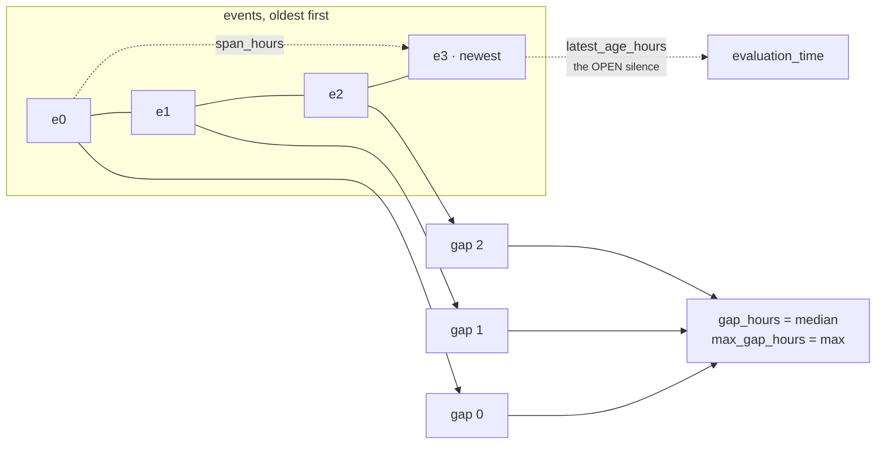

# 03b · Plugin `event_ordering`

**Class:** `timeline_unit.py:EventOrderingPlugin`
**`plugin_id`:** `event_ordering`
**Observation `kind`:** `timeline.ordering`
**Executes:** second of three (alphabetically); conceptually first

---

## 1 · The claim it makes

*How many events are known, how recent is the newest, how wide is the timeline, and what does a
typical gap look like?*

This is the base layer every other timeline claim stands on, and the only one that needs no
declaration from anybody. From the class docstring:

> *"This is the base layer every other timeline claim stands on, and the one honest thing this unit
> can say when nothing else is declared."*

`cadence_adherence` needs a business declaration. `trend_direction` needs three events. This plugin
needs one datable moment, and it produces the raw shape from which the other two claims are read.

---

## 2 · What exists

```python
class EventOrderingPlugin:
    plugin_id = "event_ordering"

    def contribute(self, view: UnitView) -> tuple[Observation, ...]:
        events = _known_events(view)
        if not events:
            return ()
        latest_age = _hours_between(events[-1].at, view.request.evaluation_time)
        span = _hours_between(events[0].at, events[-1].at)
        metrics: dict[str, int] = {
            "event_count": len(events),
            "latest_age_hours": latest_age,
            "span_hours": span,
        }
        codes: list[str] = []
        gaps = _gaps(events)
        if gaps:
            metrics["gap_hours"] = _median(gaps)
            metrics["max_gap_hours"] = max(gaps)
            if latest_age > max(gaps):
                codes.append("silence_exceeds_prior_gaps")
        else:
            codes.append("timeline_single_event")
        return (Observation(
            plugin_id=self.plugin_id,
            kind="timeline.ordering",
            metrics=metrics,
            evidence_ids=_evidence(view, events),
            reason_codes=tuple(codes),
        ),)
```

### 2.1 · Outputs

| Metric | Range | Meaning | Present when |
|---|---|---|---|
| `event_count` | `1..n` | distinct datable moments after dedupe | always (the plugin is silent at 0) |
| `latest_age_hours` | `0..n` | whole hours since the newest event | always |
| `span_hours` | `0..n` | whole hours from oldest to newest | always; `0` for a single event |
| `gap_hours` | `0..n` | **median** closed gap | `event_count >= 2` |
| `max_gap_hours` | `0..n` | longest closed gap | `event_count >= 2` |

| Reason code | When | Meaning |
|---|---|---|
| `timeline_single_event` | `gaps == ()`, i.e. exactly one event | there is history, but no interval in it |
| `silence_exceeds_prior_gaps` | `latest_age > max(gaps)` | the current silence has outlasted the longest silence this relationship ever recovered from |

The two are mutually exclusive by construction — `silence_exceeds_prior_gaps` lives inside the
`if gaps:` branch — so the plugin emits zero or one code, never two.

Evidence: `_evidence(view, events)` — the union of evidence ids across **every** field that
contributed a surviving event.

---

## 3 · How it works

### 3.1 · The four measurements



**`span_hours` and `latest_age_hours` measure different things and must not be confused.** The span
is how much history exists; the latest age is how long the current silence has run. A relationship
with 700 hours of span and 2 hours of silence is busy with a long history; one with 700 hours of
span and 700 hours of silence has been dead for as long as it was alive.

**The open silence is deliberately not a gap.** `_gaps` returns only closed intervals:

```python
def _gaps(events):
    """The stretch of silence since the newest event is deliberately *not* a gap: it is still open,
    and may close tomorrow. Treating it as a gap would let a live situation look like a dead one."""
    return tuple(_hours_between(events[index].at, events[index + 1].at)
                 for index in range(len(events) - 1))
```

Including it would inflate `max_gap_hours` with an interval that has not finished, and — worse —
would make `silence_exceeds_prior_gaps` unable to fire, because the current silence would always be
one of the gaps it was being compared against.

### 3.2 · Median, not mean

```python
def _median(values):
    """Median, not mean: one dormant summer must not redefine what a normal gap looks like."""
    ordered = sorted(values)
    middle = len(ordered) // 2
    if len(ordered) % 2 == 1:
        return ordered[middle]
    return divide_half_up(ordered[middle - 1] + ordered[middle], 2)
```

The even case rounds half-up so the result is an integer and hand-verifiable: `_median([100, 103])`
is `divide_half_up(203, 2) = (203 + 1) // 2 = 102`, not `101` and not `101.5`.

The argument, with real numbers. A relationship with five touches at 1,000h, 400h, 376h, 352h and
328h ago has gaps `[600, 24, 24, 24]`:

```text
median  = divide_half_up(24 + 24, 2)          = 24         ← what a normal gap actually is
mean    = (600 + 24 + 24 + 24) / 4            = 168        ← what a single shutdown claims it is
```

`test_ordering_uses_the_median_gap_so_one_dormant_stretch_cannot_redefine_normal` makes the point in
its docstring: *"the mean would claim 168h is normal here. It is not — 24h is."* A mean would let one
holiday shutdown rewrite what a normal gap looks like forever, and every subsequent silence would
measure as unremarkable against it.

`max_gap_hours` is published alongside precisely so the dormant stretch is not lost — the median says
what is typical, the max says what this relationship has survived. Both are needed, and both are
published rather than blended.

**The median protects this plugin only.** `trend_direction` uses `divide_half_up` means for its two
halves and gets no such protection. On the same `[600, 24, 24, 24]` input the trend's earlier half is
`mean(600, 24) = 312h`, producing `acceleration_bp = 9,615` — near-maximal acceleration manufactured
by one dormant stretch. Recorded in README §7.6.

### 3.3 · `silence_exceeds_prior_gaps`

```python
if latest_age > max(gaps):
    codes.append("silence_exceeds_prior_gaps")
```

The comment is explicit about what it is and is not:

> *"The current silence has already outlasted the longest silence this relationship ever recovered
> from. A fact about the shape, not a verdict on what to do about it."*

Strictly greater, not greater-or-equal: a silence exactly as long as the historical maximum has not
yet exceeded anything.

This is the **relationship's own standard**, and it is independent of `cadence_adherence`'s
**declared standard**. The four combinations are all reachable and all mean different things:

| `silence_exceeds_prior_gaps` | `cadence_breached` | Reading |
|---|---|---|
| no | no | normal for this account, and within its declared rhythm |
| no | yes | late by the declared rule, but not unusual for this account — *Northwind* |
| yes | no | unprecedented quiet, but the declared cadence is loose enough to tolerate it |
| yes | yes | quiet longer than ever before, and past the declared rule |

Northwind is the second row and the test says so directly: 216h of silence against a 168h declared
cadence, with a historical maximum gap of 336h. `test_northwind_renewal_a_weekly_account_that_is_late_and_slowing`
asserts `"silence_exceeds_prior_gaps" not in result.reason_codes`.

### 3.4 · Config keys

| Key | Type | Default | Effect |
|---|---|---|---|
| `timeline_fields` | list of field names | `("deal.last_inbound", "deal.last_outbound", "thread.last_inbound", "thread.last_outbound")` | which timestamp facts can become events |

That is the plugin's entire configuration surface. There is no threshold here — the plugin measures
and never judges, so there is nothing to tune. Both reason codes are structural comparisons against
the data itself, not against an authored number.

---

## 4 · Worked examples

### 4.1 · Three events, no declaration

```python
facts = {"timeline.events": [500h, 400h, 100h ago]}
```

```text
events oldest-first    500h ago, 400h ago, 100h ago
gaps                   [500-400, 400-100] = [100, 300]

event_count      = 3
latest_age_hours = 100
span_hours       = 500 - 100                             = 400
gap_hours        = median([100, 300])
                 = divide_half_up(100 + 300, 2)          = 200
max_gap_hours    = max(100, 300)                         = 300
silence check    100 > 300?  no                          → no code

Observation(metrics={event_count 3, latest_age_hours 100, span_hours 400,
                     gap_hours 200, max_gap_hours 300},
            reason_codes=())
```

`test_ordering_reports_recency_span_and_the_typical_gap`, whose docstring gives the reason all four
numbers ship together: *"recency alone cannot tell a broken rhythm from no rhythm; span and typical
gap can."*

An empty `reason_codes` tuple here is meaningful: the plugin spoke, measured everything, and found
nothing structurally notable.

### 4.2 · The unprecedented silence

```python
facts = {"timeline.events": [500h, 400h, 300h ago]}
```

```text
gaps             [100, 100]
gap_hours        = median([100, 100])                    = 100
max_gap_hours    = 100
latest_age_hours = 300
silence check    300 > 100?  yes                         → silence_exceeds_prior_gaps
span_hours       = 200
```

This relationship traded messages every 100 hours, twice, and has now been quiet for 300 — three
times its own longest silence. No cadence was declared, so `cadence_adherence` is silent and
`cadence_breach_bp` is absent from the result entirely. The only signal that anything is wrong is
this reason code, which is exactly the case the plugin exists to cover.

Verified end-to-end result: `matched=False`, reason codes
`("silence_exceeds_prior_gaps", "timeline_steady")`. Note the unit-level `matched` is `False` even
though the shape is visibly broken — neither of stage 6's two thresholds reads this code. That is
examined in `05`.

### 4.3 · The dormant summer

```python
facts = {"timeline.events": [1000h, 400h, 376h, 352h, 328h ago]}
```

```text
gaps             [600, 24, 24, 24]
sorted           [24, 24, 24, 600]
len 4, even, middle = 2
gap_hours        = divide_half_up(ordered[1] + ordered[2], 2)
                 = divide_half_up(24 + 24, 2)            = 24
max_gap_hours    = 600
latest_age_hours = 328
span_hours       = 1000 - 328                            = 672
silence check    328 > 600?  no                          → no code
```

The pair `gap_hours: 24` and `max_gap_hours: 600` is the plugin's whole argument in two numbers: this
account normally moves daily and once went dormant for 25 days. Neither number alone tells you that.

### 4.4 · One message through two joins

```python
facts = {"deal.last_inbound": "<30h ago>", "thread.last_inbound": "<30h ago>"}
```

```text
collected        2 events at the identical instant
deduped          1 event
gaps             ()                                      → the else branch

event_count      = 1
latest_age_hours = 30
span_hours       = _hours_between(events[0].at, events[0].at) = 0
reason_codes     ("timeline_single_event",)

no gap_hours, no max_gap_hours
```

`span_hours: 0` here is a **measured** zero — the timeline genuinely has no width — while
`gap_hours` is **absent**, because no interval exists to measure. Both are correct and they are
different claims. `test_one_message_seen_through_two_joins_counts_as_one_moment` asserts
`"gap_hours" not in observation.metrics`.

### 4.5 · Four default facts, three surviving events

```python
facts = {"deal.last_inbound":  "<300h ago>",
         "deal.last_outbound": "<200h ago>",
         "thread.last_inbound": "<100h ago>"}
```

```text
_config_fields → the four defaults, iterated sorted:
    deal.last_inbound   → event @ 300h
    deal.last_outbound  → event @ 200h
    thread.last_inbound → event @ 100h
    thread.last_outbound → absent, contributes nothing

event_count 3 · latest_age_hours 100 · span_hours 200 · gap_hours 100 · max_gap_hours 100
```

`test_fact_write_order_cannot_change_the_shape` supplies the same three facts in reverse write
order and asserts identical metrics. Ordering comes from timestamps and from the `sorted()` on the
field list, never from the order Layer 2 happened to write the mapping.

---

## 5 · Silence and edge cases

### 5.1 · The one silence

| Condition | Returns |
|---|---|
| `_known_events(view)` is empty | `()` |

The docstring is precise about why:

> *"It is silent when no event can be dated, because a timeline of zero events has no recency, no
> span, and no typical gap — only absence, which the unit reports as `event_count: 0` rather than as
> a shape."*

The `event_count: 0` does not come from this plugin. It is `calculate`'s initialiser, and it is the
only metric the unit publishes when everything is silent. `test_ordering_says_nothing_when_no_event_can_be_dated`
pins the plugin-level silence: *"reporting zero recency would read as 'just happened'."*

### 5.2 · What makes an event undatable

Every one of these produces silence when it is the only candidate:

| Input | Dropped by |
|---|---|
| no timestamp fact and no event log | nothing to collect |
| `deal.last_inbound` 5 hours in the **future** | `at <= now` filter — verified `()` |
| `{"occurred_at": "last tuesday"}` | `parse_time` raises, `_moment` returns `None` |
| `{"occurred_at": "2026-08-06T12:00:00"}` (naive) | `parse_time` — "must be timezone-aware" |
| `{"event_id": "e1"}` with no moment key | `_moment` finds no key in `_MOMENT_KEYS` |
| `"timeline.events": "nope"` (a string) | the `isinstance(raw, (tuple, list))` guard, silently |

### 5.3 · Boundaries

| Case | Behaviour |
|---|---|
| an event exactly at `evaluation_time` | included (`at <= now`); `latest_age_hours: 0` |
| four events inside one hour | three gaps of `0`; `gap_hours: 0`, `max_gap_hours: 0`, `span_hours: 0` — all measured zeros |
| `latest_age == max(gaps)` exactly | **no** code; the comparison is strictly greater |
| two events one second apart | two events, one gap of `0` hours — dedupe is on exact instant, not proximity |
| 10,001 events in the log | `f"{ordinal:04d}"` pads to four digits only, so ordinal 9,999 renders `timeline.events#9999` and ordinal 10,000 renders `timeline.events#10000`. Lexicographically `#10000 < #9999`, so past 10,000 entries the fallback label order stops tracking the ordinal. It affects nothing but the tie-break between two events at the identical instant, and only for entries with no `event_id`/`id`/`kind`/`type`/`label`. |

### 5.4 · Evidence

`_evidence(view, events)` builds `{event.field for event in events}` and asks
`common.py:evidence_ids` for every evidence row matching one of those field names. Verified with one
row per fact:

```text
facts   deal.last_inbound → ev_in · deal.last_outbound → ev_out · thread.last_inbound → ev_thr
finding timeline.event_ordering evidence_ids ("ev_in", "ev_out", "ev_thr")
```

`test_ordering_carries_the_evidence_of_the_facts_it_read`: *"a shape nobody can trace back to a
source cannot be defended in a review."*

The limit: events sourced from `timeline.events` all carry `field == "timeline.events"`, so a
timeline built entirely from the explicit log cites whatever evidence rows exist for that single
field name — usually none. Per-event provenance is preserved in `_Event.field` inside the unit and
lost at the boundary.

---

## Related

| Document | Covers |
|---|---|
| [03 · Analyzer](03-Analyzer.md) | `_known_events`, `_gaps`, `_median` in the shared substrate |
| [03a · `cadence_adherence`](03a-plugin-cadence_adherence.md) | the declared standard, against which this plugin's is the observed one |
| [03c · `trend_direction`](03c-plugin-trend_direction.md) | the other reader of `_gaps`, which does not use the median |
| [04 · Calculator](04-Calculator.md) | `latest_age_hours` republished as `elapsed_hours` |
