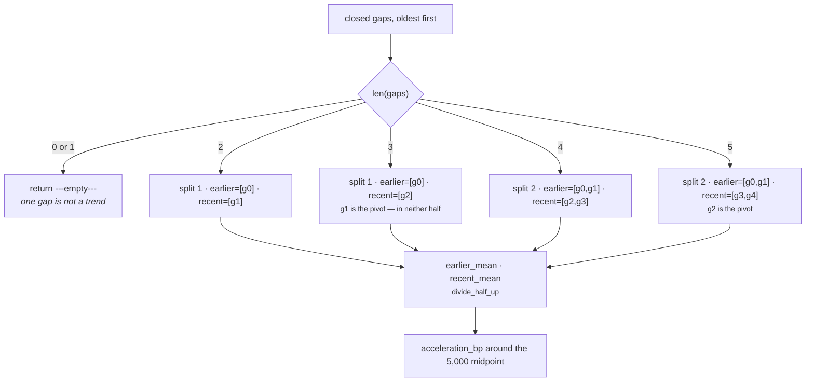

# 03c · Plugin `trend_direction`

**Class:** `timeline_unit.py:TrendDirectionPlugin`
**`plugin_id`:** `trend_direction`
**Observation `kind`:** `timeline.trend`
**Executes:** third of three (alphabetically)

---

## 1 · The claim it makes

*Are the gaps tightening or stretching?*

The docstring frames it as a derivative rather than a level, and that framing is the whole reason the
plugin exists:

> *"Momentum is a derivative, not a level: a deal with three exchanges a week and slowing is a
> different situation from one with three exchanges a week and speeding up, even though both look
> identically busy today."*

`event_ordering` publishes `gap_hours` — the level. This plugin publishes the direction that level is
moving in. Two accounts with identical `gap_hours` can be moving in opposite directions, and no
present-tense metric in Layer 4 can tell them apart.

---

## 2 · What exists

```python
STEADY_BP = 5_000       # module constant: neutral trend, gaps neither shortened nor stretched


class TrendDirectionPlugin:
    plugin_id = "trend_direction"

    def contribute(self, view: UnitView) -> tuple[Observation, ...]:
        gaps = _gaps(_known_events(view))
        if len(gaps) < 2:
            return ()
        split = len(gaps) // 2
        earlier = gaps[:split]
        recent = gaps[len(gaps) - split:]
        earlier_mean = divide_half_up(sum(earlier), len(earlier))
        recent_mean = divide_half_up(sum(recent), len(recent))
        if earlier_mean <= 0:
            if recent_mean <= 0:
                acceleration = STEADY_BP
            else:
                acceleration = 0
        elif recent_mean <= 0:
            acceleration = 10_000
        elif recent_mean < earlier_mean:
            acceleration = STEADY_BP + divide_half_up(
                (earlier_mean - recent_mean) * STEADY_BP, earlier_mean)
        elif recent_mean > earlier_mean:
            acceleration = STEADY_BP - divide_half_up(
                (recent_mean - earlier_mean) * STEADY_BP, recent_mean)
        else:
            acceleration = STEADY_BP
        acceleration = clamp_bp(acceleration)
        ...
```

### 2.1 · Outputs

| Metric | Range | Meaning |
|---|---|---|
| `acceleration_bp` | `0..10000` | `5,000` is steady; above is tightening, below is stretching |
| `earlier_gap_hours` | `0..n` | mean of the oldest half of the closed gaps |
| `recent_gap_hours` | `0..n` | mean of the newest half of the closed gaps |
| `gap_sample` | `2..n` | how many closed gaps the reading is drawn from |

| Reason code | When |
|---|---|
| `timeline_accelerating` | `acceleration_bp > 5_000` |
| `timeline_decaying` | `acceleration_bp < 5_000` |
| `timeline_steady` | `acceleration_bp == 5_000` |

Exactly one, always.

**Evidence: none.** The plugin does not call `_evidence` and constructs its `Observation` without
`evidence_ids`. Recorded as a known problem in README §7.4 — a reader of the trace cannot follow
`acceleration_bp` back to a source.

### 2.2 · Config

**None.** This plugin reads no config key of its own. `timeline_fields` affects it only indirectly,
by deciding which facts become events. The `decay_threshold_bp` that turns `acceleration_bp` into a
judgement lives in stage 6, not here — the plugin measures direction and never rules on it.

---

## 3 · How it works

### 3.1 · Splitting the gaps



```python
split   = len(gaps) // 2
earlier = gaps[:split]                     # the oldest `split` gaps
recent  = gaps[len(gaps) - split:]         # the newest `split` gaps
```

The two slices are always the same length, and on an odd count they never overlap. From the
docstring:

> *"The oldest half of the closed gaps is compared with the newest half; on an odd count the pivot
> gap belongs to neither side, so it cannot be double-counted."*

`test_the_odd_middle_gap_belongs_to_neither_half` pins it: *"a pivot counted on both sides would let
one interval vote twice on its own trend."*

Verified with events at 700h, 600h, 300h and 100h ago — gaps `[100, 300, 200]`:

```text
split 1 · earlier [100] · recent [200] · the 300 pivot excluded
earlier_gap_hours 100 · recent_gap_hours 200 · gap_sample 3
acceleration_bp = 5_000 - divide_half_up((200 - 100) * 5_000, 200) = 5_000 - 2_500 = 2_500
```

Note that `gap_sample` reports `3` — the number of gaps that *exist*, not the number that were
compared. A consumer wanting the sample size per side computes `gap_sample // 2`.

### 3.2 · The two directional branches, and why they are asymmetric in form

```text
shortening   recent_mean < earlier_mean
             acceleration = 5_000 + divide_half_up((earlier_mean - recent_mean) * 5_000, earlier_mean)

stretching   recent_mean > earlier_mean
             acceleration = 5_000 - divide_half_up((recent_mean - earlier_mean) * 5_000, recent_mean)
```

Different denominators. The docstring explains the choice:

> *"Reported around a 5,000bp midpoint — above is accelerating, below is decaying — with each side
> scaled by its own larger term so both directions are bounded and symmetric."*

**Each side divides by whichever mean is larger.** When gaps shorten, `earlier_mean` is larger; when
they stretch, `recent_mean` is. The effect is that the distance from the midpoint is always

```text
|acceleration - 5,000| = 5,000 × (1 - smaller / larger)
```

which is bounded by `5,000` in both directions and reaches it only in the limit. Equivalently, and
easier to compute in your head:

```text
stretching   acceleration ≈ 5,000 × earlier_mean / recent_mean
shortening   acceleration ≈ 10,000 - 5,000 × recent_mean / earlier_mean
```

Both closed forms agree with the code's integer arithmetic on every value checked; the code rounds
the *delta* term half-up rather than the whole expression, so a ±1bp divergence is theoretically
possible.

Had both branches divided by `earlier_mean`, a stretching timeline would be unbounded: gaps growing
from 10h to 1,000h would give `5,000 − 5,000 × 99 = −490,000`, clamped to `0` long before the
relationship was actually dead, and every badly-stretched timeline would report the same saturated
number. The chosen form keeps the two directions readable against each other:

| Change in rhythm | `acceleration_bp` |
|---|---|
| gaps cut to a tenth (10× faster) | `9,500` |
| gaps quartered | `8,750` |
| gaps halved | `7,500` |
| unchanged | `5,000` |
| gaps doubled | `2,500` |
| gaps quadrupled | `1,250` |
| gaps ten times longer | `500` |

Halving and doubling land at exactly `7,500` and `2,500` — equidistant from the midpoint. That is
the symmetry the docstring claims, and it holds.

**Why a midpoint rather than a signed number.** The whole layer is unsigned basis points. A single
integer in `0..10,000` carries both directions without a separate sign field, and every
`_bp`-suffixed metric passes through the same `clamp_bp` in `build` regardless of what it means.

### 3.3 · The three degenerate branches

`_hours_between` truncates to whole hours, so a burst of activity inside one hour produces gaps of
`0` and the ratio arithmetic has nothing to divide by.

| `earlier_mean` | `recent_mean` | `acceleration_bp` | Reading |
|---|---|---|---|
| `0` | `0` | `5,000` | everything happened inside single hours at both ends — no measurable change |
| `> 0` | `0` | `10,000` | *"the rhythm collapsed to back-to-back activity"* |
| `0` | `> 0` | `0` | maximum decay |

The middle case is commented; the first is commented; **the third is a bare assignment**. Its source
comment covers only the `earlier_mean <= 0` guard as a whole:

> *"Every earlier event landed inside the same hour: there is no baseline interval to compare
> against, so a ratio would be an artefact of rounding rather than a trend."*

That argument justifies refusing a ratio. It does not justify reporting `0` — the strongest decay
signal the plugin can emit — for a situation the code has just declared unmeasurable. Verified:

```text
events    500h ago, 499h50m ago, 499h40m ago, 200h ago, 1h ago
gaps      (0, 0, 299, 199)
split 2 · earlier [0, 0] → mean 0 · recent [299, 199] → mean 249

acceleration_bp   0
earlier_gap_hours 0
recent_gap_hours  249
reason_code       timeline_decaying
```

Three messages traded inside ten minutes, then a normal multi-week rhythm, reads as *total collapse*.
At stage 6 that trips `decay_threshold_bp` and sets `matched=True` with
`timeline_shape_decaying`. Returning `()` — the plugin's own idiom for "this axis has nothing to
contribute" — would be the consistent choice. Recorded in README §7.7.

### 3.4 · Means, not medians

`event_ordering` uses `_median` explicitly so *"one dormant summer must not redefine what a normal
gap looks like."* This plugin uses `divide_half_up` means for both halves and inherits no such
protection.

```text
gaps [600, 24, 24, 24]
    event_ordering  gap_hours     = median → 24        ← protected
    trend_direction earlier_mean  = divide_half_up(600 + 24, 2) = 312
                    recent_mean   = divide_half_up(24 + 24, 2)  = 24
                    acceleration  = 5_000 + divide_half_up(288 × 5_000, 312)
                                  = 5_000 + 4_615      = 9_615  ← unprotected
```

One dormant stretch produces a claim of near-maximal acceleration. The mean is defensible for a
*trend* — a trend is about aggregate movement between two periods, and a median of two values is a
mean anyway — but the protection the module argues for covers one of the two claims, and nothing in
the code notes the difference. README §7.6.

---

## 4 · Worked examples

### 4.1 · A rhythm coming apart

```python
facts = {"timeline.events": [1000h, 916h, 832h, 496h, 160h ago]}
```

```text
gaps oldest-first   [84, 84, 336, 336]
len 4 · split 2
earlier [84, 84]    → divide_half_up(168, 2)  = 84
recent  [336, 336]  → divide_half_up(672, 2)  = 336

recent > earlier → stretching
acceleration = 5_000 - divide_half_up((336 - 84) * 5_000, 336)
             = 5_000 - divide_half_up(1_260_000, 336)
             = 5_000 - (1_260_000 + 168) // 336
             = 5_000 - 3_750                             = 1_250

metrics {acceleration_bp 1_250, earlier_gap_hours 84, recent_gap_hours 336, gap_sample 4}
reason_codes ("timeline_decaying",)
```

Twice-weekly became fortnightly. `test_widening_gaps_read_as_decay` names why it matters: *"same
busy-looking account, opposite direction."* The account still traded five messages in five weeks;
`event_ordering` reports `gap_hours: 210` and `event_count: 5`, both of which look healthy. Only the
derivative shows the collapse.

Closed-form check: `5,000 × 84 / 336 = 1,250`. Exact.

### 4.2 · A rhythm tightening

```python
facts = {"timeline.events": [1000h, 500h, 100h, 50h ago]}
```

```text
gaps            [500, 400, 50]
len 3 · split 1
earlier [500]   → 500
recent  [50]    → 50            # the 400 pivot excluded
recent < earlier → shortening
acceleration = 5_000 + divide_half_up((500 - 50) * 5_000, 500)
             = 5_000 + divide_half_up(2_250_000, 500)
             = 5_000 + 4_500                             = 9_500

reason_codes ("timeline_accelerating",)
```

`test_stretching_gaps_read_as_decay_below_the_steady_midpoint`. Closed form:
`10,000 − 5,000 × 50/500 = 9,500`. Exact.

This is the fixture that produces the interesting combination in `05`: paired with a 24-hour declared
cadence it gives `matched=True` from the cadence side and `timeline_accelerating` from the trend
side. Overdue and decaying are independent, and ORing them must not blur which one fired.

### 4.3 · Exactly steady — the midpoint must be reachable

```python
facts = {"timeline.events": [400h, 300h, 200h, 100h ago]}
```

```text
gaps            [100, 100, 100]
len 3 · split 1
earlier [100] · recent [100]        # the middle 100 is the pivot
recent == earlier → the else branch
acceleration = 5_000

reason_codes ("timeline_steady",)
```

`test_an_unchanged_rhythm_reads_as_exactly_steady`: *"the midpoint must be reachable, or every stable
relationship looks like it is moving."* Both directional branches use strict inequalities precisely
so equality falls through to the exact midpoint rather than to a branch that would round to
`5,000 ± 0`.

### 4.4 · Northwind

```python
facts = {"timeline.cadence_hours": 168,
         "timeline.events": [912h, 720h, 552h, 216h ago]}
```

```text
gaps            [192, 168, 336]
len 3 · split 1
earlier [192] · recent [336]        # the 168 pivot excluded
acceleration = 5_000 - divide_half_up((336 - 192) * 5_000, 336)
             = 5_000 - divide_half_up(720_000, 336)
             = 5_000 - (720_000 + 168) // 336
             = 5_000 - 2_143                             = 2_857

reason_codes ("timeline_decaying",)
```

Against the default `decay_threshold_bp = 3_000`, `2,857 <= 3,000` fires `timeline_shape_decaying`.
The margin is 143bp — this account is barely over the line, and a capability that authored `2_500`
would not have flagged it. Worth knowing before treating the default as settled: nobody has tuned it
against outcomes.

**How far gaps must stretch to trip the default.** From the closed form,
`acceleration ≈ 5,000 × earlier / recent`, so `acceleration <= 3,000` means
`recent >= earlier / 0.6 = 1.667 × earlier`. Gaps must stretch by **at least two thirds** before the
default threshold reads the shape as decaying.

### 4.5 · A near-miss that publishes nothing

```python
facts = {"timeline.events": [500h, 100h ago]}
```

```text
events 2 · gaps [400] · len(gaps) == 1 < 2
contribute → ()

result carries event_count 2, elapsed_hours 100, span_hours 400,
              gap_hours 400, max_gap_hours 400
              and NO acceleration_bp
```

`test_a_single_gap_is_not_a_trend`: *"two events give one interval. Declaring a direction from it
would be fabrication."* Absence, not `5,000`. A fabricated `5,000` would read downstream as *we
measured the trend and it is steady*, which is a claim two events cannot support.

---

## 5 · Silence and edge cases

### 5.1 · The one silence

| Condition | Returns |
|---|---|
| `len(_gaps(_known_events(view))) < 2` | `()` |

Which means fewer than three surviving events. The docstring:

> *"Fewer than three events means fewer than two gaps, which is not a trend, and the plugin says
> nothing."*

And from the module header: *"reporting a trend from one gap would be a fabrication dressed as
arithmetic."*

Note the interaction with deduplication: four facts that all resolve to two distinct instants give
two events, one gap, and silence. The plugin's precondition is on *distinct moments*, not on how many
fields Layer 2 populated.

### 5.2 · Boundaries

| Case | `acceleration_bp` | Notes |
|---|---|---|
| `len(gaps) == 2` | computed from one gap per side | the minimum sample; `gap_sample: 2` |
| `earlier_mean == recent_mean` | exactly `5,000` | `timeline_steady` |
| all gaps `0` (sub-hour timeline) | `5,000` | both means truncate to `0` |
| earlier gaps sub-hour, recent real | `0` | maximum decay from an unmeasurable baseline — §3.3 |
| recent gaps sub-hour, earlier real | `10,000` | *"the rhythm collapsed to back-to-back activity"* |
| `clamp_bp` binding | never in practice | both branches are bounded by construction; the clamp is belt-and-braces |

### 5.3 · What it cannot see

The plugin reads gaps and nothing else. It does not know:

- **which direction the messages went.** A stretch of outbound-only follow-ups with no replies looks
  identical to a healthy two-way exchange at the same intervals.
- **how recent the newest event is.** A timeline whose gaps tightened beautifully and then went
  silent for a year still reports `timeline_accelerating`. `latest_age_hours` is the ordering
  plugin's business, and stage 6 never combines them.
- **the pivot gap on an odd count.** It is excluded from both halves and appears in no metric. A
  three-gap timeline of `[100, 5000, 200]` reports `earlier 100`, `recent 200`, `acceleration 2,500`
  and never mentions the 5,000-hour dormancy in between. `event_ordering`'s `max_gap_hours` is the
  only place that shows up.

The third is the most surprising, and it is a direct consequence of refusing to double-count the
pivot. Excluding it is right; the trace simply does not say it happened.

---

## Related

| Document | Covers |
|---|---|
| [03 · Analyzer](03-Analyzer.md) | `_gaps` and the shared substrate |
| [03b · `event_ordering`](03b-plugin-event_ordering.md) | `gap_hours` and `max_gap_hours` — the level this plugin differentiates |
| [05 · Evaluator](05-Evaluator.md) | `decay_threshold_bp`, `timeline_shape_decaying`, and the `core.temporal` corroboration |
| README §7.6, §7.7 | the median gap that does not protect this plugin, and the zero-baseline decay |
