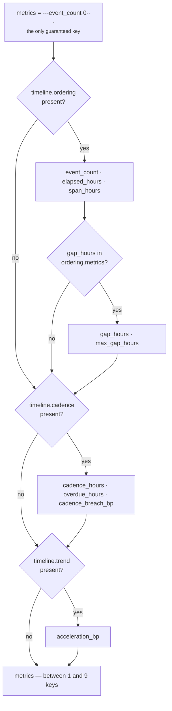
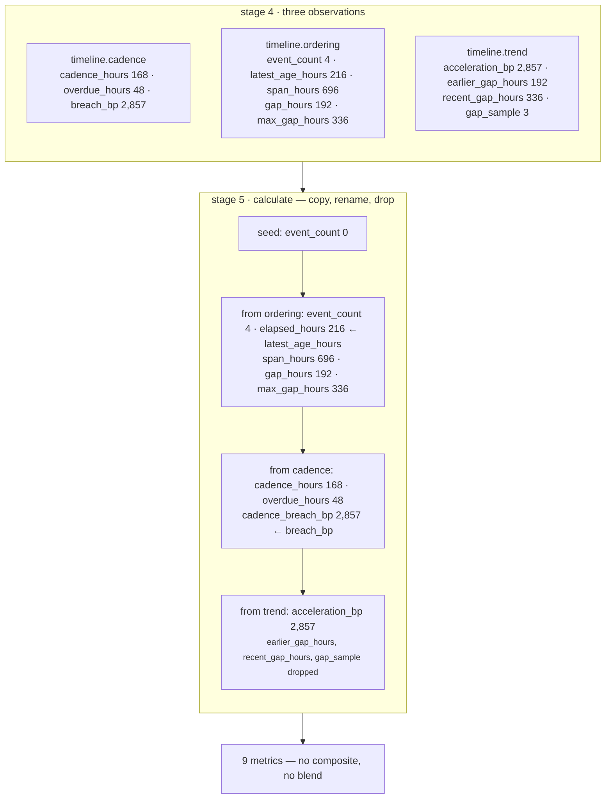

# 04 · Calculator — `core.timeline`

**Stage 5 of the eight.** `@abstractmethod` on the base class; every unit must implement it.
`timeline_unit.py:TimelineUnit.calculate`, 30 lines.

---

## 1 · What it is for

The Calculator turns the Analyzer's partial evidence into this unit's published metrics, using pure
integer arithmetic and nothing else. No IO, no clock, no floats.

For most units that means combining several plugin contributions into a composite score.
`core.opportunity` takes the strongest claim plus a quarter of the rest. `core.dependency` subtracts
the worst blocker plus a bounded drag plus a depth penalty.

`core.timeline` does none of that. **It republishes each plugin's measurement under the unit's stable
names and combines nothing.** That refusal is the whole design decision in this stage, and the
docstring argues it directly.

---

## 2 · What exists

```python
@staticmethod
def _by_kind(observations: Sequence[Observation], kind: str) -> Observation | None:
    for item in observations:
        if item.kind == kind:
            return item
    return None


def calculate(self, view: UnitView,
              observations: Sequence[Observation]) -> Mapping[str, int]:
    """Republish each plugin's measurement under the unit's stable names.

    Deliberately no blending.  Recency, cadence breach and trend answer different questions and
    combining them into one "timeline score" would destroy exactly the distinction the unit
    exists to make — an overdue-but-accelerating situation is not the average of the two.
    """
    del view
    metrics: dict[str, int] = {"event_count": 0}

    ordering = self._by_kind(observations, "timeline.ordering")
    if ordering is not None:
        metrics["event_count"] = int(ordering.metrics["event_count"])
        metrics["elapsed_hours"] = int(ordering.metrics["latest_age_hours"])
        metrics["span_hours"] = int(ordering.metrics["span_hours"])
        if "gap_hours" in ordering.metrics:
            metrics["gap_hours"] = int(ordering.metrics["gap_hours"])
            metrics["max_gap_hours"] = int(ordering.metrics["max_gap_hours"])

    cadence = self._by_kind(observations, "timeline.cadence")
    if cadence is not None:
        metrics["cadence_hours"] = int(cadence.metrics["cadence_hours"])
        metrics["overdue_hours"] = int(cadence.metrics["overdue_hours"])
        metrics["cadence_breach_bp"] = clamp_bp(int(cadence.metrics["breach_bp"]))

    trend = self._by_kind(observations, "timeline.trend")
    if trend is not None:
        metrics["acceleration_bp"] = clamp_bp(int(trend.metrics["acceleration_bp"]))
    return metrics
```

### 2.1 · The name mapping

| Observation key | Published as | Renamed? |
|---|---|---|
| `timeline.ordering` → `event_count` | `event_count` | no |
| `timeline.ordering` → `latest_age_hours` | **`elapsed_hours`** | **yes** |
| `timeline.ordering` → `span_hours` | `span_hours` | no |
| `timeline.ordering` → `gap_hours` | `gap_hours` | no |
| `timeline.ordering` → `max_gap_hours` | `max_gap_hours` | no |
| `timeline.cadence` → `cadence_hours` | `cadence_hours` | no |
| `timeline.cadence` → `overdue_hours` | `overdue_hours` | no |
| `timeline.cadence` → `breach_bp` | **`cadence_breach_bp`** | **yes** |
| `timeline.trend` → `acceleration_bp` | `acceleration_bp` | no |
| `timeline.trend` → `earlier_gap_hours` | — | **dropped** |
| `timeline.trend` → `recent_gap_hours` | — | **dropped** |
| `timeline.trend` → `gap_sample` | — | **dropped** |

Two renames and three drops. Both renames disambiguate a plugin-local name into a unit-global one:
`breach_bp` says nothing about *what* was breached once it leaves the cadence plugin, and
`latest_age_hours` collides conceptually with the `elapsed_hours` name every other time-reading unit
in the layer uses.

The three dropped keys are not lost — they survive on the `timeline.trend_direction` **finding**,
which stage 6 builds from `item.metrics` verbatim. They are diagnostic support for
`acceleration_bp`, readable by an auditor reconstructing the number, and not something a downstream
unit should be weighing.

---

## 3 · How it works

### 3.1 · Selection by kind, never by position

`_by_kind` scans for the first observation whose `kind` matches and returns `None` otherwise.

That is why nothing in this unit depends on `analyze`'s alphabetical ordering, on registration
order, or on how many plugins stayed silent. Adding a fourth plugin with a new `kind` would leave
`calculate` untouched and produce no metric until somebody wrote the branch for it — which is the
correct failure mode, because the `publishes` guard at stage 8 would otherwise be the first thing to
notice.

It also means the unit is robust to a plugin returning two observations of the same kind: the first
wins silently. No plugin here does that, and if one ever did, the second would be dropped without a
diagnostic. Worth knowing before adding one.

### 3.2 · Presence checks all the way down



Three levels of conditional, and each one preserves a distinction that a default value would erase:

| Absent metric | What its absence means | What a zero would have meant |
|---|---|---|
| `gap_hours` | fewer than two events — no interval exists | the two events were simultaneous |
| `cadence_breach_bp` | nobody declared a cadence | a cadence was declared and is being met |
| `acceleration_bp` | fewer than three events — no trend measurable | the rhythm was measured and is unchanged |
| `elapsed_hours` | nothing datable at all | something happened this very hour |

The class docstring states the rule:

> *"Publishes only what it could actually observe. A metric that is absent means 'unknown', and
> downstream readers get their own default from `prior_metric`; emitting a zero for a gap nobody
> measured is indistinguishable from a measured zero, and something would eventually act on it."*

`test_unmeasurable_quantities_are_absent_rather_than_zero` pins three of the four:

```python
result = TimelineUnit().evaluate(_request({"deal.last_inbound": _ago(50)}), {})
assert result.metrics["event_count"] == 1
assert result.metrics["elapsed_hours"] == 50
assert "gap_hours" not in result.metrics
assert "acceleration_bp" not in result.metrics
assert "cadence_breach_bp" not in result.metrics
```

The `prior_metric` half of that sentence is the mechanism that makes absence safe. A consumer reads
`view.prior_metric("core.timeline", "acceleration_bp", 5_000)` and chooses its **own** neutral
default, in its own terms, rather than inheriting one this unit invented.

### 3.3 · `event_count: 0` is the floor, not a default

```python
metrics: dict[str, int] = {"event_count": 0}
```

This is the only pre-seeded key, and it is the only metric present on every possible run. It is not a
fabricated zero: it is the honest count when `_known_events` found nothing, and it is overwritten by
the real count the moment the ordering plugin speaks.

The three plugins' preconditions guarantee it cannot lie. `cadence_adherence` and `event_ordering`
both require at least one event; `trend_direction` requires three. So there is no reachable state
where `observations` is non-empty but `timeline.ordering` is missing, and therefore no state where
`event_count: 0` ships alongside another plugin's metrics. Verified across every fixture in the test
file.

### 3.4 · Why no composite score

The docstring's argument, in full:

> *"Deliberately no blending. Recency, cadence breach and trend answer different questions and
> combining them into one 'timeline score' would destroy exactly the distinction the unit exists to
> make — an overdue-but-accelerating situation is not the average of the two."*

Made concrete with two real fixtures from the test file:

```text
A · a late but tightening account          B · a healthy weekly account
    cadence_breach_bp  10,000                  cadence_breach_bp       0
    acceleration_bp     9,500                  acceleration_bp     5,000

    a plausible composite:                     a plausible composite:
    mean(10,000 - 0, 9,500)                    mean(10,000 - 0, 5,000)
      = mean(10,000, 9,500) = 9,750              = mean(10,000, 5,000) = 7,500
```

Under any such blend, A — an account 26 hours past a 24-hour cadence whose team is exchanging
messages faster every week — outscores B, an account meeting its cadence with a perfectly stable
rhythm. Both readings would be "concerning", and one of them is a team working hard on a live deal.

`test_a_late_but_tightening_account_is_not_reported_as_decaying` asserts the opposite outcome from
the real code: `matched=True`, `cadence_materially_overdue` present, `timeline_shape_decaying`
**absent**, `acceleration_bp == 9_500` published untouched. The consumer sees *late, and speeding
up*, which is one call to make, not two numbers averaged into a mood.

The same argument in the negative: what a composite would have to assume. Blending requires a common
scale and a defensible weight. `cadence_breach_bp` is a fraction of a declared period;
`acceleration_bp` is a ratio between two means with `5,000` as its neutral point; `elapsed_hours` is
not a ratio at all. There is no exchange rate between them that is not invented.

### 3.5 · `clamp_bp` is applied three times

| Where | Value |
|---|---|
| `CadenceAdherencePlugin.contribute` | `breach_bp` |
| `TrendDirectionPlugin.contribute` | `acceleration_bp` |
| `TimelineUnit.calculate` | both again |
| `ReasoningUnit.build` | every `_bp`-suffixed metric, a fourth time |

Redundant by the time `calculate` runs — both values are already in range. It is cheap and it means
`calculate` is correct in isolation: a future plugin emitting an out-of-range `breach_bp` would be
caught here rather than three stages later.

`int()` on the observation values is likewise belt-and-braces. `Observation.__post_init__` already
rejects any metric that is not an `int` and rejects `bool` explicitly, so the coercion can never
change a value. It does mean that if a metric key were ever missing from an observation the failure
would be a `KeyError` out of `calculate` — the ordering plugin's `event_count`, `latest_age_hours`
and `span_hours` are indexed, not `.get()`-ed, on the grounds that a `timeline.ordering` observation
without them is a broken plugin rather than a thin situation.

### 3.6 · The stage-8 guard sits immediately after

`evaluate()` compares `set(verdict.metrics)` against `publishes` before `build` runs. Since
`evaluate_meaning` passes `dict(metrics)` through unchanged, this stage's output *is* what the guard
inspects. Every key `calculate` can emit is in the declared nine:

```python
publishes = ("event_count", "elapsed_hours", "span_hours", "gap_hours", "max_gap_hours",
             "cadence_hours", "cadence_breach_bp", "overdue_hours", "acceleration_bp")
```

`test_the_unit_publishes_only_metrics_it_declared` asserts both directions on a fixture that
exercises all three plugins: `set(result.metrics) <= set(publishes)`, and that the nine names are
exactly what a full run produces.

---

## 4 · Worked combination — Northwind, end to end

Facts: `timeline.cadence_hours = 168`; four touches at 912h, 720h, 552h and 216h ago. No config.



The arithmetic behind each number, recomputable by hand from the trace:

```text
gaps oldest-first  = [912-720, 720-552, 552-216] = [192, 168, 336]

event_count        = 4
elapsed_hours      = 216                                    # hours since the newest event
span_hours         = 912 - 216                              = 696
gap_hours          = median([168, 192, 336])                = 192
max_gap_hours      = max([192, 168, 336])                   = 336

overdue_hours      = max(0, 216 - 168)                      = 48
cadence_breach_bp  = divide_half_up(48 * 10_000, 168)
                   = (480_000 + 84) // 168                  = 2_857

split 1 · earlier [192] · recent [336]                      # the 168 pivot excluded
acceleration_bp    = 5_000 - divide_half_up((336 - 192) * 5_000, 336)
                   = 5_000 - (720_000 + 168) // 336
                   = 5_000 - 2_143                          = 2_857
```

Verified output:

```text
{acceleration_bp 2857, cadence_breach_bp 2857, cadence_hours 168, elapsed_hours 216,
 event_count 4, gap_hours 192, max_gap_hours 336, overdue_hours 48, span_hours 696}
```

The two `2,857`s are a coincidence of this fixture. One is `48/168` of a review period; the other is
`5,000 × 192/336`. Nothing in the code relates them, and reading significance into the match would be
an error.

---

## 5 · Edge cases

### 5.1 · Every reachable metric shape

| Situation | Keys published |
|---|---|
| no datable event | `event_count` only — value `0` |
| 1 event, no cadence | `event_count`, `elapsed_hours`, `span_hours` |
| 1 event, cadence declared | the above + `cadence_hours`, `overdue_hours`, `cadence_breach_bp` |
| 2 events, no cadence | `event_count`, `elapsed_hours`, `span_hours`, `gap_hours`, `max_gap_hours` |
| 3+ events, no cadence | the above + `acceleration_bp` |
| 3+ events, cadence declared | all nine |

Verified for each row. Note there is no reachable shape carrying `acceleration_bp` without
`gap_hours` — three events imply two gaps imply a median.

### 5.2 · Single event

```python
facts = {"deal.last_inbound": "<50h ago>"}
```

```text
ordering.metrics has no "gap_hours"        → the inner conditional skips both gap keys
cadence  absent                            → no cadence keys
trend    absent                            → no acceleration_bp

metrics = {event_count 1, elapsed_hours 50, span_hours 0}
```

`span_hours: 0` is published because the ordering plugin measured it —
`_hours_between(events[0].at, events[0].at)` is a genuine zero-width span. `gap_hours` is absent
because no interval exists. Two zeros' worth of difference, and the code keeps them apart.

### 5.3 · Cadence declared, one event, no gaps

```python
facts  = {"timeline.cadence_hours": "weekly", "deal.last_inbound": "<200h ago>"}
config = {"expected_cadence_hours": 168}
```

Verified:

```text
{cadence_breach_bp 1905, cadence_hours 168, elapsed_hours 200, event_count 1,
 overdue_hours 32, span_hours 0}
```

Six keys. The cadence branch fires on a one-event timeline because the breach only ever needed the
newest moment; the gap and trend branches do not. This is the shape that most clearly shows the three
plugins failing independently.

### 5.4 · `view` is discarded

```python
del view
```

`calculate` takes the argument to satisfy the abstract signature and immediately drops it. The unit's
arithmetic depends on nothing but the observations — no config read, no prior-result read, no
snapshot access. Everything configurable was already applied inside the plugins.

The practical consequence: this stage is trivially testable in isolation from any `UnitView`, and
`test_identical_input_produces_identical_metrics` gets determinism here for free. The one stage that
does read `view` is the Evaluator, which is where every threshold lives.

---

## Related

| Document | Covers |
|---|---|
| [03 · Analyzer](03-Analyzer.md) | the observations this stage consumes |
| [05 · Evaluator](05-Evaluator.md) | the thresholds applied to these metrics, and where `view` is read |
| [06 · Builder and Metrics](06-Builder-and-Metrics.md) | the `publishes` guard and the final result |
| Unit framework README §3.4 | the guard's escape hatch for a unit with an empty `publishes` |
