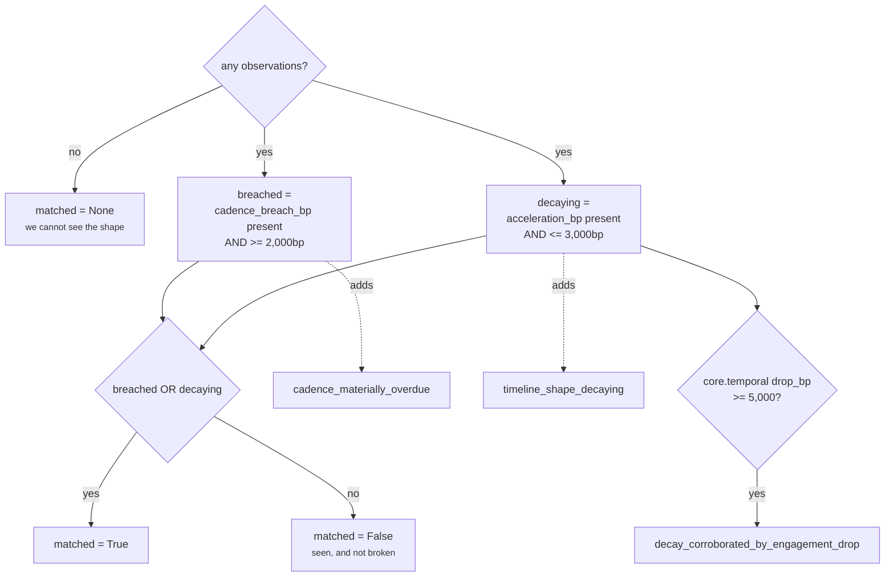

# 05 · Evaluator — `core.timeline`

**Stage 6 of the eight.** `@abstractmethod` on the base class.
`timeline_unit.py:TimelineUnit.evaluate_meaning`, 53 lines including its docstring.

---

## 1 · What it is for

The Evaluator turns numbers into meaning. It is the only stage that reads `view.config`, and
therefore the only stage where a capability author's judgement enters this unit.

What "meaning" means here is narrow and stated in the docstring:

> *"`matched` means the timeline's shape is broken, not that anything should be done."*

The unit reports shape. It never says "follow up now" and never ranks which silence matters most.
Two independent breaks, ORed, and a set of reason codes naming which one fired.

---

## 2 · What exists

```python
def evaluate_meaning(self, view: UnitView, metrics: Mapping[str, int],
                     observations: Sequence[Observation]) -> Verdict:
    if not observations:
        return Verdict(matched=None, metrics=dict(metrics))

    breach_threshold = _config_bp(view, "cadence_breach_threshold_bp", 2_000)
    decay_threshold = _config_bp(view, "decay_threshold_bp", 3_000)
    breached = "cadence_breach_bp" in metrics \
        and metrics["cadence_breach_bp"] >= breach_threshold
    decaying = "acceleration_bp" in metrics and metrics["acceleration_bp"] <= decay_threshold

    codes = {code for item in observations for code in item.reason_codes}
    if breached:
        codes.add("cadence_materially_overdue")
    if decaying:
        codes.add("timeline_shape_decaying")
        if view.prior_metric("core.temporal", "drop_bp", 0) >= _config_bp(
                view, "corroborating_drop_bp", 5_000):
            codes.add("decay_corroborated_by_engagement_drop")

    matched_by_kind: dict[str, bool | None] = {
        "timeline.ordering": None,
        "timeline.cadence": breached,
        "timeline.trend": decaying,
    }
    findings = tuple(Finding(
        finding_id=f"timeline.{item.plugin_id}",
        kind="timeline",
        matched=matched_by_kind.get(item.kind),
        metrics=item.metrics,
        evidence_ids=item.evidence_ids,
        reason_codes=item.reason_codes,
    ) for item in observations)
    return Verdict(
        matched=bool(breached or decaying),
        metrics=dict(metrics),
        findings=findings,
        reason_codes=tuple(sorted(codes)),
    )
```

### 2.1 · Thresholds

| Config key | Default | Compared against | Direction | Adds |
|---|---|---|---|---|
| `cadence_breach_threshold_bp` | `2_000` | `cadence_breach_bp` | `>=` | `cadence_materially_overdue` |
| `decay_threshold_bp` | `3_000` | `acceleration_bp` | `<=` | `timeline_shape_decaying` |
| `corroborating_drop_bp` | `5_000` | `core.temporal`'s `drop_bp` | `>=` | `decay_corroborated_by_engagement_drop` (only when already decaying) |

All three go through `_config_bp`, which **raises** on anything that is not an integer in
`0..10_000`, including `bool`:

```python
value = view.config.get(key, default)
if isinstance(value, bool) or not isinstance(value, int) or not 0 <= value <= 10_000:
    raise ValueError(f"{key} must be integer basis points")
```

> *"Raising rather than defaulting is deliberate: a mistyped threshold that silently falls back to
> the default would ship a capability that scores differently from what its author reviewed."*

**None of the three defaults has been tuned against outcomes.** The one capability that names this
unit ships `live_delivery_enabled=False`. Treat `2,000`, `3,000` and `5,000` as reasoned starting
positions, not measurements.

What the defaults mean in plain terms:

```text
cadence_breach_threshold_bp = 2,000
    overdue_hours >= 0.2 × cadence_hours
    on a 168h weekly cadence: about 34 hours past the review

decay_threshold_bp = 3,000
    acceleration_bp ≈ 5,000 × earlier_gap / recent_gap  (stretching branch)
    5,000 × earlier / recent <= 3,000  ⟹  recent >= 1.667 × earlier
    gaps must stretch by at least two thirds
```

### 2.2 · Outputs

| `Verdict` field | Populated? | Contents |
|---|---|---|
| `matched` | yes | `None` with no observations, else `bool(breached or decaying)` |
| `metrics` | yes | `dict(metrics)` — the Calculator's output, unchanged |
| `reason_codes` | yes | union of every observation's codes, plus up to three unit-level codes, sorted |
| `findings` | yes | one per observation, in `analyze` order |
| `adjustments` | **never** | `()` |
| `checks` | **never** | `()` |

**No adjustments, no checks — ever.** `CandidateAdjustment` moves a play's utility score;
`CandidateCheck` can eliminate a candidate before ranking. Emitting either would make this unit a
decision authority, and the module header rules that out: *"The unit reports shape. It never says
'follow up now' or ranks which silence matters most; that synthesis is the Decision Maker's, and
keeping it out of here is what keeps the shape auditable."* Only `core.constraint` emits checks in
this category, and only `core.impact` and `core.cost` emit adjustments in the shipped roster.

---

## 3 · How it works

### 3.1 · Two independent breaks, ORed



The docstring's reason for OR rather than sum:

> *"Broken is either of two independent things: the situation is materially past a cadence its owner
> declared, or its rhythm is measurably unravelling. They are ORed rather than summed because either
> one alone is a real break — a weekly account nine days silent is late even if its historical gaps
> were shrinking."*

Summing would require a shared scale between a fraction of a declared period and a ratio of two
means, which does not exist. Averaging would let a strongly accelerating rhythm cancel a genuine
breach — precisely the case `test_a_late_but_tightening_account_is_not_reported_as_decaying`
exercises.

**The `in metrics` guards matter.** `breached` is `False` when no cadence was declared, and
`decaying` is `False` when fewer than three events exist. Absence is treated as "this break did not
fire", never as "this break fired at zero". A snapshot with one event and no cadence therefore
evaluates both breaks as `False` without ever having been able to test either — see §3.5.

### 3.2 · `matched=None` versus `matched=False`

```python
if not observations:
    return Verdict(matched=None, metrics=dict(metrics))
```

> *"With no datable event the verdict is `None`, not `False`: 'we cannot see the shape' and 'the
> shape is fine' are different claims, and collapsing them would let an empty snapshot read as a
> healthy one."*

The early return also suppresses findings and reason codes, so an unobservable timeline produces a
result carrying `{"event_count": 0}` and nothing else. `test_an_empty_snapshot_yields_unknown_rather_than_a_healthy_looking_zero`
asserts all three: `matched is None`, `metrics == {"event_count": 0}`, `findings == ()`.

The complementary test is `test_a_healthy_weekly_account_is_matched_false_not_none`: *"seen-and-fine
must be distinguishable from never-seen for downstream to trust it."* Four touches a week apart
against a 168h cadence gives `matched=False`, `cadence_breach_bp: 0`, `acceleration_bp: 5,000` — a
positive statement of health, backed by numbers a reviewer can check.

### 3.3 · Reason codes — the full inventory

The verdict's codes are the **union** of every observation's codes plus up to three added here, then
sorted. Ten codes are reachable:

| Code | Emitted by | Fires when |
|---|---|---|
| `cadence_on_track` | `cadence_adherence` | a cadence is declared and `overdue_hours == 0` |
| `cadence_breached` | `cadence_adherence` | a cadence is declared and `overdue_hours > 0` |
| `timeline_single_event` | `event_ordering` | exactly one datable event |
| `silence_exceeds_prior_gaps` | `event_ordering` | `latest_age > max(gaps)` |
| `timeline_accelerating` | `trend_direction` | `acceleration_bp > 5,000` |
| `timeline_steady` | `trend_direction` | `acceleration_bp == 5,000` |
| `timeline_decaying` | `trend_direction` | `acceleration_bp < 5,000` |
| `cadence_materially_overdue` | **the Evaluator** | `cadence_breach_bp >= cadence_breach_threshold_bp` |
| `timeline_shape_decaying` | **the Evaluator** | `acceleration_bp <= decay_threshold_bp` |
| `decay_corroborated_by_engagement_drop` | **the Evaluator** | decaying **and** `core.temporal.drop_bp >= corroborating_drop_bp` |

The pairing to watch is `cadence_breached` versus `cadence_materially_overdue`, and
`timeline_decaying` versus `timeline_shape_decaying`. The plugin codes are **observations** — any
overdue at all, any stretching at all. The Evaluator codes are **threshold readings**. A result can
carry `cadence_breached` without `cadence_materially_overdue`, and that is the normal case for a
small breach:

```text
cadence 168h · elapsed 200h · overdue 32h · cadence_breach_bp 1,905
    1,905 < 2,000  →  cadence_breached present, cadence_materially_overdue absent
    matched = False
```

A consumer matching on `cadence_breached` gets "is it late at all"; one matching on
`cadence_materially_overdue` gets "is it late enough for this capability to care". They are different
questions and the trace answers both.

Note that positive codes ship too. `cadence_on_track` and `timeline_steady` appear on healthy runs,
because *"a healthy rhythm is a real observation; suppressing it would make health unprovable."*

### 3.4 · Findings — one per observation, with a per-kind `matched`

```python
Finding(finding_id=f"timeline.{item.plugin_id}",
        kind="timeline",
        matched=matched_by_kind.get(item.kind),
        metrics=item.metrics,          # verbatim, including keys calculate dropped
        evidence_ids=item.evidence_ids,
        reason_codes=item.reason_codes)
```

| Finding id | `kind` | `matched` | Carries |
|---|---|---|---|
| `timeline.cadence_adherence` | `timeline` | `breached` | `cadence_hours`, `overdue_hours`, `breach_bp` |
| `timeline.event_ordering` | `timeline` | **always `None`** | `event_count`, `latest_age_hours`, `span_hours`, and the two gap keys when measured |
| `timeline.trend_direction` | `timeline` | `decaying` | `acceleration_bp`, `earlier_gap_hours`, `recent_gap_hours`, `gap_sample` |

The ordering finding is permanently `None` because ordering makes no claim that can be true or
false — it reports count, recency, span and typical gap, none of which is a threshold crossing.
Mapping it to `False` would assert "ordering found nothing wrong", which is not a statement the
plugin is equipped to make.

The other two carry the **Evaluator's** threshold reading, not the plugin's own. That produces one
combination that reads oddly in a trace and is worth knowing about:

```text
finding timeline.cadence_adherence
    matched      False
    reason_codes ("cadence_breached",)
    metrics      {breach_bp 1905, cadence_hours 168, overdue_hours 32}
```

*Not matched, and breached.* Both are correct — the plugin observed a breach, the capability's
threshold says it is not material — but a reader skimming `matched` alone will draw the wrong
conclusion. `test_northwind_renewal_a_weekly_account_that_is_late_and_slowing` asserts the finding
ids but not their `matched` values, so nothing pins this pairing.

Findings are emitted in `analyze` order, which is alphabetical by `plugin_id`:
`cadence_adherence`, `event_ordering`, `trend_direction`. That order reaches the result's
`semantic_hash`, which is why the base `analyze` sorts.

The three trend keys `calculate` drops — `earlier_gap_hours`, `recent_gap_hours`, `gap_sample` —
survive here, on the finding. That is where an auditor reconstructs `acceleration_bp` by hand.

### 3.5 · The `matched=False` wrinkle

`matched=None` is reserved for `not observations`, which means *zero datable events*. But there are
two further situations where neither break could be tested:

| Situation | Observations | `breached` | `decaying` | `matched` |
|---|---|---|---|---|
| no datable event | `()` | — | — | `None` |
| 1 event, no cadence declared | ordering only | `False` (absent) | `False` (absent) | **`False`** |
| 2 events, no cadence declared | ordering only | `False` (absent) | `False` (absent) | **`False`** |
| 3+ events, no cadence | ordering + trend | `False` (absent) | tested | `False` or `True` |

Rows two and three report `matched=False` — *the shape is not broken* — on a timeline where neither
breakage test was evaluable. Verified:

```python
facts = {"deal.last_inbound": "<30h ago>", "thread.last_inbound": "<30h ago>"}
# → matched False, metrics {event_count 1, elapsed_hours 30, span_hours 0}
#   reason_codes ("timeline_single_event",)
```

The docstring's None/False distinction is drawn at *zero observations*, not at *zero measurable
breaks*, and the `timeline_single_event` reason code is the only thing in the result that says so. A
consumer reading `matched` alone cannot distinguish "a weekly account meeting its cadence with a
stable rhythm" from "one email, ever". A consumer reading the reason codes can.

A related gap: `silence_exceeds_prior_gaps` **never influences `matched`**. A relationship quiet for
three times its own longest historical silence, with no declared cadence, reports:

```python
facts = {"timeline.events": [500h, 400h, 300h ago]}
# → matched False
#   reason_codes ("silence_exceeds_prior_gaps", "timeline_steady")
#   acceleration_bp 5,000 · max_gap_hours 100 · elapsed_hours 300
```

`matched=False` on a shape that is visibly broken by the relationship's own standard. The break the
ordering plugin detected has no threshold and no place in the OR. Whether that is right depends on
whether `matched` is meant to mean *broken by a declared rule* — which is what the two thresholds
test — or *broken*. The docstring says the latter; the code implements the former.

### 3.6 · The corroboration read

```python
if view.prior_metric("core.temporal", "drop_bp", 0) >= _config_bp(
        view, "corroborating_drop_bp", 5_000):
    codes.add("decay_corroborated_by_engagement_drop")
```

The source comment is emphatic about the boundary:

> *"Corroboration only. `core.temporal` measures engagement collapse for one deal; when it agrees
> with a stretching timeline the pairing is worth naming, but it must never move a number here, or
> adding that unit to a plan would silently re-score this one."*

Three properties enforce that:

1. **It is inside the `if decaying:` block.** A high `drop_bp` on a healthy timeline adds nothing.
   Corroboration cannot create a claim, only annotate one.
2. **It adds a reason code and touches no metric.** `test_engagement_drop_corroborates_decay_without_moving_a_single_number`
   evaluates the same facts twice, once with `core.temporal` in `prior` and once without, and asserts
   `dict(alone.metrics) == dict(corroborated.metrics)`.
3. **It reads through `prior_metric`,** which returns the default silently if the dependency did not
   run, did not complete, or published a non-integer.

**It is dead in the shipped capability.** `view.prior` contains only the dependencies the capability
declared — the orchestrator builds it as `{item: prior[item] for item in spec.dependencies if item
in prior}` (`orchestrator.py:158`) — and `deal_cooling_v2` declares
`_spec("core.timeline", config={...})` with no `dependencies` argument, so `dependencies=()`.
`core.temporal` runs in the same plan and completes; this unit never sees it. The default `0` is
returned on every production run and the code can never fire. Fixing it is a one-tuple change in the
manifest: `_spec("core.timeline", ("core.temporal",), config={...})`.

---

## 4 · Worked examples

### 4.1 · Northwind — both breaks fire

```python
facts = {"timeline.cadence_hours": 168,
         "timeline.events": [912h, 720h, 552h, 216h ago],
         "deal.status": "open"}
```

```text
cadence_breach_bp 2,857  >= 2,000  → breached = True
acceleration_bp   2,857  <= 3,000  → decaying = True
matched = bool(True or True)       = True

codes from observations  {cadence_breached, timeline_decaying}
                       + cadence_materially_overdue
                       + timeline_shape_decaying
                       + (corroboration: prior is empty → not added)
sorted → ("cadence_breached", "cadence_materially_overdue",
          "timeline_decaying", "timeline_shape_decaying")

findings
  timeline.cadence_adherence   matched True
  timeline.event_ordering      matched None
  timeline.trend_direction     matched True
```

`silence_exceeds_prior_gaps` is **absent**: 216h of silence against a historical maximum gap of 336h
is not unprecedented for this relationship. The test asserts its absence explicitly, because that
absence is the whole reason cadence and ordering are separate claims.

Both thresholds are cleared by thin margins — 857bp on the breach, 143bp on the decay. This fixture
would flip to `matched=False` under `{"cadence_breach_threshold_bp": 3_000, "decay_threshold_bp":
2_500}`, which is well inside the range a capability author might plausibly choose.

### 4.2 · Late but tightening — one break, and the trace says which

```python
facts = {"timeline.cadence_hours": 24,
         "timeline.events": [1000h, 500h, 100h, 50h ago]}
```

```text
elapsed 50h · cadence 24h · overdue 26h
cadence_breach_bp = clamp_bp(divide_half_up(260_000, 24)) = clamp_bp(10_833) = 10,000
                    10,000 >= 2,000                        → breached = True

gaps [500, 400, 50] · earlier [500] · recent [50]
acceleration_bp = 5,000 + divide_half_up(450 × 5,000, 500) = 9,500
                    9,500 <= 3,000?  no                     → decaying = False

matched = True
codes ("cadence_breached", "cadence_materially_overdue", "timeline_accelerating")

findings
  timeline.cadence_adherence   matched True
  timeline.event_ordering      matched None
  timeline.trend_direction     matched False    ← explicitly not decaying
```

`test_a_late_but_tightening_account_is_not_reported_as_decaying`: *"overdue and decaying are
independent claims; ORing them must not blur which one fired."* The trend finding carries
`matched=False` and `timeline_accelerating`, so a reader can see the unit considered decay and
rejected it. A composite score would have produced one number in which the acceleration silently
offset the breach.

### 4.3 · Healthy weekly account — matched False with proof

```python
facts = {"timeline.cadence_hours": 168,
         "timeline.events": [400h, 300h, 200h, 100h ago]}
```

```text
elapsed 100h · overdue max(0, 100-168) = 0 · cadence_breach_bp 0
    0 >= 2,000?     no    → breached = False
gaps [100, 100, 100] · earlier [100] · recent [100] · acceleration_bp 5,000
    5,000 <= 3,000? no    → decaying = False
matched = False

codes ("cadence_on_track", "timeline_steady")
findings
  timeline.cadence_adherence   matched False
  timeline.event_ordering      matched None
  timeline.trend_direction     matched False
```

Nine metrics, three findings, two positive codes. Health is asserted with the same evidentiary weight
as a break.

### 4.4 · Corroboration, when the dependency is actually passed

```python
facts   = {"timeline.events": [1000h, 916h, 832h, 496h, 160h ago]}
prior   = {"core.temporal": ReasonerResult(..., metrics={"drop_bp": 7_500})}
```

```text
no cadence declared          → breached = False
acceleration_bp 1,250 <= 3,000 → decaying = True
matched = True

drop_bp 7,500 >= corroborating_drop_bp 5,000 → add the corroboration code

alone         codes ("timeline_decaying", "timeline_shape_decaying")
corroborated  codes ("decay_corroborated_by_engagement_drop",
                     "timeline_decaying", "timeline_shape_decaying")

dict(alone.metrics) == dict(corroborated.metrics)     ← asserted by the test
```

The metrics are byte-identical in both runs. Only the code set differs, which is exactly the
boundary the comment draws.

---

## 5 · Edge cases

### 5.1 · Threshold boundaries

| Comparison | Operator | At exactly the threshold |
|---|---|---|
| `cadence_breach_bp` vs `cadence_breach_threshold_bp` | `>=` | **fires** |
| `acceleration_bp` vs `decay_threshold_bp` | `<=` | **fires** |
| `drop_bp` vs `corroborating_drop_bp` | `>=` | **fires** |

All three are inclusive. `cadence_breach_bp == 2_000` is materially overdue;
`acceleration_bp == 3_000` is decaying.

### 5.2 · Degenerate threshold values

| Config | Effect |
|---|---|
| `{"cadence_breach_threshold_bp": 0}` | any declared cadence with `breach_bp >= 0` — i.e. **every** cadence observation, including on-track ones at `0` — sets `matched=True` |
| `{"decay_threshold_bp": 10_000}` | every trend observation is decaying, including `timeline_accelerating` at `9,500` |
| `{"decay_threshold_bp": 0}` | only the degenerate `acceleration_bp == 0` branch fires |
| `{"cadence_breach_threshold_bp": 10_000}` | only a full period past due counts |

Both `0` and `10_000` are inside `_config_bp`'s accepted range, so nothing warns. A capability author
who sets `cadence_breach_threshold_bp: 0` intending "flag any breach" gets "flag every account with a
declared cadence, including healthy ones", because `cadence_on_track` still publishes
`cadence_breach_bp: 0` and `0 >= 0`.

### 5.3 · Malformed config raises out of stage 6

```text
{"cadence_breach_threshold_bp": 20000} → ValueError: cadence_breach_threshold_bp must be integer basis points
{"decay_threshold_bp": True}           → ValueError: decay_threshold_bp must be integer basis points
{"corroborating_drop_bp": "5000"}      → ValueError: corroborating_drop_bp must be integer basis points
```

The orchestrator catches these and produces `ResultStatus.FAILED` with the exception type and
message in `diagnostics`. `diagnostics` is `compare=False, repr=False` and outside
`to_semantic_dict`, so a failure message can never move a decision hash.

Note the ordering: `_config_bp("cadence_breach_threshold_bp")` and `_config_bp("decay_threshold_bp")`
are both evaluated unconditionally at the top, so a malformed `decay_threshold_bp` raises even on a
snapshot with no trend observation. `corroborating_drop_bp` is evaluated lazily inside
`if decaying:`, so a malformed value there is only discovered on a decaying run — a misauthored
capability can ship and pass its first hundred evaluations before failing.

### 5.4 · What `matched` does *not* mean

Worth stating plainly for anyone wiring a consumer:

- not "act now" — no urgency is expressed anywhere in this unit
- not "this deal is at risk" — that is `core.risk`, which reads different inputs
- not "the shape is unusual" — `silence_exceeds_prior_gaps` says that and does not reach `matched`
- not "we are confident" — `confidence_bp` belongs to `core.confidence`, and
  `test_the_unit_never_claims_authority_over_a_shared_metric` proves this unit cannot publish it

It means: *at least one of two declared rules about time has been broken by more than the capability's
threshold.*

---

## Related

| Document | Covers |
|---|---|
| [04 · Calculator](04-Calculator.md) | the metrics these thresholds read |
| [03a · `cadence_adherence`](03a-plugin-cadence_adherence.md) | `cadence_breached` versus `cadence_materially_overdue` |
| [03c · `trend_direction`](03c-plugin-trend_direction.md) | `acceleration_bp` and what `3,000bp` means in gap terms |
| [06 · Builder and Metrics](06-Builder-and-Metrics.md) | how the `Verdict` becomes a `ReasonerResult` |
| README §7.2 | why the corroboration read is dead in production |
