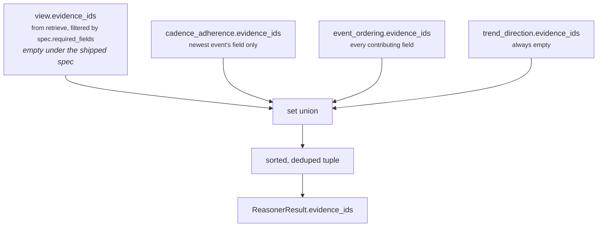

# 06 · Builder and Metrics — `core.timeline`

**Stages 7 and 8 of the eight.** Neither is overridden. `core.timeline` uses
`unit.py:ReasoningUnit.build` unchanged, and declares its metrics through the `publishes` class
attribute that the framework's guard enforces.

---

## 1 · What it is for

Stage 7 assembles the one object shape every unit returns, so that seventeen independently written
units are interchangeable to everything downstream. Stage 8 is the declaration that makes the object
safe: a unit publishes what it said it would publish, and the framework refuses anything else.

---

## 2 · What exists

### 2.1 · `build` — base implementation

```python
# unit.py:ReasoningUnit.build
def build(self, view: UnitView, verdict: Verdict,
          observations: Sequence[Observation]) -> ReasonerResult:
    evidence = set(view.evidence_ids)
    for observation in observations:
        evidence.update(observation.evidence_ids)
    return ReasonerResult(
        reasoner_id=self.unit_id,
        reasoner_version=self.version,
        status=ResultStatus.COMPLETED,
        matched=verdict.matched,
        metrics={name: clamp_bp(value) if name.endswith("_bp") else value
                 for name, value in verdict.metrics.items()},
        findings=verdict.findings,
        adjustments=verdict.adjustments,
        checks=verdict.checks,
        evidence_ids=tuple(sorted(evidence)),
        reason_codes=verdict.reason_codes,
    )
```

`TimelineUnit` defines no `build`. Only one unit in the roster does — `core.confidence`, which
overrides it to route around the `publishes` guard for a name-colliding metric. This unit has no such
problem, so the base is correct for it and the framework pays for itself here.

### 2.2 · The `publishes` declaration

```python
publishes = ("event_count", "elapsed_hours", "span_hours", "gap_hours", "max_gap_hours",
             "cadence_hours", "cadence_breach_bp", "overdue_hours", "acceleration_bp")
```

Nine names. The guard that enforces them lives in the template method, between the Evaluator and the
Builder:

```python
# unit.py:ReasoningUnit.evaluate
undeclared = sorted(set(verdict.metrics) - set(self.publishes)) if self.publishes else []
if undeclared:
    raise ValueError(f"{self.unit_id} published undeclared metrics: {', '.join(undeclared)}")
return self.build(view, verdict, observations)
```

It sits *before* `build` deliberately: a unit that published an undeclared metric would still produce
a well-formed `ReasonerResult`, so the guard refuses before that object exists. The failure reads
"this unit is misdeclared", not "this result contains something surprising".

### 2.3 · The result shape

| Field | Value for `core.timeline` |
|---|---|
| `reasoner_id` | `"core.timeline"` — from `self.unit_id`, not from the capability's spec |
| `reasoner_version` | `"1.0.0"` — from `self.version` |
| `status` | always `ResultStatus.COMPLETED` when `build` runs |
| `matched` | `None`, `True` or `False` — see `05` |
| `metrics` | 1 to 9 of the declared names |
| `findings` | one `Finding` per observation, 0 to 3, ids `timeline.{plugin_id}` |
| `adjustments` | **always `()`** |
| `checks` | **always `()`** |
| `evidence_ids` | union of `view.evidence_ids` and every observation's — sorted, deduped |
| `missing_fields` | **always `()`** — never populated by this unit |
| `reason_codes` | 0 to ~6 codes, sorted |
| `diagnostics` | **always `{}`** |

**One finding per observation**, so the count tracks how many plugins spoke:

| Situation | Findings |
|---|---|
| no datable event | `0` — `evaluate_meaning` returns early |
| 1–2 events, no cadence declared | `1` — ordering only |
| 1–2 events, cadence declared | `2` — cadence + ordering |
| 3+ events, no cadence declared | `2` — ordering + trend |
| 3+ events, cadence declared | `3` |

Verified for each row. `adjustments` and `checks` are structurally always empty: `evaluate_meaning`
never constructs either, because emitting one would make this unit a decision authority (`05` §2.2).

---

## 3 · How it works

### 3.1 · Evidence union



The sort is load-bearing: `evidence_ids` is part of `to_semantic_dict`, so it reaches the result's
`semantic_hash`. `ReasonerResult.__post_init__` sorts and dedupes again, which makes the sort in
`build` redundant but harmless.

Verified on a three-fact snapshot with one evidence row per fact and a declared cadence:

```text
result.evidence_ids                  ("ev_in", "ev_out", "ev_thr")
finding timeline.event_ordering      ("ev_in", "ev_out", "ev_thr")
finding timeline.cadence_adherence   ("ev_out",)          ← newest event only
finding timeline.trend_direction     ()
```

Because `view.evidence_ids` is empty under the shipped spec, **the result's evidence is entirely the
plugins' own**. That is the right outcome — the ordering plugin cites exactly the fields that
produced surviving events, which is a tighter claim than "every field the spec declared" — but it
means a capability that declared `required_fields` would see evidence ids appear in the result that
no observation stands on. Discussed in `02` §4.1.

**One honest gap.** A timeline built entirely from `timeline.events` produces
`result.evidence_ids == ()`, because every `_Event` from the log carries
`field == "timeline.events"` and there is usually no `EvidenceRef` with that field name. The most
information-rich input the unit accepts is the one that attributes worst.

### 3.2 · The `_bp` clamp

```python
{name: clamp_bp(value) if name.endswith("_bp") else value for name, value in verdict.metrics.items()}
```

Two of the nine names end in `_bp`: `cadence_breach_bp` and `acceleration_bp`. Both were already
clamped in their plugin and again in `calculate`, so this is the fourth application and can never
bind for this unit.

The framework-wide caveat still applies here. `clamp_bp` is `min(10_000, max(0, int(value)))`, and
`int()` on a float truncates silently — `clamp_bp(0.7)` is `0`. `Verdict` validates nothing, so a
float `_bp` metric would be quietly truncated rather than rejected, while a float in a non-`_bp`
metric is loudly rejected one layer later by `platform/canonical.py:canonicalize`. This unit cannot
reach that state — every value it produces passes through `Observation.__post_init__`, which rejects
non-integers — but the asymmetry is real and is recorded in the unit-framework README §3.7.

`ReasonerResult.__post_init__` then re-validates every `_bp` name through `_bp(value, …)`, which is
the third independent check that these two metrics are integers in `0..10,000`.

### 3.3 · Determinism, and what reaches the hash

```python
def to_semantic_dict(self):
    return {"reasoner_id", "reasoner_version", "status", "matched", "metrics",
            "findings", "adjustments", "checks", "evidence_ids", "missing_fields",
            "reason_codes"}     # keys only, for brevity

@property
def semantic_hash(self) -> str:
    return semantic_hash(self.to_semantic_dict())
```

`diagnostics` is excluded, and is declared `compare=False, repr=False`, so a failure message can
never move a hash.

Everything else does reach it — including finding **order**, which is why `analyze`'s sort by
`plugin_id` matters. Four sorts stand between this unit and a hash that depends on incidental
ordering:

| Sort | Where | Protects against |
|---|---|---|
| `sorted(_config_fields(view))` | `_known_events` | the order fields were authored in config |
| `sorted(collected, key=(at, label, field))` then `sorted(deduped, key=(at, label))` | `_known_events` | the order Layer 2 wrote the facts mapping |
| `sorted(self.plugins, key=plugin_id)` | base `analyze` | the order plugins were registered |
| `tuple(sorted(codes))`, `tuple(sorted(evidence))` | `evaluate_meaning`, `build` | set iteration order |

`test_identical_input_produces_identical_metrics` asserts
`first.semantic_hash == second.semantic_hash` across two independent evaluations of the same facts.
`test_fact_write_order_cannot_change_the_shape` supplies three timestamp facts in reverse write
order and asserts identical metrics: *"ordering must come from timestamps, never from the order
Layer 2 happened to write facts."*

### 3.4 · The `publishes` guard in practice

The guard compares `set(verdict.metrics)` — which for this unit is exactly `calculate`'s output,
passed through `evaluate_meaning` unchanged — against the nine declared names.

`test_the_unit_publishes_only_metrics_it_declared` pins both directions:

```python
result = TimelineUnit().evaluate(
    _request({"timeline.cadence_hours": 168, "timeline.events": _events(900, 600, 300, 100)}), {})

assert set(result.metrics) <= set(TimelineUnit.publishes)
assert {"event_count", "elapsed_hours", "span_hours", "gap_hours", "max_gap_hours",
        "cadence_hours", "overdue_hours", "cadence_breach_bp",
        "acceleration_bp"} == set(result.metrics)
```

The subset assertion pins the guard; the equality assertion pins the declaration against drift in the
other direction — a name removed from `calculate` but left in `publishes` would pass the guard
silently and be caught here.

What the guard prevents concretely: if someone added a fourth plugin reporting, say, `burst_count`
and wired it into `calculate` without amending `publishes`, the run would raise
`ValueError: core.timeline published undeclared metrics: burst_count` on the first test, not six
months later when a downstream unit started reading a metric nobody knew was moving.

### 3.5 · Roster invariants this unit satisfies

`tests/test_unit_roster.py` applies ten invariants across all seventeen units. The three that bind
hardest here:

| Invariant | How `core.timeline` satisfies it |
|---|---|
| Exactly one publisher per metric name | none of the nine is declared by another unit. `elapsed_hours` is the interesting case: `core.temporal` and `core.scheduling` both *emit* it, but `core.temporal` declares no `publishes` at all and `core.scheduling` declares `("constraint_count", "deadline_pressure_bp", "timing_fit_bp", "wait_hours")`. The declaration is unique; the name is not. |
| Only the named authority publishes a shared decision metric | `test_the_unit_never_claims_authority_over_a_shared_metric` asserts `publishes` is disjoint from `{confidence_bp, urgency_bp, priority_override_bp}` |
| No clock, DB, randomness or LLM in the unit module | `timeline_unit.py` imports `datetime` for type annotations only; every age is measured against `request.evaluation_time`. The purity scan is a substring match for `datetime.now`, `time.time`, `random.`, `os.environ`, `requests.`, `sqlalchemy`, `openai`, `anthropic` — none appears |

The `elapsed_hours` situation is worth restating because it is a live trap. Three units in a single
run can carry a metric called `elapsed_hours` with three different values measured from three
different fields: `core.temporal` from its configured timestamp field, `core.scheduling` from a
deadline field, and `core.timeline` from the newest datable event. The roster invariant does not
catch it because it inspects `publishes`, and two of the three do not declare it. A consumer must
read `result.reasoner_id`, not just the metric name.

`core.validation`'s `ContradictionPlugin` would not flag the divergence either — it compares only
`_bp`-suffixed metrics across units, on the stated grounds that *"a gap of '31' between two
`elapsed_hours` metrics is not comparable to anything."*

---

## 4 · Who consumes these metrics

Honest inventory, because "the unit publishes it" and "something reads it" are different claims.

### 4.1 · Verified by grep across `genios_engine/`

**Nothing reads any of the nine metrics from a `core.timeline` result.**

| Metric | Read by any unit? | Read by the Decision Maker? | Read by Layers 5–7? |
|---|---|---|---|
| `event_count` | no | no | no |
| `elapsed_hours` | no | no | no |
| `span_hours` | no | no | no |
| `gap_hours` | no | no | no |
| `max_gap_hours` | no | no | no |
| `cadence_hours` | no | no | no |
| `cadence_breach_bp` | no | no | no |
| `overdue_hours` | no | no | no |
| `acceleration_bp` | no | no | no |

`decision_maker.py` indexes exactly three metric names by hand — `confidence_bp`, `urgency_bp` and
`priority_override_bp` — and none of them belongs to this unit. No `prior_metric("core.timeline",
…)` call exists anywhere in the codebase.

### 4.2 · The two near-misses

**`core.validation` would read it, if it were declared as a dependency.**
`ContradictionPlugin` and its siblings iterate `completed_results(view)` generically — every prior
result, sorted by reasoner id — and would compare this unit's `_bp` metrics against other units'
looking for divergent duplicates, and its findings against others' looking for opposed verdicts.
But `deal_cooling_v2` declares:

```python
_spec("core.validation", ("core.risk", "core.opportunity", "core.impact", "core.confidence"), …)
```

`core.timeline` is not in that tuple, so it never appears in the validation unit's `prior`.

**`core.timeline` would read `core.temporal`, if it were declared as a dependency.** The mirror image
of the same problem, covered in `05` §3.6 and README §7.2.

Both are the framework-wide sharp edge described in the unit-framework README §4.3: a capability
author who wires a unit without declaring the dependency gets the silent default, no error, no reason
code, no telemetry.

### 4.3 · What does consume the result today

| Consumer | What it uses |
|---|---|
| `reason/guards.py` | validates the result's shape — declared metrics, citable evidence, known play ids |
| the orchestrator's `StepTrace` | `input_hash` and `output_hash` for every step, including this one |
| `reason/store.py` | persists the immutable result into the decision record |
| `tests/test_capability_deal_cooling_full.py` | asserts `result_by_id["core.timeline"].metrics["elapsed_hours"] == 240` — the only assertion anywhere that a timeline metric has a particular value in a full capability run |

So the unit is **write-only into the audit record**. Every number it publishes is hashed, persisted
and replayable, and none of it moves a decision. That is a defensible state for a unit inside a
shadow-mode capability — it is exactly what shadow mode is for — but it means none of the nine
metrics has been validated against a consumer's expectations, and none of the three thresholds has
been tuned against an outcome.

The most likely first consumer, on the shape of the existing roster, is `core.risk`'s
`momentum_decay` plugin or `core.recommendation`'s `ActionReadinessPlugin` — both already read a
Category 1 unit's metric as an input, and both are about whether the situation is moving.

---

## 5 · Worked example — the full result object

Northwind, verified end to end:

```python
facts = {"timeline.cadence_hours": 168,
         "timeline.events": [912h, 720h, 552h, 216h ago],
         "deal.status": "open"}
prior = {}
```

```text
ReasonerResult(
    reasoner_id       = "core.timeline",
    reasoner_version  = "1.0.0",
    status            = ResultStatus.COMPLETED,
    matched           = True,

    metrics = {
        acceleration_bp    2857,      # 5,000 × 192/336, stretching
        cadence_breach_bp  2857,      # 48h overdue on a 168h cadence
        cadence_hours       168,
        elapsed_hours       216,
        event_count           4,
        gap_hours           192,      # median of [168, 192, 336]
        max_gap_hours       336,
        overdue_hours        48,
        span_hours          696,
    },

    findings = (
        Finding("timeline.cadence_adherence", kind="timeline", matched=True,
                metrics={breach_bp 2857, cadence_hours 168, overdue_hours 48},
                reason_codes=("cadence_breached",)),
        Finding("timeline.event_ordering", kind="timeline", matched=None,
                metrics={event_count 4, gap_hours 192, latest_age_hours 216,
                         max_gap_hours 336, span_hours 696},
                reason_codes=()),
        Finding("timeline.trend_direction", kind="timeline", matched=True,
                metrics={acceleration_bp 2857, earlier_gap_hours 192,
                         gap_sample 3, recent_gap_hours 336},
                reason_codes=("timeline_decaying",)),
    ),

    adjustments  = (),
    checks       = (),
    evidence_ids = (),                # the timeline came from timeline.events — §3.1
    reason_codes = ("cadence_breached", "cadence_materially_overdue",
                    "timeline_decaying", "timeline_shape_decaying"),
)
```

Three things to read out of that object.

**`latest_age_hours` and `elapsed_hours` are the same 216 hours under two names**, one on the finding
and one in the metrics. README §7.3.

**The findings carry three keys the metrics do not** — `earlier_gap_hours`, `recent_gap_hours` and
`gap_sample`. They are how an auditor recomputes `acceleration_bp` by hand without re-running the
unit.

**`evidence_ids` is empty** on the unit's own flagship fixture, because its timeline came from
`timeline.events` and no evidence row carries that field name. The most complete input produces the
least attributable output.

---

## 6 · Edge cases

### 6.1 · The empty result

```python
facts = {"deal.status": "open"}
```

```text
ReasonerResult(reasoner_id="core.timeline", reasoner_version="1.0.0",
               status=COMPLETED, matched=None,
               metrics={"event_count": 0},
               findings=(), adjustments=(), checks=(),
               evidence_ids=(), reason_codes=())
```

`COMPLETED` with `matched=None` and one metric. Contrast with what a refusal would have produced:
`ReasonerResult.__post_init__` forbids a non-`COMPLETED` result from carrying `matched`, metrics,
findings, adjustments, checks or evidence ids, so an `INSUFFICIENT_CONTEXT` result would have carried
**no `event_count` at all**. Completing with an honest zero is strictly more informative.

### 6.2 · The unit cannot skip itself

If `build` ever returned `ResultStatus.SKIPPED`, `orchestrator.py:_evaluate` would overwrite the
result with `FAILED` carrying `reasoner_returned_skipped`. Skipping is a scheduling decision and
belongs to Part 1. The base `build` hardcodes `COMPLETED`, so this unit cannot reach that state.

### 6.3 · `missing_fields` is never populated

`ReasonerResult.missing_fields` exists so a unit can report what it could not see. `build` does not
set it, and this unit never populates it, so it is always `()`. The information *is* available —
`_known_events` knows which configured fields yielded nothing — but it is discarded. A consumer
asking "did the timeline come from four facts or from one?" reads `event_count` and infers, or reads
the ordering finding's `evidence_ids` and counts.

### 6.4 · Failure paths that skip `build` entirely

| Cause | Stage | Result status |
|---|---|---|
| malformed `timeline_fields` | 4, `_config_fields` | `FAILED` |
| malformed `expected_cadence_hours` | 4, `_config_hours` | `FAILED` |
| malformed `cadence_breach_threshold_bp` or `decay_threshold_bp` | 6, `_config_bp` | `FAILED` |
| malformed `corroborating_drop_bp` | 6, but only on a decaying run | `FAILED` |
| an undeclared metric in the `Verdict` | 8, the guard | `FAILED` |
| `MissingContextError` from `validate` | 2 | `INSUFFICIENT_CONTEXT` — unreachable under the shipped spec |

`core.timeline` is declared `FailurePolicy.OPTIONAL` in `deal_cooling_v2` — it is not in the
`_REQUIRED` set — so a `FAILED` result does not stop the run. The capability produces its decision
without the timeline, and the only trace of the failure is the `StepTrace` and the exception message
in `diagnostics`, which is outside the hash.

---

## Related

| Document | Covers |
|---|---|
| [04 · Calculator](04-Calculator.md) | the metrics the guard inspects |
| [05 · Evaluator](05-Evaluator.md) | the `Verdict` this stage consumes |
| [02 · Retriever](02-Retriever.md) | `view.evidence_ids`, the other half of the evidence union |
| Unit framework README §3.4, §3.7 | the guard's escape hatch and the unvalidated `Verdict` |
| `genios_engine/contracts/reasoning.py` | `ReasonerResult`, `Finding`, `semantic_hash` |
