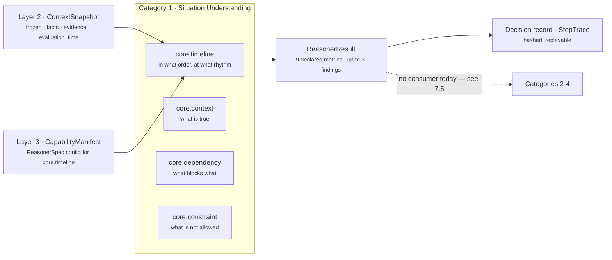
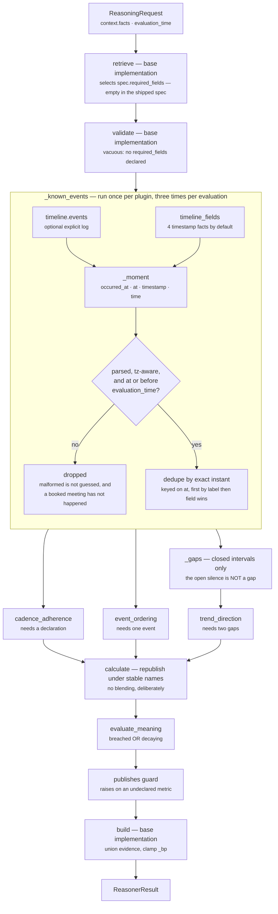

# `core.timeline` — the shape of a situation over time

**Module:** `genios_engine/reason/reasoners/timeline_unit.py` (453 lines)
**Tests:** `tests/test_unit_timeline_unit.py` — 29 assertions, all passing
**Category:** `UnitCategory.SITUATION_UNDERSTANDING` (Category 1, unit 2 of 4)
**Version:** `1.0.0`
**Registered:** `reasoners/__init__.py:SITUATION_UNDERSTANDING = (ContextUnit, TimelineUnit, DependencyUnit, ConstraintReasoner)`

---

## 1 · What it is for

**The business question:** *what shape does this situation have over time?*

Most of GeniOS reads the present — is engagement low, is the deal open, is anyone waiting. This
unit reads the **sequence**: when things happened, how far apart, whether the rhythm is tightening
or unravelling, and whether the last event is older than the rhythm the business declared for this
relationship.

The module docstring states the case in one sentence, and it is the whole reason the unit exists:

> *"A deal quiet for nine days after eleven exchanges in a fortnight is a break in a strong rhythm;
> a deal quiet for nine days after two emails ever never had a rhythm to break. Only the ordering
> tells them apart, and acting on the present alone treats those two as the same situation."*

**What it deliberately does not do.** It never says "follow up now" and never ranks which silence
matters most. That synthesis belongs to Part 3, the Decision Maker. Keeping it out of here is what
keeps the shape auditable.

### Why this is not `core.temporal`

| | `core.temporal` (supplementary) | `core.timeline` (this unit) |
|---|---|---|
| Measures | how far one deal's engagement has fallen, how long since it was touched | the arrangement of events in time |
| Emits | `drop_bp`, `elapsed_hours`, `urgency_bp` | `event_count`, `span_hours`, `gap_hours`, `acceleration_bp`, … |
| Shape | a magnitude for a single relationship | a sequence across many moments |

This unit **never publishes `drop_bp`**. It reads it in exactly one place — as corroboration for a
decay reason code in `evaluate_meaning` — and that read can never move a number here. The design
intent, from the docstring: *"adding `core.temporal` to a plan can never silently re-score the
timeline."* Section 6 records why that read is currently dead in the only capability that runs
this unit.

---

## 2 · Its place in the pipeline



`core.timeline` runs in the first category, before anything is entitled to an opinion about whether
the situation is risky or valuable. In `sales.deal_cooling_full` v2 — the only capability that names
it — its spec is:

```python
_spec("core.timeline", config={"cadence_hours": 336})
```

which means: **no dependencies**, **no `required_fields`**, `failure_policy=OPTIONAL`,
`latency_budget_ms=60`. That capability ships with `live_delivery_enabled=False`, so the unit has
never influenced a delivered decision.

---

## 3 · Plugins

`analyze()` is the base implementation, which runs `sorted(self.plugins, key=plugin_id)`. Execution
order is therefore **alphabetical by `plugin_id`**, not the registration order in the class body.

| # | `plugin_id` | Class | Observation `kind` | Claim | Silent when |
|---|---|---|---|---|---|
| 1 | `cadence_adherence` | `CadenceAdherencePlugin` | `timeline.cadence` | the newest event measured against a declared rhythm | no cadence declared, by fact or config; or no datable event |
| 2 | `event_ordering` | `EventOrderingPlugin` | `timeline.ordering` | how many events, how recent, how wide, what a typical gap looks like | no event can be dated |
| 3 | `trend_direction` | `TrendDirectionPlugin` | `timeline.trend` | whether the closed gaps are shortening or stretching | fewer than 2 closed gaps, i.e. fewer than 3 events |

`event_ordering` is the conceptual base — it is the only claim that needs no declaration, and the
one honest thing the unit can say when nothing else is available. It executes second only because
`c` sorts before `e`. Nothing depends on execution order: the three plugins do not communicate, and
`calculate()` selects observations by `kind`, never by position.

Detail on each is in `03a`–`03c` below.

---

## 4 · Published metrics

```python
publishes = ("event_count", "elapsed_hours", "span_hours", "gap_hours", "max_gap_hours",
             "cadence_hours", "cadence_breach_bp", "overdue_hours", "acceleration_bp")
```

| Metric | Range | Source plugin | Meaning | Present when |
|---|---|---|---|---|
| `event_count` | `0..n` | `event_ordering` | how many distinct datable moments | **always** — the only guaranteed metric |
| `elapsed_hours` | `0..n` | `event_ordering` | whole hours since the newest event | ≥ 1 event |
| `span_hours` | `0..n` | `event_ordering` | whole hours from oldest to newest event | ≥ 1 event (`0` for a single event) |
| `gap_hours` | `0..n` | `event_ordering` | **median** closed gap between consecutive events | ≥ 2 events |
| `max_gap_hours` | `0..n` | `event_ordering` | the longest gap this relationship ever recovered from | ≥ 2 events |
| `cadence_hours` | `1..8760` | `cadence_adherence` | the rhythm somebody declared | a cadence is declared **and** ≥ 1 event |
| `overdue_hours` | `0..n` | `cadence_adherence` | `max(0, elapsed − cadence)` | same |
| `cadence_breach_bp` | `0..10000` | `cadence_adherence` | how far past the declared period, capped at one full period | same |
| `acceleration_bp` | `0..10000` | `trend_direction` | gaps shortening above `5,000`, stretching below | ≥ 3 events |

None of these is a reserved shared metric. `test_the_unit_never_claims_authority_over_a_shared_metric`
pins that `publishes` is disjoint from `{confidence_bp, urgency_bp, priority_override_bp}` — those
belong to `core.confidence` and `core.priority`, and a second writer would silently re-score every
ranked decision in the system.

**An absent metric means "unknown", never zero.** From the class docstring: *"emitting a zero for a
gap nobody measured is indistinguishable from a measured zero, and something would eventually act on
it."* `test_unmeasurable_quantities_are_absent_rather_than_zero` asserts that a single-event snapshot
carries no `gap_hours`, no `acceleration_bp` and no `cadence_breach_bp` at all.

---

## 5 · Internal flow



Two properties of that diagram carry the design.

**`_known_events` is recomputed by every plugin.** All three call it independently, so a single
evaluation parses the same timestamps three times. It is pure and cheap at these input sizes, and
the alternative — a shared cache on the unit instance — would give the unit mutable state that the
framework's determinism argument does not want. Worth knowing before someone "optimises" it.

**The open silence is not a gap.** `_gaps` returns only the closed intervals between consecutive
events. The stretch since the newest event is reported separately as `elapsed_hours`, because *"it
is still open, and may close tomorrow. Treating it as a gap would let a live situation look like a
dead one."*

---

## 6 · Configuration

Every key is read off `view.config`, which is `spec.config` — per-capability tuning authored in
Layer 3 and versioned with the capability.

| Key | Type | Default | Read at | Bad value |
|---|---|---|---|---|
| `timeline_fields` | list of field names | `("deal.last_inbound", "deal.last_outbound", "thread.last_inbound", "thread.last_outbound")` | `_config_fields`, inside `_known_events` | **raises** `ValueError: timeline_fields must be a list of fact field names`; a bare string is rejected explicitly |
| `expected_cadence_hours` | int, `1..8760` | none — absent means the cadence plugin is silent | `CadenceAdherencePlugin._declared_hours` | **raises** `ValueError: expected_cadence_hours must be a whole number of hours between 1 and 8760` |
| `cadence_breach_threshold_bp` | int bp, `0..10000` | `2_000` | `evaluate_meaning` | **raises** `ValueError: cadence_breach_threshold_bp must be integer basis points` |
| `decay_threshold_bp` | int bp, `0..10000` | `3_000` | `evaluate_meaning` | **raises** `ValueError: decay_threshold_bp must be integer basis points` |
| `corroborating_drop_bp` | int bp, `0..10000` | `5_000` | `evaluate_meaning`, only when `decaying` | **raises**, same message shape |

Facts read from the snapshot — these are **not** config:

| Fact | Constant | Shape |
|---|---|---|
| `timeline.events` | `EVENT_LIST_FIELD` | list of records, each with `occurred_at` / `at` / `timestamp` / `time`, labelled by `event_id` / `id` / `kind` / `type` / `label` |
| `timeline.cadence_hours` | `CADENCE_FACT` | int, `1..8760` |
| the four default timestamp facts | `DEFAULT_TIMELINE_FIELDS` | ISO-8601 or `datetime`, timezone-aware |

Module constants:

```python
DEFAULT_TIMELINE_FIELDS = ("deal.last_inbound", "deal.last_outbound",
                           "thread.last_inbound", "thread.last_outbound")
EVENT_LIST_FIELD  = "timeline.events"
CADENCE_FACT      = "timeline.cadence_hours"
_MOMENT_KEYS      = ("occurred_at", "at", "timestamp", "time")
_LABEL_KEYS       = ("event_id", "id", "kind", "type", "label")
_MAX_CADENCE_HOURS = 8_760          # one year
STEADY_BP          = 5_000          # neutral trend midpoint
```

**Bad config raises; bad data does not.** `_config_bp`, `_config_hours` and `_config_fields` all
raise rather than falling back to a default, and the docstring gives the reason: *"a mistyped
threshold that silently falls back to the default would ship a capability that scores differently
from what its author reviewed."* A malformed `timeline.cadence_hours` **fact**, by contrast, falls
back to config silently — bad data from Layer 2 must not take a capability offline. Both halves are
pinned: `test_a_cadence_config_that_is_not_whole_hours_is_rejected_loudly` and
`test_a_corrupt_cadence_fact_falls_back_to_config_instead_of_failing_the_run`.

---

## 7 · Known problems

Recorded here because this folder is the truth of the code, not a brochure for it.

### 7.1 · The only shipped configuration is a dead key

`packs/capabilities/deal_cooling_v2.py:80` configures the unit with `{"cadence_hours": 336}`, with
an authored comment explaining the intent. **Nothing reads `cadence_hours` from config.**
`CadenceAdherencePlugin._declared_hours` reads the *fact* `timeline.cadence_hours`, and failing that
calls `_config_hours(view, "expected_cadence_hours")`. The authored fortnight has no effect. It is a
one-word fix in the manifest, not in the unit.

### 7.2 · The corroboration read is dead in the shipped capability

`evaluate_meaning` calls `view.prior_metric("core.temporal", "drop_bp", 0)`. `view.prior` contains
**only the dependencies the capability declared** — the orchestrator builds it as
`{item: prior[item] for item in spec.dependencies if item in prior}`
(`orchestrator.py:158`). The shipped spec declares `dependencies=()`, so `prior` is empty, the read
returns the `0` default, and `decay_corroborated_by_engagement_drop` can never fire in production.
The unit test proves the mechanism by passing `core.temporal` in directly
(`test_engagement_drop_corroborates_decay_without_moving_a_single_number`), which the orchestrated
path never does.

### 7.3 · `latest_age_hours` and `elapsed_hours` are the same number under two names

The ordering observation reports `latest_age_hours`; `calculate` republishes it as `elapsed_hours`.
Both appear in the same `ReasonerResult` — the metric under one name, the finding under the other.
A consumer reading findings and metrics together sees two keys for one measurement.

### 7.4 · The trend has no evidence

`TrendDirectionPlugin` constructs its `Observation` with no `evidence_ids`. A reader of the trace
cannot follow `acceleration_bp` back to a source the way they can follow `elapsed_hours`. It is
defensible — a trend is derived from intervals, not from any one fact — but if evidence-grounded
reasoning becomes a hard requirement rather than a policy, this is where it breaks first.

### 7.5 · Nothing downstream reads any of the nine metrics

Verified by grep across `genios_engine/`: no unit, no plugin, and no part of `decision_maker.py`
reads `event_count`, `elapsed_hours`, `span_hours`, `gap_hours`, `max_gap_hours`, `cadence_hours`,
`cadence_breach_bp`, `overdue_hours` or `acceleration_bp` from a `core.timeline` result. The unit is
currently write-only into the audit record. Details and the two near-misses are in `06`.

### 7.6 · The median protects `gap_hours` but not the trend

`_median` exists so *"one dormant summer must not redefine what a normal gap looks like."*
`TrendDirectionPlugin` does not use it — each half is a `divide_half_up` **mean**. On gaps
`[600, 24, 24, 24]` the typical gap is correctly `24h`, while the trend's earlier half is
`mean(600, 24) = 312h` against a recent half of `24h`, giving `acceleration_bp = 9,615` — a claim of
near-maximal acceleration produced by one dormant stretch. The protection the docstring argues for
covers one of the two claims.

### 7.7 · A burst inside one hour reads as total decay

When every earlier gap truncates to zero whole hours and the recent gaps do not,
`acceleration_bp = 0` — maximum decay. Three messages traded within one hour followed by a normal
weekly rhythm is a *deceleration from an implausible baseline*, and the unit reports it as the
strongest decay signal it can produce. Verified: gaps `(0, 0, 299, 199)` yield
`acceleration_bp = 0`, `earlier_gap_hours = 0`, `recent_gap_hours = 249`. The code comments the
opposite branch carefully but treats this one as a plain assignment.

### 7.8 · One config key is validated lazily, so a misauthored capability can ship

`cadence_breach_threshold_bp` and `decay_threshold_bp` are both read unconditionally at the top of
`evaluate_meaning`, so a bad value raises on the very first evaluation. `corroborating_drop_bp` is
read **inside** `if decaying:`, so a bad value is only discovered on a run where the timeline is
actually decaying. Verified: `{"corroborating_drop_bp": 20000}` raises
`ValueError: corroborating_drop_bp must be integer basis points` on a decaying fixture and passes
silently on a steady one. A capability carrying that typo can pass review, deploy, and run for weeks
before the first decaying deal turns it into a `FAILED` result. Moving the read alongside the other
two would cost nothing — the value is a constant, not a per-observation quantity.

---

## 8 · The files

| File | Stage | Covers |
|---|---|---|
| [01 · Input and Validator](01-Input-and-Validator.md) | 1–2 | what arrives, `required_fields`, why `validate()` is not overridden, when it would refuse |
| [02 · Retriever](02-Retriever.md) | 3 | which slice of the snapshot it selects, and why the plugins bypass it |
| [03 · Analyzer](03-Analyzer.md) | 4 | the plugin seam: composition, execution order, interaction |
| [03a · plugin `cadence_adherence`](03a-plugin-cadence_adherence.md) | 4 | overdue against a declaration |
| [03b · plugin `event_ordering`](03b-plugin-event_ordering.md) | 4 | count, recency, span, typical gap |
| [03c · plugin `trend_direction`](03c-plugin-trend_direction.md) | 4 | gaps shortening or stretching |
| [04 · Calculator](04-Calculator.md) | 5 | `calculate()` in full, and why there is no composite |
| [05 · Evaluator](05-Evaluator.md) | 6 | `evaluate_meaning()`, thresholds, `matched`, findings, reason codes |
| [06 · Builder and Metrics](06-Builder-and-Metrics.md) | 7–8 | the `ReasonerResult`, evidence attachment, who consumes what |

---

## 9 · Verify

```bash
cd /Users/rohitswerashi/genios-brain && .venv/bin/python -m pytest tests/test_unit_timeline_unit.py -q
# 29 passed
```

---

## Related

| Document | Covers |
|---|---|
| [Category 1 README](../README.md) | the four Situation Understanding units together |
| [Unit framework](../../README.md) | the eight stages and the plugin seam this unit implements |
| `genios_engine/reason/unit.py` | `ReasoningUnit`, `UnitView`, `Observation`, `Verdict` |
| `genios_engine/reason/reasoners/common.py` | `clamp_bp`, `divide_half_up`, `parse_time`, `fact_value`, `evidence_ids` |
