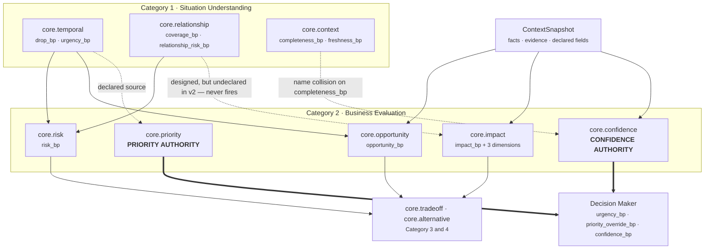
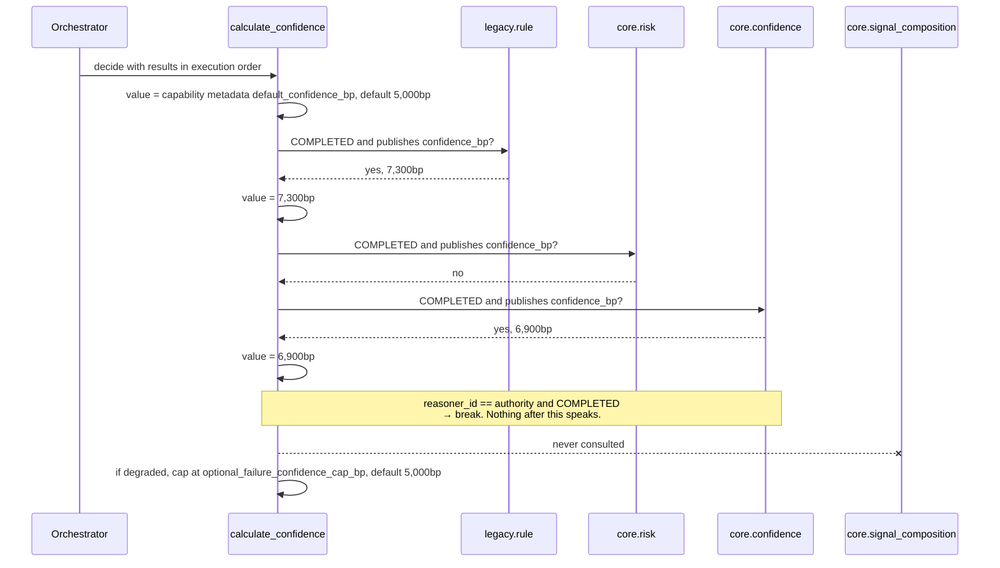
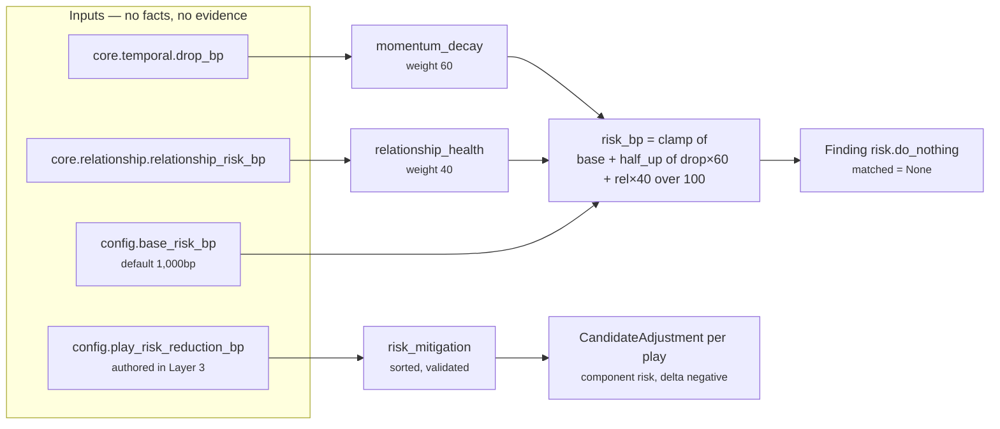
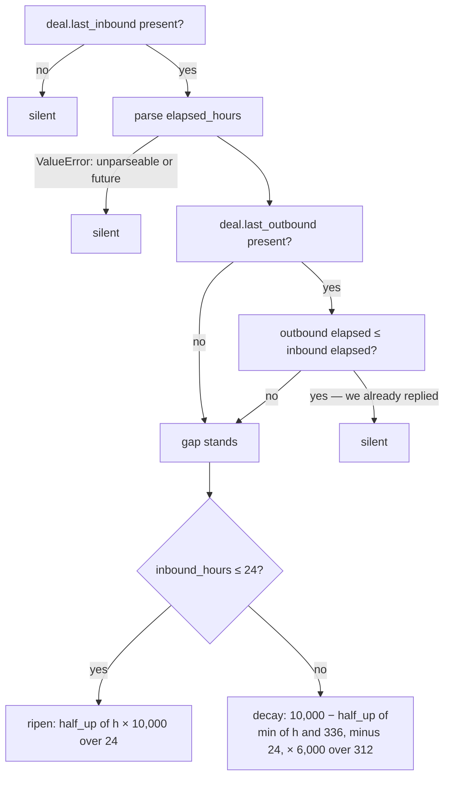
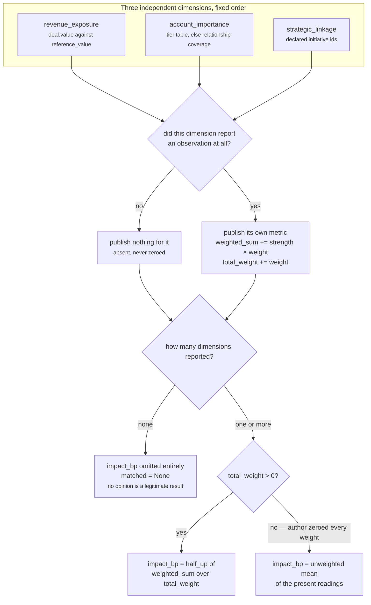
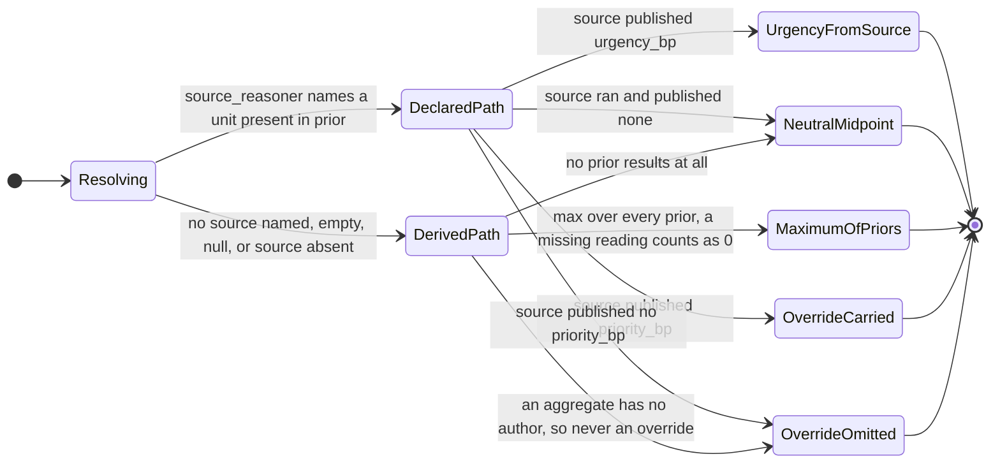
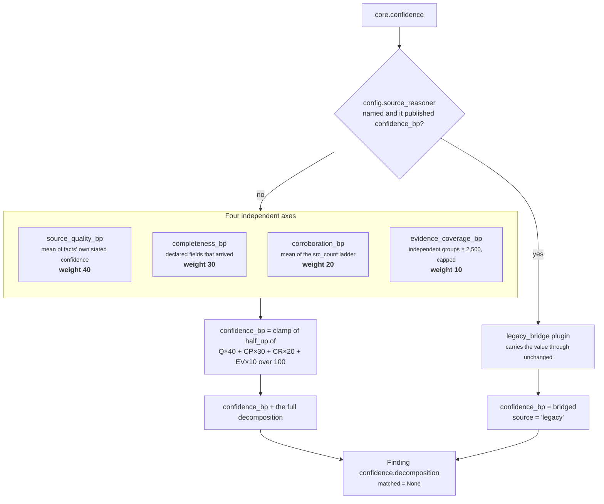

# Category 2 · Business Evaluation

**Package:** `genios_engine/reason/reasoners/`
**Question the category answers:** *What is this situation worth, and what does it threaten?*
**Units:** `core.risk` · `core.opportunity` · `core.impact` · `core.priority` · `core.confidence`
**Output:** five `ReasonerResult` objects — magnitudes, never verdicts. Three of the five never set
`matched` to anything but `None`; a fourth returns `None` whenever it has no opinion.

Category 1 ([03 · Situation Understanding](../01-Situation-Understanding/README.md)) establishes what is
true. This category prices it. Nothing here selects a play, ranks a candidate, or decides an
outcome — that is [07 · Decision Maker](../../03-Decision-Maker/README.md) alone. What this category does own,
uniquely, is **two of the three metrics the Decision Maker resolves through a named authority**, and
that ownership is the most load-bearing thing in the file set.

---

## 1 · What the blueprint asked for

The architecture names the category and its five members without elaboration:

| Category | Units | Purpose |
|---|---|---|
| 2 · Business Evaluation | Risk, Opportunity, Impact, Priority, Confidence | Evaluate the situation |

The substantive instruction is not about *which* units exist but about how each is built:

> *Instead of designing every unit differently, every unit should have Input → Validator →
> Retriever → Analyzer → Calculator → Evaluator → Output Builder. Exactly the same.*
>
> *…I would go one level deeper. Analyzer should itself have plugins. Now Risk isn't one algorithm.
> It's 20 small deterministic algorithms.*

And the constraint that governs the whole layer, stated of the Executive layer above but binding
everywhere:

> *If it starts making decisions, then you've accidentally created two reasoning engines. That's
> architectural leakage. There should only be one place where thinking happens.*

`core.risk` is the unit the blueprint names in its plugin argument, and it is built exactly that
way — three plugins, one of which reads an authored table rather than computing anything at all.

### What the blueprint does not specify, and had to be invented

The blueprint never says **who owns a shared number**. When the roster held seven units that was a
non-question: `core.temporal` published `urgency_bp`, nobody else did, and the Decision Maker read
whatever it found. At seventeen units it becomes the central question of the category, because
several units legitimately *observe* confidence and urgency along the way — a legacy rule that
scored, a gate that ranked, a temporal decay that measured pressure — and the Decision Maker
consumes exactly one of each.

Without a rule, the winner is "whichever emitter happened to run last", which means **adding a unit
to a capability silently re-scores every decision the product has ever made**. The mechanism the
repo invented for this — `CONFIDENCE_AUTHORITY`, `PRIORITY_AUTHORITY`, and the metadata keys that
let a capability move them — is documented in §4.1. It is an addition to the architecture, not an
implementation of it.

---

## 2 · What exists

All five units, all on the `ReasoningUnit` framework described in
[02 · Unit Framework](../README.md), registered explicitly in
`reasoners/__init__.py:BUSINESS_EVALUATION`.

| Unit id | File | Class | Plugins | `publishes` | `matched` |
|---|---|---|---|---|---|
| `core.risk` | `reasoners/risk.py` | `RiskUnit` | 3 | `risk_bp` | always `None` |
| `core.opportunity` | `reasoners/opportunity.py` | `OpportunityUnit` | 3 | `opportunity_bp`, `opportunity_count` | `True`/`False` |
| `core.impact` | `reasoners/impact_unit.py` | `ImpactUnit` | 3 | `impact_bp`, `revenue_exposure_bp`, `relationship_exposure_bp`, `strategic_bp`, `impact_signal_count` | `True`/`False`/`None` |
| `core.priority` | `reasoners/priority.py` | `PriorityReasoner` | 3 | `urgency_bp`, `priority_override_bp` | always `None` |
| `core.confidence` | `reasoners/confidence.py` | `ConfidenceReasoner` | 3 | `confidence_bp`, `source`, `source_quality_bp`, `corroboration_bp`, `evidence_coverage_bp`, `independent_evidence_groups` | always `None` |

Three class names are irregular and deliberately so. `RiskUnit` carries the alias
`risk.py:RiskReasoner = RiskUnit`; `PriorityReasoner` and `ConfidenceReasoner` keep their
pre-framework names outright. The roster, the capability packs, and the registry all resolve these
by name, and a pinned manifest names `(reasoner_id, version)` pairs that must not move.
`priority.py:PriorityReasoner` says so in its own docstring.

### Provenance: three migrations, two new builds

`Rohit_Updates/Layer 4.md` records four units migrated onto the framework as byte-identical
refactors. Three of those four are in this category:

| Unit | Origin | Equivalence proof |
|---|---|---|
| `core.risk` | migrated | `tests/test_unit_risk.py::_LegacyRiskReasoner`, 15 differential scenarios × 2 assertions |
| `core.priority` | migrated | `tests/test_unit_priority.py::_LegacyPriorityReasoner`, 17 differential scenarios |
| `core.confidence` | migrated | `tests/test_unit_confidence.py::_FrozenConfidenceReasoner`, 18 differential scenarios |
| `core.opportunity` | built new | no dedicated test file — see §3.7 |
| `core.impact` | built new | `tests/test_unit_impact_unit.py`, 25 tests — no differential, it never shipped before |

The fourth migrated unit, `core.constraint`, belongs to Category 1.

Each differential test keeps a **verbatim frozen copy** of the pre-migration implementation in the
test file rather than importing it — the migration rewrote the module in place, so there is nothing
left to import, and a literal copy cannot drift when someone later edits the live unit. The
assertion is on `ReasonerResult.semantic_hash`, which covers status, `matched`, metrics, findings,
adjustments, checks, evidence ids, missing fields and reason codes together. One equality is the
whole equivalence claim, not a spot check.

### How the five relate



Three things this picture is meant to make uncomfortable. First, the thin arrows and the thick
arrows carry different weight: `risk_bp`, `opportunity_bp` and `impact_bp` reach Part 3 only
*indirectly*, through adjustments and through Category 3/4 units that may not be deployed, whereas
`urgency_bp`, `priority_override_bp` and `confidence_bp` are read by `decision_maker.py` on every
single run. Second, `core.context` and `core.confidence` both emit `completeness_bp` — that dotted
arrow is a name collision, not a data flow, and §3.6(c) explains what it costs. Third, one of the
solid-looking design edges is not connected at all: `core.impact` never receives
`core.relationship`'s reading in the shipped v2 manifest, for the reason in §3.5.

---

## 3 · The gap, and why

### 3.1 · The declaration invariant covers less than it appears to

`tests/test_unit_roster.py::test_only_the_named_authority_publishes_a_shared_decision_metric` is the
test everyone points at. It reads:

```python
offenders = [instance.spec.reasoner_id for instance in _instances()
             if metric in getattr(instance, "publishes", ())
             and instance.spec.reasoner_id != authorities[metric]]
```

The `getattr(..., "publishes", ())` default is the hole. **Four reasoners in the runtime emit
reserved metrics and are invisible to this test**, because they predate the framework, are not
`ReasoningUnit` subclasses, and therefore have no `publishes` attribute at all:

| Reasoner | Emits into `ReasonerResult.metrics` | In the roster test? |
|---|---|---|
| `legacy.rule` | `confidence_bp`, `urgency_bp`, `priority_bp`, `impact_bp` | no — not a `ReasoningUnit` |
| `legacy.score_gate` | `confidence_bp` | no |
| `core.temporal` | `urgency_bp` | no |
| `core.signal_composition` | `confidence_bp`, `urgency_bp` | no |

This is not a bug in the test so much as a misreading of what the test is for. The declaration
invariant is a **design-time** guard on the seventeen framework units; the thing that actually makes
the system safe at runtime is the authority scan in `decision_maker.py` (§4.1), which is
order-terminating rather than order-dependent. Both mechanisms are needed, and only one of them is
enforced by a test. Anyone adding a supplementary reasoner should know they are outside the fence.

### 3.2 · `core.risk`: silence is zero, deliberately, against Law 3

[Law 3 of the layer](../../00-Overview.md) is *silence is not zero* — a metric is omitted rather than
zeroed, because a published `0` is a claim and an absent metric is an admission. `core.risk`
breaks it on purpose. `risk.py:_published` treats "the dependency did not run" as `0`, and
`risk.py:RiskUnit.calculate` always publishes `risk_bp`.

The docstring's argument:

> *`risk_bp` is consumed by the ranking math, and a missing `risk_bp` would be read downstream as
> "unknown", not "low" — so the unit reports the risk it can actually evidence and lets the floor
> carry the rest. This is a documented asymmetry, not an oversight.*

**The premise is currently false as shipped, and that is worth saying plainly.** `risk_bp` is not
read by the ranking math. `decision_maker.py:score_candidate` weighs the *play's* authored
`risk_bp`, adjusted by this unit's negative adjustments — never the unit's published metric. The
actual consumers of `core.risk.risk_bp` are `tradeoff_unit.py:RiskVersusRewardPlugin` and
`alternative_unit.py` (via `inaction_cost` signals), and both read it through a helper that returns
`None` on absence and stays silent. Neither is in `sales.deal_cooling` v1.

So the exception is defensible in principle — a consumer that read a missing metric with a `0`
default genuinely could not distinguish "safe" from "unmeasured" — but it is currently paying
insurance on a risk nobody runs. It survived the migration because changing it would change the
hash, which the refactor's contract forbade. A CTO deciding whether to keep it should note that
`core.impact` made the opposite call in the same category and documented the opposite rationale.

### 3.3 · `core.opportunity` does the same thing without the argument

`opportunity.py:OpportunityUnit.calculate` returns `{"opportunity_bp": 0, "opportunity_count": 0}`
when no plugin fires. That is the same Law 3 breach as `core.risk`, with no docstring acknowledging
it and no reasoning offered. A capability reading `opportunity_bp == 0` cannot tell "we looked and
there is no headroom" from "no plugin had anything to work with".

### 3.4 · `core.opportunity` cites nothing, ever

None of the three opportunity plugins attach `evidence_ids`, and `OpportunityUnit` does not override
`retrieve`, so its `UnitView.evidence_ids` is derived from `spec.required_fields` — which the
shipped `deal_cooling_full_v2` spec leaves empty. Two of the plugins read facts directly:
`UnansweredInboundPlugin` reads `deal.last_inbound` and `deal.last_outbound`,
`StalledButOpenPlugin` reads `deal.status`. When the unit matches, every finding it emits carries
`matched=True` and an empty `evidence_ids`.

`validation_unit.py:_asserts_a_claim` counts a result as an assertion when `matched is True` **or
when any of its findings is not an explicit negative** — and `Finding.matched` defaults to `None`.
`_cited` then finds no producible evidence ids on it. The validation unit's own docstring names the
offender:

> *"3 of 5 claims are ungrounded" is an engineering metric while **"core.opportunity asserted an
> opportunity and cited nothing"** is something a reviewer can act on.*

It is not only opportunity. `core.risk`, `core.priority` and `core.confidence` each emit exactly one
finding with `matched=None` and cite nothing **by design** — each has a documented reason for not
re-attaching another unit's evidence. Under `_asserts_a_claim`, a `None` finding is a claim. A real
run of `deal_cooling_full_v2` on a 500k open deal, ten days silent, measured:

```text
core.validation  ungrounded_claim_count = 3
                 inspected_result_count = 4
                 evidence_sufficiency_bp = 2,500
                 safe_bp = 5,500
```

`core.validation` inspects only its four declared dependencies — risk, opportunity, impact,
confidence. **Three of the four are ungrounded**; only `core.impact` cites anything. So the
evidence-sufficiency axis of the safety score is reporting, correctly by its own definition and
misleadingly in effect, that 75% of the Business Evaluation category is unsupported. `safe_bp`
cleared the 3,000bp floor in this run, so nothing was eliminated — but the margin exists because of
other axes, not because the claims are grounded.

Two units cannot both be right here. Either `_asserts_a_claim` should exempt `matched=None`
findings, or the four units should attach the evidence ids of the metrics they read. The design
records point in opposite directions and neither cites the other.

`UnworkedRelationshipPlugin` is worse in kind: it fires when `deal.owner` is *falsy*, which includes
absent. In the run above there is no `deal.owner` fact at all, and the plugin contributed 4,000bp of
opportunity on the strength of a field that was never synced, cited to nothing.

### 3.5 · `core.impact` loses a whole dimension to a missing dependency declaration

`orchestrator.py` passes each unit only the prior results it declared:

```python
dependencies = {item: prior[item] for item in spec.dependencies if item in prior}
# A reasoner can see only dependencies it declared in the capability DAG.
```

`deal_cooling_full_v2` declares `core.impact` with **no dependencies**:
`_spec("core.impact", config={"play_impact_bp": {...}})`. So `AccountImportancePlugin`'s fallback —
`view.prior_metric("core.relationship", "coverage_bp", -1)` — always reads the `-1` sentinel and
always stays silent, even though `core.relationship` ran in the same execution and published
`coverage_bp = 6,666`.

In the measured run, `core.impact` reported `impact_signal_count = 1`. The stake was revenue only.
The relationship dimension, worth 3,000 of the 10,000 weight, was structurally unreachable, and
nothing anywhere reported a problem — the renormalisation quietly re-weighted revenue to 100%. This
is the failure mode the silence-is-not-zero rule was supposed to make visible, and it is invisible
because the omission is in the manifest rather than in the data.

### 3.6 · The three latent bugs, found during migration and deliberately preserved

The byte-identical contract meant these could be *found* but not *fixed*. All three are recorded in
`Rohit_Updates/Layer 4.md` Part 4 as decisions for the CTO. Here is what each actually does.

**(a) `core.priority` reads `priority_bp`, publishes `priority_override_bp`.**
`priority.py:DeclaredOverridePlugin.contribute` reads `result.metrics.get("priority_bp")` from the
declared source and republishes it under a different name. The shipped `sales.deal_cooling` config
names `core.temporal` as the source, and `core.temporal` publishes no `priority_bp`, so **the
override path is inert for `sales.deal_cooling` and `sales.deal_health`** — the latter names
`core.signal_composition`, which publishes no `priority_bp` either.

**It is not inert for the system.** `reason/adapters/legacy_pack.py:83` gives `core.priority`
`config={"source_reasoner": "legacy.rule"}`, and `legacy_rule.py:49` publishes
`priority_bp = score * 100`. `runner.py:449` compiles *every* rule in the legacy pack into one such
capability through `legacy_capability_manifest`, so the override path carries the entire legacy rule
corpus in production. The round trip is exact: a rule scoring 78 gives `priority_bp = 7,800`, which
becomes `priority_override_bp = 7,800`, which `score_candidate` returns verbatim as `utility_bp`,
which `authority.py:AUTHORITATIVE_SCORE_SQL` projects back as `(7,800 + 50) / 100 = 78`. Without the
override the same play — which takes every `PlayDefinition` scoring default of 5,000bp — would have
scored 5,280bp and projected as 53. That round trip is the evidence the asymmetric name is a
deliberate legacy bridge rather than a typo; the code still says nothing either way, and that
silence is the real defect. Worked in full in
[`core.priority/06`](core.priority/06-Builder-and-Metrics.md) §5.2.

The consequence if it is a typo: an override is the single most powerful thing a unit can produce.
`decision_maker.py:score_candidate` returns it verbatim and skips the weighted utility entirely.

**(b) The 5,000-versus-0 cliff.** `priority.py:MaximumUrgencyPlugin`:

```python
readings = [integer(view.prior[key].metrics.get("urgency_bp", 0), "urgency_bp")
            for key in sorted(view.prior)]
... max(readings, default=NEUTRAL_URGENCY_BP)
```

The `default=` only applies when `readings` is empty. The docstring defends the distinction —
"absence of an opinion is 5,000bp, absence of a reading is 0", a prior unit that ran and said
nothing genuinely reported no time pressure — and the distinction is a real one. The cliff is that
it is a step function on the contents of `view.prior`:

| `core.priority`'s spec, with no `source_reasoner` declared | Published `urgency_bp` |
|---|---|
| `dependencies=()` — nothing enters `prior` | **5,000** |
| one dependency that published no `urgency_bp` | **0** |
| one dependency reporting 7,200bp | 7,200 |

The trigger is narrower than "roster membership" and that is worth being precise about:
`orchestrator.py:158` filters `prior` to `spec.dependencies`, so adding a unit to the *capability*
changes nothing unless it is also added to `core.priority`'s own `dependencies` tuple. That tuple is
routinely widened for scheduling reasons, and widening it with a unit that publishes no `urgency_bp`
moves urgency from the neutral midpoint to zero. Urgency carries weight 20 of 100 in
`sales.deal_cooling`'s ranking, so the move costs `5,000 × 20 / 100 = 1,000bp` off every candidate's
utility — enough to reorder a field.
`test_unit_priority.py::test_maximum_urgency_is_neutral_only_when_nothing_ran` pins the behaviour
rather than fixing it. It is unreachable in all three shipped capabilities, every one of which
declares a `source_reasoner` and is therefore never on the derived path at all.

**(c) `completeness_bp` is emitted by two units.** `core.context` declares it in `publishes`;
`core.confidence` emits it in its result and finding but cannot declare it, because
`test_no_unit_publishes_a_metric_another_unit_owns` permits exactly one declared publisher per
name. The workaround is explicit and documented in `confidence.py:UNDECLARED_METRICS`: the metric is
filtered out of `Verdict.metrics` so the framework's undeclared-metric guard in
`unit.py:ReasoningUnit.evaluate` passes, then re-attached in `confidence.py:ConfidenceReasoner.build`
by taking the result's metrics from the decomposition finding instead of the verdict.

That is a deliberate circumvention of a framework guard, and the cost is not only cosmetic. The two
units compute **different quantities under one name**:

| | `core.context` | `core.confidence` |
|---|---|---|
| Denominator | capability `required_fields` ∪ every reasoner's `required_fields` ∪ L2 `context.missing_fields` | this unit's own `required_fields`, else the capability's |
| Nothing declared | emits no observation at all — silence | emits `10,000` — "asked for nothing, got all of it" |
| Where | `context_unit.py:declared_fields`, `FactCoveragePlugin` | `confidence.py:_declared_fields`, `CoverageCompletenessPlugin` |

In `deal_cooling_full_v2` both units run. `core.context` has no config, so its denominator is the
union across the whole roster; `core.confidence` inherits v1's spec with four required fields. And
`completeness_bp` is **not** in `validation_unit.py:AUTHORITY_RESOLVED_METRICS`, so if the two
readings diverge by `contradiction_gap_bp` (default 5,000bp) or more, `core.validation` reports a
`validation.metric_divergence` — a genuine contradiction that drags `safe_bp` toward the safety
floor and can eliminate every play.

**How close is that today?** Measured, not inferred. On a representative `deal_cooling_full_v2` run
both units read `completeness_bp = 10,000` and no divergence was reported. The reason is arithmetic
rather than luck: across v2's roster the denominators differ by exactly one field —
`core.confidence` declares four, and the union adds only
`relationship.verified_stakeholder_count` — so the widest possible gap is
`10,000 − 4/5×10,000 = 2,000bp`, comfortably under the tolerance. **The collision is a latent
hazard, not a live fault.** It becomes live the moment a capability declares a confidence spec much
narrower than its roster, or the moment Layer 2 starts populating `context.missing_fields`, which
enters `core.context`'s denominator and nothing else's. Fixing it properly means renaming the
metric, which is a hash-breaking change.

### 3.7 · `core.opportunity` has no test file

Every other unit in the category has a dedicated `tests/test_unit_*.py` with per-plugin isolation,
determinism assertions, and boundary cases. `core.opportunity` is exercised only incidentally:
three assertions across `tests/test_l4_end_to_end.py` and
`tests/test_capability_deal_cooling_full.py`, of the form `opportunity_bp > 8_000`,
`opportunity_bp > 0`, and `matched is True`. Its ripen-then-decay curve, its max-plus-quarter-lift
blend, and its three guard sequences are unpinned. A refactor could change any of them and the
suite would stay green.

### 3.8 · Every threshold in the two new units is a guess

`opportunity_threshold_bp` (3,000 default, 2,500 as authored in v2), `unowned_strength_bp` (4,000),
`impact_threshold_bp` (5,000), `reference_value` (100,000), `goal_alignment_bp` (6,000), and the
`_DIMENSIONS` default weights 5,000/3,000/2,000 were authored from domain reasoning and have never
been fitted to data. The five migrated/legacy constants — the 60/40 risk blend, the 40/30/20/10
confidence blend, the corroboration ladder, `NEUTRAL_URGENCY_BP`, `base_risk_bp` — inherit whatever
justification the pre-framework system had, which is also not an empirical one. See
`Rohit_Updates/Layer 4.md` Step 4.

---

## 4 · How it works inside

### 4.1 · The two metric authorities

Three metrics in the whole system are resolved through a named authority rather than by whoever
published them:

| Metric | Authority constant | Default | Metadata override key |
|---|---|---|---|
| `confidence_bp` | `CONFIDENCE_AUTHORITY` | `core.confidence` | `confidence_authority` |
| `urgency_bp` | `PRIORITY_AUTHORITY` | `core.priority` | `priority_authority` |
| `priority_override_bp` | `PRIORITY_AUTHORITY` | `core.priority` | `priority_authority` |

All three live in `decision_maker.py`, and the module's own comment states the reason:

> *Several units legitimately observe confidence and urgency along the way — a legacy rule, a gate, a
> temporal decay — but exactly one gets to publish the value the decision is built on. Without a
> named authority the winner would be "whichever emitter happened to run last", so adding a unit
> could silently move every score in the system.*

The mechanism is not "ignore everyone but the authority". It is **the authority terminates the
scan**:



Read the loop body in `decision_maker.py:calculate_confidence` carefully, because two properties
follow from its exact shape and neither is obvious:

1. **A non-authority publisher upstream of the authority is harmless but not ignored.** It sets
   `value`, and the authority immediately overwrites it in the same iteration before breaking. The
   only way an upstream value survives is if the authority ran but published nothing — which for
   `core.confidence` cannot happen, since it always produces `confidence_bp` in both branches.
2. **If the authority does not complete, the scan runs to the end and the last publisher wins.**
   The `break` is guarded by `result.status == ResultStatus.COMPLETED`. In both shipped
   capabilities `core.confidence` is `FailurePolicy.REQUIRED`, so its failure terminates the run
   before Part 3 synthesises anything — the hole is closed by failure policy, not by the scan.

`priority_metrics` is the same walk with one asymmetry that matters:

```python
if "urgency_bp" in result.metrics:
    urgency = clamp_bp(int(result.metrics["urgency_bp"]))
if result.reasoner_id == authority:
    if "priority_override_bp" in result.metrics:
        override = clamp_bp(int(result.metrics["priority_override_bp"]))
    break
```

`urgency_bp` is read from anyone up to and including the authority; `priority_override_bp` is read
**only from the authority**. The docstring gives the reason: *"An override replaces the weighted
utility outright, so it is read only from the priority authority — a unit cannot seize ranking
control by emitting the metric opportunistically."* An override is the single strongest signal in
Part 3 — `score_candidate` returns it and never evaluates the weighted formula — so its provenance
is narrowed to one named unit while urgency, which is merely a weighted term, is not.

Both authorities are per-capability overridable through `capability.metadata`.
`decision_maker.py:_authority` refuses a non-string or blank value with an `OrchestrationError`
rather than falling back to the default, on the grounds that an authority resolved from a default
instead of from the capability *"would quietly answer a different question than the caller asked"*.
No shipped capability sets either key; both run on the constants.

### 4.2 · `core.risk` — what the do-nothing branch costs

> Opened all the way up in [`core.risk/`](core.risk/README.md) — one file per stage, one file per
> plugin, every config key and every worked number.

Three plugins, two of which read another unit's published number rather than re-deriving it, and one
of which reads an authored table.



**Why the plugins read rather than re-derive.** `MomentumDecayPlugin` could parse the timestamps
itself; it does not, because *"two units deriving the same number from the same facts is how they
drift apart"*. Both dependency ids are configurable (`temporal_reasoner`, `relationship_reasoner`),
so a capability can run a domain-specific decay model under its own id and still have its output
weighted here. `sales.deal_cooling` names the defaults explicitly.

**Why 60/40.** `risk.py:MOMENTUM_WEIGHT` / `RELATIONSHIP_WEIGHT` carry the argument in a comment:
*"Decay leads because a deal that has stopped moving is the nearer loss; thin coverage is the slower
one."* They are named constants rather than config, because *"moving these would re-score every
shipped decision"* — a business-critical distinction from `base_risk_bp`, which *is* config, because
the irreducible exposure a capability chooses to carry is a per-domain judgement.

**Why the division happens once.** `divide_half_up(drop * 60 + relationship_risk * 40, 100)`, over
the summed numerator. Rounding each term separately would let two 50bp halves round up
independently and produce 100bp of risk that neither signal reported.
`test_unit_risk.py::test_rounding_is_half_up_on_the_summed_numerator_not_per_term` pins it: with
`drop_bp = 1` and `relationship_risk_bp = 2`, `(60 + 80)/100 = 1.4 → 1`, so `risk_bp = 1,001`. Per
term it would have been `1,002`.

The shipped arithmetic, `sales.deal_cooling`:

| Input | Value |
|---|---|
| `base_risk_bp` | 1,000bp — meaning 0.10 |
| `core.temporal.drop_bp` | 6,200bp — meaning 0.62 |
| `core.relationship.relationship_risk_bp` | 7,500bp — meaning 0.75 |
| weighted term | `(6,200×60 + 7,500×40) / 100 = 6,720` |
| **`risk_bp`** | **7,720bp — meaning 0.7720** |

**The floor exists because a deal that looks perfect is still a deal that can be lost.** With no
prior results at all, `risk_bp` is exactly `base_risk_bp`.

**Mitigations are authored, never inferred.** Only the capability knows that "multithread the
account" attacks coverage risk. `PlayMitigationPlugin` reads
`play_risk_reduction_bp: {play_id: bp}`, validates each entry as basis points, and reports the whole
table as one observation keyed by play id. `evaluate_meaning` turns each entry into a
`CandidateAdjustment(play_id, "risk", -bp, RISK_MITIGATION_REASON)`. The sign is applied at the
consumer, so the observation stays a plain statement of magnitude.

Both the plugin and the consumer iterate `sorted()`. This is not stylistic. Adjustment order is
inside the result's `semantic_hash`, and `ReasonerSpec.config` round-trips through JSON in the audit
store — where `sort_keys=True` and then PostgreSQL `jsonb` re-order object keys by their own rules.
Unsorted iteration made **every persisted `deal_cooling` run report as non-reproducible** while the
request hash stayed byte-identical. That was the serious defect of the Layer 4 pass; the fix is
the `sorted()` calls in `risk.py:PlayMitigationPlugin` and
`temporal.py:TemporalReasoner.evaluate`, and the regression is
`tests/test_reasoning_config_order.py`.

**`matched` is always `None`.** *"There is no threshold at which risk becomes 'true' — the number is
the statement, and a boolean would invite a downstream reader to treat this unit as a gate."*
Likewise `validate()` is overridden to a no-op and `retrieve()` returns a view with no facts: the
unit reads no context field, so a declared `required_fields` entry cannot make it guess, and the
default validator would turn a perfectly answerable run into `INSUFFICIENT_CONTEXT` — a status this
unit has never returned. It cites no evidence for the same reason: every claim is downstream of a
metric another unit already evidenced, and re-attaching those ids would double-count them.

### 4.3 · `core.opportunity` — evidenced headroom nobody has taken

An opportunity is never "this looks promising". It is a specific gap between what the situation makes
possible and what has actually happened. Three plugins, three separate claims:

| Plugin | Fires when | `strength_bp` |
|---|---|---|
| `unanswered_inbound` | `deal.last_inbound` parses, and `deal.last_outbound` is either absent or older | the ripen-then-decay curve below |
| `stalled_but_open` | `deal.status` ∈ {open, active, in_progress, negotiation} **and** `core.temporal.drop_bp > 0` | `clamp_bp(drop_bp)` |
| `unworked_relationship` | `deal.owner` is falsy — **including absent** | `unowned_strength_bp`, default 4,000bp |



**Why a curve rather than a flag.** An unanswered inbound is the strongest opportunity signal in the
system, *"because the counterparty already spent the effort — the cost of capture is one reply, and
the window closes on its own."* But it is not equally valuable at every moment, and the curve encodes
two different business claims on either side of the 24-hour hinge:

| `inbound_hours` | `strength_bp` | Reading |
|---|---|---|
| 0 | 0 | a message that arrived this minute is not yet an unanswered message |
| 6 | 2,500 | ripening |
| 12 | 5,000 | ripening |
| 24 | **10,000** | peak — the whole day is gone and nobody replied |
| 25 | 9,981 | decay begins |
| 72 | 9,077 | |
| 168 (7 days) | 7,231 | |
| 336 (14 days) | 4,000 | floor |
| beyond 336 | 4,000 | `min(h, 336)` saturates the decay |

The ripen half says *an opportunity to reply is not created by the message arriving, it is created by
the silence that follows*. Firing at full strength on arrival would make the unit indistinguishable
from an inbox notification. The decay half says the value of a reply falls but never reaches zero:
14 days of silence still leaves 4,000bp, because a late reply to a real buyer is worth more than no
reply.

**Two accuracy notes on this plugin.** The `min(inbound_hours, 168)` in the ripen branch is dead —
that branch only runs when `inbound_hours <= 24`, so the clamp can never bind. And the source
comment says *"after a week the moment has mostly passed"*, which the arithmetic does not support:
at one week the signal is still 7,231bp, 72% of peak. The prose and the numbers disagree; the
numbers are the contract.

**The blend: strongest signal plus a quarter of the rest.**

```python
strengths = sorted((int(item.metrics.get("strength_bp", 0)) for item in observations), reverse=True)
lift = divide_half_up(sum(strengths[1:]), 4)
opportunity_bp = clamp_bp(strengths[0] + lift)
```

*"Deliberately not a sum: three weak hints are not a strong opportunity, and averaging would let one
weak plugin drag down a genuinely ripe one. The strongest claim sets the level and corroboration
adds a bounded lift."* Worked: an unanswered inbound at 24 hours — 10,000bp — beside a
stalled-but-open reading of 6,000bp gives `10,000 + half_up(6,000, 4) = 11,500`, clamped to 10,000.
The measured run in §4.8 is the three-signal case: readings of 6,000 / 5,846 / 4,000 give
`6,000 + half_up(9,846, 4) = 6,000 + 2,462 = 8,462bp`. Note that the lift is a flat quarter of the
*sum* of the remainder, not a per-signal decay, so a fourth weak signal is worth exactly as much as
the third. The same idiom appears in `alternative_unit.py:DoNothingBaselinePlugin` for pricing
inaction, which is a sign the shape is principled rather than local.

`opportunity_count` is the number of firing plugins, published for explainability, not used in the
blend.

`evaluate_meaning` compares against `opportunity_threshold_bp` (3,000 default; `deal_cooling_full_v2`
authors 2,500 with the comment *"An unanswered buyer is the cheapest opportunity in the system"*).
Below the threshold the unit emits `matched=False` with **no findings and no reason codes** — the
metric is still published, but the explanation is suppressed. Above it, every observation becomes a
`Finding` with `matched=True`, which is what triggers the ungrounded-claim interaction in §3.4.

### 4.4 · `core.impact` — how much actually changes

Impact is the size of the swing, not the direction and never the choice. *"A deal worth twelve
thousand and a deal worth twelve million can sit in exactly the same state, with the same risk and
the same urgency, and still deserve very different amounts of human attention."* Nothing else in
Layer 4 measures the stake.



**Renormalisation is the whole point.** `_DIMENSIONS` declares the weights as data — 5,000 /
3,000 / 2,000 — but the denominator is `total_weight`, summed only over dimensions that *actually
reported*. Averaging a known 9,000bp revenue exposure against two unknowns would report a 3,000bp
stake for a deal we know to be enormous, turning the number from "how big is this" into "how complete
is our data". `test_unit_impact_unit.py::test_a_dimension_that_did_not_report_is_absent_from_the_metrics`
pins exactly this: `deal.value` at 180,000 against a 200,000 reference gives
`revenue_exposure_bp = 9,000` and `impact_bp = 9,000`, with the other two metrics absent entirely.

The zero-weight branch is a small piece of authoring hygiene: *"An author who zeroes every weight has
not asked for a zero impact — they have removed the weighting"*, so it falls back to an unweighted
mean instead of dividing by zero.

**Silence is not zero, and here the argument holds.** Every plugin has a silence path and each one is
argued separately in the source:

- A missing `deal.value` is *unknown, not small*.
- A **malformed** `deal.value` — CRM text in a money column — is a data fault, not a worthless deal.
- A **zero or negative** `deal.value` is how CRMs represent "not filled in yet" and how they represent
  credits, so it *"carries no information about the stake"*.
- `AccountImportancePlugin` uses `view.prior_metric(source, "coverage_bp", -1)` — a **negative
  sentinel**, not the usual `0`, precisely because *"the relationship reasoner did not run"* and
  *"coverage is genuinely zero"* are different facts and only one justifies an observation.
- An initiative id the author never priced is *unweighted, not zero-weight*, so it is skipped rather
  than scored.

`calculate` omits `impact_bp` entirely when nothing reported, and `evaluate_meaning` returns
`matched=None` in that case — *"the unit has no opinion, which is a different statement from 'this is
immaterial' and must not be collapsed into False"*.

**Why a ratio and not an amount.** `RevenueExposurePlugin` reports
`clamp_bp(divide_half_up(amount * 10_000, reference))`, saturating at the reference. Absolute
currency is meaningless across tenants — *"50,000 is a rounding error to an enterprise team and a
record quarter to a two-person agency"* — and saturation encodes that a deal ten times the reference
*"does not deserve ten times the priority, it deserves the top of the scale"*.

**Why tier beats breadth.** `AccountImportancePlugin` prefers an explicit `account_tier_field` +
`account_tier_bp` table over relationship coverage, because *"a company that has been designated
strategic is strategic regardless of how many threads happen to be open today"*. Breadth is a
defensible proxy — more people, more history, more to lose — but it is inference, so it is the
fallback. Tier labels are normalised on both sides (`strip().lower()`) because CRMs emit arbitrary
casing, and the table is built by iterating `sorted(weights)` so that a collision *after*
normalisation resolves identically on every machine.

**Why the strongest linkage wins.** `StrategicLinkagePlugin` takes `max(scores)`, not the sum: *"A
deal attached to five minor initiatives is not more strategic than one attached to the company's
stated priority."* Linkage to the capability's *own* `goal.goal_id` is strategic by definition — the
capability exists to move that goal — so it carries `goal_alignment_bp` (6,000 default) even when the
author never listed it in the weight table.

**Tilts are scaled, not flat.** When `impact_bp >= impact_threshold_bp` (5,000 default), each entry
in the authored `play_impact_bp` table becomes an adjustment of
`divide_half_up(delta * impact_bp, 10_000)` — the author's delta is a *ceiling* reached at a maximal
stake, not a bonus applied to anything that clears the bar. A tilt that rounds to zero is dropped as
*"noise in the audit trail"*. Every adjustment is mirrored by a `CandidateCheck` with
`stage="cost_benefit"` and `outcome=ADJUST`, so the tilt appears in the trace next to the score it
moved rather than as an unexplained component delta.

The end-to-end case the unit exists for, `test_the_northwind_renewal_reports_a_high_stake_across_all_three_dimensions`:

| Dimension | Reading | Weight |
|---|---|---|
| revenue: 150,000 against a 200,000 reference | 7,500bp — meaning 0.75 | 5,000 |
| account tier: strategic | 9,000bp | 3,000 |
| strategic linkage: `expand_enterprise` | 8,000bp | 2,000 |
| **`impact_bp`** = `(7,500×5,000 + 9,000×3,000 + 8,000×2,000) / 10,000` | **8,050bp** | |
| adjustment on `executive_escalation` | `2,000 × 8,050 / 10,000` = **1,610bp** | |

Revenue alone reads 7,500bp — meaningful but not alarming. The tier and the strategic tag are what
lift it to 8,050bp and put it in front of a human. Any refactor that loses a dimension shows up here
as a materially lower number.

The test is a good one and it did not help. It configures its own capability with the tier field
declared, so it never exercises the fallback path that the shipped v2 manifest actually depends on —
which is why the dependency omission in §3.5 has been sitting in the candidate capability with a
green suite. A unit test proves the unit; only a capability test proves the wiring.

### 4.5 · `core.priority` — the priority authority

> Opened all the way up in [`core.priority/`](core.priority/README.md) — one file per stage, one file
> per plugin, every config key and every worked number.

The smallest unit in the roster, and the only one permitted to speak about urgency at all. It does
not compute urgency; it **sources** it, from a unit that already measured whatever urgency is made
of. Two mutually exclusive paths:



**Why declared outranks derived.** *"A capability that names `core.temporal` as its source is
asserting that time-decay is what urgency means for this situation, and that assertion outranks any
louder number some other unit happened to publish."* Naming the source in Layer 3 keeps the judgement
with the capability author rather than hardcoding it in a shared unit. `sales.deal_cooling` names
`core.temporal`, whose `urgency_bp` is `clamp_bp(drop_bp + min(hours, 168) * 20)` — decay plus twenty
basis points per elapsed hour, capped at a week.

**Why maximum rather than mean on the derived path.** *"Urgency is a claim that something is about to
be lost, and a claim like that is not weakened by other units having nothing to say. Averaging would
let a quiet relationship reading dilute a deal that is one day from close."*

**Why only the declared path can produce an override.** *"The derived maximum is an aggregation
across units with no single author, so there is nobody whose override it would be."* This is the
same argument the Decision Maker makes from the other side (§4.1), and the two halves have to agree
or an override could enter from an unattributable source.

**Why `_declared_source` does not filter by status.** The contract in
`contracts/reasoning.py:ReasonerResult.__post_init__` already forbids a non-COMPLETED result from
carrying metrics, adjustments, findings or a `matched`. So a SKIPPED source reads as an empty metric
map and falls through to the neutral midpoint via the same code path as a source that completed with
no opinion. *"Re-checking status here would be a second, divergent definition of the same rule."*

**Why the derived scan sorts.** `sorted(view.prior)` cannot move the maximum — `max` is order-free —
but it makes a *malformed* prior reading raise against a deterministic result rather than against
whichever key the runtime mapping happened to yield first.
`test_a_malformed_urgency_is_reported_before_a_malformed_override` extends the same reasoning to
plugin order: alphabetical plugin ordering (`declared_urgency` < `maximum_urgency` <
`override_priority`) is what makes a bad urgency surface before a bad override, so an operator
chasing a broken deploy is sent to the right reasoner.

**Why an absent override stays absent.** `calculate` publishes `priority_override_bp` only when a
plugin produced one. *"A zero override is a live instruction to deprioritise and 'no opinion' is not
that."* `test_a_zero_override_is_published_and_an_absent_one_is_not` pins both sides.

**Why `matched` is `None`.** *"'Is 7,200bp urgent enough to act?' is a ranking question, and answering
it here would make the priority unit a decision authority by the back door — the one thing a unit
that owns a reserved metric must never become."*

Like `core.risk`, this unit overrides both `retrieve` and `validate` to no-ops. The `validate`
override carries a sharper consequence than risk's: *"refusing to answer would be a fabricated
objection, and it would strip the Decision Maker of the urgency authority it resolves against."*

### 4.6 · `core.confidence` — the confidence authority

The only unit permitted to publish `confidence_bp`, the number that decides how hard anyone leans on
everything else Layer 4 produced. *"Confidence here is never a feeling about the answer. It is a
measurement of the inputs."*



**The bridge is a declaration, not a fallback.** When a capability names a `source_reasoner`, this
unit *bridges* that reasoner's confidence rather than recomputing it — that is how the legacy
strangler packs keep one confidence authority while the old scoring still owns the number. Because it
is a declaration, it wins outright: the two decomposition plugins each call
`_bridged_confidence_bp(view)` first and return `()` if a bridge applies, so *"a malformed fact
cannot fail a run whose confidence came from somewhere else entirely"*. A bridged result carries
`source = "legacy"` — a deliberately non-integer metric, the only one in the roster, kept because
changing it would change the result hash of every legacy strangler decision ever replayed.

**Why 40/30/20/10.** The weights are declared as module constants with the rationale stated as a
sentence: *"What the facts claim about themselves dominates, how much of the picture arrived is next,
and independent corroboration is the tie-breaker."* Unpacked into the business argument:

| Axis | Weight | What it measures | Why that rank |
|---|---|---|---|
| Source quality | 40 | what the facts themselves claim about their reliability | The most *specific* evidence available. A CRM field that says it is 90% sure is a direct statement about the thing being reasoned over; nothing else in the blend is that close to the claim. |
| Completeness | 30 | share of declared fields that arrived | The only axis that fires when no fact carries metadata at all. It is what keeps a thin snapshot from scoring as a confident one, and it is structural — it cannot be gamed by a producer that self-reports optimistically. |
| Corroboration | 20 | how many distinct sources reported each fact | Independent agreement is strong evidence but *coarse*: three systems agreeing that a deal is open says less about a decision than one system's stated confidence in the deal's value. |
| Evidence coverage | 10 | how many independent source groups back the snapshot at all | The most diffuse claim — a property of the whole snapshot rather than of any field being read. It is a sanity check on single-source pictures, not a measurement of the situation. |

The denominator is the constant 100 with **no renormalisation**, unlike `core.impact`. That is
possible because every axis always reports — using `_NEUTRAL_BP` (5,000) where it had nothing to
measure — so the arithmetic stays integral end to end with a fixed divisor. The asymmetry with
`core.impact` is principled: impact's dimensions are *measurements of the world* that can be genuinely
absent, whereas confidence's axes are *measurements of the inputs*, and the inputs always exist even
when they are empty.

**Why the neutral midpoint rather than zero.** *"A fact that never stated its own confidence is
unknown, not untrustworthy, and scoring it 0 would turn a silent CRM field into a reason to distrust
the whole decision."* This applies to `source_quality_bp` and `corroboration_bp`. It deliberately does
*not* apply to `completeness_bp` or `evidence_coverage_bp`, where zero is a genuine measurement: no
declared field arrived, or no evidence exists.

**Why corroboration is a ladder and not a curve.**

| `src_count` | `corroboration_bp` |
|---|---|
| absent, or 1 | 6,000 |
| 2 | 8,500 |
| ≥ 3 | 10,000 |

*"A step function rather than a curve because the business meaning is discrete — 'one system says so'
versus 'three systems agree'."* An absent `src_count` reads as one sighting, *"which is the floor of
the ladder rather than a hole in it"* — the fact was seen at least once by definition, so the floor
is a measurement, not a guess.

**Two readings from one pass.** `FactSourceQualityPlugin` collects confidence and corroboration
together because they come from one walk over one structure. A record that states no confidence
contributes nothing to the source-quality mean but *does* contribute to corroboration, because "how
many systems saw this" is knowable even when "how sure is the system" is not. A bare scalar fact
carries no metadata at all, so it counts for completeness — it arrived — and is silent everywhere
else.

Both `confidence_bp` and the older `confidence` spelling are accepted; `common.py:ratio_bp` reads a
0..1 ratio as basis points and explicit basis points as themselves, with `confidence_bp` winning when
both are present on one record.

**Independence groups.** `evidence_coverage_bp = min(10_000, len(groups) * 2_500)`, saturating at
four groups. Evidence lacking an `independence_group` collapses into one `"unattributed"` bucket:
*"Missing independence metadata is one unknown group, not proof that every field came from an
independent source."* Note the count is over **every** evidence item in the frozen context, not only
the items backing this unit's fields, *"because independence is a property of where the picture came
from, not of which field is being read right now."*

Worked, from `test_the_blend_is_the_documented_weighted_mean_of_the_four_axes`:

| Axis | Computation | Value |
|---|---|---|
| source quality | `(9,000 + 5,000) / 2` — one stated, one unknown | 7,000bp |
| corroboration | `(8,500 + 10,000) / 2` — `src_count` 2 and 3 | 9,250bp |
| completeness | 2 of 3 declared fields, half-up | 6,667bp |
| evidence coverage | one independence group | 2,500bp |
| **`confidence_bp`** | `half_up(7,000×40 + 6,667×30 + 9,250×20 + 2,500×10, 100)` | **6,900bp — meaning 0.69** |

And the case that shows why the unit must never refuse to run — a capability declaring four required
fields and receiving none:

`half_up(5,000×40 + 0×30 + 5,000×20 + 0×10, 100)` = **3,000bp**.

`ConfidenceReasoner.validate` is overridden to a no-op precisely for this: *"the whole point of the
completeness axis is to answer a thin snapshot with a low confidence rather than with silence… A
confidence unit that declined to run on incomplete input would remove the only signal that the input
was incomplete."* Under `deal_cooling_full_v2`'s `confidence_floor_bp: 4_500`, a 3,000bp reading
converts a ranked winner into `DEFER` — the system stops recommending and starts asking, which is
Law 03 in behaviour.

**A malformed fact still takes the run down.** A `confidence_bp` of 12,000 on a fact record raises a
`ValueError` from `basis_points` rather than degrading, and
`test_a_malformed_fact_still_fails_the_run_exactly_as_it_used_to` pins that as *preserved, not
fixed*. It is a defensible position — an unparseable self-reported confidence is an upstream data
fault — but it means a single bad L2 record can fail a capability whose confidence unit is REQUIRED.

**The decomposition travels with the score.** *"A bare `confidence_bp` is an assertion; the
decomposition beside it is an explanation, and it is what lets a reviewer say 'this was 42% because
half the fields never arrived' instead of arguing with a number."* The `build()` override exists to
carry that decomposition intact — see §3.6(c) for the `completeness_bp` mechanics — and to attach **no
evidence ids**, because the unit reasons *about* the evidence in aggregate rather than *from* any
particular item. Attaching the ids of every field it counted would assert a provenance it does not
claim.

### 4.7 · Arithmetic laws the whole category obeys

| Law | Where it shows up here |
|---|---|
| Integer basis points only, 0..10,000 | `common.py:clamp_bp`; every `_config_bp` refuses a float, a bool, or an out-of-range int as a loud authoring fault rather than coercing |
| Half-up division on the **summed** numerator | `risk.py:calculate`, `confidence.py:calculate`, `impact_unit.py:calculate` — never per term |
| Every iteration over authored config is `sorted()` | `risk.py:PlayMitigationPlugin` and its consumer, `impact_unit.py` tier table and `play_impact_bp`, `priority.py:MaximumUrgencyPlugin` |
| Plugins run in alphabetical `plugin_id` order | `unit.py:ReasoningUnit.analyze` — observation order is a property of composition, not registration |
| A unit may not publish an undeclared metric | `unit.py:ReasoningUnit.evaluate`; circumvented once, on purpose, by `core.confidence` |

`common.py:divide_half_up` rounds half away from zero symmetrically, which matters only in
`impact_unit.py` where an authored `play_impact_bp` delta may be negative — *"a large stake can also
make a cheap play look worse."*

### 4.8 · All five, on one real situation

Every number below was produced by running `sales.deal_cooling_full` v2 through
`ReasoningOrchestrator` against one frozen snapshot: a **$500,000 deal, status open, engagement
halved to 4,000bp, buyer silent for ten days, two verified stakeholders against a target of three,
four evidence items across three independence groups**. No `deal.owner` fact exists.

| Unit | Published | How it got there |
|---|---|---|
| `core.risk` | `risk_bp = 5,934` | `1,000 + half_up(6,000×60 + 3,334×40, 100)` = `1,000 + 4,934`. Decay 6,000bp from `core.temporal`; concentration risk 3,334bp from `core.relationship`, which is `10,000 − 2×10,000//3`. |
| `core.opportunity` | `opportunity_bp = 8,462`<br/>`opportunity_count = 3` | Three plugins fired at 6,000 / 5,846 / 4,000. Leader 6,000, lift `half_up(5,846 + 4,000, 4) = 2,462`. The 5,846 is the decay curve at 240 hours; the 4,000 is `unworked_relationship` firing on an **absent** `deal.owner`. |
| `core.impact` | `revenue_exposure_bp = 10,000`<br/>`impact_bp = 10,000`<br/>`impact_signal_count = 1` | 500,000 against the default 100,000 reference saturates. Account importance was unreachable — see §3.5. Strategic linkage unconfigured. One dimension, renormalised to itself. |
| `core.priority` | `urgency_bp = 9,360` | Declared source `core.temporal`: `6,000 + min(240, 168) × 20`. **No `priority_override_bp`** — `core.temporal` publishes no `priority_bp`, so the override path stayed inert exactly as §3.6(a) describes. |
| `core.confidence` | `confidence_bp = 6,950` | `half_up(5,000×40 + 10,000×30 + 6,000×20 + 7,500×10, 100)`. Source quality neutral: no fact record stated its own confidence. Completeness 10,000: all four declared fields arrived. Corroboration 6,000: every fact one sighting. Coverage 7,500: three independence groups. |

The decision that came out the other side: `outcome = DECISION`, `confidence_bp = 6,950`, above
`deal_cooling_full_v2`'s `confidence_floor_bp` of 4,500 — so no `DEFER`. The winner was
`clarify_next_step` at 7,397bp utility, *not* the higher-scoring `restore_momentum` at 8,070bp,
which was eliminated by a hard check before ranking ever saw it.

Two things in that table are worth a CTO's attention and are not visible from any single unit's
tests. `core.impact` reported the maximum possible stake off **one** of three dimensions, silently,
because the manifest forgot a dependency. And `core.opportunity` contributed 4,000bp of its
8,462bp score from a plugin reading a field that does not exist in the snapshot. Both readings are
arithmetically correct and both are, in the ordinary sense, wrong.

---

## Related

- [00 · Overview](../../00-Overview.md) — the three parts, the four outcomes, the five laws
- [02 · Unit Framework](../README.md) — the eight stages, `UnitView`, `Observation`, `Verdict`
- [03 · Situation Understanding](../01-Situation-Understanding/README.md) — `core.context`, whose `completeness_bp` collides with this category's
- [05 · Optimization](../03-Optimization/README.md) — `core.tradeoff` and `core.cost`, the real consumers of `risk_bp`, `opportunity_bp` and `impact_bp`
- [06 · Decision Support](../04-Decision-Support/README.md) — `core.validation`, which prices ungrounded claims and metric divergence
- [07 · Decision Maker](../../03-Decision-Maker/README.md) — `calculate_confidence`, `priority_metrics`, `score_candidate`, and the confidence floor
- [09 · Determinism, Audit & Replay](../../_reference/Determinism-Audit-Replay.md) — why every `sorted()` in this category is load-bearing
