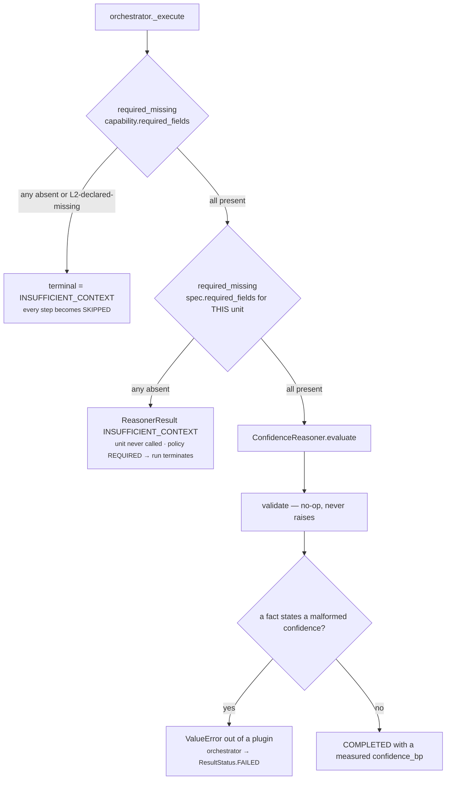

# 01 · Input and Validator

**Stage 1 — Input:** `unit.py:ReasoningUnit.evaluate(request, prior_results)` · not overridable
**Stage 2 — Validator:** `confidence.py:ConfidenceReasoner.validate` (line 242) — **overridden to a
no-op**

---

## 1 · What it is for

Stage 1 answers *what was this unit handed?* Stage 2 answers *is that enough to reason from?*

For sixteen of the seventeen units the second answer can be "no", and saying so is a feature: a unit
that refuses is better than a unit that guesses. For this one the answer is **always yes**, and the
argument for that is the whole reason the unit exists. Its subject matter *is* the thinness of the
input.

---

## 2 · What arrives

`evaluate` takes exactly two arguments, and everything the unit is allowed to see reaches it through
them.

| Input | Type | Contents | Where it comes from |
|---|---|---|---|
| `request` | `ReasoningRequest` | the frozen `ContextSnapshot`, the `CapabilityManifest`, `evaluation_time`, `trigger_kind` | Layer 2 froze the snapshot; Layer 3 authored the manifest |
| `prior_results` | `Mapping[str, ReasonerResult]` | **only the reasoners this unit declared as `dependencies`** | `orchestrator.py:158` — `{item: prior[item] for item in spec.dependencies if item in prior}` |

The spec for this run is resolved first, inside the template method:

```python
# unit.py:250
spec = active_spec(request, self.unit_id)
```

`common.py:active_spec` scans `request.capability.reasoners` for a matching `reasoner_id` and
**raises `ValueError` if the capability never declared this unit**. That is the first refusal in the
chain and it has nothing to do with data — it means the capability is misauthored.
`test_a_capability_that_never_declared_this_unit_is_refused_by_both` pins it against both the
migrated unit and the frozen pre-framework oracle.

### 2.1 · What the unit actually reads out of the request

| Read | Accessor | Used by |
|---|---|---|
| `spec.required_fields` | `confidence.py:108` | the completeness denominator, first choice |
| `request.capability.required_fields` | `confidence.py:108` | the completeness denominator, fallback |
| `request.context.facts` | `confidence.py:113` and `common.py:fact_record` | presence test, and the per-fact metadata |
| `request.context.evidence` | `confidence.py:211` | the `independence_group` of every evidence item |
| `spec.config["source_reasoner"]` | `confidence.py:94` | the bridge decision |
| `prior[source]` | `confidence.py:96` | the bridged value |

Note what is **not** read: `evaluation_time`, `trigger_kind`, `context.observations`,
`context.neighbor_facts`, `context.missing_fields`, `context.metadata`, and every field of
`EvidenceRef` except `independence_group`. This unit is time-independent — it is the only Business
Evaluation unit with no clock arithmetic at all, which is why nothing in it can drift as a decision
ages.

### 2.2 · The shape of a fact record

Only *mapping-shaped* fact records carry information for this unit. Layer 2's native loader
(`reason/runner.py:99` — `_load_context`) writes them like this:

```python
facts["deal.status"] = {
    "value": "open",
    "confidence": 0.5,                       # float; 0.5 when the column is NULL
    "authority_rank": 3,
    "occurred_at": ...,
    "fact_version_id": ...,
    "source_ref_id": ...,
    "independence_group": "source:crm",      # or "unattributed"
    "src_count": 2,                          # count(distinct source) over the fact's versions
}
```

Three of those keys reach this unit: `confidence` (or `confidence_bp` if a producer wrote basis
points), `src_count`, and — indirectly, through `EvidenceRef` — `independence_group`.

A **bare scalar** fact (`{"derived.engagement": 42}`) is legal and common. It counts for
completeness because it arrived, and is silent everywhere else:
*"A bare scalar fact carries no metadata to read, so it is counted for completeness and silent
everywhere else."* Pinned by
`test_a_bare_scalar_fact_carries_no_metadata_and_is_counted_nowhere_here`.

---

## 3 · `required_fields` — what the shipped specs declare

`required_fields` is a `ReasonerSpec` field, so it is **authored per capability**, not by the unit.
`ReasonerSpec.__post_init__` sorts and de-duplicates it (`contracts/reasoning.py:295`), which is why
`confidence.py:_declared_fields` can say:

> *Both sources are sorted de-duplicated tuples at construction time, so the scan order below is a
> property of the manifest rather than of dict insertion.*

That is verified: `CapabilityManifest.__post_init__` does the same at `contracts/reasoning.py:393`.
It is also what makes `test_fact_insertion_order_cannot_change_the_result` hold — two spellings of
the same declaration hash identically.

| Capability | `spec.required_fields` for `core.confidence` | Count |
|---|---|---|
| `sales.deal_cooling` | `deal.status`, `deal.value`, `derived.engagement`, `thread.last_inbound` | 4 |
| `sales.deal_cooling_full` (v2) | inherited from v1, byte-identical | 4 |
| `sales.deal_health` | — | 0 |
| every compiled legacy rule | — | 0 |

The two that declare nothing are both on the bridged branch, where `required_fields` is never
consulted at all.

**The fallback chain.** When `spec.required_fields` is empty, the denominator becomes the
*capability's* `required_fields`:

```python
# confidence.py:102
def _declared_fields(view: UnitView) -> tuple[str, ...]:
    return tuple(view.spec.required_fields or view.request.capability.required_fields)
```

For `sales.deal_cooling` both happen to be the same four field names
(`deal_cooling.py:216` and `deal_cooling.py:362`), so the fallback is invisible there. It is pinned
independently by `test_the_capabilitys_own_required_fields_are_used_when_the_unit_declares_none`.

**Both empty means 10,000bp.** *"A capability that declared no required fields asked for nothing and
got all of it"* (`confidence.py:208`). Not zero — asking for nothing and receiving nothing is a
complete answer to a request for nothing.

---

## 4 · The Validator — an empty method with a long argument

```python
# confidence.py:242
def validate(self, view: UnitView) -> None:
    """Never refuse. A missing field is this unit's subject matter, not an obstacle to it."""
```

The method body is nothing but its docstring. It overrides:

```python
# unit.py:179
def validate(self, view: UnitView) -> None:
    absent = missing_fields(view.request, view.spec.required_fields)
    if absent:
        raise MissingContextError(*absent)
```

### 4.1 · Why

The base validator would raise `MissingContextError` for any absent declared field, which
`orchestrator.py` converts into `ResultStatus.INSUFFICIENT_CONTEXT`. The docstring's argument:

> *That would be exactly backwards here: the whole point of the completeness axis is to answer a
> thin snapshot with a low confidence rather than with silence, and downstream units read
> `confidence_bp` to decide how much to lean on everything else. A confidence unit that declined to
> run on incomplete input would remove the only signal that the input was incomplete.*

Stated as a circularity: refusing to measure incompleteness because the input is incomplete leaves
the Decision Maker with `default_confidence_bp = 5,000` (`decision_maker.py:126`) — a made-up number
— in place of the measured one. The unit's silence would read as *no information about confidence*
when the truth is *strong information that confidence should be low*.

`test_a_thin_snapshot_answers_with_low_confidence_rather_than_insufficient_context` pins exactly
this, with all four declared fields absent:

```
declared      = ("a.one", "a.two", "a.three", "a.four")   → 4
present       = ()                                        → 0
completeness_bp = half_up(0 × 10,000, 4)                  = 0
source_quality_bp   = 5,000   (no confidences seen → _NEUTRAL_BP)
corroboration_bp    = 5,000   (no records seen   → _NEUTRAL_BP)
evidence_coverage_bp= 0       (no evidence at all → 0 groups)

confidence_bp = half_up(5,000×40 + 0×30 + 5,000×20 + 0×10, 100)
              = half_up(200,000 + 0 + 100,000 + 0, 100)
              = half_up(300,000, 100)                     = 3,000
```

`status` is `COMPLETED`, `missing_fields` is `()`, and the answer to *how sure are we* is **3,000bp
— 30%**. That is the signal the base validator would have deleted.

### 4.2 · The floor of the computed branch

3,000bp is not an arbitrary number: it is the exact figure the computed branch reports whenever the
facts are **entirely absent**, because the two neutral axes contribute `(5,000×40 + 5,000×20)/100 =
3,000` on their own and the two structural axes contribute nothing. It is a fixed point, not a
floor.

Going *below* 3,000 requires facts that are present and actively worthless — every one stating
`confidence_bp: 0`, none corroborated, no independence metadata. Even then corroboration cannot fall
below its ladder floor of 6,000, so the blend is bounded from below:

```
worst case, N declared fields, 1 present, that one stating confidence_bp 0, no evidence

source_quality_bp    = 0
corroboration_bp     = 6,000                     ← the ladder floor, unavoidable
completeness_bp      = half_up(10,000, N)        ← shrinks as N grows
evidence_coverage_bp = 0

confidence_bp = half_up(0×40 + completeness_bp×30 + 6,000×20 + 0×10, 100)
              = 1,200 + completeness_bp × 0.3
```

| N declared | `completeness_bp` | `confidence_bp` |
|---|---|---|
| 1 | 10,000 | 4,200 |
| 4 | 2,500 | 1,950 |
| 100 | 100 | 1,230 |

**So the computed branch's practical infimum is 1,200bp, approached but never reached**, and its
exact value on a completely empty snapshot is 3,000bp. Nothing in the code enforces either; both
fall out of `_NEUTRAL_BP` and the corroboration ladder's floor.

---

## 5 · What actually refuses to reason — and it is not this unit

Four things can end a run before or during this unit. Only one of them is the unit's own doing.



| # | Refusal | Raised by | Becomes |
|---|---|---|---|
| 1 | The capability's own `required_fields` are not satisfied | `guards.py:required_missing` at `orchestrator.py:144` | terminal `INSUFFICIENT_CONTEXT` for the whole run |
| 2 | This spec's `required_fields` are not satisfied | `guards.py:required_missing` at `orchestrator.py:178` | `INSUFFICIENT_CONTEXT` for this step; `REQUIRED` policy makes it terminal |
| 3 | A present fact states an unparseable confidence or `src_count` | `common.py:basis_points` / `ratio_bp` / `integer`, inside `FactSourceQualityPlugin` | `ValueError` → `ResultStatus.FAILED` |
| 4 | A bridged source published an out-of-range `confidence_bp` | `common.py:basis_points` at `confidence.py:99` | `ValueError` → `FAILED` — unreachable, see [03c](03c-plugin-legacy_bridge.md) §5 |

`MissingContextError` — the mechanism the framework provides for a unit to say *I will not guess* —
**is never raised by this unit**. Rows 1 and 2 produce `INSUFFICIENT_CONTEXT` without the unit's
participation, from a different code path with a stricter definition of "missing".

### 5.1 · The compromise: the override is defeated where it matters most

`guards.py:required_missing` is stricter than the unit's own default validator would have been. It
treats a field as missing when it is absent **or** when Layer 2 explicitly published it in
`context.missing_fields`:

```python
# guards.py:42
if absent or field in declared_missing:
    missing.add(field)
```

And it runs *before* `evaluate` is called. So in `sales.deal_cooling`, where this spec declares four
`required_fields` and `failure_policy=REQUIRED`:

- If any of the four is absent, the orchestrator produces `INSUFFICIENT_CONTEXT` at
  `orchestrator.py:180` and the unit is never invoked.
- Because the policy is `REQUIRED`, `terminal` is set at `orchestrator.py:205` and the entire run
  ends as `INSUFFICIENT_CONTEXT`.
- The capability *also* declares the same four fields at the manifest level
  (`deal_cooling.py:362`), so `initial_missing` at `orchestrator.py:144` catches it one step earlier
  still.

**Consequence, stated plainly:** in the shipped `sales.deal_cooling` and `sales.deal_cooling_full`,
the unit only ever runs when all four declared fields are present, which means
`completeness_bp` is **always exactly 10,000** and the 30% weight is a constant `3,000bp` added to
every run. The axis that the `validate()` override exists to protect is, in production, incapable of
reporting anything but a perfect score.

The override is not dead code — `test_a_thin_snapshot_answers_with_low_confidence_rather_than_insufficient_context`
exercises it by calling `evaluate` directly, and any future capability that declares this unit with
zero `required_fields` and no `source_reasoner` would put it back in play. But today its argument is
sound and its effect is theoretical.

**How to make it real, if that is wanted:** drop `required_fields` from the `core.confidence` spec in
`deal_cooling.py:215-220`. The unit would then measure completeness against the *capability's* four
fields via the `_declared_fields` fallback and answer a thin snapshot with a low number, exactly as
designed — while the capability-level `required_fields` at `deal_cooling.py:362` would still
terminate the run, so that would have to go too. Both are hash-affecting changes.

---

## 6 · Edge cases

| Input | What happens | Why |
|---|---|---|
| `spec.required_fields = ()` and `capability.required_fields = ()` | `completeness_bp = 10,000` | *"asked for nothing and got all of it"* — `test_a_capability_that_declared_nothing_asked_for_nothing_and_got_all_of_it` |
| Every declared field absent | `COMPLETED`, `completeness_bp = 0`, `confidence_bp = 3,000` | the whole point of the `validate` override |
| A declared field present but `None`-valued | counts as **present** | the test is `field in facts`, not truthiness. `None` is a mapping-less scalar, so it is silent for quality and corroboration |
| A declared field present as `{}` | counts as present **and** as a described fact | `{}` is a `Mapping`, so `src_count` defaults to 1 → contributes 6,000 to corroboration |
| `neighbor:`-prefixed required field | never satisfied by this unit's logic | `_present_fields` tests `field in request.context.facts`; a `neighbor:` name will never match, so it permanently drags completeness down. No shipped capability declares one on this spec |
| Capability does not declare `core.confidence` | `ValueError` from `active_spec`, before any stage runs | a misauthored capability, not a data problem |
| `prior_results = {}` | fine — bridge stays silent, computed branch runs | `test_the_bridge_stays_silent_when_the_named_source_did_not_run` |

The `neighbor:` row is worth a second look. `unit.py:retrieve` filters `neighbor:`-prefixed fields
out of its selection and `common.py:missing_fields` honours the prefix, but
`confidence.py:_present_fields` does neither — it does a plain `field in facts` test. A capability
that declared `neighbor:contact.title` on this spec would find it counted in the denominator and
never in the numerator, capping completeness below 10,000 forever. Nothing declares one today; the
asymmetry is inherited from the framework's own `neighbor:` inconsistency, recorded in the
[Unit Framework README §3.1](../../README.md).

---

## Related

- [02 · Retriever](02-Retriever.md) — what the `UnitView` carries, and why this unit reads around it
- [03a · `coverage_completeness`](03a-plugin-coverage_completeness.md) — where `required_fields` becomes a number
- [06 · Builder and Metrics](06-Builder-and-Metrics.md) — the result shape a completed run returns
- [Unit Framework §4.1](../../README.md) — the two definitions of "missing" and which one runs first
