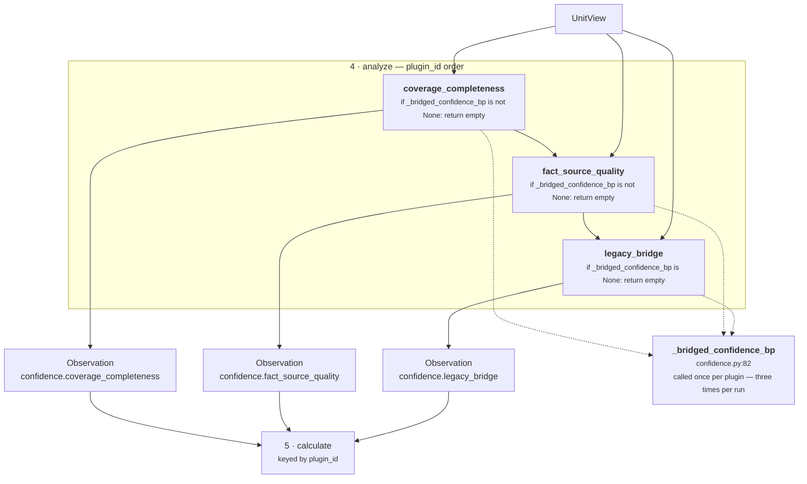

# 03 · Analyzer

**Stage 4:** `unit.py:ReasoningUnit.analyze` (line 202) — **not overridden**. Base implementation.
**Plugins:** three, registered at `confidence.py:240`.

---

## 1 · What it is for

The Analyzer is where the unit's actual intellectual property lives. The framework's demand:

> *Risk is not one algorithm. It is time decay plus revenue exposure plus relationship health plus
> policy — each a small deterministic contribution that can be tested, tuned, and versioned alone. A
> unit composes plugins; it does not hide a monolith.*

For confidence the decomposition is not four plugins for four axes. It is **two plugins for two
branches**, and the four axes are split across them by *how they are read*, not by what they mean.

---

## 2 · The three plugins

```python
# confidence.py:240
plugins = (LegacyBridgePlugin(), FactSourceQualityPlugin(), CoverageCompletenessPlugin())
```

| `plugin_id` | Class · line | `kind` | Branch | Emits |
|---|---|---|---|---|
| `coverage_completeness` | `CoverageCompletenessPlugin` · 188 | `confidence.coverage_completeness` | computed | `completeness_bp`, `evidence_coverage_bp`, `independent_evidence_groups`, `declared_field_count`, `present_field_count` |
| `fact_source_quality` | `FactSourceQualityPlugin` · 138 | `confidence.fact_source_quality` | computed | `source_quality_bp`, `corroboration_bp`, `self_reported_fact_count`, `described_fact_count` |
| `legacy_bridge` | `LegacyBridgePlugin` · 117 | `confidence.legacy_bridge` | bridged | `confidence_bp` |

**None emits a reason code. None attaches an evidence id.** Both tuples are empty on every
`Observation` this unit produces, which is unusual — most units use plugin reason codes to explain
which axis fired. Here the explanation is carried entirely by the metrics in the decomposition
finding, and the single reason code `confidence_computed` is attached at the Evaluator instead.

### 2.1 · Why two plugins and not four

The four axes named in the module docstring do not map one-to-one onto plugins:

| Axis | Plugin | Why grouped that way |
|---|---|---|
| Source quality | `fact_source_quality` | both come from **one pass over one structure** — the fact record |
| Corroboration | `fact_source_quality` | |
| Completeness | `coverage_completeness` | both are **structural** claims that need no fact metadata |
| Evidence coverage | `coverage_completeness` | |

The `FactSourceQualityPlugin` docstring states the grouping rule directly:

> *Two readings of the same records, kept in one plugin because they come from one pass over one
> structure: a fact record states its own confidence and how many distinct sources contributed it.*

The split is by **data dependency**, not by semantics. Source quality and corroboration both need
the fact record and fail together when it is malformed; completeness and coverage need only the
declaration and the evidence list and cannot fail at all. Splitting into four would mean iterating
the fact records twice for no gain and would separate two readings that must agree about which
fields were scanned.

---

## 3 · Execution order and branch exclusivity

`unit.py:analyze` sorts by `plugin_id` before running:

```python
# unit.py:209
for plugin in sorted(self.plugins, key=lambda item: item.plugin_id):
    observations.extend(plugin.contribute(view))
```

Alphabetical order is therefore the run order, and it is **not** the registration order:

```
registration: legacy_bridge → fact_source_quality → coverage_completeness
execution:    coverage_completeness → fact_source_quality → legacy_bridge
```

The framework's argument for the sort — *"observation order is a property of the unit's composition,
not of registration order"* — is real but weak here, because `calculate` immediately rebuilds the
observations into a dict keyed by `plugin_id`:

```python
# confidence.py:261
by_plugin = {item.plugin_id: item for item in observations}
```

**Order is therefore irrelevant to this unit's output.** No hash moves if the sort is removed. That
is a property worth knowing, because it means the deciding plugin runs *last* and nothing goes wrong.

### 3.1 · Exclusivity is enforced three times, not once



Every plugin calls `_bridged_confidence_bp(view)` itself. The bridge does not *tell* the others to
stand down; each one asks the same question independently and reaches the same answer, because the
function is pure over the same frozen inputs.

That triples the work — three dictionary lookups and, on the bridged path, three
`basis_points` validations of the same number. The docstring explains why the redundancy is
preferred to a shared flag:

> *Every plugin consults this, so the two decomposition plugins stay silent whenever the bridge
> applies — that keeps the branch exclusive exactly as the pre-framework unit had it, including the
> fact that a malformed fact is never even looked at when a bridge is configured.*

The alternative — computing the bridge once in `calculate` and letting all three plugins run — would
change behaviour, not just performance. A run with a configured bridge **and** a malformed fact
would then fail on the fact, even though the fact plays no part in the answer.
`test_the_decomposition_plugins_stand_down_when_the_bridge_applies` pins that exact scenario:

```python
broken = {"deal.status": {"value": "open", "confidence_bp": "not a number"}}
# with source_reasoner configured and legacy.rule publishing confidence_bp=6,100:
assert FactSourceQualityPlugin().contribute(view) == ()
assert CoverageCompletenessPlugin().contribute(view) == ()
```

### 3.2 · The observation count is always exactly one

| Branch | Observations produced | Total |
|---|---|---|
| bridged | `legacy_bridge` only | **1** |
| computed | `coverage_completeness` + `fact_source_quality` | **2** |

Zero is impossible: `_bridged_confidence_bp` returns either `None` or an `int`, and the three
plugins partition those two cases exhaustively. That is what makes the fallback defaults inside
`calculate` unreachable — see [04 · Calculator](04-Calculator.md) §5.

Three observations is also impossible, which matters because it is what lets `calculate` read
`by_plugin.get(...)` without worrying about a bridged value arriving alongside a computed one.

---

## 4 · Silence semantics at this seam

The framework's rule is that a plugin returning `()` means *this axis has nothing to contribute
here* — silence, not a zero. In most units that distinction shows up in a count metric: three silent
plugins and three plugins each reporting zero produce the same score but a different
`*_count`, and downstream reads them differently.

**This unit is the opposite case, and it is worth being precise about it.** Here, silence does not
mean *nothing to say*. It means *the other branch owns this run*. Neither decomposition plugin ever
returns `()` because it found nothing:

| Situation | `fact_source_quality` | `coverage_completeness` |
|---|---|---|
| No facts at all | fires, `source_quality_bp = 5,000`, `corroboration_bp = 5,000` | fires, `completeness_bp = 0` |
| Every fact a bare scalar | fires, both at `5,000`, counts at `0` | fires |
| No evidence at all | n/a | fires, `evidence_coverage_bp = 0`, `groups = 0` |
| No declared fields | fires | fires, `completeness_bp = 10,000` |
| A bridge applies | **silent** | **silent** |

So the *only* reason either can be silent is the bridge. The neutral midpoint `_NEUTRAL_BP` exists
precisely so that "nothing to measure" is expressible as a number rather than as silence:

> *Deliberately the midpoint rather than 0: a fact that never stated its own confidence is unknown,
> not untrustworthy, and scoring it 0 would turn a silent CRM field into a reason to distrust the
> whole decision.* — `confidence.py:54`

And at the unit level there is no silence at all. Every run publishes `confidence_bp` and exactly one
`Finding`. *"Confidence is always produced — there is no 'confidence unknown' outcome."*

---

## 5 · What the observations carry, and what survives

```
Observation(plugin_id="coverage_completeness",
            kind="confidence.coverage_completeness",
            metrics={"completeness_bp": 7_500,
                     "evidence_coverage_bp": 5_000,
                     "independent_evidence_groups": 2,
                     "declared_field_count": 4,        ← dropped by calculate
                     "present_field_count": 3},        ← dropped by calculate
            evidence_ids=(), reason_codes=())

Observation(plugin_id="fact_source_quality",
            kind="confidence.fact_source_quality",
            metrics={"source_quality_bp": 8_500,
                     "corroboration_bp": 9_250,
                     "self_reported_fact_count": 2,    ← dropped by calculate
                     "described_fact_count": 2},       ← dropped by calculate
            evidence_ids=(), reason_codes=())
```

`Observation.__post_init__` rejects any non-`int` metric and rejects `bool` explicitly, so every
number above is a plain integer by the time it leaves a plugin. That is the framework's guarantee,
not this unit's — but it is what makes `divide_half_up` safe to apply without re-checking.

**Four of the nine metrics never leave the Analyzer.** `calculate` names six and copies nothing else,
so `declared_field_count`, `present_field_count`, `self_reported_fact_count` and
`described_fact_count` exist only inside the run. The consequence for an auditor: a persisted
`completeness_bp = 7,500` does not tell you whether that was *3 of 4* or *6 of 8*, and a
`source_quality_bp = 5,000` does not distinguish *two facts averaging 5,000* from *no fact stating
anything at all*. Those four counts were computed and would have answered both questions; they are
tested (`test_facts_that_state_their_own_confidence_are_averaged` asserts
`self_reported_fact_count == 2`) and then thrown away.

The counts cannot simply be added to the result: `publishes` does not name them, so the framework
guard at `unit.py:256` would raise `ValueError: core.confidence published undeclared metrics: …`.
Adding them means widening `publishes`, which changes every decision hash.

---

## 6 · Composition summary

| Property | Value |
|---|---|
| Plugin count | 3 |
| Plugins that can fire together | `coverage_completeness` + `fact_source_quality` |
| Plugins that fire alone | `legacy_bridge` |
| Observations per run | 1 (bridged) or 2 (computed) — never 0, never 3 |
| Execution order | alphabetical by `plugin_id`; provably irrelevant to output |
| Reason codes from plugins | none |
| Evidence ids from plugins | none |
| Shared helper | `_bridged_confidence_bp`, called once per plugin |
| Interaction between the two computed plugins | **none** — they read disjoint inputs and neither sees the other's output |

The last row is the cleanest property of this seam. `fact_source_quality` reads fact records;
`coverage_completeness` reads the declaration and the evidence list. Neither can affect the other,
and the only place their outputs meet is the weighted sum in `calculate`. That is what makes them
independently testable, and it is what the module docstring means by *"four independent axes that
fail independently."*

---

## Related

- [03a · `coverage_completeness`](03a-plugin-coverage_completeness.md)
- [03b · `fact_source_quality`](03b-plugin-fact_source_quality.md)
- [03c · `legacy_bridge`](03c-plugin-legacy_bridge.md)
- [04 · Calculator](04-Calculator.md) — how the observations become one number
- [Unit Framework §4.2](../../README.md) — why plugins, and what an `Observation` may say
